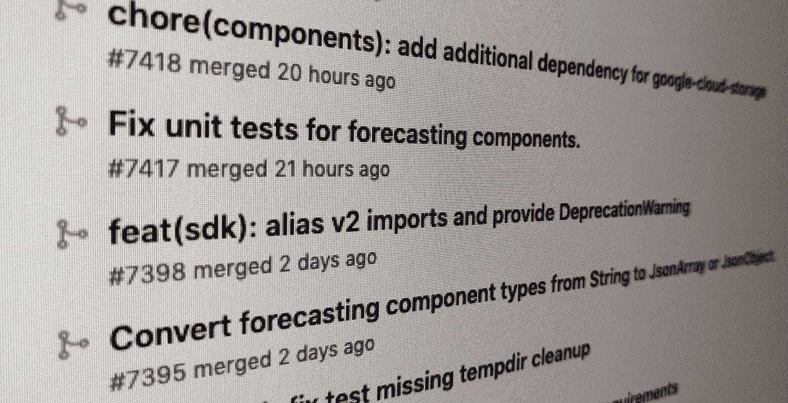
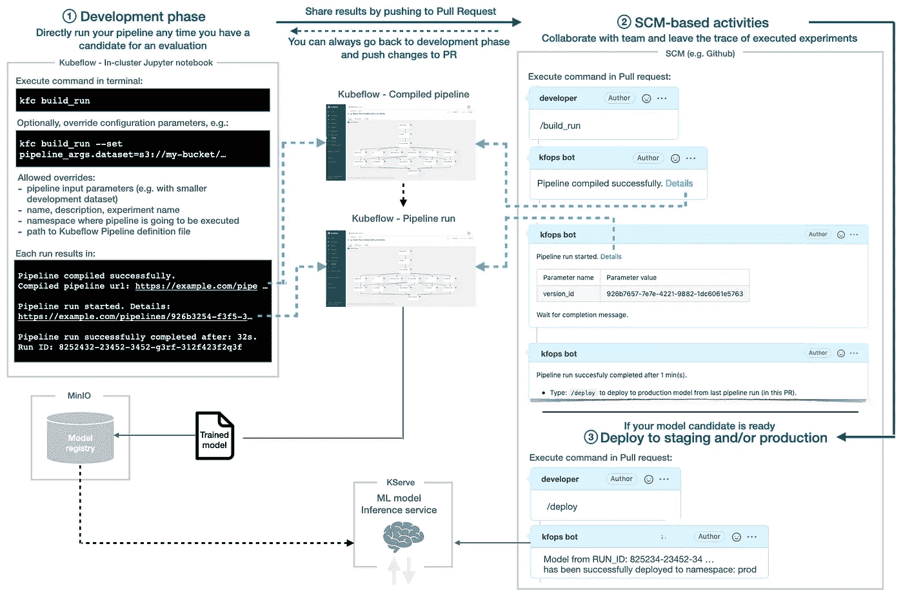
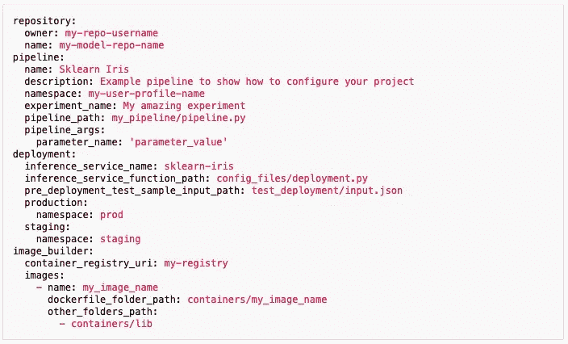
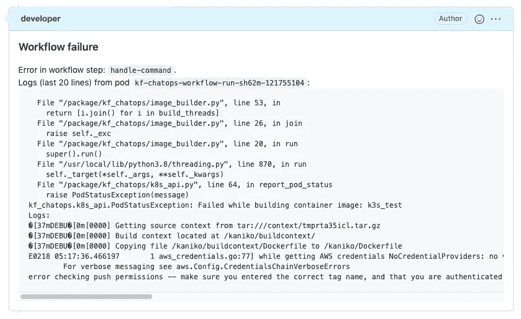
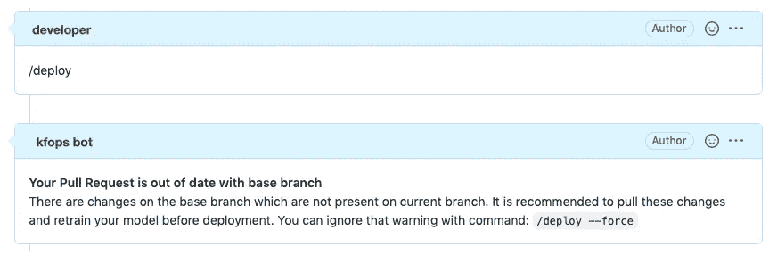

# 简化了 Kubeflow 与 Kfops 的 MLOps

> 原文：<https://towardsdatascience.com/simplified-mlops-for-kubeflow-with-kfops-785e36a6c5f4>

## 这篇文章介绍了 **Kfops** ，它是一个基于 [Kubeflow](https://www.kubeflow.org) 的工具，可以插入到你的 [MLOps](/why-data-science-teams-needs-to-get-serious-about-mlops-56c98e255e20) 生命周期中。

作者图片

## 什么是 Kfops？

该项目的主要目标是简化和标准化 Kubeflow 管道编译、管道执行和模型部署。
它有两个“组件”——一个专用的 python 包和 chatops 命令。Python 包在开发/实验阶段使用，chatops 命令直接在 Pull 请求注释中使用。

**它如何融入 MLOps 生命周期？**
我们来举个例子。您的 ML 模型的代码存储在 Github 存储库中。你的团队利用 Github 问题来讨论 ML 模型和(Kubeflow)管道的特性、改进和 bug 修复。
在其中一个问题中，团队计划改进管道的预处理步骤。您的任务是测试这些变化将如何影响模型。
作为第一步，您想在您的开发环境中进行试验。您对代码进行修改，并使用 Kfops CLI(命令`kfc build-run`)直接在 Kubeflow 中执行管道。Kfops 将链接输出到管道运行。
你做了更多的修改，直到结果准备好与团队分享。
您将变更推送到存储库并创建拉请求。在 Pull 请求中，使用`/build_run` chatops 命令再次运行管道。Kfops 运行管道并直接在 PR 中打印结果。现在，您可以通过在本期杂志中引用您的公关来与团队分享结果。
团队对结果很满意，并决定将其部署到生产中。你回到公关部门，发布`/deploy`命令。

你完成了什么？

*   您创建了可重复的实验，其中只有预处理步骤发生了变化，而其他的都保持不变。
*   因此，您可以很容易地衡量您的修改所带来的改进。
*   这个实验毫不费力地“记录”在问题和公关中，并与特定的 Kubeflow 管道运行及其结果相联系。
*   您的改进现已投入生产！

以下是该过程的可视化表示([参见此处的全屏图像](https://kfops.readthedocs.io/en/latest/kfc-flow.png)):

作者图片

你可能需要一些时间来消化这个数字。以下是关键要点:

*   `kfc`和“chatops”命令都旨在隐藏 Kubeflow 的底层复杂性。
*   作为一名数据科学家/工程师，您希望有一个简单、灵活、可扩展的实验/开发阶段。已经提到的`kfc`命令控制它。根据您的设置，该命令可以直接在集群内[运行](https://www.kubeflow.org/docs/components/pipelines/sdk/connect-api/#multi-user-mode)(例如，Jupyter notebook 预装了 Kubeflow 或任何其他配置为访问 Kubeflow 管道的 Kubernetes Pod)或从连接到远程 Kubeflow 实例的本地环境([Kubernetes 集群](https://www.kubeflow.org/docs/components/pipelines/sdk/connect-api/#connect-to-kubeflow-pipelines-from-outside-your-cluster)之外)运行。
*   不允许使用`kfc`命令进行模型部署，因为它没有记录执行命令的时间和人员。
*   模型部署被有目的地从 Kubeflow 管道中移除。相反，你应该使用`/deploy`来发布那些满足你的“生产”需求的模型。
*   类似`/build_run`、【或`/build` 、`/run`、`/deploy`(或`/staging_deploy`)的命令在拉取请求的上下文中执行。
*   团队使用存储库的问题和拉请求来讨论计划的实验、改进、修复等。在 Pull 请求中执行的命令将这个讨论与 Kubeflow 管道 UI 中的实验结果联系起来。
*   管道运行(`/build_run` 或`/run`)直接在 PR 注释中打印出 Kubeflow 管道输入参数值。
*   目前，kfop 只能将 ML 模型部署到安装了 Kubeflow 和 kfop 的同一个 Kubernetes 集群。
*   并非存储库中的所有变更都与 ML 模型相关。模特培训可能很耗时或者很昂贵。因此，当创建或更新 PR 时，Kubeflow 管道不会自动启动。必须用“运行”命令手动执行。

出于简洁的原因，该图隐藏了容器图像生成器等细节。查看[文档](https://kfops.readthedocs.io/en/latest/mlops_lifecycle/)中的更多数字和细节。

## 主配置文件

Kfops 的另一个重要特性是主配置文件。它集中了项目的管道、容器映像生成器和部署设置。
在开发过程中，您可以使用`kfc`命令覆盖与`pipeline`相关的设置。可以用`kfc`的`--set`标志和/或单独的覆盖文件(如`kfc build_run --config-override override.yaml`)覆盖参数。
请注意，因为配置文件是存储库的一部分，所以您可以很容易地跟踪过去对它所做的所有更改。

Kfops 示例配置文件(图片由作者提供)

更多细节请参考[配置文件文档](https://kfops.readthedocs.io/en/latest/user/config/)。

## 约定、限制和更多功能

您可以在[文档](https://kfops.readthedocs.io/en/latest/features/)中找到完整的列表；以下是最重要的几个:

*   惯例(例如，集中配置)在你所有的 ML 项目中强制执行标准化。
*   每个存储库只允许一个 ML 模型。
*   Kfops 可以插入任何 SCM 系统*(虽然目前只支持 Github)*。
*   在`/deploy`期间，默认执行“金丝雀”阶段，随后是可选的推断端点检查(HTTP 返回代码`200`)。
    如果 ML 模型部署成功，Kfops 将标记 PR(例如`Deployed-to-production`)，与 HEAD 合并并关闭 PR。
    所有故障都被记录为 PR 注释。
*   如果您的 ML 模型库向公众开放，您可以限制谁可以执行 chatops 命令*(功能正在开发)*。
*   各种警告和错误的输出直接“记录”在 PR 上下文中:

管道错误示例(作者图片)

管道警告示例(图片由作者提供)

## 下一步是什么？

尽管功能齐全，该项目仍处于早期开发阶段。它的长期目标是为处于 MLOps 成熟度不同阶段的公司提供选择。前往[文档](http://kfops.readthedocs.io)了解更多详情。