# 用 Python 模拟一个微小的太阳系

> 原文：<https://towardsdatascience.com/simulate-a-tiny-solar-system-with-python-fbbb68d8207b>

## 使用 Matplotlib 中的真实质量、距离和速度数据，模拟一个包含太阳、地球、火星和一颗未知彗星的微型太阳系

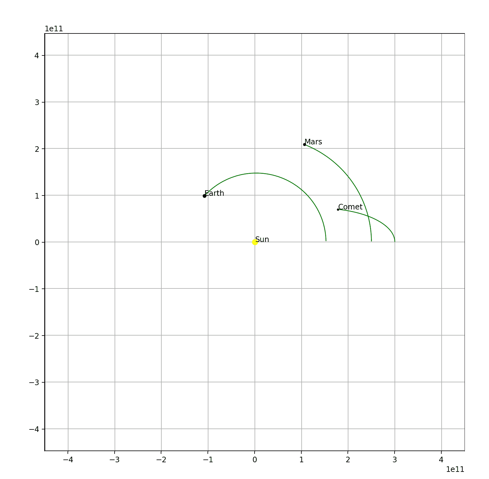

有太阳、地球、火星和彗星的太阳系。Andrew Zhu 的 GIF

我对 PCA(主成分分析)感到惊讶，并想到用动画来展示机器学习过程。当我设法制作一个图表动画时，我很想制作一些很酷的东西。我想到的第一个很酷的东西是太阳系。这篇文章也是我回忆牛顿物理学、向量空间、matplotlib 等知识的一次旅程。

为了模拟行星的轨道并制作动画，我需要解决两个关键问题:

1.  生成轨道数据。
2.  用 Matplotlib 制作数据动画。

在这篇文章中，我将涉及上述两个问题。如果你赶时间，不想看我啰嗦的八卦，可以在 Github 上查看[代码主机。](https://github.com/xhinker/orbit)

作者所有图片和 gif。

# 牛顿引力定律

根据牛顿万有引力定律，我们可以计算出两个物体之间的力。只考虑地球和太阳。太阳对地球的引力影响可以用下面的等式来表示:

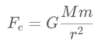

`M`表示太阳的质量，`m`表示地球的质量，`r`表示两个物体中心之间的距离。`G`是一个常量值。

根据牛顿第二定律:

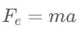

我们可以得到加速度`a`:

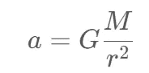

嗯，加速度`a`只与太阳质量和日地距离`r`有关。现在有了已知的`a`。我们可以计算δ时间后地球的速度- `dt`。

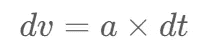

最后，得到位移的变化— `dd`:

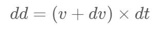

(我知道在一篇文章中使用/阅读如此多的方程令人讨厌，但这可能是解释引力轨道模拟基础的最简单、最简洁的方式)

# 向量空间中的引力定律

由于我要用 matplotlib 绘制地球轨道，所以需要计算`x`、`y`的值。为了简单起见，我将使用 2D 坐标轴，而不是三维。

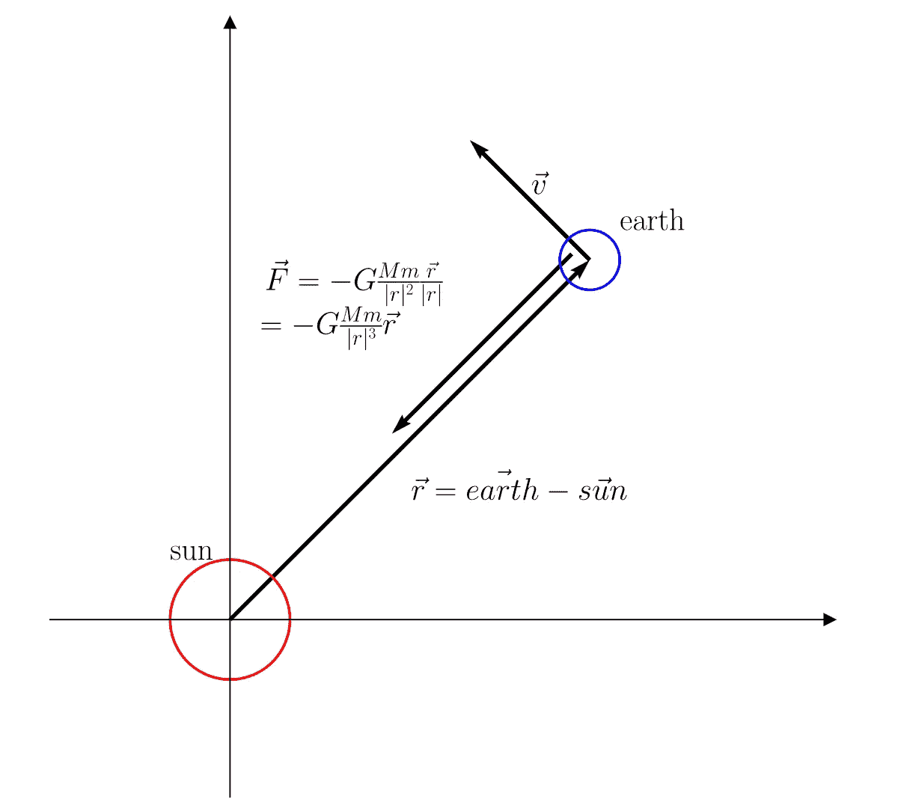

地球引力分析。附录中的图表代码

我在上图中画出了方程的矢量版本。如果你是第一次读这个方程，你可能会有几个问题。

1.  **为什么引力方程中有一个负号(-)？**因为力的方向与距离矢量`r`相反。当你计算地球对太阳的作用力时，你需要去掉负号(-)。在矢量坐标中，我们需要非常小心方向。
2.  **离心力呢，为什么不处理离心力？**因为离心力其实是万有引力的结果。如果我们在地球上进行受力分析。只有一个引力作用在它上面。当地球绕着太阳旋转时，地球正在向太阳下落。然而，地球垂直于 G 力的初速度将它拉离太阳，这就是为什么地球可以绕太阳运行。

在 Python 代码中，假设太阳在位置(0，0)，地球在位置(6，6):

```
sx,sy = 0,0
ex,ey = 6,6
```

距离 r 将是:

```
rx = ex - sx
ry = ey - sy
```

定义日地引力常数`GMm`为`gravconst_e`:

```
Ms          = 2.0e30                    *# mass of sun in kg unit*
Me          = 5.972e24                  *# mass of earth in kg unit* 
G           = 6.67e-11
gravconst   = G*Ms*Me
```

模拟器将每隔`dt`时间计算一个数据点。我们可以把`dt`设定为某一天:

```
daysec = 24.0*60*60
dt     = 1*daysec
```

r (|r|)的立方是:

```
modr3_e = (rx**2 + ry**2)**1.5
```

要计算施加在地球方向上的力:

```
*# get g force in x and y direction*
fx_e = gravconst_e*rx/modr3_e
fy_e = gravconst_e*ry/modr3_e
```

基于矢量形式的牛顿第二定律:

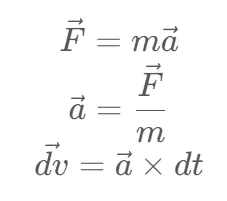

结合上述等式:

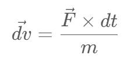

因为我已经计算了力的矢量，所以我可以在`dt`时间后得到新的速度矢量:

```
xve += fx_e*dt/Me
yve += fy_e*dt/Me
```

最后得到地球新的位移(速度乘以时间就是距离:d=v*t):

```
xe += xve*dt
ye += yve*dt
```

下面是模拟地球轨道运行一年的完整代码。

```
G           = 6.67e-11                  *# constant G*
Ms          = 2.0e30                    *# sun*
Me          = 5.972e24                  *# earth* 
AU          = 1.5e11                    *# earth sun distance*
daysec      = 24.0*60*60                *# seconds of a day*
e_ap_v      = 29290                     *# earth velocity at aphelion*gravconst_e = G*Me*Ms
*# setup the starting conditions*
*# earth*
xe,ye,ze    = 1.0167*AU,0,0
xve,yve,zve = 0,e_ap_v,0*# sun*
xs,ys,zs    = 0,0,0
xvs,yvs,zvs = 0,0,0t           = 0.0
dt          = 1*daysec *# every frame move this time*xelist,yelist,zelist = [],[],[]
xslist,yslist,zslist = [],[],[]*# start simulation*
**while** t<1*365*daysec:
    *################ earth #############*
    *# compute G force on earth*
    rx,ry,rz = xe - xs, ye - ys, ze - zs
    modr3_e = (rx**2+ry**2+rz**2)**1.5
    fx_e = -gravconst_e*rx/modr3_e
    fy_e = -gravconst_e*ry/modr3_e
    fz_e = -gravconst_e*rz/modr3_e

    *# update quantities how is this calculated?  F = ma -> a = F/m*
    xve += fx_e*dt/Me
    yve += fy_e*dt/Me
    zve += fz_e*dt/Me

    *# update position*
    xe += xve*dt
    ye += yve*dt 
    ze += zve*dt

    *# save the position in list*
    xelist.append(xe)
    yelist.append(ye)
    zelist.append(ze)

    *################ the sun ###########*
    *# update quantities how is this calculated?  F = ma -> a = F/m*
    xvs += -fx_e*dt/Ms
    yvs += -fy_e*dt/Ms
    zvs += -fz_e*dt/Ms

    *# update position*
    xs += xvs*dt
    ys += yvs*dt 
    zs += zvs*dt
    xslist.append(xs)
    yslist.append(ys)
    zslist.append(zs)

    *# update dt*
    t +=dt
```

看看轨道是什么样子:

```
**import** matplotlib.pyplot **as** plt
plt.plot(xelist,yelist,'-g',lw=2)
plt.axis('equal')
plt.show()
```

# 用 matplotlib 制作动态观察动画

现在，我要把静止的地球轨迹变成一个移动的物体，并在平面上保留一个轨迹。以下是我在制作动画时解决的一些问题:

1.  所有的魔法都发生在`update` 函数内部。基本上每一帧都会被`FuncAnimation` 调用函数。您可以调用`ax.plot(…)`在平面中绘制新像素(所有像素将保留在下一帧中)或调用`set_data` 或`set_position`更新可视对象的数据(matplotlib 将根据当前帧的数据重新绘制所有内容)。
2.  表达式“`line_e, = ax.plot(…)`”中的逗号一开始看起来很怪异。但是请注意，是逗号构成了元组。"`ax.plot(…)`"返回一个元组对象。这就是为什么您需要在变量名后添加一个逗号。
3.  在地球后面画出轨迹。我初始化空列表(`exdata,eydata = [],[]`)来保存所有先前的轨迹点。每次调用`update` 函数时，将轨迹点追加到列表中。

我不打算把这部分变成动画教程。如果你以前从未尝试过 matplotlib 动画。杰克·范德普拉斯的 Matplotlib 动画教程非常值得一读。

以下是制作动态观察动画的代码:

```
**import** matplotlib.pyplot **as** plt
**from** matplotlib **import** animation

fig, ax = plt.subplots(figsize=(10,10))
ax.set_aspect('equal')
ax.grid()

line_e,     = ax.plot([],[],'-g',lw=1,c='blue')
point_e,    = ax.plot([AU], [0], marker="o"
                      , markersize=4
                      , markeredgecolor="blue"
                      , markerfacecolor="blue")
text_e      = ax.text(AU,0,'Earth')

point_s,    = ax.plot([0], [0], marker="o"
                      , markersize=7
                      , markeredgecolor="yellow"
                      , markerfacecolor="yellow")
text_s      = ax.text(0,0,'Sun')

exdata,eydata = [],[]                   *# earth track*
sxdata,sydata = [],[]                   *# sun track*

**print**(len(xelist))

**def** update(i):
    exdata.append(xelist[i])
    eydata.append(yelist[i])

    line_e.set_data(exdata,eydata)
    point_e.set_data(xelist[i],yelist[i])
    text_e.set_position((xelist[i],yelist[i]))

    point_s.set_data(xslist[i],yslist[i])
    text_s.set_position((xslist[i],yslist[i]))
       ax.axis('equal')
    ax.set_xlim(-3*AU,3*AU)
    ax.set_ylim(-3*AU,3*AU)

    **return** line_e,point_s,point_e,text_e,text_s

anim = animation.FuncAnimation(fig
                                ,func=update
                                ,frames=len(xelist)
                                ,interval=1
                                ,blit=True)
plt.show()
```

结果:

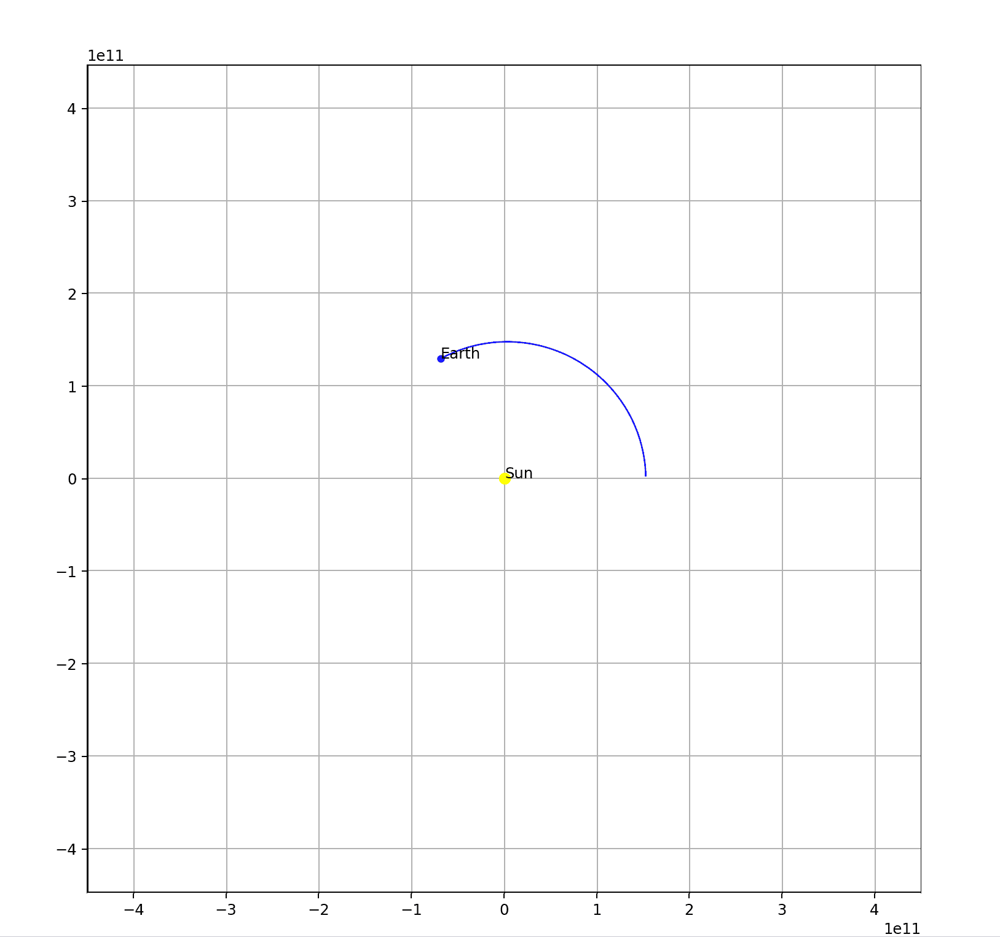

点击查看完整代码[。](https://github.com/xhinker/orbit/blob/main/simulate_earth_orbit.py)

# 如果…会怎样

改变地球的初始速度，比如将地球速度降低到**19290 米/秒(从 29290 米/秒)**:

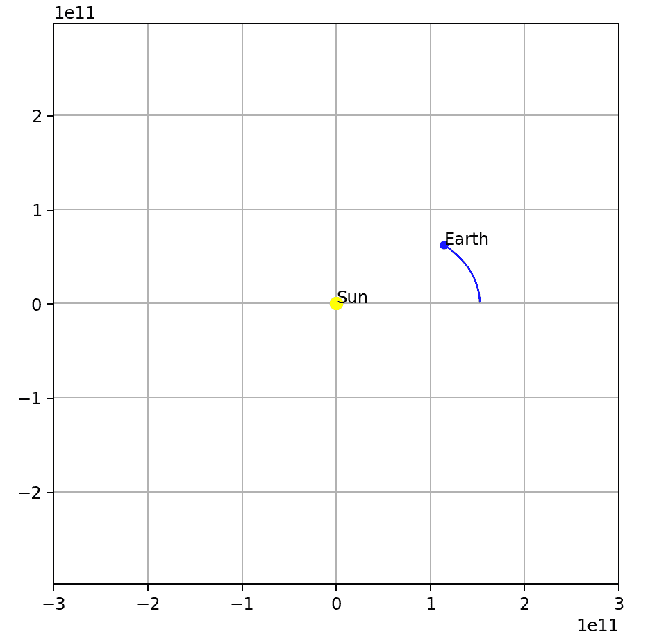

改变地球质量，增加到 **5.972e29 kg(从 5.972e24 kg)** 。太阳在移动！

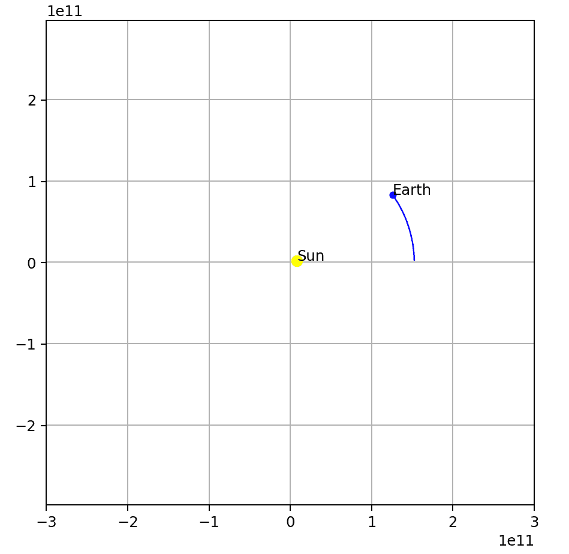

# 将火星和一颗未知彗星加入轨道系统

因为我已经成功模拟了地球和太阳的轨道。向系统中添加更多的对象并不困难。比如火星和一颗未知的彗星。


点击查看其代码[。](https://github.com/xhinker/orbit/blob/main/solar_orbit_2d.py)

# 在 Matplotlib3D 中制作动画

通过对绘图代码进行一些调整，我甚至可以制作 3D 轨道动画！在上面的模拟代码中，我已经计算了`z`轴的数据。

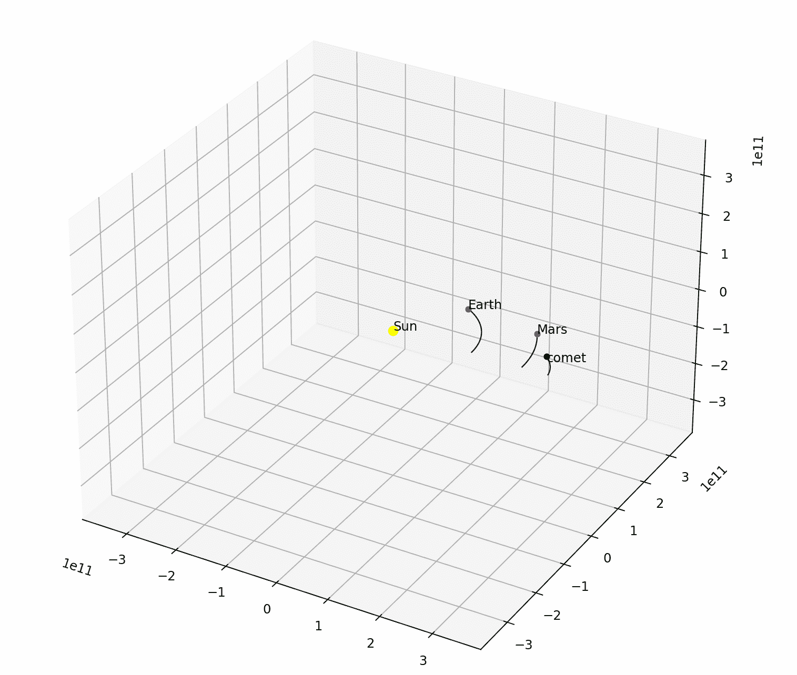

点击查看代码[。](https://github.com/xhinker/orbit/blob/main/solar_orbit_3d_plt.py)

# 摘要

在这篇文章里，我把牛顿万有引力定律的基础，如何把方程组转换到向量空间，一步一步的计算仿真数据。有了模拟数据在手，我也解释了动画路上的三个关键问题。

感谢您阅读到这里。彻底了解模拟过程，你甚至可以搭建著名的[三体问题](https://en.wikipedia.org/wiki/Three-body_problem)模拟器。(是的，我也是同名小说的粉丝)

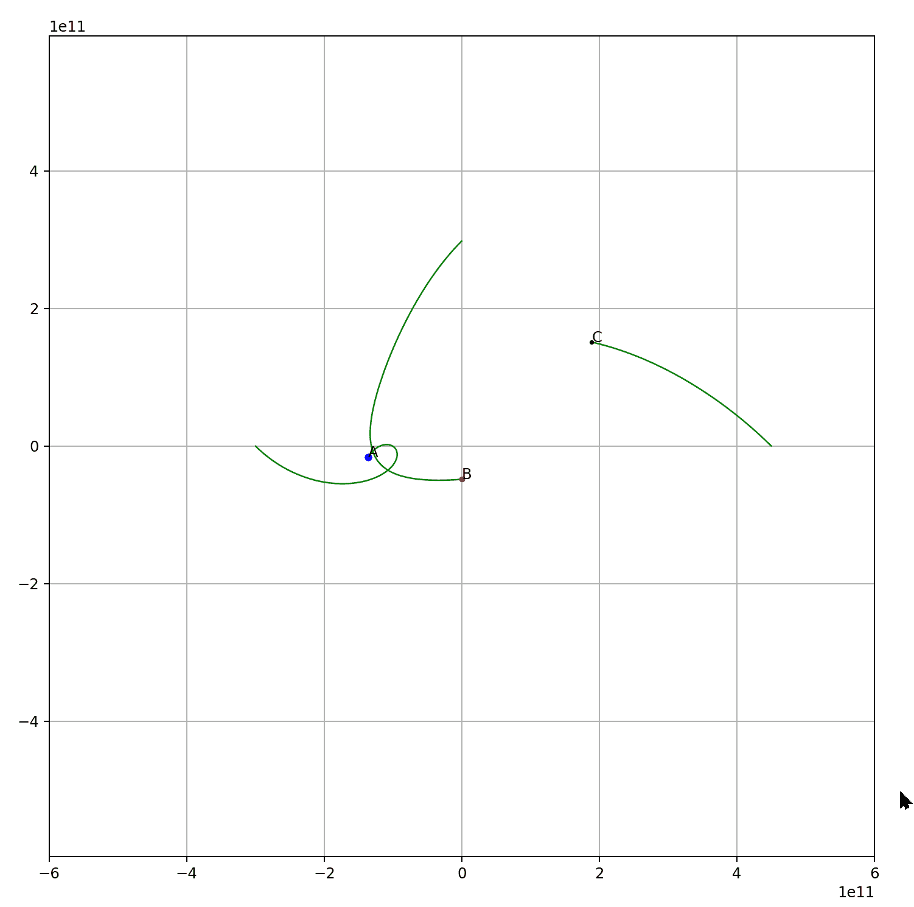

如果你有任何问题，请告诉我，我会尽力回答。并且不要犹豫指出我在文章中犯的任何错误。期待与您的进一步联系。

我就讲到这里，祝你喜欢它，编程愉快。

# 参考链接

*   [牛顿万有引力定律](https://en.wikipedia.org/wiki/Newton%27s_law_of_universal_gravitation)
*   [地球轨道](https://en.wikipedia.org/wiki/Earth%27s_orbit)
*   [使用 Tex 渲染数学方程](https://matplotlib.org/stable/gallery/text_labels_and_annotations/tex_demo.html)
*   [MV3.03 二体问题](https://www.youtube.com/watch?v=ZPP9czMqrBk&ab_channel=PaulFrancis)
*   [MV3.04 二体人:Python](https://www.youtube.com/watch?v=yzZeSEKx2O4&ab_channel=PaulFrancis)

# 附录—代码生成矢量坐标图

在运行代码之前，您需要在您的机器上安装 LaTex。

```
**import** numpy **as** np
**import** matplotlib.pyplot **as** plt
plt.rcParams['text.usetex'] = True
font = {'family' : 'normal',
        'weight' : 'bold',
        'size'   : 18}
plt.rc('font',**font)

*# initialize the stage*
fig,ax = plt.subplots(figsize=(8,8))

*# set x, and y axis,and remove top and right*
ax.spines[['top','right']].set_visible(False)
ax.spines[['bottom','left']].set_position(('data',0.0))
ax.axis('equal')
ax.axes.xaxis.set_visible(False)
ax.axes.yaxis.set_visible(False)
ax.set_xlim(-3,10)
ax.set_ylim(-3,10)

*# draw arrows*
ax.plot(1, 0, ">k", transform=ax.get_yaxis_transform(), clip_on=False)
ax.plot(0, 1, "^k", transform=ax.get_xaxis_transform(), clip_on=False)

*# sun*
a = np.linspace(0,2*np.pi,360)
xs = np.sin(a)
ys = np.cos(a)
ax.plot(xs,ys,c='r')
ax.text(-1,1,'sun')

*# earth*
xec,yec = 6,6
xe = xec+ 0.5*xs
ye = yec+ 0.5*ys
ax.plot(xe,ye,c='b')
ax.text(xec+0.5,yec+0.5,'earth')
ax.text(xec-1,yec+1.1,r"$\vec{v}$")

*# r vector*
ax.quiver([0,xec,xec-0.3],[0,yec,yec+0.1]
         ,[xec,-2,-3],[yec,2,-3]
         ,units='xy',scale=1,width=0.07)
ax.text(3,2,r"$\vec{r} = \vec{earth}-\vec{sun}$")
f_eq = (r"$\vec{F}=-G\frac{Mm}{|r|^2}\frac{\vec{r}}{|r|}\\$"
        r"$=-G\frac{Mm}{|r|^3}\vec{r}$")
ax.text(0.5,5.5,f_eq)

*# plot data*
plt.show()
```

结果:

