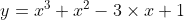
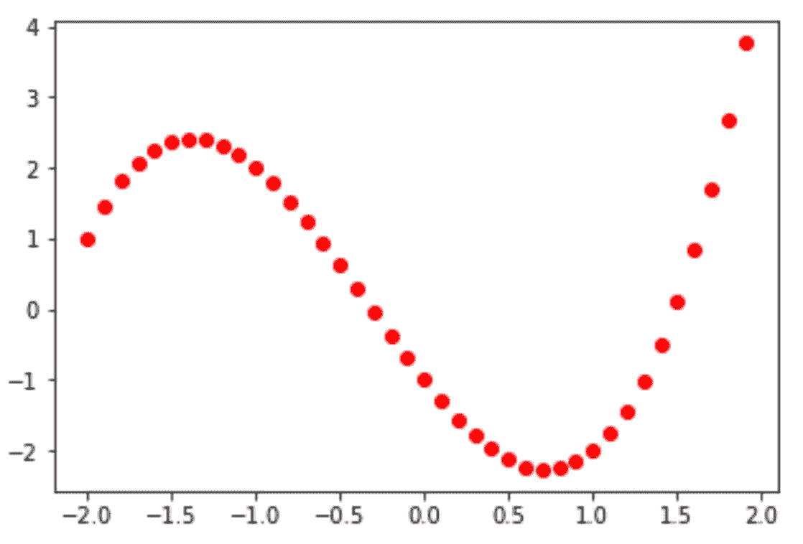
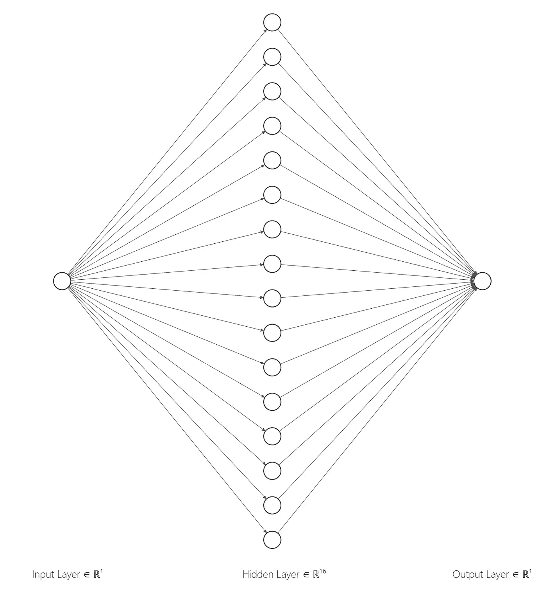
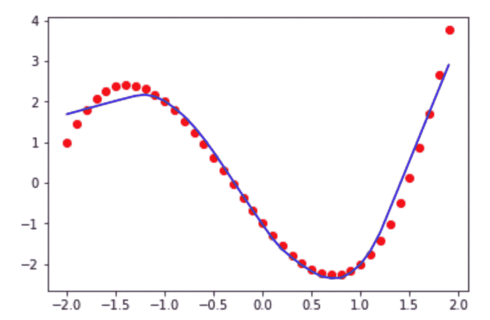
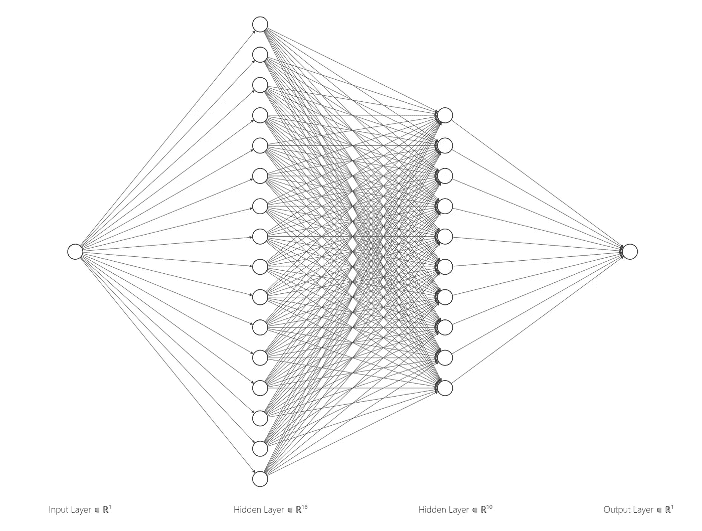
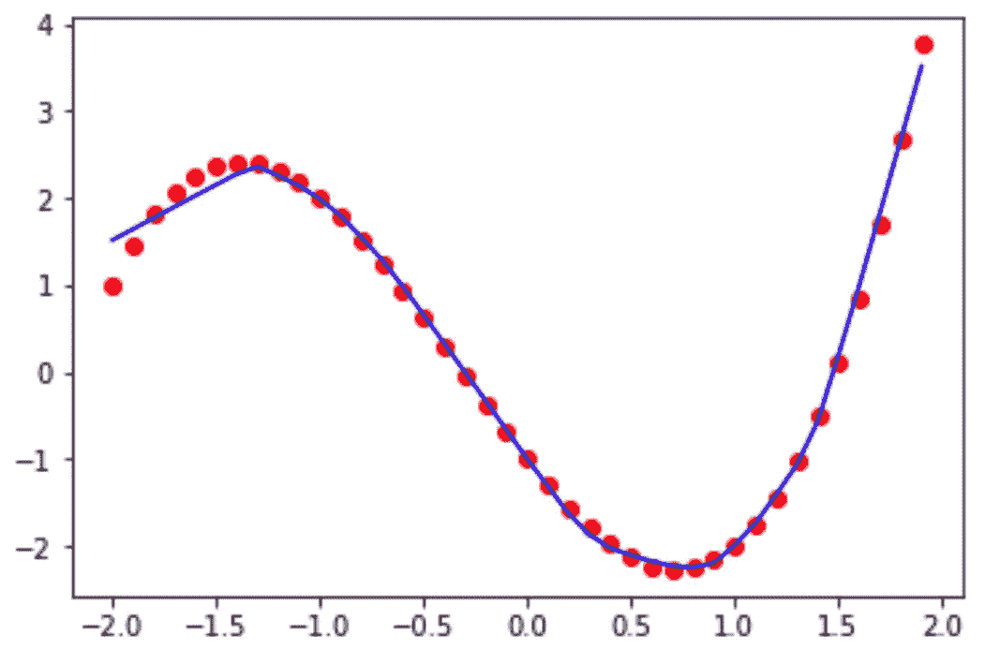

# 用神经网络模拟任何功能

> 原文：<https://towardsdatascience.com/simulate-any-functions-with-neural-network-8e52f2083e3d>

## 使用 PyTorch 建立一个神经网络模型来模拟任何函数

我们知道线性回归模型可以帮助生成一条线来模拟“线性数据”。一个形式为 **f(x) = ax + b** 的函数。


线性回归，作者图片

那么，其他函数呢，比如非线性函数？甚至是我们一无所知的不规则形状。我们还能模拟一个模型来拟合它吗？像头图中的那种甚至是螺旋形的？

最近，我受到了这个视频的启发:[为什么神经网络可以学习几乎任何东西](https://www.youtube.com/watch?v=0QczhVg5HaI&ab_channel=EmergentGarden)。我意识到，有了真实的数据在手，我们可以…

> 用神经网络模型模拟任何函数！

紧急花园的视频确实是一个被低估的视频，强烈推荐你也去看，视频中的链接质量也很高。

在这篇文章中，我将使用 PyTorch 实现一个**任意函数模拟器**。出于两个目的:

1.  见证神经网络模型的威力。看试衣过程真的很好玩。
2.  经过训练的模型也可以用于检测异常数据。常规数据通常处于稳定的模式，比如说，在工作日相对较高，在周末下降。经过训练的神经网络模型可用于检测异常数据。

# 生成培训数据

以下代码将初始化 **x** 数字，并使用以下函数生成用于模拟的 **y** 数字。



```
import numpy as np
import matplotlib.pyplot as plt
X = np.array([*range(-20,20)],*dtype*=np.float32)
X = X*0.1
y = [x**3+ x**2 -3*x -1 for x in X]
plt.plot(X,y,'ro')
```



一个“未知形状的点”，作者图片

现在我们既有输入 **x** 又有输出 **y** ，接下来让我们忘记上面的函数，因为我要构建一个神经网络来模拟“未知”函数。

# PyTorch 模型的转换数据

在将数据输入 NN 模型之前，我需要将 list 和 NumPy 数组数据转换为 PyTorch 张量。

```
import torch
import torch.nn as nn
import torch.nn.functional as FX_t = torch.tensor(X,*dtype*=torch.float32)
y_t = torch.tensor(y,*dtype*=torch.float32)
X_t = X_t.view(X_t.shape[0],1)
y_t = y_t.view(y_t.shape[0],1)
```

现在， **X_t** 和 **y_t** 都是 2d 张量数组。

# 定义具有一个隐藏层的神经网络模型

在这里，我将定义一个简单的神经网络模型，只有一个隐藏层，隐藏层神经数字设置为 **16** 更容易可视化。在代码中，我将把数字增加到 **128** 。



具有一个隐藏层的 NN。Andrew Zhu 使用此[工具](http://alexlenail.me/NN-SVG/LeNet.html)生成的图像

代码如下:

```
*class* func_simulator(nn.Module):
    *def* __init__(*self*):
        super(func_simulator,*self*).__init__()
        *self*.l1 = nn.Linear(1,128)
        *self*.l2 = nn.Linear(128,1) *def* forward(*self*,*x*):
        out = **F.relu**(*self*.l1(*x*))
        out = *self*.l2(out)
        return out
```

ReLU 激活是这里的关键，不要改成乙状结肠。

# 训练并验证结果

现在，让我们设置学习率，历元数，损失，梯度函数开始训练。

```
learning_rate,num_epochs    = 0.0001,100000
model                       = func_simulator()
loss                        = nn.MSELoss()
gradient = torch.optim.SGD(model.parameters(),*lr*=learning_rate)# start training
for epoch in range(num_epochs):
    y_pred = model.forward(X_t)
    l = loss(y_pred,y_t)
    l.backward()
    gradient.step()
    gradient.zero_grad()
    if(epoch+1)%1000==0:
        print(*f*'epoch:{epoch+1},loss={l.item()*:.3f*}')
```

查看结果:

```
predicted = model(X_t).detach().numpy()
plt.plot(X_t,y_t,'ro')
plt.plot(X_t,predicted,'b')
plt.show()
```



带有一个隐藏层的模拟线条，图像由 Andrew Zhu 提供

红点是训练点，蓝线是来自已训练模型的点。模拟在一些区域不是很好，特别是开始和结束部分，我添加了另一个隐藏层，看看这两层是否能带来更好的模拟。

# 用两个隐藏层微调模型



具有两个隐藏层的 NN。Andrew Zhu 使用此[工具](http://alexlenail.me/NN-SVG/LeNet.html)生成的图像

```
*class* func_simulator(nn.Module):
    *def* __init__(*self*):
        super(func_simulator,*self*).__init__()
        *self*.l1 = nn.Linear(1,128)
        ***self*.l2 = nn.Linear(128,10)**
        ***self*.l3 = nn.Linear(10,1)** *def* forward(*self*,*x*):
        out = F.relu(*self*.l1(*x*))
        **out = F.relu(*self*.l2(out))**
        out = *self*.l3(out)
        return out
```

我强调了与单层版本不同的代码，2 层模型可以生成更好的模拟。



红点是实数，蓝线是 NN 模拟的线。模拟线与两个隐藏层，图像由安德鲁朱

# 包裹

为什么神经网络模型可以模拟任何函数？这种强大的功能是从神经网络模型的本质继承而来的。本质上，神经网络是一个多层参数系统。提供给模型的训练数据越多，需要的参数就越多(层也越多)。一层中每个神经捕捉一个微小特征，几个组合的神经确定一个主要特征，等等。

从上面的示例中，我们可以看到，与只有一个隐藏层的模型相比，两层神经网络生成了更好的拟合线。训练数据越多，训练模型需要的神经元和层数就越多。但最终，如果存在一台无限的计算机，有足够的数据，我们可以模拟几乎任何功能。

当我意识到，只要有足够的训练数据，计算机和神经网络就可以模拟任何函数。我对图像对象检测的理解提高了，并导致了一个更令人震惊的猜想:

> 如果存在一台超级强大的计算机，它能模拟我们的现实世界，甚至整个宇宙吗？

也许我们都生活在一个模拟的世界里。

# 参考

1.  [神经网络能解决任何问题吗？](/can-neural-networks-really-learn-any-function-65e106617fc6)
2.  [神经网络可以计算任何函数的直观证明](http://neuralnetworksanddeeplearning.com/chap4.html)
3.  [为什么神经网络几乎可以学习任何东西](https://www.youtube.com/watch?v=0QczhVg5HaI&ab_channel=EmergentGarden)
4.  [深度前馈网络](https://www.deeplearningbook.org/contents/mlp.html)

# 附录—代码

这里是本文中使用的完整代码，您可以在安装了 PyTorch 的机器上复制并运行它，不需要 GPU。