# X 射线计算机断层成像的模拟

> 原文：<https://towardsdatascience.com/simulation-of-x-ray-computed-tomography-2579f1ad2652>

## 拉冬变换的一个应用

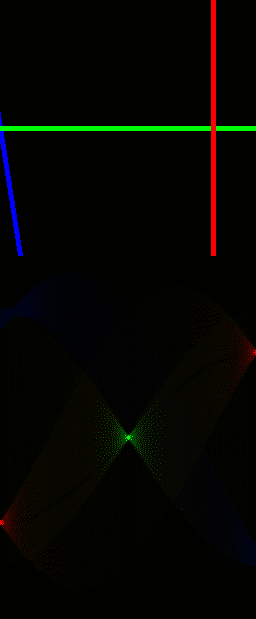

图 1:显示拉冬变换的动画。顶部:输入图像。下图:对应的拉冬变换。由[生成此代码](https://github.com/sebastiengilbert73/tutorial_radon_transform/blob/main/generate_animation_lines.py)。图片由作者提供。

在电子制造业中，用 X 射线计算机断层扫描检查两个分立元件之间的互连是常见的做法。例如，[球栅阵列(BGA)](https://en.wikipedia.org/wiki/Ball_grid_array) 是连接印刷电路板(PCB)和芯片的小焊球的密集网格。我们希望确保每个球都正确焊接到芯片和 PCB 的金属焊盘上。如果我们对组装好的封装进行垂直 X 射线检测，就像你的牙医获取你牙齿的图像一样，最终的图像质量会受到芯片和 PCB 中多层金属结构的影响。每个金属结构都充当一个 X 射线衰减器，形成遮挡，可能会阻止检测 BGA 平面中的细微缺陷(通常是孤立的焊料卫星、桥和异常球)。

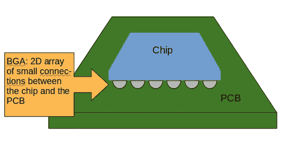

图 2:球栅阵列(BGA)位于 PCB 和芯片之间，不完全可见。图片由作者提供。

# BGA 检查场景

你是计算机视觉工程师，负责检查装配线上的 BGA，就在元件被焊接到熔炉中之后。您考虑从阵列的侧面拍照，但是您很快意识到除了第一行连接之外，您看不到更远的地方。你在寻找可以在芯片下任何地方找到的缺陷，所以你已经排除了这个选项。

经过大量的谷歌搜索，你找到了一个基于 *X 射线计算机断层扫描*的解决方案。作为一名杰出的制造商，您构建了一个一维 X 射线成像系统，可以从多个角度捕捉 BGA 吸收的切片(参见图 3)。

> 警告，孩子们:不要在家里这样做，除非在一个拥有高能辐射博士学位的成年人的监督下。
> 
> 再三考虑后，不要这样做，句号。

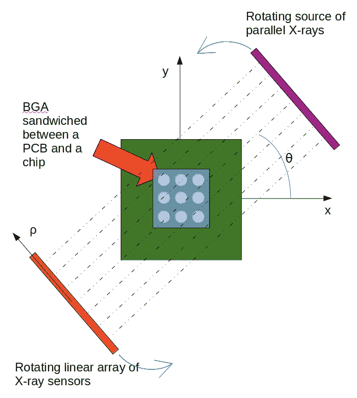

图 3:X 射线成像系统。图片由作者提供。

您的成像系统沿着 363 个 X 射线传感器的线性阵列长度产生 BGA 集成密度的切片。旋转机构可以选择投影的角度θ。你可以在这里找到模拟这个系统[的代码。](https://github.com/sebastiengilbert73/tutorial_radon_transform/blob/main/simulate_bga.py)

经过几天的对齐调整，你终于成功地获得了一个通过水平堆叠 BGA 的投影构建的图像，以 256 个离散的角度，从- **π** /2 到 **π** /2:

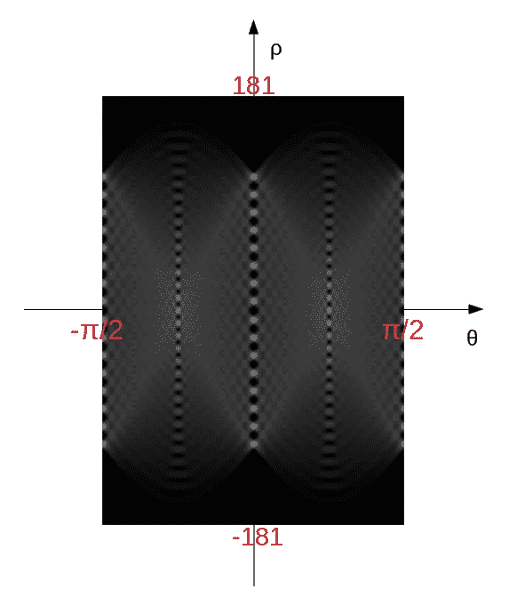

图 BGA 平面正弦图。图片由作者提供。

我们称这样的图像为*正弦图*，因为原始密度图像中的一个点在堆叠切片的图像中产生了正弦曲线。

你现在做什么？图 4 的正弦图如何揭示 BGA 平面上的密度图？

# 拉冬变换

通过在给定角度的平行射线上整合 2D 密度图来创建线性轮廓的操作是[拉冬变换](https://en.wikipedia.org/wiki/Radon_transform)。

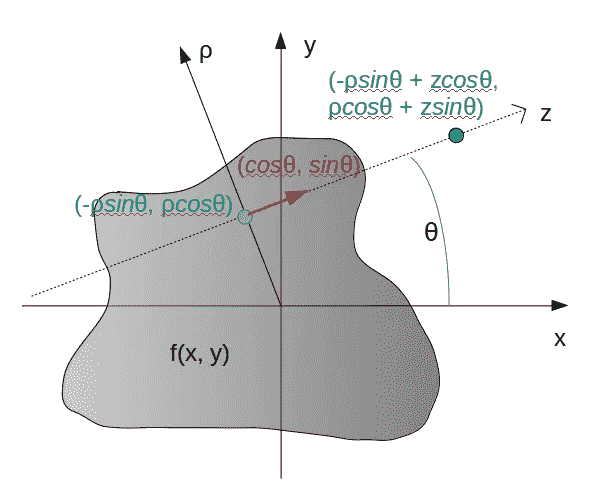

图 5:(ρ，θ)中 Radon 变换的值是 f(x，y)沿(ρ，θ)定义的线的积分。图片由作者提供。

f(x，y)的拉冬变换由下式定义:

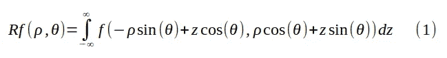

我们在图 3 中所示的旋转源和传感器的设置执行了对应于 BGA 平面的 X 射线局部吸收系数的函数的 Radon 变换。由于我们对 X 射线吸收图感兴趣，我们需要计算*逆拉冬变换*。

# 逆拉冬变换

我们可以通过利用[傅立叶切片定理](https://en.wikipedia.org/wiki/Projection-slice_theorem)得到逆 Radon 变换的近似:

> 对于给定的θ=θ₀，Rf(ρ，θ₀)(在ρ上积分)的 1D 傅立叶变换是 F(u，v)(f(x，y)的 2D 傅立叶变换)穿过原点并沿着θ₀ + **π** /2 的切片视图。

图 4 中的每一列都生成了一个 1D 频谱，并粘贴到 2D 频谱 F(u，v)中。有了大量的投影，我们可以建立一个“径向密集”的 2D 光谱(参见图 6)。

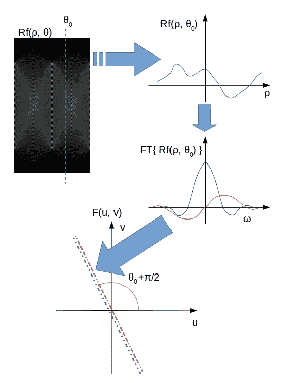

图 6:傅立叶切片定理。图片由作者提供。

> 你的意思是我们必须把任意角度的 1D 谱粘贴到定义在矩形网格上的 2D 谱上吗？

是的。你可以猜到，逆拉冬变换是一个插值节。幸运的是， *skimage* 库已经为我们完成了这项工作，计算 Radon 逆变换非常简单:

```
from skimage.transform import iradon
reconstruction = iradon(sinogram, theta=thetas, filter_name='ramp')
```

# BGA 密度图

将逆 Radon 变换应用于图 4 的正弦图，我们获得以下密度图:

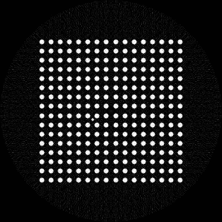

图 7:图 4 的逆 Radon 变换。图片由作者提供。

因为逆 Radon 变换不精确，所以重建有点嘈杂。质量受到投影角度的数量和用于将 2D 谱的矩形点阵与 1D 切片的极坐标匹配的插值方法的影响。

然而，我们可以看到 BGA 的 16 x 16 单个金属连接。在图像中心的左侧，有一个不应该在那里的小而密集的物体。我们发现了一个*微珠*，这是影响 BGA 的缺陷之一，只有通过计算机断层扫描才能看到。

# 结论

我们用计算机断层扫描模拟了 BGA 的检测。这让我们引入了拉冬变换及其逆运算。

我们通过整合多个角度的投影来构建 BGA 的正弦图。正弦图的逆拉冬变换揭示了物体密度图。

## 有奖游戏

在正弦图中，小物体表现为正弦曲线。我们 BGA 里的微珠打破了对称性。你能感觉到图 4 中看起来不同相的微弱正弦波吗？

[1]我们可以将 X 射线沿路径的总吸收建模为一系列短传播长度δX 上的指数吸收的乘积，其中局部吸收系数为αi:

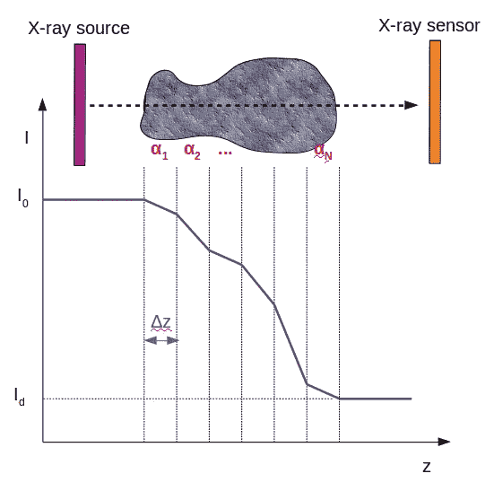

图 8:X 射线强度随着射线穿过被测物体而降低。图片由作者提供。

检测到的强度 Id 与源强度 I₀的比值可以写为:

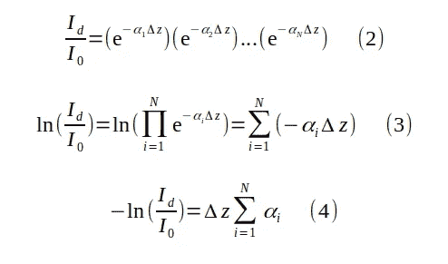

等式(4)告诉我们，-ln(Id/I₀与 x 射线沿其穿过材料的路径遇到的局部吸收系数αi 的总和(极限情况下的积分)成比例。这就是为什么我们可以将 X 射线投影视为物平面中密度图的积分。

[2]

## 傅立叶切片定理的证明

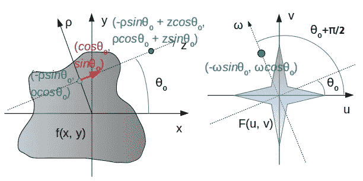

图 9:密度图 f(x，y)及其 2D 傅立叶变换 F(u，v)。图片由作者提供。

我们需要展示:

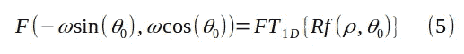

将(1)插入到 1D 傅立叶变换的定义中:

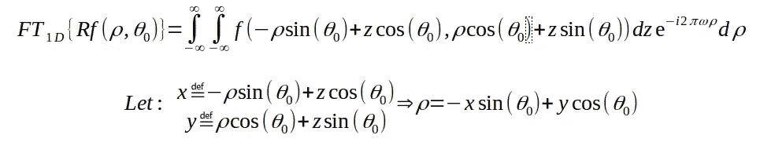

因为变量从(z，ρ)到(x，y)的变化对应于轴的旋转而没有标度变化，所以整个(z，ρ)平面上的积分与整个(x，y)平面上的积分相同。

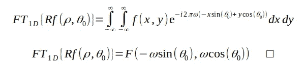