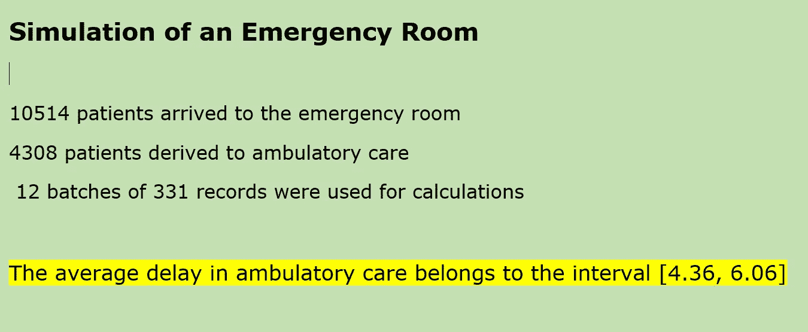

# SimPy 模拟

> 原文：<https://towardsdatascience.com/simulation-with-simpy-287cbdf5d78e>

## **第 7 部分:非终止模拟**


照片由 [JC Gellidon](https://unsplash.com/@jcgellidon?utm_source=medium&utm_medium=referral) 在 [Unsplash](https://unsplash.com?utm_source=medium&utm_medium=referral) 上拍摄

在本系列的第四篇文章中，我们区分了关于输出数据分析的两种类型的模拟:[1]终止模拟；[2]非终止模拟。

**终止模拟**是指运行一段时间，直到某个**预定义事件**标志着运行结束。该事件被称为“终端事件”，它必须在运行前指定，其发生时间可能是一个随机变量。模型的初始条件必须在运行前完全建立，因为我们关心的是被研究系统的**短期动态行为**。

另一方面，**非终止模拟**是一种我们关心被研究系统的**稳态性能的模拟。**模型运行了很长一段时间:没有预定义的终端事件来指定每次运行的长度。当然，我们必须在某个时间点停止运行。建立停止点有不同的技术，我们将在本文中讨论其中的一种。

非终止模拟与终止模拟有几个概念上的不同:

1)模型的**初始条件不需要完全建立**，因为它们的影响随着运行的长度而显著降低。

2)最初，有一个**瞬态**，在此状态下，性能指标在稳定之前会大幅波动。通常的程序是从瞬态中移除数据，以便它们不会对系统的稳态性能产生任何影响。

3)不可避免地，在非常长的运行中，出现**自相关**现象，因此在计算模型的稳态参数时出现**偏差**。

已经开发了几种方法和程序来确保非终止模拟的输出数据真正代表所研究系统的真实稳态行为。也许最著名的是分批平均法。

# **批量方法指**

让我们记住( [article 4](/introduction-to-simulation-with-simpy-8e7187c6eb82) )在终止模拟中，我们执行 *n* 个独立复制。每次运行的独立性通过在每次运行中使用不同的随机数流来实现。每次复制都以相同的初始条件开始。最后，我们计算每个性能指标的点估计和置信区间。

另一方面，我们在一个非终止的模拟中进行一个单独的长期运行。

非终止模拟的批量平均方法**由以下步骤组成:**

1)做一次非常非常长的跑步。通过消除初始瞬态的所有数据来消除瞬态效应。这被称为**预热阶段**。它的长度通常是通过初步的试运行来确定的。

2)剩余长度(有效行程)被分成等长的 *n* 个区间，称为**批次**。

3) **每批被认为是一个独立的复制**。因此，我们可以通过将每批视为一个独立的复制来计算样本均值、样本方差和置信区间及其相应的置信水平(平均性能指标)。

这是一个非常简单的程序，尽管有不同的方法涉及****批次数量和每批的长度。**一些作者认为至少应该有 20 至 30 个批次，而其他作者认为由于自相关问题，不应超过 20 个批次。一般认为，批次应等于或长于预热时间，以确保在一定程度上接近独立重复的条件。**

# ****用 SimPy 模拟急诊室****

**急诊室是医院或医疗机构中的一个部门，当病人病危或受伤并需要尽快治疗时，他们会去那里。**

**急诊室的操作方面通常被分析为 [**排队系统** (](/introduction-to-simulation-with-simpy-322606d4ba0c) 等候线系统)，其中患者随机到达，并排队等候(或不排队)，直到他们被初步筛选以确定他们的严重程度。这些患者中有一定比例的人需要住院治疗，另一个比例的人需要门诊治疗，其余的人不需要额外治疗，并在确认他们的病情不需要任何治疗后离开系统。**

**我们将使用 **SimPy** 来模拟在一个虚构的急诊室中对人员分配的可能修改，该急诊室包括一个入院区，以及分配给以下三个区域的医生:医院护理；门诊护理；不在乎。**

**首先，我们导入了 SimPy，Pandas 作为 *pd，* Numpy 作为 *np* ，以及 *scipy.stats* 模块，该模块包含了再现服从均匀分布和**截尾正态分布**的随机数序列的方法。**

```
@author: darwt
"""## Emergency Room Simulation Model
## Non Terminating Simulation
## Batch Means Technique# Import Modulesimport pandas as pd
import numpy  as np
from numpy.random import RandomStateimport simpyfrom scipy import stats
from scipy.stats import uniform
from scipy.stats import truncnorm
```

**我们包含了一个初始化模块来指示代表患者到达率的泊松分布的参数值。我们还显示了住院服务台的数量和医院护理、门诊护理和非护理级别的医生数量。我们认为住院、住院和流动区域的住院时间遵循正态分布，其平均值和标准偏差值在模块中显示。不关心水平遵循均匀分布，因此我们指出了它的最小值和最大值。我们还初始化了模拟运行的长度，以及用于存储中间结果的列表。第 3 条中所示的类似逻辑用于将患者分为三个护理级别。**

```
# initialization module
# Unit of time = hoursPATIENT_ARRIVAL_RATE  = 1.2NUMBER_ADMISSIONS_DESKS = 2ADMISSION_MEAN = 0.3
ADMISSION_STD  = 0.15HOSPITAL_MEAN = 25
HOSPITAL_STD  = 1.5AMBULATORY_MEAN = 6
AMBULATORY_STD  = 1NO_CARE_INF = 0.5
NO_CARE_SUP = 1.0NUMBER_DOCS_HOSPITAL= 1
NUMBER_DOCS_AMBULAT = 5
NUMBER_DOCS_NO_CARE = 1# discrete probabilities for three care levels
prob1, prob2, prob3 = 0.3, 0.6, 0.1prob1 = round(prob1, 2)
prob2 = round(prob1 + prob2,2)
prob3 = round(prob2 + prob3,2)
list_of_probs = [prob1, prob2, prob3]patient_arrival, arrival = [], []
patient_admission, patient_hospital_care = [], []
patient_ambulatory_care, patient_no_care = [], []
time_in_admission,       delay_in_admission = [], []
time_in_hospital_care,   delay_in_hospital_care   = [], []
time_in_ambulatory_care, delay_in_ambulatory_care = [], []
time_in_no_care,         delay_in_no_care         = [], []SIM_TIME = 3000
```

**利用[生成器功能](/introduction-to-simulation-with-simpy-8d744c82dc80)和*生成患者来模拟患者的到达。*我们计算住院和三级护理的住院时间。 *yield env.timeout()* 是一种离散事件，在经过一定的模拟时间后触发。**

```
def generate_patient(env, patient_arrival_rate,inital_delay = 0,                 
              stoptime = simpy.core.Infinity,prng = RandomState(0)): number_of_patients = 0
    yield env.timeout(inital_delay)     # Initial delay    while (env.now <stoptime):  
       inter_arrival_time=prng.exponential(1.0/patient_arrival_rate) left, right = 0, np.inf 
       loc1, scale1  = ADMISSION_MEAN, ADMISSION_STD
       loc2, scale2  = HOSPITAL_MEAN,  HOSPITAL_STD
       loc3, scale3  = AMBULATORY_MEAN,AMBULATORY_STD a1 = (left -  loc1)/scale1
       b1 = (right - loc1)/scale1
       a2 = (left -  loc2)/scale2
       b2 = (right - loc2)/scale2
       a3 = (left -  loc3)/scale3
       b3 = (right - loc3)/scale3       los_admis = truncnorm.rvs(a1,b1,loc1, scale1 ,size=1)
       los_hosp  = truncnorm.rvs(a2,b2,loc2, scale2 ,size=1)
       los_ambu  = truncnorm.rvs(a3,b3,loc3, scale3 ,size=1)
       los_exit  = uniform.rvs(loc = NO_CARE_INF, 
                               scale = NO_CARE_SUP + 1,size=1) number_of_patients += 1
       pat_str = patient_stream(env, 'Patient number: {}'.format(number_of_patients),
              los_admis, los_hosp,los_ambu, los_exit) env.process(pat_str)
       yield env.timeout(inter_arrival_time)
```

**Simpy 在仿真建模中使用 [**流程交互方法**](/introduction-to-simulation-with-simpy-b04c2ddf1900) 。 *patient_stream* 生成器函数描述了单个患者在整个系统中的流动，代码模拟了这些患者在急诊室模型中的路线中的体验。方法 *request()* 生成一个事件，该事件在资源再次可用时被触发( *yield req* )。进程*请求*那些资源成为用户，并且一旦完成就必须*释放*。**

```
def patient_stream(env, patient_number, los_admis, 
                   los_hosp, los_ambu, los_exit): #  Admission
    print("%3s is arriving for admission at %.2f" %(patient_number, env.now))
    patient_arrival.append(patient_number)
    arrival_time = env.now
    arrival.append(arrival_time) adm_request_desk = admission_desks.request()
    yield adm_request_desk
    print("%3s admitted to admission at %.2f" %(patient_number, env.now))
    time_in_admission.append(env.now) if (env.now > arrival_time):
        delay_in_admission.append(env.now - arrival_time)
        patient_admission.append(patient_number)
        print("%3s has to wait %.2f' for admission" %(patient_number, env.now - arrival_time)) yield env.timeout(los_admis)
    print('%3s stays at admission %.2f' % (patient_number,los_admis)) admission_desks.release(adm_request_desk) # uniform distribution for level assigments
    r_v = uniform.rvs(size=1)
    if r_v < prob1:
       stream = 1
    elif r_v < prob2:
       stream = 2
    else:
       stream = 3 if stream == 1:
       #  Hospital Care
       print('%3s is arriving for hospital care at %.2f' % (patient_number,env.now)) arrival_time = env.now
       time_in_hospital_care.append(arrival_time) hospital_care_request = hospital_care.request()
       yield hospital_care_request
       print('%3s is admitted to hospital care at %.2f' % (patient_number,env.now)) if (env.now > arrival_time):
          delay_in_hospital_care.append(env.now - arrival_time)
          patient_hospital_care.append(patient_number)
          print('%3s has to wait for hospital care for %.2f'
                 %(patient_number, env.now - arrival_time)) 

       yield env.timeout(los_hosp)
       print('%3s stays at hospital care at %.2f' % (patient_number,los_hosp)) hospital_care.release(hospital_care_request) elif stream == 2:
       #  ambulatory care
       print('%3s is arriving for ambultory care at %.2f' % (patient_number,env.now)) arrival_time = env.now
       time_in_ambulatory_care.append(arrival_time) ambulatory_care_request = ambulatory_care.request()
       yield ambulatory_care_request
       print('%3s is admitted to ambulatory care at %.2f' % (patient_number,env.now)) if (env.now > arrival_time):
          delay_in_ambulatory_care.append(env.now - arrival_time)
          patient_ambulatory_care.append(patient_number)
          print('%3s has to wait for ambulatory care for %.2f' %
                 (patient_number, env.now - arrival_time)) yield env.timeout(los_ambu)
       print('%3s stays at ambulatory care at %.2f' % (patient_number,los_ambu)) ambulatory_care.release(ambulatory_care_request)elif stream == 3:
       #  no care
       print('%3s is arriving for no care at %.2f' % (patient_number,env.now)) arrival_time = env.now
       time_in_no_care.append(arrival_time) no_care_request = no_care_level.request()
       yield no_care_request
       print('%3s is admitted to no care at %.2f' % (patient_number,env.now)) if (env.now > arrival_time):
          delay_in_no_care.append(env.now - arrival_time)
          patient_no_care.append(patient_number)
          print('%3s has to wait for no care for %.2f' % 
                (patient_number, env.now - arrival_time)) yield env.timeout(los_exit)
       print('%3s stays at no care at %.2f' % (patient_number,los_exit)) no_care_level.release(no_care_request)
```

**我们编写了函数 *calc_batches()* ，用于计算门诊护理级别的平均排队延迟的置信区间(置信水平为 0.90)。我们在每批中使用了 12 批相同数量的记录。**

```
def calc_batches():
    ## delay in ambulatory care global inf, sup, delay_in_ambulatory_care
    number_batchs = 13        ## selected by the analyst
    number_recs    = len(delay_in_ambulatory_care)
    recs_per_batch = int(number_recs/number_batchs) # to guarantee equal number of records in each batch
    matrix_dim = number_batchs*recs_per_batch
    rows_to_eliminate = number_recs - matrix_dim   
    delay _in_ambulatory_care = 
                    delay_in_ambulatory_care[rows_to_eliminate:] # eliminating transient effects (warm-up period)
    delay_in_ambulatory_care =  
                    delay_in_ambulatory_care[recs_per_batch:] matrix = []
    while delay_in_ambulatory_care != []:
         matrix.append(delay_in_ambulatory_care[:recs_per_batch])
         delay_in_ambulatory_care = 
                   delay_in_ambulatory_care[recs_per_batch:] 

    number_batchs = number_batchs – 1 ## the warm-up batch

    dof  = number_batchs - 1
    confidence = 0.90                   ## selected by the analyst
    t_crit = np.abs(stats.t.ppf((1-confidence)/2,dof))
    batch_means = np.mean(matrix, axis = 1)
    batch_std   = np.std(matrix,  axis = 1)
    average_batch_means  = np.mean(batch_means,axis = 0)
    standard_batch_means = np.std(batch_means, axis = 0) inf = average_batch_means 
          -standard_batch_means*t_crit/np.sqrt(number_batchs) sup = average_batch_means 
          +standard_batch_means*t_crit/np.sqrt(number_batchs) inf = round(float(inf),2)
    sup = round(float(sup),2) print('')
    print('Simulation of an Emergency Room')
    print('')
    print('%3s patients arrived at the emergency room' % (len(patient_arrival)))
    print('%3s patients derived to ambulatory care' % (number_recs))
    print('%3s batches of %3s records were used for calculations' %      (number_batchs,  recs_per_batch))
    print ('')
    print('The average delay in ambulatory care belongs to the interval %3s %3s' % (inf, sup))
```

**模拟算法的核心代码如下。它包含了一个 *Environment()* 的实例，因为所有 SimPy 进程都存在于一个环境中[2]。我们排队系统的服务器(**资源**)是接诊台的数量，以及医院护理、门诊护理和非护理级别的医生数量。我们使用 *1234* 作为泊松、均匀和截尾正态分布的随机数序列的种子值。变量*stop _ arrives*在验证步骤中使用，必须在生产运行时分配给 *SIM_TIME* 。**

```
env = simpy.Environment()
admission_desks = simpy.Resource(env,
                                 capacity = NUMBER_ADMISSIONS_DESKS)
hospital_care   = simpy.Resource(env, 
                                 capacity = NUMBER_DOCS_HOSPITAL)
ambulatory_care = simpy.Resource(env, 
                                 capacity = NUMBER_DOCS_AMBULAT)
no_care_level   = simpy.Resource(env, 
                                 capacity = NUMBER_DOCS_NO_CARE)prng = RandomState(1234)
stop_arrivals = 2000env.process(generate_patient(env,PATIENT_ARRIVAL_RATE,0,
            stop_arrivals, prng ))env.run(until = SIM_TIME)
calc_batches()
```

****分析****

**我们模拟了一个急诊室，包括一个有两个入院台的入院区、一个医院护理级别的医生、五个门诊护理级别的医生和一个非护理级别的医生。根据泊松分布，病人以每小时 1.2 个病人的速度到达急诊室。根据正态分布，患者随机停留在入院区、医院护理级别和门诊护理级别。历史数据表明，30%的到达患者留在医院护理，60%需要流动护理，只有 10%离开房间时仅进行了根据均匀分布的额外筛查。**

**医疗机构的管理人员希望分析人员分配的可能修改，因为他们收到了来自众多患者的大量投诉，这些投诉与排队时间过长有关，尤其是在门诊护理级别。**

**他们决定进行模拟研究，以了解最终变化的影响，而不必在实际系统中进行。**

**最初，我们进行了一次长度为 8760 (24 小时* 365 天/小时)的运行。在剔除第一批(预热期)后，我们用 12 个等长批次的批次均值法计算了我们的性能指标(稳态参数)。**

**图 1 总结了输出数据:在 10514 个模拟患者后，我们以大约 90%的置信度声称，门诊护理水平的平均延迟包含在置信区间[4.36，6.06]小时内。**

****

**图 1 由作者制作**

**在接下来的文章中，我们将继续分析当前配置的替代方案，以使急诊室的运作更好地响应患者的需求。**

# ****参考文献****

****【1】**[https://simpy . readthedocs . io/en/latest/API _ reference/simpy . resources . html # simpy . resources . resource . resource . release](https://simpy.readthedocs.io/en/latest/api_reference/simpy.resources.html#simpy.resources.resource.Resource.release)**

****【2】**[https://simpy . readthedocs . io/en/latest/API _ reference/simpy . html # environments](https://simpy.readthedocs.io/en/latest/api_reference/simpy.html#environments)**