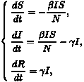
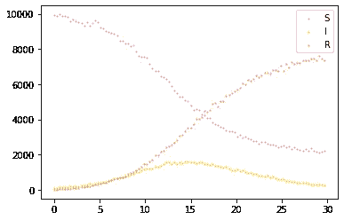
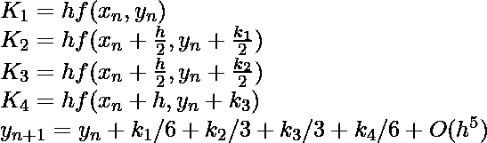
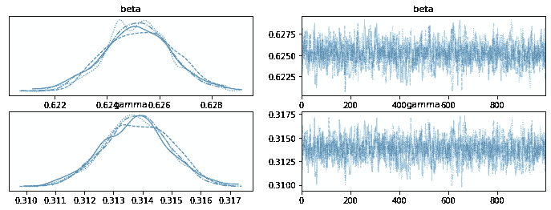
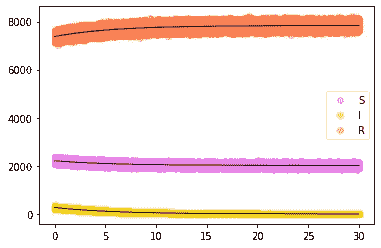

# 基于 SIR 模型的传染病传播概率估计

> 原文：<https://towardsdatascience.com/sir-model-informed-probabilistic-estimation-of-infectious-disease-spread-ec9d4a35453e>

## 用 Pymc3 推断龙格-库塔积分

布莱恩·阿萨尔拍摄的图片

机器学习方法在流行病学研究中发挥了重要作用。对这个领域感兴趣的数据科学家是幸运的，因为他们不必从头开始寻找数据驱动的解决方案。相反，他们会被一些经过充分研究的数学模型所引导。

这篇文章解释了如何使用 [Pymc3](https://docs.pymc.io/en/v3/index.html) (一个用于贝叶斯统计建模的 Python 包)来构建贝叶斯推断，以预测由最基本的流行病学模型(例如 SIR 模型)提供的疾病传播。该实现也可以通过类似实现的[张量流概率](https://www.tensorflow.org/probability)来完成。请查看[笔记本](https://colab.research.google.com/drive/13Ka-KV4HQMMRpdVYNJ3s_BkXg8ns8TnK#scrollTo=a-4vhzjAVc5P)获取完整的 python 代码。

# SIR 模型

[SIR 模型](https://en.wikipedia.org/wiki/Compartmental_models_in_epidemiology#The_SIR_model)可能是最简单的房室模型，并衍生出许多变体。它描述了整个种群中三个基本区间的动态:易感个体、传染性个体和被移除的个体，正如该模型的名称所示。该模型值得一章，这篇文章不会深入到各种参考资料中很好解释的细节。取而代之的是，我们在这一节只做一个简单的介绍。

SIR 模型通过一个常微分方程(ODE)给出了不同人群的动态，假设整个人群为常数 N，忽略了流行病期间的出生率和死亡率。

图片作者:SIR 模特

两个参数β和γ代表感染率和清除率。它们的比率是基本再生数，其值决定了流行病的渐近行为。一旦给出这两个参数，SIR 模型所描述的流行病的动力学将被确定。

# 资料组

以下模型化中使用的数据集是通过 SIR 模型的简单模拟生成的合成数据集。它包含在流行病的前 30 天期间易感个体、感染个体和被移除个体的人口。总人口为 10000 人，最初有 10 名感染者，9990 名易感者，0 名被清除者。我们想训练一个模型，预测未来 30 天的疫情。

为了显示以下模型化的能力，只考虑了 100 个数据点。

作者图片:SIR 人群数据集

# SIR 模型通知模型化

## 模型化的目标

分室模型应该指导机器学习方法来模拟流行病的发展。此外，对于给定的初始状态，如果我们知道β和γ的值，就可以得到 SIR 群的未来粒子数。因此，模型化的主要目标变成学习 SIR 模型的两个参数。

同时，当我们记录不同群体的人口时，不确定性是不可避免的。因此，我们将建立一个 SIR 动态和贝叶斯推理的网络来学习两个相关参数中的后一个。

## 龙格-库塔法

由 ODE 给定的 SIR 模型在被投入网络之前应该被离散化。在这里，我们将使用经典的四阶[龙格-库塔](https://en.wikipedia.org/wiki/Runge%E2%80%93Kutta_methods)积分，这是一种涉及逐次逼近求解微分方程的数值方法，其形式为 dy/dx=f(x，y)。

图片作者:四阶[龙格-库塔](https://en.wikipedia.org/wiki/Runge%E2%80%93Kutta_methods)

## 推理

1.  将β和γ的先验设置为[0，1]中的均匀分布；
2.  给定 SIR 的初始状态(用 y0 表示)，使用 Runge-Kutta 方法获得未来时刻的状态序列。
3.  给每个实例添加一个项式泊松噪声。
4.  做贝叶斯推断得到β和γ的后验概率。

我们不会在这篇文章中提供详细的代码。请读者阅读[笔记本](https://colab.research.google.com/drive/13Ka-KV4HQMMRpdVYNJ3s_BkXg8ns8TnK#scrollTo=o22Tu93XJFTT)，欢迎提问。

# 结果

在 100 个数据点上训练，参数收敛到以 0.6 和 0.3 为中心的正态分布。

作者图片:参数跟踪图

因此，我们可以预测接下来 30 天的 SIR 数量。我们可以在图中看到，流行病趋于渐近平衡。幸运的是，我们最终几乎不再看到新的病例。

作者图片:30 天后疫情动态

# 结论

在这篇文章中，我们将一个数学模型插入到贝叶斯推理中，并将其应用于传染病传播用例。当模型被一些背景知识告知时，小数据集似乎足以用于参数的收敛。

最后，我们要指出，合成数据集只是一个理想的情况，有些不真实的简化。一个有趣的下一步将是在真实数据集上测试该模型，例如大城市的 covid 案例。