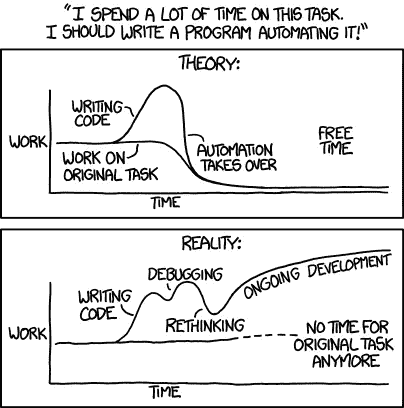
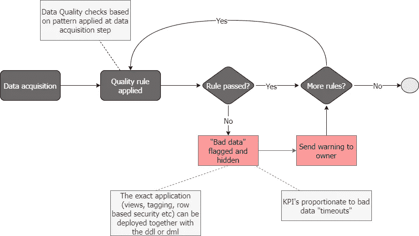
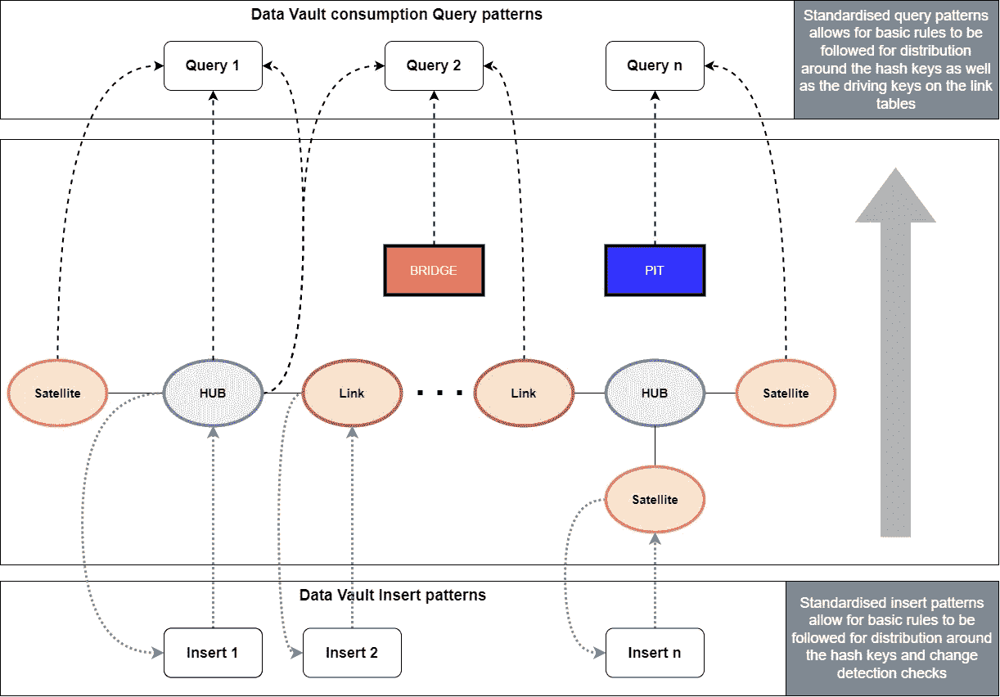

# 你应该自动化的六个数据函数

> 原文：<https://towardsdatascience.com/six-data-functions-you-ought-to-automate-cad4b11e404b>

## 数据管道中应该被视为可重复模式的方面


莱尼·屈尼在 [Unsplash](https://unsplash.com/?utm_source=medium&utm_medium=referral) 上的照片

任何好的解决方案或数据架构师在任何给定的时间点都应该有各种各样的问题。这很正常。什么是 ***ab*** 正常的是，同样的问题会回到那个桌子上。这是您想要摆脱的一个可重复的模式。

在概念上正确的地方解决方案应该永远是架构师的现状。虽然这是我们一直想要的，但是时间压力会让我们做傻事。然而，当您的解决方案建立在可重复的模式之上时，它多少会迫使您这样做。

如果单点解决方案是由自动化过程生成的，那么修复它们是非常不舒服的。通过创建这些孤立的解决方案，你会树敌很多。

通过使用可重复的模式，你将被迫缩小视野，从整体上看问题。例如，您将被迫查看逻辑数据模型并识别潜在的缺点，而不是简单地调整一些将数据加载到目标对象中的 SQL 代码。它会凸显出你的模式并不完美，从而迫使你让它变得更加健壮。

你总是可以通过编码让自己摆脱困境，但是在你的生态系统中拥有定制的编码模式是不可持续的。

我不太支持无代码平台。我对高代码平台非常满意，只要我不需要自己写代码，或者如果我要写，只写一次。但是如果不允许我查看代码并在需要时调整模式，我会受到严重的限制。

关于自动化的话题，如果我每次谈到它时都不分享这个形象，那就太虚伪了。这仍然是事实，人们应该记住这一点。



图片来源:[xkcd.com](https://xkcd.com/1319/)

仅仅因为一些事情是痛苦的，并不意味着它不是正确的事情。设置这些初始模板和模式是困难的，但在某些时候它将胜过手工。

下面是一些我认为应该考虑自动化的明显的可重复模式。

# 装货

无论您的加载模式如何，无论是批量加载、CDC 方法还是消息驱动流。您将数据接收到所需平台或存储的方式应该是轻量级和可重复的。它应该是一对夫妇点击设置加载过程。

我是 ELT 的支持者——让您的数据按原样加载并在目标中转换。这使得加载的模块化变得更加容易，然后目标平台可以为 on target 转换做优化查询计划的艰苦工作。

# 数据转换

ETL/ELT 中测试不一定要完全定制。

模块化不同的功能在许多职业中是一个很好的原则，尤其是软件开发。将经常重复的功能模块化。这方面的一些例子是数据清理模式和数据类型转换等硬业务规则。

从概念上讲(这个词又出现了)，在同一个地方做同样的事情。不要一步到位地净化和改造。通过这种方式，你可以将重复性的任务模块化，并将它们从非重复性的任务中剥离出来。

测试也依赖于风格。例如，Data Vault 建模风格是高度面向自动化的，因此不需要花费太多精力在可重复的模式上，但是即使是 3NF 和 Kimball 建模风格本质上也是高度重复的。

选择一种造型风格并坚持下去，这也会迫使你在正确的地方做正确的事情。不选择特定的建模技术，你也在做选择——把决定权留给每个工程师。这将导致不可重复的代码。

# 数据质量

在数据采集过程中模块化和重复质量检查，但要确保它落到正确的人手里。

失败的质量检查需要反馈给那些不愿意接受坏数据的人。无论是您的产品所有者还是指定的数据管理员，他们都需要积极主动地解决数据质量问题。

一个简单的流程可能看起来像这样，其中隐藏了“坏数据”。如果数据集没有通过质量检查，可以通过标记数据集来隐藏数据。然后可以在加载过程中排除它们，或者通过视图或行/列级安全性隐藏它们。



作者图片

无论您决定标记、隐藏还是排除失败的数据，都可以作为内置于自动化流程中的 DDL 语句发送。

# 分销策略

MPP 平台上的数据分布是数据平台生命周期和可持续性的关键部分。

根据您的建模模式，这可以是高度自动化的，也可以是稍微自动化的，但是不应该没有自动化的机会。

不管您使用什么平台，您应该如何存储数据取决于几个因素，如查询模式、数据量以及对象是否应该针对读取或写入进行优化。查询模式高度依赖于您正在使用的数据建模风格。许多这些因素在设计时就知道了，因此可以在最初创建 DDL 时分配。随着时间的推移，随着数据大小和查询模式的变化，有些需要改进。这仍然可以自动化，因为它会持续对您的数据进行健康检查。

由于 Data Vault 作为一种建模风格的重复性和标准化性质，因此有很好的机会在没有干预的情况下应用适当的分布标准。在设计时，如果需要更改，可以覆盖它。



标准化的 DV 查询模式可轻松实现自动化——按作者分类的图片

通常，不同的平台(如 Synapse、Redshift、Snowflake 和 Delta Lake 等)都有关于分区、分布和集群策略的良好文档。他们通常也有文档告诉你如何检查你的数据是否有偏差。然后，您可以从这个更大的社区中学习，并将其烘焙成一个可重复的模式来定期运行，从而允许您的数据“自我修复”。

# 数据安全

每当我与客户交谈时，数据安全占据了大量的通话时间。它一直很重要，但现在变得更加微妙了。大多数公司正在转向云计算和“即服务”解决方案。这一点，再加上个人信息的复杂性，让你难以理解。不仅每个国家都有自己的法律，每个公司都有自己对法律的解释。

免责声明——自动化不会修复这些细微差别。

自动化确实允许您更快地迭代和测试您的安全策略。给合规团队一些工作。只有律师能在纸上谈兵，我们其他人需要看到它在行动中。

您不需要手动对用户或角色应用安全策略。预先定义策略，理想情况下，您希望这些策略在设计时是可部署的(而不是可悲的)。

根据您的数据建模风格，您可以轻松地将敏感数据部署到安全模式中的不同规范化表中(如 Data Vault)，或者您可以将它们保存在一起，但使用 DDL 生成对表应用列级或行级策略。无论您是屏蔽数据、加密数据还是简单地保护数据不被用户发现，大多数目标平台都满足这些特性中的一部分或全部。设计保持同质，部署基于您要部署到的目标平台而定制。

# 测试

关于这一点已经写了很多，我建议你阅读一下数据操作方面的测试。

这是一个广泛的话题，我将简单地强调一个我认为被忽视的方面:策划输入，策划输出。创建可测试的精选数据集是痛苦和荣耀之所在。

# 会议邀请谢绝

好吧，这是一个额外的，但人们都缩小了。良好架构的解决方案与良好执行的计划密切相关。两者都需要时不时不间断的专注努力。

总之，可能有更多的领域可以自动化，但是我发现这六个领域在你的架构的可持续性中扮演着关键的角色。持续改进这些模式将迫使您构建架构良好的解决方案，并停止不得不修复相同问题的循环。

简单地问自己哪里存在可重复的模式，或者哪里可以改进——改进模式，清洗并重复。

```
[1] - DataKitchen. 2022\. *Blog - Add DataOps Tests to Deploy with Confidence | DataKitchen*. [online] Available at: <https://datakitchen.io/add-dataops-tests-to-deploy-with-confidence/>
```