# 分析时间序列数据的六张图

> 原文：<https://towardsdatascience.com/six-plots-to-analyze-your-time-series-data-d71b555f99cf>

## 在 Python 中实现箱线图、傅立叶变换、熵、自相关和 PCA 来分析时间序列数据


照片由[卢卡斯](https://www.pexels.com/@goumbik)在[像素](https://www.pexels.com/photo/chart-close-up-data-desk-590022/)上拍摄

数据可视化是任何数据相关项目中最重要的阶段之一。根据数据可视化的对象，有:

1.  数据可视化以报告结果。
2.  数据可视化，用于分析数据，或者换句话说，数据科学家内部使用的可视化，用于提取有关数据的信息，然后实现他们的模型。

本文主要关注后者，因为它解释了一些有助于时间序列数据分析的方法。具体来说，这篇文章涵盖了以下方法:(1)均值和标准差，(2)箱线图，(3)傅立叶，(4)熵，(5)降维，以及(6)自相关。

本文使用的所有数据和代码都包含在下面的 [GitHub](https://github.com/javiferfer/medium) 库中。

# 0.图书馆

首先，这些是与笔记本一起使用的库。大部分代码绕过了 *NumPy* 和 P *和 as* 库，因为数据主要用作 P *和 as Dataframe* 的 *NumPy 数组*。

# 1.导入文件

一旦下载了位于 [GitHub](https://github.com/javiferfer/medium) 存储库中的数据，运行下面的代码来导入它。

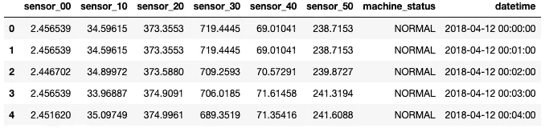

如所观察到的，数据具有六个传感器的传感器数据、每个数据点的日期时间以及机器状态。这一个是“已中断”、“正常”或“正在恢复”，但是为了简化可视化，它被分组如下:

```
{'BROKEN', 'NORMAL', 'RECOVERING'}0: {'NORMAL', 'RECOVERING'}
1: {'BROKEN'}
```

在任何编程语言中处理 datetimes 总是具有挑战性，Python 也不例外。尽管有几种处理日期时间的方法，但是列 datetime(作为*字符串*读取)被函数 *pandas.to_datetime 转换为时间戳。*

```
<class 'str'>
<class 'pandas._libs.tslibs.timestamps.Timestamp'>
```

# 2.数据预处理

在进行可视化之前，对重复和缺失的值进行了分析。

以下是在我们的数据框中删除重复项的函数:

这是填充缺失值的函数:

这是预处理阶段的整个管道。此外，数据分为输入和输出数据。

```
Input shape: (10081, 7)
Output shape: (10081, 2)
```

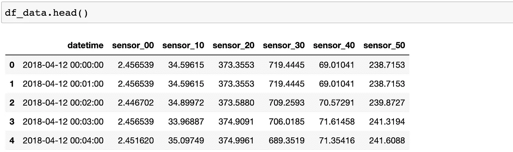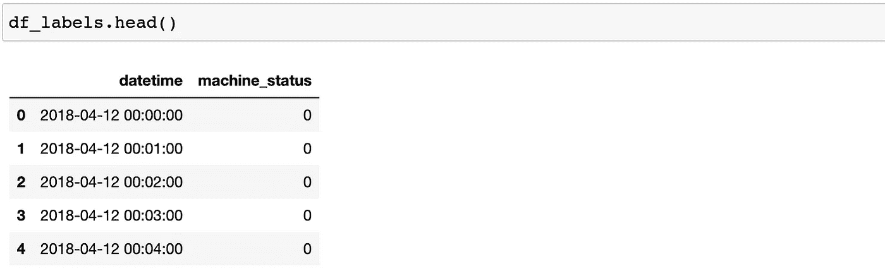

# 3.数据可视化

现在，我们准备开始数据可视化。这是传感器数据和异常的曲线图。

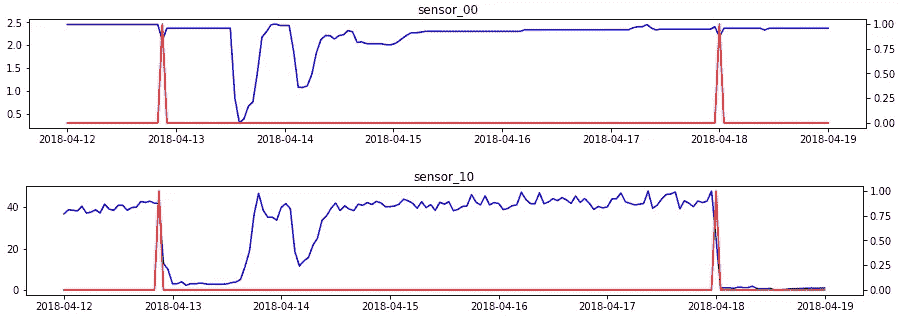

**图一**。时间序列。**参考**:图片由作者提供。

## 3.1.平均值和标准值

更好地总结数据随时间变化的行为的最基本的图之一是均值-标准差图，其中我们显示了按时间范围分组的均值和标准差。这主要有助于分析特定时间段的基线和噪声。

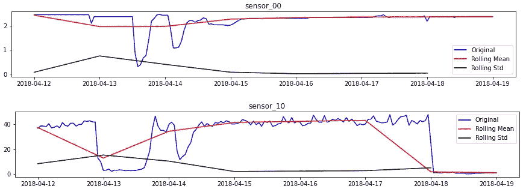

**图二**。均值和标准差。**参考号**:图片由作者提供。

## 3.2.箱线图

另一个有趣的图是通过 boxplots 显示的图。箱线图是一种通过四分位数以图形方式展示数字数据的局部性、分布和偏斜度组的方法。有两个主框表示从第 25 个百分位数到第 75 个百分位数的数据，由分布的中值分隔。除了方框之外，还有从方框延伸出来的胡须，表示上下四分位数之外的可变性。与数据集的其余部分显著不同的异常值也绘制为箱线图上触须之外的单个点。

这个类似于均值和标准差图，因为它表明了数据的平稳性。但是，它也显示异常值，这有助于直观地检测异常和数据之间的任何关系。

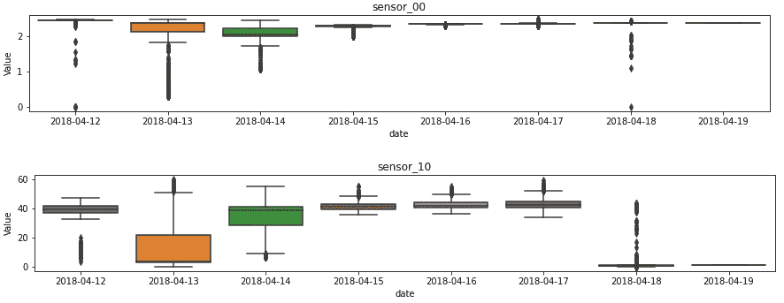

**图三**。箱线图。 **Ref** :图片作者。

## 3.3.傅里叶

快速傅立叶变换(FFT)是一种计算序列的离散傅立叶变换的算法。这种类型的绘图非常有趣，因为它是处理时间序列时提取特征的主要方法之一。通常的做法是应用傅立叶变换提取频率，然后训练模型，而不是训练时间序列的模型。

为此，您必须选择一个滑动窗口来计算 FFT。滑动窗口越宽，频率数越高。缺点是您将获得更少的时间戳，从而失去数据的时间分辨率。当减小窗口大小时，我们得到相反的结果:更少的频率但更高的时间分辨率。然后，窗口的大小应该取决于任务。

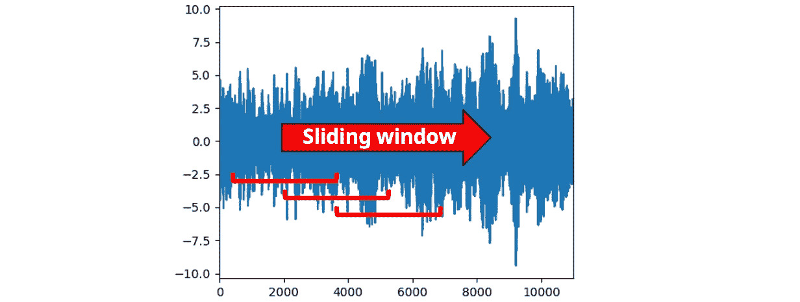

**图 4** 。FFT 的滑动窗口。**参考**:图片由作者提供。

对于下图，我选择了 64 个数据的时间窗口。因此，频率从 1-32 赫兹。


**图 5** 。FFT。**参考**:图片由作者提供。

## 3.4.熵

可视化信息和熵是机器学习中的有用工具，因为它们是许多特征选择、构建决策树和拟合分类模型的基础。

熵的计算如下:

*   归一化频率分布


*   计算熵


最低熵是为一个随机变量计算的，这个随机变量有一个概率为 1.0 的确定性的单一事件。如果所有事件的可能性相等，那么随机变量的熵最大。

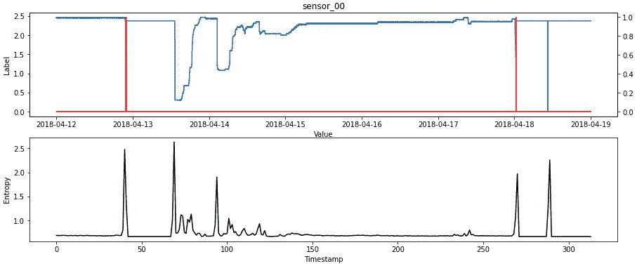

**图 6** 。熵。**参考号**:图片由作者提供。

## 3.5.降维

当有多个传感器时，实施降维方法以获得包含大部分信息的 1、2 或 3 个主要成分总是令人感兴趣的。

对于这个例子，我实现了主成分分析(PCA)。这是计算主成分并使用它们对数据进行基变换的过程。

解释的差异比率是由每个所选组件引起的差异的百分比。

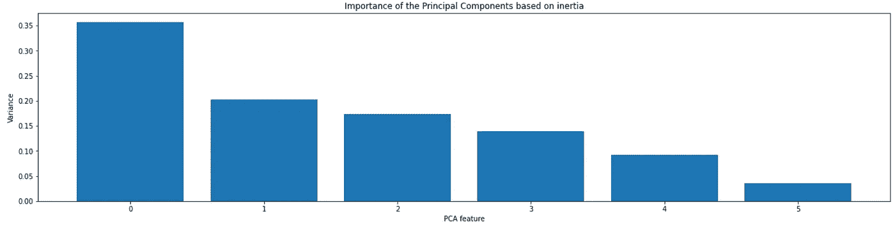

**图七**。PCA 解释的方差比。 **Ref** :图片作者。

对于第一个主成分分析，您可以绘制数据并直观地检查异常和时间序列之间是否存在关系。

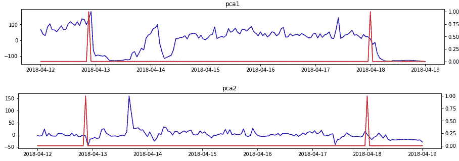

**图 8** 。PCA。**参考**:图片由作者提供。

## 3.6.自相关

最后，特别是对于预测任务，绘制数据的自相关图是很有趣的。这一个代表一个给定的时间序列和它本身在连续时间间隔内的滞后版本之间的相似程度。

```
Autocorrelation is:  0.024363541344977133
```

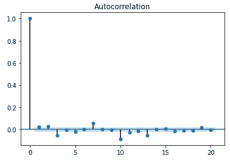

**图 9** 。自相关。**参考**:图片由作者提供。

与自相关相关的是扩展的 Dickey-Fuller 统计检验，用于检验给定的时间序列是否平稳。

```
sensor_00:  (-4.288982026391745, 0.00046413778677505943, 13, 10067, {'1%': -3.4309997435394877, '5%': -2.861827148204747, '10%': -2.5669228438492597}, -31804.0714734676)
pca1:  (-3.7298433193954073, 0.003712434586758542, 5, 10075, {'1%': -3.430999227482557, '5%': -2.8618269201630375, '10%': -2.566922722462425}, 44790.129278286884)
```

***如果你喜欢这个帖子，请考虑*** [***订阅***](https://javiferfer.medium.com/membership) ***。你将获得我所有的内容+所有其他来自牛逼创作者的文章！***

# 参考

[1] GitHub，[异常检测](https://github.com/bauyrjanj/Anomaly_Detection)

[2]开放风险，[可视化时间序列的 21 种方法](https://www.openriskmanagement.com/21_ways_to_visualize_a_timeseries/)