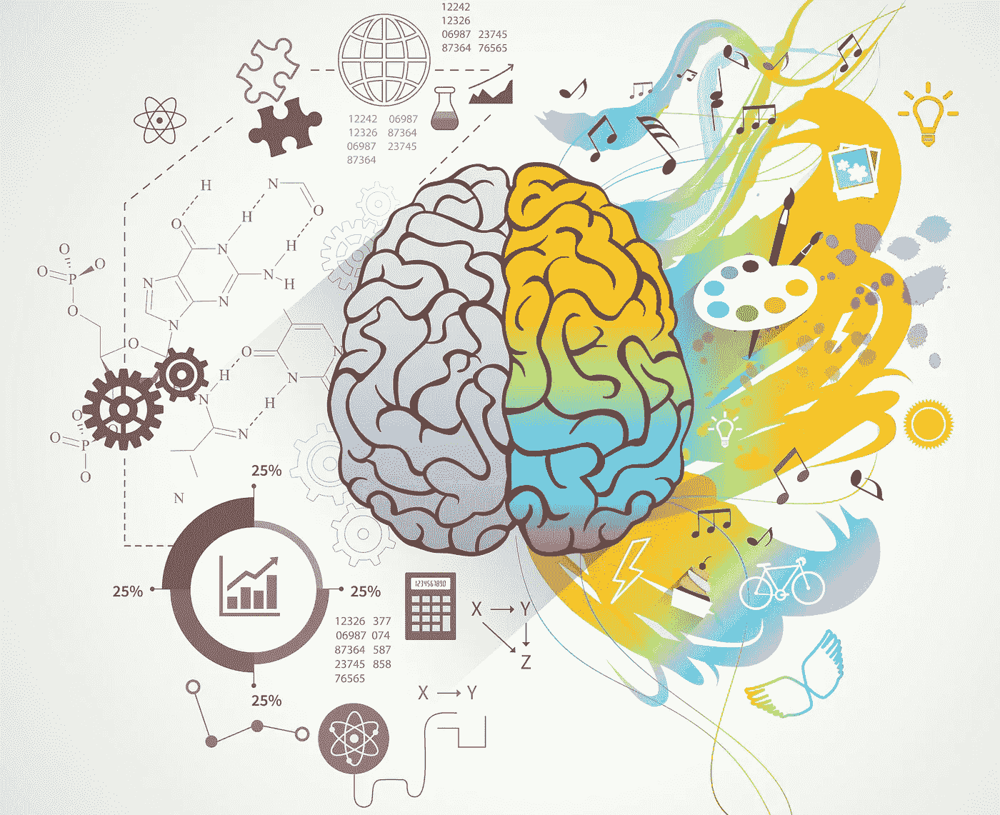

# 从业务人员转变为数据科学家需要知道的六件事

> 原文：<https://towardsdatascience.com/six-things-you-need-to-know-about-changing-from-business-person-to-data-scientist-975003bbcf78>

宏向量创建的图像—[www.freepik.com](http://www.freepik.com)

## 一位成为数据科学家的董事总经理的见解

首先，从商业管理(或咨询)转向数据科学不是职业“支点”。物理学家或工程师成为数据科学家将是职业生涯的转折点。从商业人士到数据科学家是一个****飞跃，进入一个非常不同的职业生涯！****

**但是如果你热爱编程、科学和绞尽脑汁解决问题，这绝对是一个伟大的举动。**

**以下是我作为一名数据科学家第一年的一些观察——这是我在销售和商业战略领域工作了 9 年之后做的。**

# **1.你会以完全不同的方式使用你的大脑**

**你处理问题的方式，实际上是你思考的方式，将会改变。**

**在数据科学中，系统而有条理地思考**至关重要**。例如，如果你试图在你的代码中找到一个 bug，你需要组织你的想法，并一个接一个地找出潜在的原因。你需要系统地理解系统，它们如何相互交流，A 如何影响 b。**

**如果你还没有强大的 STEM 背景，尤其是数学科目，这可能是你大脑如何运作的一个**换挡**。可能需要一些时间和努力来把你的大脑塑造成这种思维方式。**

**虽然系统思维在商业中非常有用，但面对客户的商业角色往往更依赖于个性、建立关系、倾听客户并创造性地提供满足客户需求的方法。**

****准备好以不同的方式思考。****

# **2.你将有更多的时间独自工作(和少得多的会议！)**

**作为一名数据科学家，你仍将定期与你的团队互动。例如，你可能每天都有站立会议(当你向团队汇报你的进展时，每天都有简短的会议)。你还会定期与同事召开决策和解决问题的会议。然而，**你会花更多的时间和你的代码独处。****

**你将有更多的机会进入状态，更加专注于你的工作。**

# **3.你可能会离客户和市场需求越来越远**

**作为一名数据科学家，你可能会工作数年而不与使用你所构建的东西的人交谈。因此，您可能在没有真正理解用户需求的情况下进行构建。**

**你可能有内部“客户”(如果你正在为你组织中的其他部门创建算法)，一旦你变得更高级，你可能会与外部客户互动。但是一开始，你可能只和你自己的团队一起工作。**

**这与商业角色相反，在商业角色中，你定期与客户交谈，一切都基于他们的需求和偏好。**

# **4.你将成为巨大的全球知识交流的一部分**

****数据科学社区是真实的**-它与你在商业世界中看到的任何东西都不一样。人们纯粹基于他们是数据科学家而联系。你会在 meetup 小组、在线论坛、出版物(如《走向数据科学》)等形式中看到这一点。数据科学家喜欢聚在一起谈论数据科学——这提供了一个**无价的知识交流和归属感。****

# **5.学习更被鼓励和接受**

**数据科学中的技术和方法发展速度非常快，因此，有一种理解是，无论你学了多少，**总会有很多你不知道的**。这意味着人们通常更愿意相互解释和教授数据科学中的新事物。**

**例如，许多数据科学团队会有每周一次的“代码审查”，其中一名成员向团队的其他成员展示他们的一些代码，并解释他们是如何做到的。**

**做好不断学习新技术技能的准备。**

# **6.你没有财务目标(也可能没有机会获得奖金)**

**如果你从事过任何商业工作，你会对财务目标很熟悉。无论是月销售额、在线收入还是利润目标，钱永远是当今的话题。**

**作为一名数据科学家，你的表现不能直接用任何财务指标来衡量。金钱这个话题很少被提及，这让商务人士耳目一新。然而，这也意味着获得奖金的机会减少了。**

# **最后的想法**

**这篇文章的作者直到 30 岁才开始接触编程和严肃的数学——这只是一个角度。能听到别人的经验和见解就太好了:)**

**希望那有用！如果您有任何问题，请随时在 LinkedIn 上给我发[消息。也可以**邮箱** **订阅我的帖子**](https://www.linkedin.com/in/lucyrothwell/) [这里](https://medium.com/subscribe/@LuRoth_)。**

**最后，如果你想进一步支持 Medium 上的作者，你可以在这里注册成为会员。**