# 关于 Python 字典你应该知道的六个窍门

> 原文：<https://towardsdatascience.com/six-tricks-you-should-know-about-python-dictionary-41c86570d282>


图片来自 [Pixabay](https://pixabay.com/?utm_source=link-attribution&utm_medium=referral&utm_campaign=image&utm_content=5796976) 的 [Felix Merler](https://pixabay.com/users/felix_merler-3317441/?utm_source=link-attribution&utm_medium=referral&utm_campaign=image&utm_content=5796976)

## 通过了解常用字典操作的快捷方式来节省您的时间

Python 的一个优点是字典可以与 JSON 对象无缝集成。这使得字典数据结构的使用比其他编程语言要频繁得多。

然而，我确实意识到一些学习者仍然在写一些代码，这是在重新发明轮子。换句话说，有许多“捷径”，或者我们应该说是“正确的方法”，来对 Python 字典进行大量频繁的操作。

在这篇文章中，我将介绍关于 Python 字典的 6 个技巧，我相信如果你以前不知道这些技巧，你会从中受益。

# 1.按值对字典数组进行排序


图片由 [cocoparisienne](https://pixabay.com/users/cocoparisienne-127419/?utm_source=link-attribution&utm_medium=referral&utm_campaign=image&utm_content=254010) 来自 [Pixabay](https://pixabay.com/?utm_source=link-attribution&utm_medium=referral&utm_campaign=image&utm_content=254010)

我们经常从一些 Web API 收到一组 JSON 对象。假设我们已经在 Python 列表中读取了它们。现在我们想按照里面的某个值对这些字典进行排序。

看到有人用选择性或冒泡排序编写 for 循环并不少见。那太累了。我们可以使用 Python 内置函数`sorted()`。

通常，当我们想要对列表进行排序时，`sorted()`函数会非常容易使用。但是，这一次我们希望根据它包含的字典对象的值对列表进行排序。事实上，`sorted()`函数有一个名为`key`的参数。

在 Python 文档中，指定如下:

> key *指定一个参数的函数，用于从 iterable 中的每个元素提取一个比较键。默认值为* `*None*` *(直接比较元素)。*

听起来我们可以创建一个函数来告诉`sorted()`函数我们想要用来排序的标准是什么。

让我们首先创建一个字典的样本列表。假设我们想按人们的年龄对字典进行分类。

```
students = [
    {'name': 'Alice', 'age': 40},
    {'name': 'Bob', 'age': 37},
    {'name': 'Chris', 'age': 33}
]
```

然后，按照文档中所说的，我们可以创建这样一个函数:

```
def get_age(dict_item):
    return dict_item['age']
```

现在，我们可以在`sorted()`函数中使用`get_age`函数。

```
sorted(students, key=get_age)
```

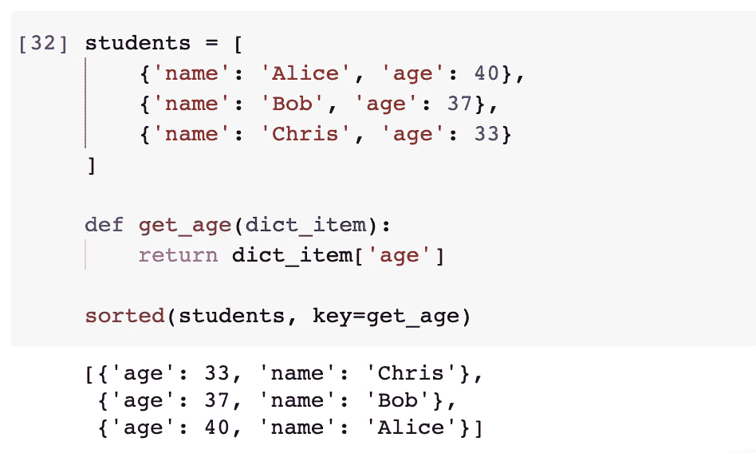

那完美地完成了工作。然而，我们意识到`get_age()`函数非常简单，所以我们可以将其简写为 lambda 函数。

```
sorted(students, key=lambda item: item['age'], reverse=True)
```

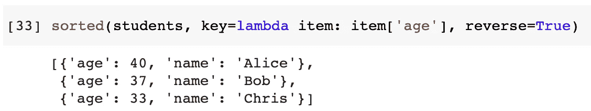

在上面的例子中，我们不需要额外的函数。相反，我们使用 lambda 编写了一个内嵌函数。此外，我还添加了`reverse`标志，这样列表就不会按降序排序。

## 展开按关键字排序的用法

虽然这不是为了字典，我只是想用`key`展示一个`sorted()`函数的扩展用法。

假设我们有一个如下的字符串列表

```
strings = [
    'aaa3',
    'bbb2',
    'ccc1',
    'ddd5'
]
```

如果我们用`sorted()`函数来排序，那一定是基于每个字符串的首字母。所以，顺序不应该改变。

```
sorted(strings)
```

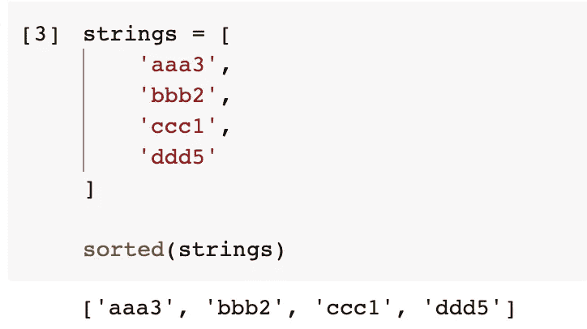

但是，如果我们希望根据最后一位数字对列表进行排序，该怎么办呢？我们可以编写一个 lambda 函数来获取字符串的最后一个字符。所以，`sorted()`函数将使用它作为标准。

```
sorted(strings, key=lambda s: s[-1])
```

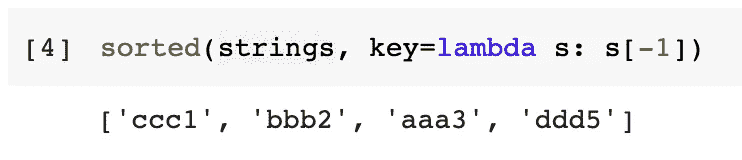

# 2.按关键字或值对字典排序


图片来自 [Pixabay](https://pixabay.com/?utm_source=link-attribution&utm_medium=referral&utm_campaign=image&utm_content=617422) 的 [Reimund Bertrams](https://pixabay.com/users/8385-8385/?utm_source=link-attribution&utm_medium=referral&utm_campaign=image&utm_content=617422)

我们已经提到了按值对字典列表进行排序。如果我们想按键或值对字典进行如下排序呢？

```
my_dict = {'c': 1, 'b': 2, 'a': 3}
```

在 Python 3.6 之前，不要为此烦恼，因为字典是无序实现的。也就是说，我们只能对字典进行排序，按顺序打印。这在 for 循环中很容易做到。如果条目的顺序很重要，我们需要使用有序字典。

```
from collections import OrderedDictmy_ordered_dict = OrderedDict(sorted(my_dict.items()))
```


## 按字典关键字排序

然而，从 Python 3.6 开始，字典将有顺序，这意味着对字典进行排序开始有意义。如果我们想按关键字对字典进行排序，我们可以简单地使用`sorted()`函数对条目进行排序，然后将它们转换回字典。

```
my_dict = dict(sorted(my_dict.items()))
```

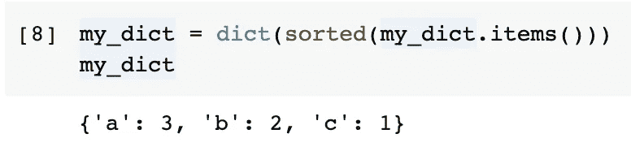

## 按字典值排序

如果我们想按值对字典进行排序，我们将需要再次使用我们从前面的问题中得到的技巧。即使用`sorted()`功能的`key`参数。

```
dict(sorted(my_dict.items(), key=lambda item: item[1]))
```

由于字典的`items()`将返回元组，我们可以使用订阅`[1]`来访问它的第二个元素，这将是值。

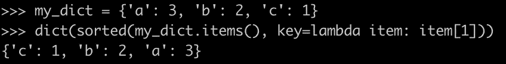

# 3.使用理解创建词典


图片来自 [Pixabay](https://pixabay.com/?utm_source=link-attribution&utm_medium=referral&utm_campaign=image&utm_content=2325552) 的[贝卡·克拉克](https://pixabay.com/users/theglassdesk-149631/?utm_source=link-attribution&utm_medium=referral&utm_campaign=image&utm_content=2325552)

我们可能经常使用列表理解，但不要忘记理解语法也适用于词典。

当我们想用 for-loop 创建一个逻辑简单的字典时，使用字典理解可以非常简洁高效。

例如，我们想使用`sqaure_x`作为键，其中`x`是一个数字。那么这个值应该是相应值的平方。我们可以使用一个带有`range()`函数的 for 循环来获得一个数字序列，然后字典创建如下。

```
my_dict = {
    'square' + '_' + str(i): i**2 
    for i in range(5)
}
```

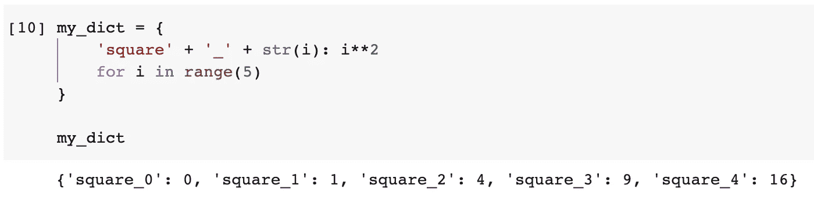

# 4.将两个列表编入词典


图片由 [Foundry Co](https://pixabay.com/users/foundry-923783/?utm_source=link-attribution&utm_medium=referral&utm_campaign=image&utm_content=869221) 从 [Pixabay](https://pixabay.com/?utm_source=link-attribution&utm_medium=referral&utm_campaign=image&utm_content=869221) 获得

有时，我们可能会分别得到键和值。有些 API 被设计成分别返回这两个东西的数组，这种情况并不少见。

为了以后的使用，我们必须把它们缝合在一起。我们可以用索引开始一个 for 循环，这样我们就可以分别从列表中获得键和值。但是，有更好的办法，而且很 Pythonic。

```
keys = ['name', 'age', 'skill']
values = ['Chris', 33, 'Python']my_dict = dict(zip(keys, values))
```


所以，我们不必重新发明轮子。如果您不太熟悉 Python 中的`zip()`函数，请查看下面的文章。我相信你会理解的。

[](/fasten-python-objects-using-zip-88a1e7a68c7) [## 使用 Zip“固定”Python 对象

### Python 的一个技巧使得使用多个可迭代对象变得更加容易

towardsdatascience.com](/fasten-python-objects-using-zip-88a1e7a68c7) 

使用`zip()`功能的好处更多。例如，如果我们有两个不同长度的列表，多余的条目将被忽略。

```
keys = ['name', 'age', 'skill']
values = ['Chris', 33, 'Python', 'English']my_dict = dict(zip(keys, values))
```

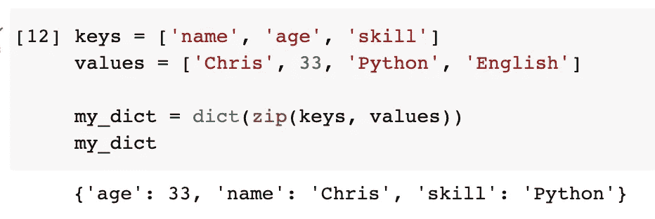

在上面的例子中，第二个列表中的字符串“English”被忽略，因为没有与之对应的键。

如果我们知道列表长度应该严格相同，我们也可以强制执行它。因此，如果两个列表的长度不同，将会抛出一个错误。请注意，这个`strict`标志是在 Python 3.10 中添加的。

```
my_dict = dict(zip(keys, values, strict=True)
```

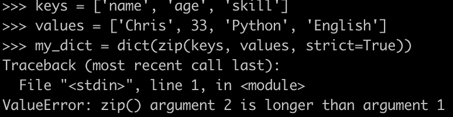

# 5.合并两本词典


图片来自 [Pixabay](https://pixabay.com/?utm_source=link-attribution&utm_medium=referral&utm_campaign=image&utm_content=4502863) 的 [Daniel Kirsch](https://pixabay.com/users/danielkirsch-4218687/?utm_source=link-attribution&utm_medium=referral&utm_campaign=image&utm_content=4502863)

合并两个或更多的字典可能是非常频繁的操作。然而，这是最棘手的问题之一。在不同的 Python 版本中，我们有不同的“最佳方式”来做到这一点。

## 在 Python 3.4 或更低版本中

我们可以使用字典的`update()`功能。它会将另一个字典追加到当前字典中。

```
my_dict1 = {'age': 33, 'name': 'Chris'}
my_dict2 = {'skill': 'Python'}my_dict1.update(my_dict2)
```

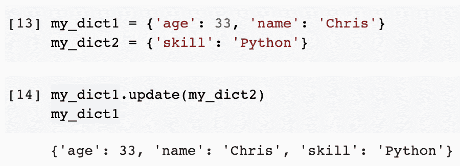

然而，缺点是第一本字典`my_dict1`被修改了。如果我们想保留两个原始字典，我们必须创建第三个。

```
my_dict = {}
my_dict.update(my_dict1)
my_dict.update(my_dict2)
```

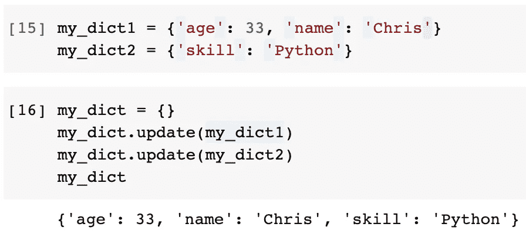

## 来自 Python 3.5 — Python 3.8

从 Python 3.5 开始，它将用于解包列表的星号`*list`语法扩展到使用双星号`**dictioanry`解包字典。

因此，我们可以创建一个新的字典，并将其中的两个原始字典解包。

```
my_dict = {**my_dict1, **my_dict2}
```

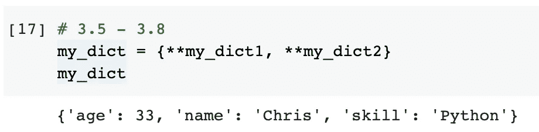

这就变得容易多了。

## 从 Python 3.9 开始

在 Python 3.9 中，涉及到了一种新的语法，即使用管道`|`来合并两个字典。

```
my_dict = my_dict1 | my_dict2
```

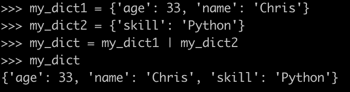

现在这个更加简洁，可读性更强，也更直观。此外，已经证明它在上述所有方法中具有最高的性能。

# 6.更改密钥的名称


图片来自[s . Hermann&f . Richter](https://pixabay.com/users/pixel2013-2364555/?utm_source=link-attribution&utm_medium=referral&utm_campaign=image&utm_content=3087900)来自 [Pixabay](https://pixabay.com/?utm_source=link-attribution&utm_medium=referral&utm_campaign=image&utm_content=3087900)

如果我们想改变一个键的名字呢？假设我们从一个 API 收到了 JSON 对象，但是键名与我们在数据库中的键名不一致。因此，在将对象保存到数据库之前，我们需要更改键的名称。

请不要写 for-loop 来查找带键的项，除非基于某个规则有很多键要改。相反，一个简单的方法是使用简单的传递值到一个新的项目，然后删除旧的。

```
my_dict['programming_language'] = my_dict['skill']
del my_dict['skill']
```

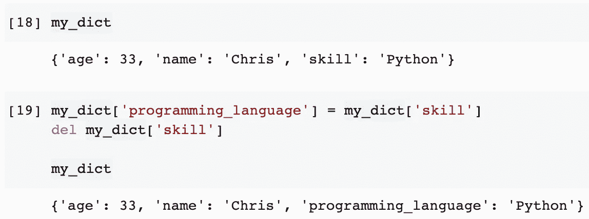

在执行了上面的示例之后，关键字“skill”已经被更改为“programming_language”。这是最直观的实现方式。然而，我们甚至可以通过使用字典的`pop()`功能来简化它。

想法是在字典中创建一个新的键，并从弹出的旧键-值对中获取值。之后，用旧值创建新的键，旧的键-值对已经不存在了。

```
my_dict['skill'] = my_dict.pop('programming_language')
```

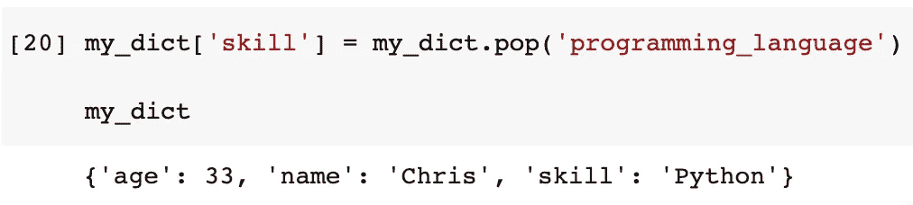

如图所示，使用最简单的方法将密钥改回来。

# 摘要


图片由[拉蒙·佩鲁丘](https://pixabay.com/users/rperucho-7689351/?utm_source=link-attribution&utm_medium=referral&utm_campaign=image&utm_content=7001026)从[皮克斯拜](https://pixabay.com/?utm_source=link-attribution&utm_medium=referral&utm_campaign=image&utm_content=7001026)拍摄

字典是 Python 中最重要的数据结构之一。所以，知道一些做一些经常性操作的捷径是很重要的。这些技巧不仅可以节省我们重新发明轮子的时间，还可以提供更高的性能。

[](https://medium.com/@qiuyujx/membership) [## 通过我的推荐链接加入灵媒-陶

### 作为一个媒体会员，你的会员费的一部分会给你阅读的作家，你可以完全接触到每一个故事…

medium.com](https://medium.com/@qiuyujx/membership) 

如果你觉得我的文章有帮助，请考虑加入 Medium 会员来支持我和其他成千上万的作者！(点击上面的链接)