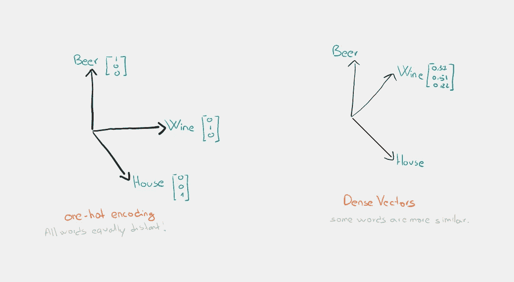
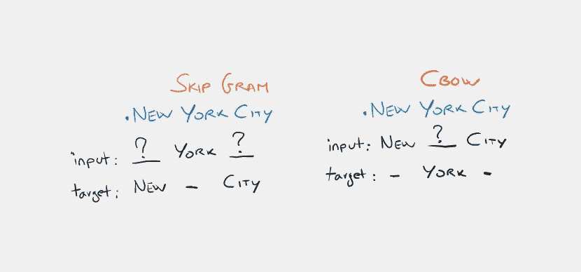
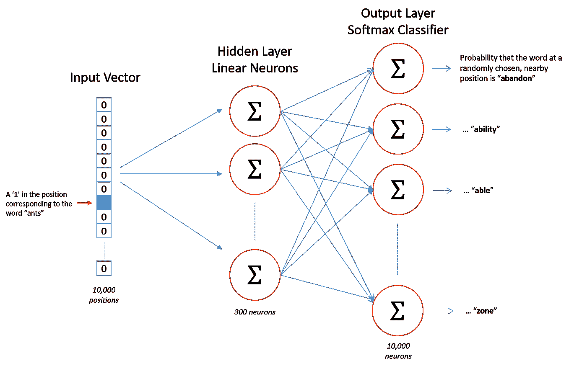
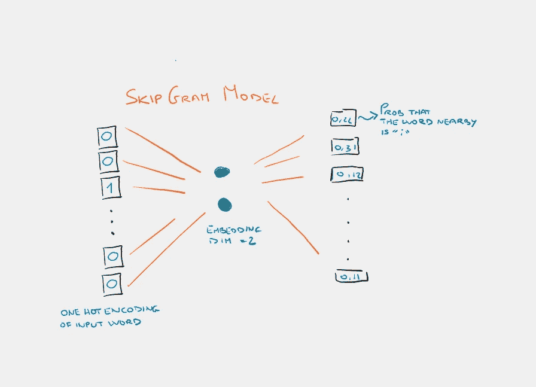
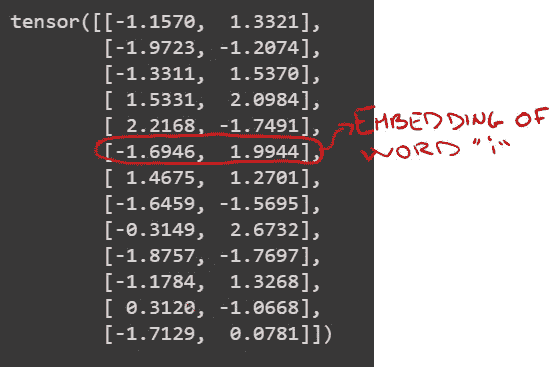
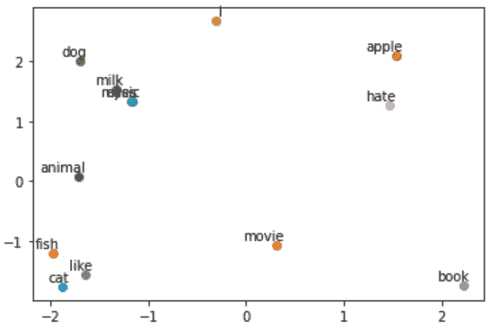

# Word2Vec 神经网络从无到有

> 原文：<https://towardsdatascience.com/skip-gram-neural-network-from-scratch-485f2e688238>

由[纳迪·博罗迪纳](https://unsplash.com/@borodinanadi?utm_source=medium&utm_medium=referral)在 [Unsplash](https://unsplash.com?utm_source=medium&utm_medium=referral) 上拍摄

## 使用 Skip-Gram 和 CBOW 深入研究非上下文 NLP

自然语言处理领域具有挑战性有几个原因，但最主要也是最琐碎的原因是处理**数据**，因为**不是数字，而是文本。**

因此，需要一种从文本到数字值的转换，这种转换可以尽可能地保留单词的含义，而不会丢失单词在人的头脑中唤起的任何东西。

这种转换被称为**单词嵌入**。我们可以进行更低层次的分析，创建一个字符嵌入，或者更高层次的分析，创建一个句子嵌入。这取决于我们选择了哪些记号(我们的原子元素)。

迄今为止，在众多尝试中，最好的尝试是**将单词映射成数字向量**。目标是让**相似的单词在向量空间**中紧密地放置在一起。我们可以用余弦相似度来度量向量的相似度。

作者图片

让我们看看上面图片的代码示例。

你可以注意到*啤酒*和*葡萄酒*之间的相似度很高，这有道理吧？

在本文中，我们将处理非上下文嵌入方法，其中单词的**表示，因此**不依赖于上下文**。**

例如，即使以下句子中的单词 *second* 具有不同的含义，使用这些嵌入方法，其矢量表示将总是相同的。

`This is the second time that I try it`

`He just arrived one second later`

如果你对非上下文自然语言处理的有影响力的论文感兴趣，这里有一个简短的列表:

*   **Word2Vec** ( [米科洛夫等人，2013](https://arxiv.org/abs/1301.3781))；
*   **用于单词表示的全局向量**(手套)( [Pennington et al .，2014](https://www-nlp.stanford.edu/pubs/glove.pdf))；
*   **FastText** ( [米科洛夫等人，2016](https://arxiv.org/abs/1607.04606))；

# Word2Vec

2013 年，随着 [Word2Vec](https://papers.nips.cc/paper/5021-distributed-representations-of-words-and-phrases-and-their-compositionality.pdf) ，谷歌的 Mikolov 等人彻底改变了嵌入范式:从那时起，嵌入将是一个神经网络的权重，根据任务进行调整，以最小化一些损失。**嵌入已经成为一种神经网络算法。**

我们接下来要做的是训练一个简单的神经网络，在某个任务上只有一个隐藏层。但是请注意，我们不会使用网络来解决手头的任务，我们感兴趣的只是代表单词 embedding 的网络的**权重。**

> 我们将训练神经网络做以下事情。给定一个句子中间的特定单词(输入单词)，查看附近的单词(窗口大小)并随机选择一个。一旦经过训练，神经网络将告诉我们，我们词汇表中的每个单词成为我们选择的邻近单词的概率。

我们将训练一个具有单个隐藏层的简单神经网络来执行某项任务，但之后我们实际上不会将该神经网络用于我们训练它的任务！相反，目标只是学习隐藏层的权重(不知何故，这类似于自动编码器的目标)。最后，我们会看到这些权重就是我们试图学习的*单词向量*。

例如，如果我们给训练好的网络输入单词 *New* ，那么像 *York* 和 *City* 这样的单词的输出概率会比 *book* 和*light sabre*更高。

可以使用两种不同的方法来构造 Word2Vec:

*   **CBOW** :神经网络查看周围的单词，并预测中间出现的单词。
*   **SkipGram** :神经网络接受一个单词，然后尝试预测周围的单词。

作者图片

# 从头开始编写程序

首先，为了简单起见，让我们从三个单词句子的语料库中创建一个词汇表。

从自定义语料库创建词汇库

例如，如果我们输入单词*如*，上下文单词将是 *I* 和 *dog。*

打印输入和目标单词

现在我们准备准备我们的数据。我们将使用一个 *window_size = 1，*因此给定一个字 *j* 目标将仅仅是 *j-1* 和 *j+1* 。

为 skip program 准备数据

在构建我们的模型之前，让我们分批构建我们的数据，并将单词转换成 [*单键向量*](https://en.wikipedia.org/wiki/One-hot) *。*

生成批次

## 建立模型

这是我们模型的样本。隐层神经元上没有激活函数，但输出神经元使用 softmax。

和 PyTorch 一样，让我们定义一个类来构建我们的神经网络。为了简单起见，我们的嵌入大小是 *2，*这样我们可以在二维向量空间上绘制嵌入。我们的神经网络的输入的维数等于 *vocab_size* (因为我们使用的是独热向量)。此外，输出具有 dimension = *vocab_size，*每个输出神经元的权重告诉我们代表该特定神经元的单词在输入中给定的单词附近的概率。

作者图片

是时候训练我们的模特了！

一旦训练结束，单词嵌入被存储在模型参数中。

输出应该是这样的。

作者图片

## 绘制嵌入图

作者图片

好吧，这个情节和嵌入没有意义。这只是一个虚构的例子。我们希望有相近的单词。你能做的就是使用预训练的嵌入，比如 [*GloVe*](https://nlp.stanford.edu/projects/glove/) 并在你的项目中使用它们！

## 结束了

*马赛洛·波利蒂*

[Linkedin](https://www.linkedin.com/in/marcello-politi/) ， [Twitter](https://twitter.com/_March08_) ， [CV](https://march-08.github.io/digital-cv/)