# 使用 Google BigQuery 缓慢改变维度类型 2

> 原文：<https://towardsdatascience.com/slowly-changing-dimension-type-2-with-google-bigquery-749e0f9107fb>

## 使用 SQL MERGE 逐步实现 SCD 类型 2


图片来源于[unsplash.com](https://unsplash.com/photos/HPjUkyhfVkY?utm_source=unsplash&utm_medium=referral&utm_content=creditShareLink)

# 摘要

重要的是以一种允许管理变更的方式对数据建模，以便对诸如以下问题有一个快速的答案:

*   变化是什么时候发生的？
*   现在还有效吗？
*   以前怎么样？
*   最终状态是什么？

例如，如果您想跟踪过去几年的支出，然后您开始注意到，如果您按月做报告，则每年都会更改分类，这不会与按年的实际支出相匹配，但如果您有适当的分类维度，则可以拆分更改。

在这篇文章中，我们将学习如何在 **MERGE BigQuery** 实现中破解缺失的**输出**，以创建渐变维度 **Type 2** ，我将更详细地解释以下内容:

1.  该设置
2.  SCD 型简介
3.  逐步执行
4.  了解解决方案

最后，我将添加**结论、感谢、故障排除、**和**有用的资源。**

如果您正在使用 Google Query，我建议您查看我以前的帖子，关于[使用 Python API 客户端运行 big Query SQL](/run-bigquery-sql-using-python-api-client-b5287ac05b99)和[将 DBeaver 连接到 Google BigQuery](/connecting-dbeaver-to-google-bigquery-23c8a12e55b5) ，因为它们一步一步地详细介绍了如何创建和配置服务帐户以及如何避免 BigQuery Web 界面。

# 设置

我们将使用两个表， **HR_INPUT，**作为随时间变化的输入，而 **EmployeeDim** 用于维度类型 2:

```
CREATE OR REPLACE TABLE SCD.HR_INPUT (
   ID         STRING NOT NULL
  ,EMPLOYEE   STRING NOT NULL
  ,JOB_TITLE  STRING NOT NULL
  ,COMPANY    STRING NOT NULL
  ,START_YEAR INTEGER NOT NULL
);CREATE OR REPLACE TABLE SCD.EmployeeDim (
   SKEY       STRING NOT NULL
  ,ID         STRING NOT NULL
  ,EMPLOYEE   STRING NOT NULL
  ,JOB_TITLE  STRING NOT NULL
  ,COMPANY    STRING NOT NULL
  ,START_YEAR INTEGER NOT NULL
  ,END_YEAR   INTEGER NOT NULL
  ,ACTIVE     STRING NOT NULL
  ,CREATED    TIMESTAMP NOT NULL
  ,UPDATED    TIMESTAMP NOT NULL
);
```

在 HR 输入表中，您将获得当前雇主，我们将模拟我们在不同的年份运行三次:

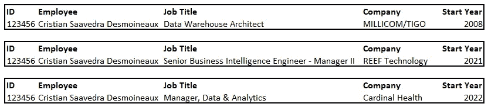

作者的例子

员工 Dim 的最终表格如下所示:

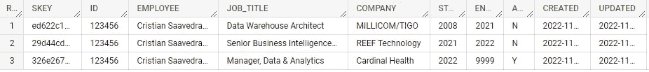

最终 **SCD。作者使用 Google BigQuery Web UI 查询 EmployeeDim** 结果

此外，我们将使用存储**过程 SP_EmployeeDim_SCD2** 来使用 MERGE 处理数据:

```
CREATE OR REPLACE PROCEDURE SCD.SP_EmployeeDim_SCD2()
BEGIN
  MERGE SCD.EmployeeDim AS output
  USING (
    SELECT src.ID as PSEUDO_ID, src.*
      FROM SCD.HR_INPUT AS src
    UNION ALL
    SELECT NULL as PSEUDO_ID, dup.*
      FROM SCD.HR_INPUT AS dup
     INNER JOIN SCD.EmployeeDim AS trget ON dup.ID = trget.ID
     WHERE trget.END_YEAR = 9999 
       AND trget.START_YEAR <> dup.START_YEAR
  ) AS input
  ON input.PSEUDO_ID = output.ID WHEN NOT MATCHED THEN INSERT (SKEY,ID,EMPLOYEE,JOB_TITLE,COMPANY,START_YEAR
          ,END_YEAR,ACTIVE,CREATED,UPDATED)
  VALUES ( GENERATE_UUID()
          ,input.ID
          ,input.EMPLOYEE
          ,input.JOB_TITLE
          ,input.COMPANY
          ,input.START_YEAR
          ,9999
          ,'Y'
          ,CURRENT_TIMESTAMP()
          ,CURRENT_TIMESTAMP()
  ) WHEN MATCHED 
   AND output.END_YEAR = 9999
   AND output.START_YEAR <> input.START_YEAR THEN UPDATE  SET ACTIVE = 'N'
         ,END_YEAR = input.START_YEAR
         ,UPDATED = CURRENT_TIMESTAMP()
  ;END;
```

# SCD 型简介

在数据建模中，[渐变维度](https://www.kimballgroup.com/2008/08/slowly-changing-dimensions/)是实现维度表中历史变化跟踪的重要部分。

[SCD Type 2](https://www.kimballgroup.com/2008/09/slowly-changing-dimensions-part-2/) 的美妙之处在于，它允许我们看到数据发生时的状态，并将其视为当前活动状态。

例如，假设您有财务分类和与每笔交易相关的支出。在这种情况下，如果我们没有正确地跟踪变化，就很容易陷入部门之间的战争。

使用 SCD Type 2，我们可以看到上一版本的分类所花费的全年时间，而且我们可以逐月检查它是如何定义的，这有助于我们解释为什么一个区域花费了更多的钱。

# 逐步执行

***首先是*** ，让我们删除两个表中的所有数据，重新开始:

```
TRUNCATE TABLE SCD.EmployeeDim;
TRUNCATE TABLE SCD.HR_INPUT;
```

***第二个*** ，我们将假设我们在 2008 年，数据源使用下面的 INSERT 语句反映了我作为**数据仓库架构师**的当前工作:

```
INSERT INTO SCD.HR_INPUT VALUES ('123456','Cristian Saavedra Desmoineaux','Data Warehouse Architect','MILLICOM/TIGO',2008);SELECT * FROM SCD.HR_INPUT;
```

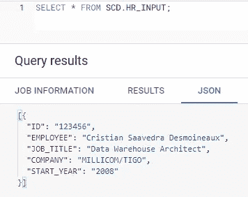

**SCD。HR_INPUT** 作者使用 Google BigQuery Web UI 查询的结果

然后，我们将调用存储过程 **SP_EmployeeDim_SCD2** 在 EmployeeDim 表中插入第一行，从 2008 年开始，到 9999 年结束:

```
CALL SCD.SP_EmployeeDim_SCD2();SELECT * FROM SCD.EmployeeDim;
```

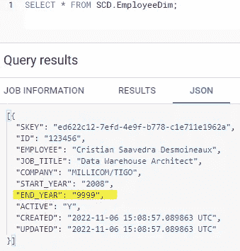

**SCD。作者使用 Google BigQuery Web UI 进行的 EmployeeDim** 结果查询

***第三个*** ，我们将假设我们是在 2009 年，而输入的数据没有改变它:

```
CALL SCD.SP_EmployeeDim_SCD2();
```

如您所见， **EmployeeDim** 表也没有改变:

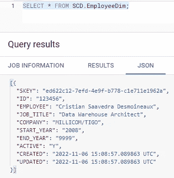

**SCD。作者使用 Google BigQuery Web UI 第二次运行该过程后的 EmployeeDim** 结果查询

***第四个*** ，我们假设我们在 2021 年，数据源显示我在 REEF Technologies 工作时的当前工作，我们运行存储过程 **SP_EmployeeDim_SCD2** :

```
TRUNCATE TABLE SCD.HR_INPUT;INSERT INTO SCD.HR_INPUT VALUES ('123456','Cristian Saavedra Desmoineaux','Senior Business Intelligence Engineer - Manager II','REEF Technology',2021);SELECT * FROM SCD.HR_INPUT;CALL SCD.SP_EmployeeDim_SCD2();SELECT * FROM SCD.EmployeeDim;
```

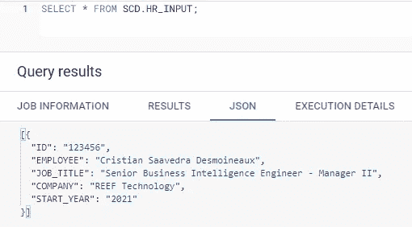

**SCD。HR_INPUT** 作者使用 Google BigQuery Web UI 第二次修改后的结果查询

现在我们有两张唱片了。之前的记录从 2008 年到 2021 年有效，并且无效:

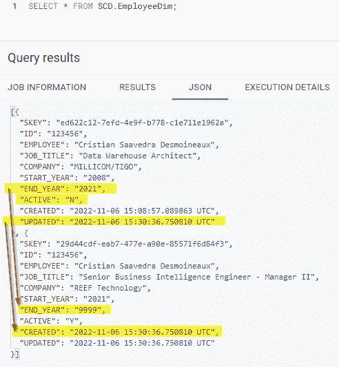

**SCD。EmployeeDim** 作者使用 Google BigQuery Web UI 第三次运行该过程后的结果查询

***第五个*** ，现在我们是 2022 年，HR 输入表反映了我现在的角色:

```
TRUNCATE TABLE SCD.HR_INPUT;INSERT INTO SCD.HR_INPUT VALUES ('123456','Cristian Saavedra Desmoineaux','Manager, Data & Analytics','Cardinal Health',2022);SELECT * FROM SCD.HR_INPUT;CALL SCD.SP_EmployeeDim_SCD2();SELECT * FROM SCD.EmployeeDim;
```

我们在 HR 输入表中只看到一条记录:

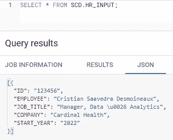

**SCD。HR_INPUT** 作者使用 Google BigQuery Web UI 第三次修改后的结果查询

和 Employee 维度中的三个记录，显示我的当前记录为活动记录，其余记录为非活动记录:

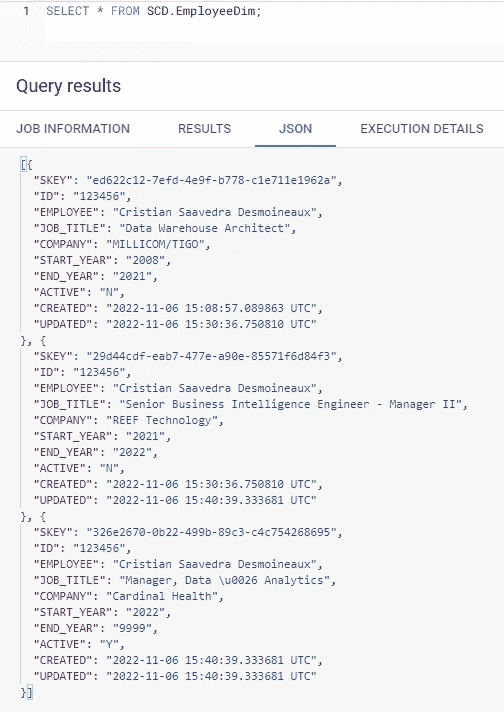

**SCD。EmployeeDim** 由作者使用 Google BigQuery Web UI 运行福特时间的过程后的结果查询

# 了解解决方案

首先，让我们看一下 SP_EmployeeDim_SCD2 存储过程:

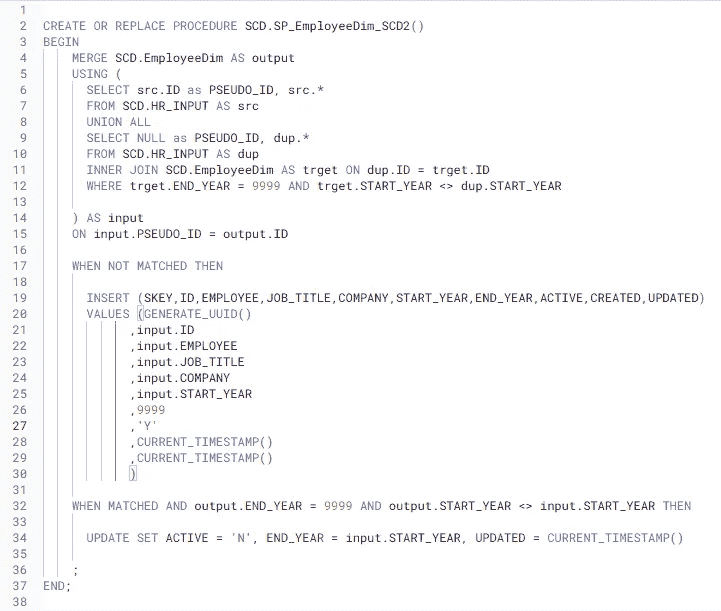

作者使用 Google BigQuery Web UI 创建的存储过程

如您所见，有一个 MERGE 语句说:

> 尝试将维度与数据源合并，如果伪 ID 不匹配，则插入一个**新行**，否则更新为**无效**，并添加年末

```
MERGE SCD.EmployeeDim AS output 
USING (<... subquery ...>) AS input 
ON input.PSEUDO_ID = output.IDWHEN NOT MATCHED THEN
INSERT (<... columns ...>)
VALUES (GENERATE_UUID(),<... all data ...>,9999,'Y'
,CURRENT_TIMESTAMP(),CURRENT_TIMESTAMP())WHEN MATCHED AND output.END_YEAR = 9999
     AND output.START_YEAR <> input.START_YEAR THENUPDATE SET ACTIVE = 'N', END_YEAR = input.START_YEAR, UPDATED = CURRENT_TIMESTAMP()
```

当不匹配时，我们从 HR 输入表中取出**的所有数据**，使用 GENERATE_UUID()函数添加一个 [**代理键**](https://www.kimballgroup.com/1998/05/surrogate-keys/) ，添加一个无穷大的**结束年份**，将其标记为**活动**，并设置**时间戳**。

```
WHEN NOT MATCHED THEN
INSERT(SKEY,ID,EMPLOYEE,JOB_TITLE,COMPANY,START_YEAR,END_YEAR,ACTIVE
,CREATED,UPDATED) VALUES (GENERATE_UUID(),input.ID,input.EMPLOYEE
,input.JOB_TITLE,input.COMPANY,input.START_YEAR,9999,'Y'
,CURRENT_TIMESTAMP(),CURRENT_TIMESTAMP())
```

当我们找到它时，我们更新了那些仍然对未来开放并具有不同起始年份的，我们将它们设置为**不活动，**添加一个**结束年份**并更新**时间戳。**

```
WHEN MATCHED AND output.END_YEAR = 9999 
             AND output.START_YEAR <> input.START_YEAR THEN
UPDATE SET ACTIVE = 'N', END_YEAR = input.START_YEAR
, UPDATED = CURRENT_TIMESTAMP()
```

最初，我试图实现 Kimball 设计技巧#107 时，我发现 Google BigQuery 没有实现我 14 年前看到的输出。然后我发现有可能改变来源:

```
USING (
SELECT src.ID as PSEUDO_ID, src.*
FROM SCD.HR_INPUT AS src
UNION ALL
SELECT NULL as PSEUDO_ID, dup.*
FROM SCD.HR_INPUT AS dup
INNER JOIN SCD.EmployeeDim AS trget ON dup.ID = trget.ID
WHERE trget.END_YEAR = 9999 AND trget.START_YEAR <> dup.START_YEAR
) AS input
```

我带来了所有的数据，复制了 ID 列，并将其命名为 **Pseudo ID，**新的记录和按年份拆分现有 ID 的值将在这里实现。

```
SELECT src.ID as PSEUDO_ID, src.*
FROM SCD.HR_INPUT AS src
```

我添加输入表中的所有记录，这些记录将把现有的 ID 添加为活动的，在分类为要插入的合并语句的**伪 ID** 中添加一个空值。

```
SELECT **NULL** as PSEUDO_ID, dup.*
FROM SCD.HR_INPUT AS dup
INNER JOIN SCD.EmployeeDim AS trget ON dup.ID = trget.ID
WHERE trget.END_YEAR = 9999 AND trget.START_YEAR <> dup.START_YEAR
```

# 结论

[缓变维度类型 2](https://www.kimballgroup.com/2008/09/slowly-changing-dimensions-part-2/) 允许我们看到数据发生时的样子，并将其视为当前活动的，MERGE 语句可以简化 SCD 类型 2 的创建但在 Google BigQuery 中实现；我们需要对源查询进行更改，以替换当前不可用的输出。

如果您正在使用 Google Query，我建议您查看我以前的帖子，关于[使用 Python API 客户端运行 big Query SQL](/run-bigquery-sql-using-python-api-client-b5287ac05b99)和[将 DBeaver 连接到 Google BigQuery](/connecting-dbeaver-to-google-bigquery-23c8a12e55b5) ，因为它们一步一步地详细介绍了如何创建和配置服务帐户以及如何避免 BigQuery Web 界面。

# 谢谢

我把这篇文章献给沃伦·桑斯韦特(金宝集团)，一个了不起的人，一个知识渊博的专业人士，直到他生命的最后几天，他都面带微笑。

当我们一起工作时，他对数据建模的热情向我展示了我职业生涯的成长之路。

对我的朋友来说，我仍然是你所说的数据魔术师。

# 解决纷争

## 验证过程主体时出错(添加选项(strict_mode=false)以隐藏):查询错误:没有为此项目启用开单。在 https://console.cloud.google.com/billing.[启用计费](https://console.cloud.google.com/billing.)在自由层不允许 DML 查询。请设置一个帐单帐户来取消此限制。在[3:5]

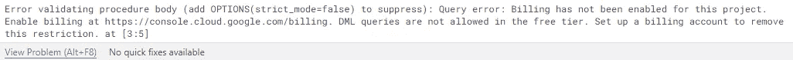

使用 Google BigQuery Web UI 合并错误消息 Google BigQuery 自由层

如果您正在使用免费层，您需要转到收费项目，方法是转到 https://console.cloud.google.com/billing 的[，创建一个帐户，设置一种支付方式，然后转到我的项目，选择您的项目，并更改计费。](https://console.cloud.google.com/billing)

请记住在测试后返回，并再次锁定或禁用计费。

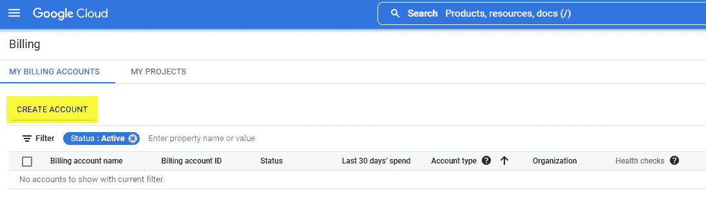

控制台谷歌云计费创建一个帐户。作者使用 Google BigQuery Web UI 截图

# 有用的资源

<https://en.wikipedia.org/wiki/Slowly_changing_dimension>  <https://cloud.google.com/bigquery/docs/reference/standard-sql/dml-syntax#merge_statement>  <https://www.kimballgroup.com/2008/11/design-tip-107-using-the-sql-merge-statement-for-slowly-changing-dimension-processing/>  <https://www.kimballgroup.com/2008/08/slowly-changing-dimensions/>  <https://www.kimballgroup.com/2008/09/slowly-changing-dimensions-part-2/>  <https://www.kimballgroup.com/2013/02/design-tip-152-slowly-changing-dimension-types-0-4-5-6-7/>  <https://www.kimballgroup.com/1998/05/surrogate-keys/> 