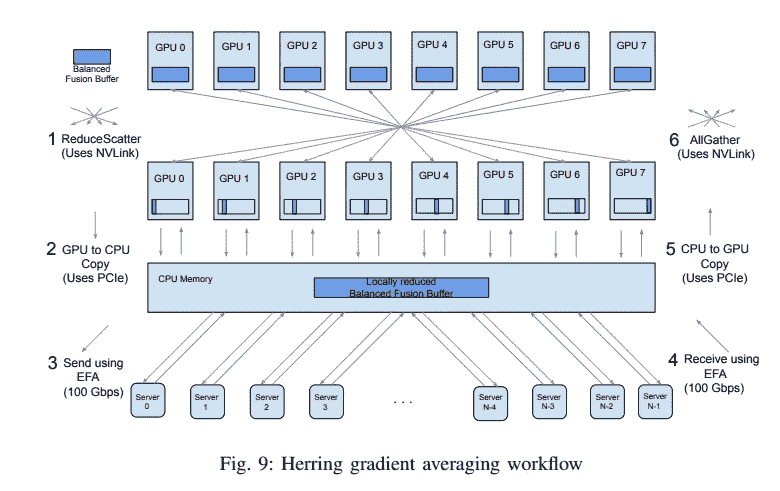
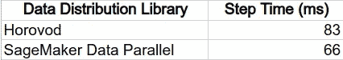

# 带 SMD 的 Amazon SageMaker 上的智能分布式培训:第 2 部分

> 原文：<https://towardsdatascience.com/smart-distributed-training-on-amazon-sagemaker-with-smd-part-2-c833e7139b5f>

## 如何用 SageMaker 分布式数据并行优化数据分布


照片由[斯蒂芬](https://unsplash.com/@stephenally?utm_source=medium&utm_medium=referral)在 [Unsplash](https://unsplash.com?utm_source=medium&utm_medium=referral) 上拍摄

这是关于优化分布式培训的三篇文章的第二部分。在[第一部分](https://chaimrand.medium.com/smart-distributed-training-on-amazon-sagemaker-with-smd-part-1-cd296f87a0ee)中，我们提供了分布式训练算法的简要概述。我们注意到所有算法的共同点是它们依赖于多个 GPU 之间的高速通信。我们推测，考虑到底层实例拓扑的分布式算法，特别是 GPU 对之间通信链路的差异，会比不考虑的算法性能更好。

在第二部分中，我们将演示如何使用 Amazon SageMaker 的[分布式数据并行](https://docs.aws.amazon.com/sagemaker/latest/dg/data-parallel.html) (SDP)库来执行数据分发，区分节点内和节点间的 GPU 到 GPU 通信。

# 使用 SageMaker 分布式数据并行进行数据分发

在数据分布式训练中，每个 GPU 维护其自己的模型副本，副本之间的对齐通过**梯度共享**来保持。好的数据分布算法将以限制对训练吞吐量的影响的方式实现梯度共享机制。一些梯度共享算法依赖于一个或多个中央**参数服务器**，其从所有工人收集梯度更新，然后将结果广播回工人。其他则依赖于 GPU 之间的直接点对点通信。梯度共享的一个流行算法是*Ring-all reduction*，在这个算法中，多个消息在一个单向环中的工人之间传递。见[此处](/visual-intuition-on-ring-allreduce-for-distributed-deep-learning-d1f34b4911da)查看*环环相扣*如何工作的精彩视觉回顾。 *Ring-AllReduce* 被 [Horovod](https://horovod.readthedocs.io/en/stable/) 使用，这是一个流行的数据分布式训练框架。

亚马逊 SageMaker [分布式数据并行](https://docs.aws.amazon.com/sagemaker/latest/dg/data-parallel.html) (SDP)库旨在简化和加速数据分布式训练。你可以在特色[公告](https://aws.amazon.com/blogs/aws/managed-data-parallelism-in-amazon-sagemaker-simplifies-training-on-large-datasets/)、[亚马逊 SageMaker 开发者指南](https://docs.aws.amazon.com/sagemaker/latest/dg/data-parallel.html)以及相关的[白皮书](https://assets.amazon.science/ba/69/0a396bd3459294ad940a705ad7f5/herring-rethinking-the-parameter-server-at-scale-for-the-cloud.pdf)中看到关于 SDP 的更多细节。(任何想知道我选择的封面图片如何与本文内容相关的人，只需看看白皮书的标题就知道了: [**Herring** :重新思考云的大规模参数服务器](https://www.amazon.science/publications/herring-rethinking-the-parameter-server-at-scale-for-the-cloud)。)SDP 的梯度共享算法依赖于许多巧妙的技术。与本文讨论最相关的属性是节点内 GPU 到 GPU 通信和节点间 GPU 到 GPU 通信之间的区别。下图总结了这一区别，显示了一个双层流程，其中节点内 GPU 通过 NVLink 共享梯度，而不同节点的 GPU 之间的通信则通过所有使用中节点的 CPU 上的服务器进行。



SDP 梯度共享流程(图片来自 [Herring 白皮书](https://assets.amazon.science/ba/69/0a396bd3459294ad940a705ad7f5/herring-rethinking-the-parameter-server-at-scale-for-the-cloud.pdf)

[白皮书](https://assets.amazon.science/ba/69/0a396bd3459294ad940a705ad7f5/herring-rethinking-the-parameter-server-at-scale-for-the-cloud.pdf)展示了与标准 *Ring-AllReduce* 算法相比，这种方法，即一种针对底层训练环境的拓扑结构而定制的分布式算法，如何能够加速大规模分布式训练作业。

我们应该注意，除了 SDP 使用的分层梯度分布算法之外，还有几个额外的算法和库提供了解决底层实例拓扑的解决方案。例如，除了推广使用 *Ring-AllReduce* 之外，Horovod 还支持分层梯度共享算法。它还公开了基于项目和环境细节的[调节](https://horovod.readthedocs.io/en/stable/autotune_include.html)梯度流的控件。此外，Horovod 使用的底层 [NCCL](https://developer.nvidia.com/nccl) 操作也包括[高级分层技术](https://developer.nvidia.com/blog/massively-scale-deep-learning-training-nccl-2-4/)。

SDP 相对于其他库的一个优势在于实例拓扑*发现*。网络带宽和延迟等训练环境的细节是选择最佳梯度共享算法的重要输入。由于 SDP 内置于 SageMaker 框架中，因此它对实例拓扑结构有着即时和详细的了解。其他库不了解相同级别的细节，可能被迫猜测最佳的梯度共享策略，或者试图*发现*丢失的信息并相应地进行调整。

## 例子

这里我们展示了一个将 SDP 集成到一个简单的 TensorFlow (2.9)脚本中的例子。SageMaker 文档包括许多演示 SMP APIs 调用的 [TensorFlow 示例](https://sagemaker-examples.readthedocs.io/en/latest/training/distributed_training/index.html#id1)。在我们的示例中，我们将包括 SageMaker 示例中目前没有的两种有用的技术:

1.  如何编写您的脚本，以便您可以轻松地在 SDP 和流行的 [Horovod](https://horovod.readthedocs.io/en/stable/) 库之间切换。
2.  如何将 SDP 与 TensorFlow 的高层 API 结合起来进行模型训练— [tf.keras.Model.fit](https://www.tensorflow.org/api_docs/python/tf/keras/Model#fit) ()。虽然高级 API 隐藏了对 TensorFlow [GradientTape](https://www.tensorflow.org/api_docs/python/tf/GradientTape) 的访问，但 SDP 要求它用 [tensorflow 包装。分布式 GradientTape](https://sagemaker.readthedocs.io/en/stable/api/training/sdp_versions/latest/smd_data_parallel_tensorflow.html#smdistributed.dataparallel.tensorflow.DistributedGradientTape) API。我们通过定制 model.fit()调用的训练步骤来克服这个冲突。

该示例由两个脚本组成。分布式培训作业启动脚本和培训脚本。

第一个脚本是 SageMaker 培训课程启动脚本。在本例中，我们选择将输入模式设置为[快速文件模式](/amazon-sagemaker-fast-file-mode-d12829479c39)，这是亚马逊 SageMaker 的一项功能，支持将输入数据直接从[亚马逊 S3](https://aws.amazon.com/s3/) 传输到训练实例。数据存储在 [*TFRecord*](https://www.tensorflow.org/tutorials/load_data/tfrecord) 文件中。虽然典型的分布式训练将在特别大的数据集上运行，但是对于这个例子，我从 [CIFAR-10](https://www.cs.toronto.edu/~kriz/cifar.html) 数据集创建了文件(使用 [this](https://github.com/aws/amazon-sagemaker-examples/blob/master/sagemaker-debugger/tensorflow_profiling/demo/generate_cifar10_tfrecords.py) 脚本)。会话由四个 [p4d.24xlarge](https://aws.amazon.com/ec2/instance-types/p4/) 训练实例实例化，并且*分布*设置被配置为使用 SageMaker 数据分布库。

```
from sagemaker.tensorflow import TensorFlow
from sagemaker.session import TrainingInput
```

```
s3_input = TrainingInput(
          's3://'+S3_BUCKET_DATASET+'/cifar10-tfrecord/',
          input_mode='FastFile')
```

```
*# Training using SMDataParallel Distributed Training Framework* distribution = {'smdistributed':
                    {'dataparallel':{'enabled': True}}
               }
```

```
tensorflow = TensorFlow(entry_point='train_tf.py',
                        role=<role>,
                        instance_type='ml.p4d.24xlarge',
                        instance_count=4,
                        framework_version='2.9.1',
                        py_version='py39',
                        distribution=distribution)
```

```
tensorflow.fit(s3_input, job_name='data-parallel-example')
```

请注意，只需修改*分发*设置，就可以修改相同的脚本来启动 Horovod 会话:

```
distribution = {
  'mpi': {
    'enabled': True,
    'processes_per_host': 8
  }
}
```

第二个脚本包括训练循环。我们设计这个脚本是为了展示在使用 Horovod 数据分发框架和 Amazon SageMaker 数据并行库之间进行转换是多么容易。该脚本以一个 *run_hvd* 开关开始，该开关可用于在两个选项之间切换。随后的 *if-else* 块包含唯一的库特定代码。如上所述，我们已经实现了一个定制的训练步骤，该步骤使用了*分布式梯度带* API。

```
import tensorflow as tf
```

```
*# toggle flag to run Horovod* **run_hvd** = False
if **run_hvd**:
  import horovod.tensorflow as dist
  from horovod.tensorflow.keras.callbacks import \
                            BroadcastGlobalVariablesCallback
else:
  import smdistributed.dataparallel.tensorflow as dist
  from tensorflow.keras.callbacks import Callback
  class BroadcastGlobalVariablesCallback(Callback):
    def __init__(self, root_rank, *args):
      super(BroadcastGlobalVariablesCallback, self).
                                            __init__(*args)
      self.root_rank = root_rank
      self.broadcast_done = False
```

```
 def on_batch_end(self, batch, logs=None):
      if self.broadcast_done:
        return
      dist.broadcast_variables(self.model.variables, 
                               root_rank=self.root_rank)
      dist.broadcast_variables(self.model.optimizer.variables(),          
                               root_rank=self.root_rank)
      self.broadcast_done = True
```

```
*# Create Custom Model that performs the train step using 
# DistributedGradientTape*
```

```
from keras.engine import data_adapter
class CustomModel(tf.keras.Model):
  def train_step(self, data):
    x, y, w = data_adapter.unpack_x_y_sample_weight(data)
    with tf.GradientTape() as tape:
      y_pred = self(x, training=True)
      loss = self.compute_loss(x, y, y_pred, w)
    tape = dist.DistributedGradientTape(tape)
    self._validate_target_and_loss(y, loss)
    self.optimizer.minimize(loss, 
                            self.trainable_variables,
                            tape=tape)
    return self.compute_metrics(x, y, y_pred, w)
```

```
def get_dataset(batch_size, rank):
  def parse_sample(example_proto):
    image_feature_description = {
        'image': tf.io.FixedLenFeature([], tf.string),
        'label': tf.io.FixedLenFeature([], tf.int64)
    }
    features = tf.io.parse_single_example(example_proto, 
                                          image_feature_description)
    image = tf.io.decode_raw(features['image'], tf.uint8)
    image.set_shape([3 * 32 * 32])
    image = tf.reshape(image, [32, 32, 3])
    image = tf.cast(image, tf.float32)/255.
    label = tf.cast(features['label'], tf.int32)
    return image, label
```

```
 aut = tf.data.experimental.AUTOTUNE
  records = tf.data.Dataset.list_files(
                     os.environ.get("SM_CHANNEL_TRAINING")+'/*',
                     shuffle=True)
  ds = tf.data.TFRecordDataset(records, num_parallel_reads=aut)
  ds = ds.repeat()
  ds = ds.map(parse_sample, num_parallel_calls=aut)
  ds = ds.batch(batch_size)
  ds = ds.prefetch(aut)
  return ds
```

```
if __name__ == "__main__":
  import argparse, os
  parser = argparse.ArgumentParser(description="Train resnet")
  parser.add_argument("--model_dir", type=str, 
                      default="./model_keras_resnet")
  args = parser.parse_args()

  # init distribution lib
  dist.init()
  gpus = tf.config.experimental.list_physical_devices('GPU')
  for gpu in gpus:
    tf.config.experimental.set_memory_growth(gpu, True)
  if gpus:
    tf.config.experimental.set_visible_devices(
                     gpus[dist.local_rank()], 'GPU')
  input_shape = (32, 32, 3)
  classes = 10
  inputs = tf.keras.Input(shape=input_shape)
```

```
 outputs = tf.keras.applications.ResNet50(weights=None, 
                                          input_shape=input_shape, 
                                          classes=classes)(inputs)
  model = CustomModel(inputs, outputs)
  model.compile(loss=tf.losses.SparseCategoricalCrossentropy(),
                optimizer= tf.optimizers.Adam())
  dataset = get_dataset(batch_size = 1024, rank=dist.local_rank())
  cbs = [BroadcastGlobalVariablesCallback(0)]
  model.fit(dataset, steps_per_epoch=100, 
            epochs=10, callbacks=cbs, verbose=2)
```

## 结果

在本节中，我们比较了使用 Horovod 数据分布框架和 Amazon SageMaker 数据并行库执行分布式训练的运行时结果。运行时性能通过每个训练步骤的平均秒数来衡量。



平均步骤时间(越短越好)——(作者)

我们的实验表明，SDP 库的环境感知分布式训练算法比 Horovod 库使用的算法高出大约 20%。请注意，基于项目的细节和您选择的实例配置，比较性能会有很大的不同。即使对于相同的项目和相同的实例配置，根据实例在培训工作中的精确放置，结果也可能不同。如上所述，实例可以放置在不同的[集群放置组](https://docs.aws.amazon.com/AWSEC2/latest/UserGuide/placement-groups.html#placement-groups-cluster)中，这可能会增加延迟并减慢训练。

请注意，在撰写本文时，并非所有实例类型都支持 SDP。详见[文档](https://docs.aws.amazon.com/sagemaker/latest/dg/data-parallel-use-api.html#data-parallel-tensorflow-api)。

# 后续步骤

在本帖的第三部分也是最后一部分中，我们将展示 [Amazon SageMaker 的分布式数据并行库](https://docs.aws.amazon.com/sagemaker/latest/dg/data-parallel.html)如何以区分节点内和节点间 GPU 对的方式支持数据分布。