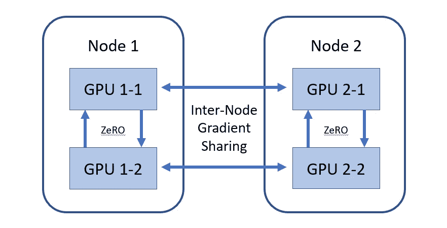
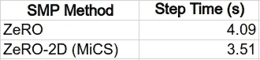

# 带 SMD 的 Amazon SageMaker 上的智能分布式培训:第 3 部分

> 原文：<https://towardsdatascience.com/smart-distributed-training-on-amazon-sagemaker-with-smd-part-3-db707db8a202>

## 如何用 SageMaker 分布式模型并行优化模型分布


马丁·杰恩伯格在 [Unsplash](https://unsplash.com?utm_source=medium&utm_medium=referral) 上的照片

这是关于优化分布式培训的三篇文章的最后一篇。在[第一部分](https://chaimrand.medium.com/smart-distributed-training-on-amazon-sagemaker-with-smd-part-1-cd296f87a0ee)中，我们提供了分布式训练算法的简要概述。我们注意到所有算法的共同点是它们依赖于多个 GPU 之间的高速通信。我们推测，考虑到底层实例拓扑的分布式算法，特别是 GPU 对之间通信链路的差异，会比不考虑的算法性能更好。在[第二部分](https://chaimrand.medium.com/smart-distributed-training-on-amazon-sagemaker-with-smd-part-2-c833e7139b5f)中，我们关注数据分发，并展示了 Amazon SageMaker 的[分布式数据并行](https://docs.aws.amazon.com/sagemaker/latest/dg/data-parallel.html) (SDP)库的优势。

在第三部分中，我们将把注意力转向模型分布。我们将展示一种方式，通过这种方式， [Amazon SageMaker 的分布式模型并行](https://docs.aws.amazon.com/sagemaker/latest/dg/model-parallel.html)库允许您以区分节点内和节点间 GPU 到 GPU 通信的方式来配置您的模型分布算法。

# 模型分布与 SageMaker 分布式模型并行

与数据分布的 SDP 类似， [Amazon SageMaker 分布式模型并行](https://docs.aws.amazon.com/sagemaker/latest/dg/model-parallel.html) (SMP)库旨在简化和加速模型分布式训练。该库包含了在[第一部分](https://chaimrand.medium.com/smart-distributed-training-on-amazon-sagemaker-with-smd-part-1-cd296f87a0ee)中讨论的每一种模型分发技术的 API(尽管您应该查看文档以获得支持矩阵的详细信息)。它允许组合一些方法，并包括一些自动化配置的控件。

在本节中，我们将重点介绍对[分片数据并行性](https://docs.aws.amazon.com/sagemaker/latest/dg/model-parallel-extended-features-pytorch-sharded-data-parallelism.html)的支持。回想一下，由 ZeRO 算法规定的参数分片算法(在[第一部分](https://chaimrand.medium.com/smart-distributed-training-on-amazon-sagemaker-with-smd-part-1-cd296f87a0ee)中描述)并不区分节点内 GPU 链接和节点间 GPU 链接。考虑到这种算法相对较高的通信量(详见[此处](https://arxiv.org/pdf/1910.02054.pdf))以及这种算法通常应用于相对较大的模型的事实，节点间带宽可能成为潜在的瓶颈。SMP 库通过支持一种称为 [**MiCS**](https://www.amazon.science/blog/near-linear-scaling-of-gigantic-model-training-on-aws) 的技术(由于它使**mi**c 通信 **s** cale】或**零 2D** 的事实)使您能够解决这个问题。MiCS 引入了分区组的概念。整个 GPU 集合被划分为分区组(大小相等)，每个分区组包含模型的一个副本。每个模型副本的参数在模型的分区组中的 GPU 之间进行分片(使用零算法)。在一个分区组中，参数根据零算法进行通信。模型副本之间的对齐通过不同分区组中相应 GPU 之间的梯度共享来维护。这导致了如下图所示的分层通信策略，图中显示了两个节点，每个节点有两个 GPU:



零 2D 中分层通信模式的一个例子。在每个节点内应用基于零的模型分片算法，并且在单独节点的相应 GPU 之间共享梯度。(作者)

## 例子

这里我们展示了一个将[分片数据并行](https://docs.aws.amazon.com/sagemaker/latest/dg/model-parallel-extended-features-pytorch-sharded-data-parallelism.html)集成到 PyTorch (1.12)培训工作中的例子。我们选择的模型是一个[视觉转换器](https://en.wikipedia.org/wiki/Vision_transformer) (ViT)模型，大约有 6.3 亿个参数。该模型是使用 [transformers](https://pypi.org/project/transformers/) python 包构建的。

下面的代码块演示了如何使用[分片数据并行](https://docs.aws.amazon.com/sagemaker/latest/dg/model-parallel-extended-features-pytorch-sharded-data-parallelism.html) API 在八个 [g4dn.12xlarge](https://aws.amazon.com/ec2/instance-types/g4/) 实例(每个实例有 4 个 GPU)上实例化一个模型分布式训练作业。请注意，这种情况下需要模型并行性，因为我们选择的 ViT 模型太大，不适合放在单个 GPU 中。

```
from sagemaker.pytorch import PyTorchdistribution = {
        "mpi": {
            "enabled": True,
            "processes_per_host": 4
        },
        "smdistributed": {
            "modelparallel": {
                "enabled": True,
                "parameters": {
                    "ddp": True,
                    **"sharded_data_parallel_degree": 32,**
           "delayed_parameter_initialization": True
           },
            }
        },
    }pytorch = PyTorch(entry_point='train.py',
                  role=<role>,
                  instance_type='ml.g4dn.12xlarge',
                  instance_count=8,
                  framework_version='1.12',
                  py_version='py38',
                  distribution=distribution)pytorch.fit()
```

上面的脚本配置为*分片 _ 数据 _ 并行 _ 度*设置为 32。这将运行经典的基于零的参数分片算法。要使用 MiCS(零 2D)，请将该参数重新配置为所需的分区组大小。

下面的代码块包含相关培训脚本的代码。

```
import torch
from torch.utils.data import Dataset
import time
import argparse
from transformers import ViTForImageClassification, ViTConfig class FakeDataset(Dataset):
  def __len__(self):
    return 1000000
  def __getitem__(self, index):
    rand_image = torch.randn([3, 224, 224], dtype=torch.float32)
    label = torch.tensor(data=[index % 1000], dtype=torch.int64)
    return rand_image, labeldef build_model():
  model_args = {
    "image_size": 256,
    "patch_size": 16,
    "hidden_size": 1024,
    "num_hidden_layers": 50,
    "num_attention_heads": 16,
    "intermediate_size": 4*1024,
    "num_labels": 1000
  }
  model = ViTForImageClassification(ViTConfig(**model_args))
  return model if __name__ == '__main__':
  parser = argparse.ArgumentParser()
  parser.add_argument('--model_dir', default='/tmp', type=str)
  args, _ = parser.parse_known_args() *# init* import smdistributed.modelparallel.torch as smp
  smp.init()
  from deepspeed.runtime.zero import stage3
  stage3.assert_ints_same_as_other_ranks = lambda x: None
  torch.cuda.set_device(smp.local_rank()) dataset = FakeDataset()
  data_loader = torch.utils.data.DataLoader(dataset,
                                batch_size=4, num_workers=12) model = build_model()
  model = smp.DistributedModel(model) *# add checkpoint activation* for m in model.get_module().vit.encoder.layer.children():
    smp.set_activation_checkpointing(m) optimizer = torch.optim.Adam(model.parameters())
  optimizer = smp.DistributedOptimizer(optimizer)
  loss_function = torch.nn.CrossEntropyLoss() model.train()
  t0 = time.perf_counter()
  summ = 0
  count = 0 @smp.step
  def train_step(model, inputs, targets):
    outputs = model(inputs)
    loss = loss_function(outputs['logits'], targets)
    model.backward(loss)
    return loss for idx, (inputs, targets) in enumerate(data_loader, start=1):
    inputs = inputs.to(torch.cuda.current_device())
    targets = targets.to(torch.cuda.current_device())
    optimizer.zero_grad()
    loss_mb = train_step(model, inputs, targets)
    loss = loss_mb.reduce_mean()
    optimizer.step()
    if torch.distributed.get_rank() == 0:
      batch_time = time.perf_counter() - t0
      print(f'step: {idx}: step time is {batch_time}')
      if idx > 1:  *# skip first step* summ += batch_time
        count += 1
  if torch.distributed.get_rank() == 0:
    print(f'average step time: {summ/count}')
```

有关 SMP API 的更多详细信息，请参见 [SageMaker 文档和示例](https://docs.aws.amazon.com/sagemaker/latest/dg/model-parallel-extended-features-pytorch-sharded-data-parallelism.html)。

## 结果

在下表中，我们将标准零基参数分片算法(*sharded _ data _ parallel _ degree = 32*)的步进时间结果与分区组设置为 4(*sharded _ data _ parallel _ degree = 4*)的零 2D (MiCS)的结果进行了比较。



平均步骤时间(越短越好)——(作者)

我们可以再次看到，考虑到环境细节的算法**比基本算法**大约高出 14%。我们再次警告不要对您自己的模型下任何结论，因为相对性能可能会因模型细节和环境设置而异。

# 摘要

多实例训练可能非常昂贵，任何提高训练速度的机会都会对你的总成本产生有意义的影响。在这篇文章中，我们展示了根据底层训练环境的拓扑结构定制的分布式训练算法如何提高性能。然而，这种算法对你的帮助程度，以及采用它们是否是你的正确选择，将在很大程度上取决于你的项目和培训环境的细节。在我们分享的例子中，我们试图演示如何编程您的代码，以便您可以轻松地在不同的选择之间切换。有选择是好事。