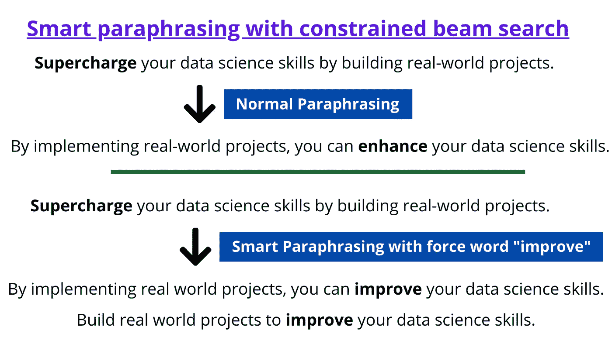

# 自然语言处理中使用约束波束搜索的智能解释

> 原文：<https://towardsdatascience.com/smart-paraphrasing-using-constrained-beam-search-in-nlp-9af6fd046e5c>

## 套用保留搜索引擎优化和文案的特定关键字


来自 [Pixabay](https://pixabay.com/photos/notepad-coffee-pen-fountain-pen-1276779/) 的无版权图片

Huggingface 最近在变形金刚库中引入了带有约束波束搜索的[引导文本生成](https://huggingface.co/blog/constrained-beam-search)。

您可以使用受约束的波束搜索来指导哪些单词需要包含在解码的输出文本中。

这在文案和 SEO 中有一些有趣的用例。

# 用例 1: SEO(搜索引擎优化)

例如，如果你正在写一篇关于**“模因营销”**的文章，你想要确保“模因营销”这个词在整个博客或文章中被多次使用，以便它在谷歌搜索(SEO)中排名更高，并在该主题上建立权威。

这个概念叫做**“关键词填充”**，当然需要适度使用，不要显得垃圾。所以这促使我们使用“模因营销”这个短语，即使我们是在转述，也不要改变它。因此，在这种情况下，有必要重写(意译)任何旧的内容，保持短语“模因营销”完好无损。

这是一个完美的受约束的 beam 用例，在你想要解释的地方搜索，同时在解释的版本中保持一个短语或关键字不变。

通常，SEO 专家会识别出[长尾关键词](https://ahrefs.com/blog/long-tail-keywords/)，即搜索量较好但相关结果较少的小众短语(例如:平足的最佳跑鞋)，并在其上撰写文章。这有助于他们在谷歌搜索中排名更快，并在第一页显示他们的网站。有时，他们想改写自己写的一句话，但又想原封不动地保留“平足的最佳跑鞋”等短语。

# 用例 2:文案

文案是为任何营销材料撰写内容，无论是博客、网站、传单等。

有效的文案写作是理解人类的心理，并写一个文案，推动客户走向最终目标，如推动注册，销售产品等。

让我们来看看 Marketingexamples.com 的一个文案技巧，建议使用简单的语言而不是多余的语言。

例如，如果我们将登录页面复制为“**通过构建真实项目增强您的前端技能**”，则建议可以将像 Supercharge、unleash、exceed、empower 这样的登录页面单词替换为更简单的单词，听起来更自然、更真实。

因此，在我们的例子中，我们理想地将这句话解释为“**通过构建真正的项目增强你的前端技能**”，但是使用词语**“改进”**听起来更自然。

这也是约束波束搜索的一个完美用例，我们可以将**“改进”**作为强制字。



作者图片

# 输入和输出

我们的解释模型的输入将是-

```
**Supercharge your data science skills by building real world projects.**
```

带波束搜索的解释器输出(无约束):

```
**1\. By implementing real world projects, you can improve your data science skills. 
2\. By implementing real world projects, you can boost your data science skills. 
3\. By implementing real world projects, you can enhance your data science skills.**
```

如果我们用强制字**【提高】**，则转述输出带约束的光束，搜索结果是:

```
**1\. By implementing real world projects, you can improve your data science skills. 
2\. By executing real world projects, you can improve your data science skills. 
3\. Build real world projects to improve your data science skills.**
```

你可以看到“**improve”**在每个句子中生成，因为我们限制了对它的波束搜索。

# 项目

现在让我们进入项目的编码部分！这里，我们将使用我们上面讨论的文案示例，并使用约束波束搜索来解释我们的原始句子。

这里可以找到 [colab 笔记本](https://colab.research.google.com/drive/1Xq7g8tTXDekL9DPKQXnhxsjCr7UqyUdT?usp=sharing)。

1.  在 Google Colab 中安装必要的库

```
**!pip install -q sentencepiece
!pip install -q transformers==4.18.0**
```

2.下载我们为 SaaS 应用 [Questgen](https://questgen.ai/) 训练的和开源的转述器模型。这个转述器只被训练来转述短句，所以适用于转述标题等。

将模型加载到 GPU 内存中。

```
**import torch****from transformers import AutoTokenizer, AutoModelForSeq2SeqLM****model = AutoModelForSeq2SeqLM.from_pretrained("ramsrigouthamg/t5-large-paraphraser-diverse-high-quality")
tokenizer = AutoTokenizer.from_pretrained("ramsrigouthamg/t5-large-paraphraser-diverse-high-quality")****device = torch.device("cuda" if torch.cuda.is_available() else "cpu")
print ("device ",device)
model = model.to(device)**
```

现在让我们运行波束搜索和约束波束搜索，输入句子**“通过构建真实世界的项目来增强您的数据科学技能。”**和 force_word **“提高”。**

```
**# Copy writing example - Use a given word in paraphrasing****context = "Supercharge your data science skills by building real world projects."
force_words = ["improve"]****text = "paraphrase: "+context + " </s>"****input_ids = tokenizer(text,max_length =128, padding=True, return_tensors="pt").input_ids
input_ids = input_ids.to(device)****# Beam search****outputs = model.generate(
    input_ids,
    num_beams=10,
    num_return_sequences=3,
    max_length=128,
    early_stopping=True,
    no_repeat_ngram_size=1,
    remove_invalid_values=True,
)****print ("\nNormal beam search\n")
print ("Original: ",context)
for beam_output in outputs:
    sent = tokenizer.decode(beam_output, skip_special_tokens=True,clean_up_tokenization_spaces=True)
    print (sent)****# Constrained Beam search****force_words_ids = tokenizer(force_words, add_special_tokens=False).input_ids****outputs = model.generate(
    input_ids,
    force_words_ids=force_words_ids,
    max_length=128,
    early_stopping=True,
    num_beams=10,
    num_return_sequences=3,
    no_repeat_ngram_size=1,
    remove_invalid_values=True,
)****print ("\nConstrained beam search\n")
print ("Original: ",context)
for beam_output in outputs:
    sent = tokenizer.decode(beam_output, skip_special_tokens=True,clean_up_tokenization_spaces=True)
    print (sent)**
```

这是输出结果:

```
**Normal beam search****Original:  Supercharge your data science skills by building real world projects.
paraphrasedoutput: By implementing real world projects, you can improve your data science skills.
paraphrasedoutput: By implementing real world projects, you can boost your data science skills.
paraphrasedoutput: By implementing real world projects, you can enhance your data science skills.****Constrained beam search****Original:  Supercharge your data science skills by building real world projects.
paraphrasedoutput: By implementing real world projects, you can improve your data science skills.
paraphrasedoutput: By executing real world projects, you can improve your data science skills.
paraphrasedoutput: Build real world projects to improve your data science skills.**
```

您可以看到，常规波束搜索的输出仅在生成的一个的**中包含**“改进”**，而它出现在约束波束搜索生成的所有**三个句子**中。**

# 结论:

条件文本生成一直是语言模型文本生成中的一个活跃的研究领域，我们希望将输出导向生成某些关键字或主题。随着在 HuggingFace 中引入约束波束搜索，我们已经向那个目标迈进了一步。

在许多文本生成应用中，如翻译、图像字幕、释义等，我们经常会遇到在生成的输出文本中使用/保留某个关键字/关键短语的需要。

无论是 SEO 还是文案，我们都需要在转述时保持某个关键字/关键短语不变，我们需要强制某个关键字出现以适应文案意图的语气，我们在本教程中已经看到了几个现实世界中的约束波束搜索用例。

祝 NLP 探索愉快，如果你喜欢它的内容，请随时在 Twitter 上找到我。

如果你想学习使用变形金刚的现代自然语言处理，看看我的课程[使用自然语言处理的问题生成](https://www.udemy.com/course/question-generation-using-natural-language-processing/?referralCode=C8EA86A28F5398CBF763)