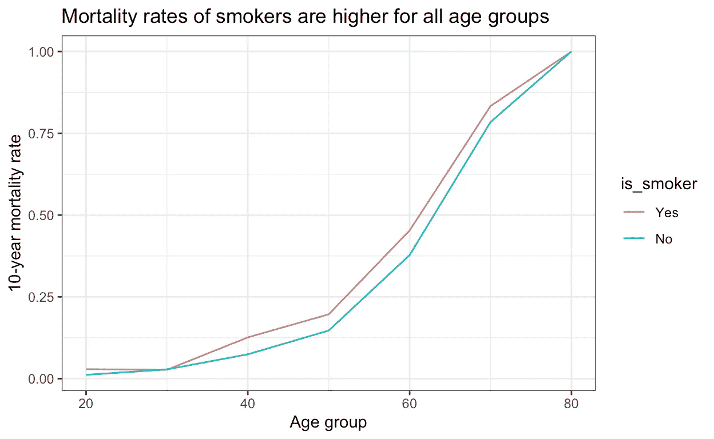
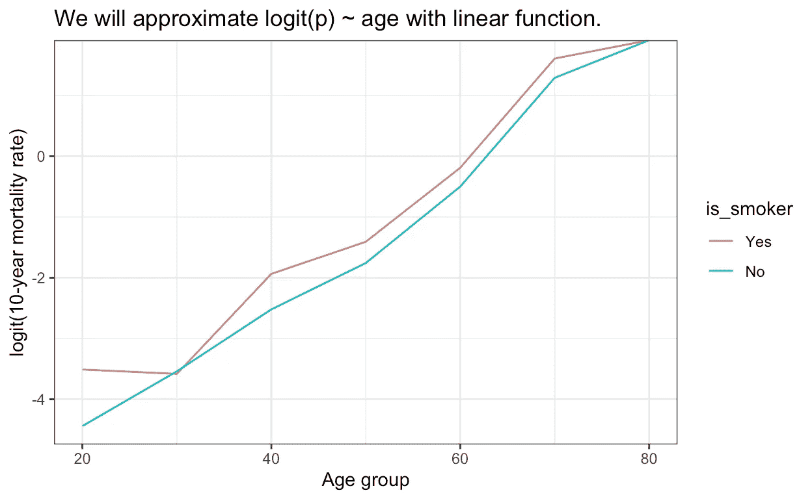
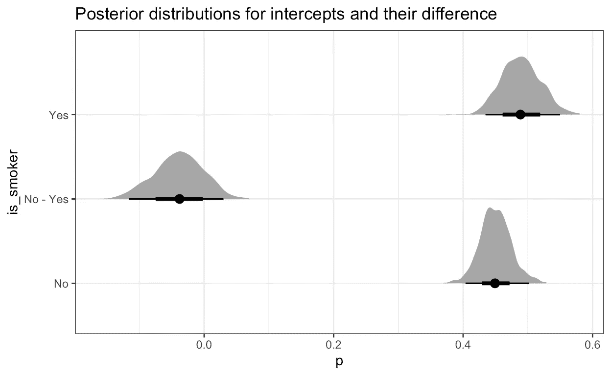
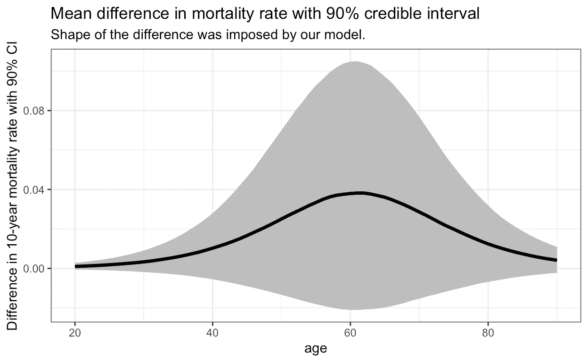
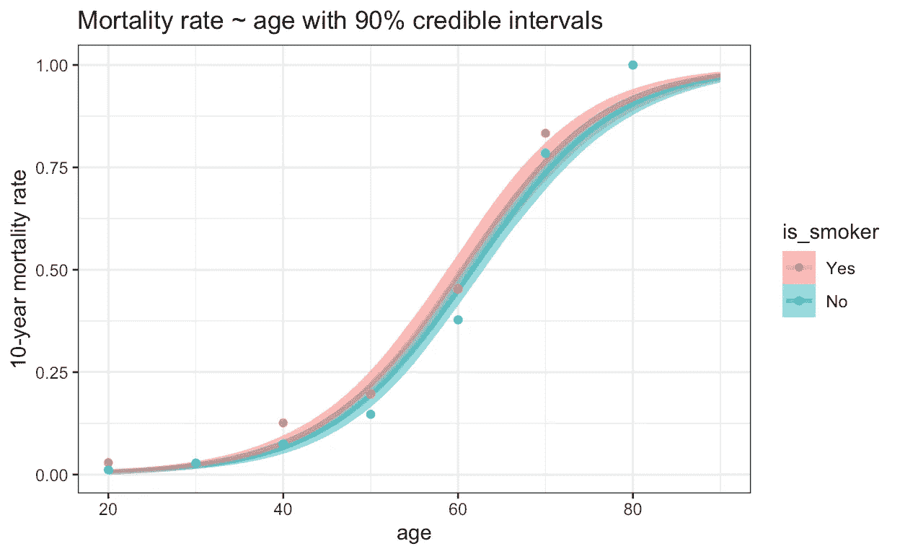

# 吸烟贝叶斯符合逻辑回归

> 原文：<https://towardsdatascience.com/smokin-bayes-cd6eb089fcd3>

## 贝叶斯推理结合广义线性模型比较吸烟者和非吸烟者死亡率的例子


我没有发现 Bayes 是否吸烟的信息。然而，我可以通过结合先验知识(当时男性吸烟的比例)和数据(画像上的他不吸烟)来估计他是吸烟者的概率。作者图片

前段时间在看[抽烟:数据集](https://calmcode.io/smoking/the-dataset.html)(这个数据集原来是在[的 mosiac R 包](https://rdrr.io/cran/mosaicData/man/Whickham.html)里找到的。)在 [calmcode.io](https://calmcode.io/) 上的系列视频。他们向你展示如何分析和比较吸烟者和非吸烟者的 10 年死亡率。(注意，不是吸烟的影响——而是作为一名吸烟者——因为吸烟者的生活方式与那些除了吸烟以外在其他方面没有区别的人不同。)

在这篇文章中，我将使用贝叶斯推理和一个广义线性模型，来计算与 calmcode 的视觉方法相比，作为一个吸烟者的影响。首先，让我们看看他们发现了什么。

# 视觉方法

吸烟数据集中的每一行代表一个人，她是否吸烟，十年后是否还活着。

```
[library](https://rdrr.io/r/base/library.html)([tidyverse](https://tidyverse.tidyverse.org))
[library](https://rdrr.io/r/base/library.html)(rethinking)
[library](https://rdrr.io/r/base/library.html)([tidybayes.rethinking](http://mjskay.github.io/tidybayes.rethinking))
[library](https://rdrr.io/r/base/library.html)([tidybayes](https://mjskay.github.io/tidybayes/))

df_raw <- readr::[read_csv](https://readr.tidyverse.org/reference/read_delim.html)("smoking.csv", col_types = "cfi")

df <- df_raw [%>%](https://magrittr.tidyverse.org/reference/pipe.html) 
  [transmute](https://dplyr.tidyverse.org/reference/mutate.html)(
    age,
    is_smoker = smoker,
    is_dead = [if_else](https://dplyr.tidyverse.org/reference/if_else.html)(outcome == "Dead", 1L, 0L)
  )[head](https://rdrr.io/r/utils/head.html)(df_raw)# A tibble: 6 × 3
  outcome smoker   age
  <chr>   <fct>  <int>
1 Alive   Yes       23
2 Alive   Yes       18
3 Dead    Yes       71
4 Alive   No        67
5 Alive   No        64
6 Alive   Yes       38
```

我们还稍微调整了数据集，并将其保存到`df`。这将在以后派上用场。从现在开始，我们将关注死亡率而不是存活率。

最基本(也是最天真)的方法是计算每种吸烟状态的死亡率。

```
df [%>%](https://magrittr.tidyverse.org/reference/pipe.html) 
  [group_by](https://dplyr.tidyverse.org/reference/group_by.html)(is_smoker) [%>%](https://magrittr.tidyverse.org/reference/pipe.html) 
  [summarise](https://dplyr.tidyverse.org/reference/summarise.html)(death_rate = [mean](https://rdrr.io/r/base/mean.html)(is_dead))# A tibble: 2 × 2
  is_smoker death_rate
  <fct>          <dbl>
1 Yes            0.239
2 No             0.314
```

哇，似乎吸烟者的死亡率更低！但是…我们不会因为年龄而“控制”。让我们比较一下每个年龄组的死亡率:

```
df_agg <- df [%>%](https://magrittr.tidyverse.org/reference/pipe.html) 
  [mutate](https://dplyr.tidyverse.org/reference/mutate.html)(round_age = plyr::[round_any](https://rdrr.io/pkg/plyr/man/round_any.html)(age, 10)) [%>%](https://magrittr.tidyverse.org/reference/pipe.html) 
  [group_by](https://dplyr.tidyverse.org/reference/group_by.html)(round_age, is_smoker) [%>%](https://magrittr.tidyverse.org/reference/pipe.html) 
  [summarise](https://dplyr.tidyverse.org/reference/summarise.html)(death_rate = [mean](https://rdrr.io/r/base/mean.html)(is_dead), .groups = "drop")[ggplot](https://ggplot2.tidyverse.org/reference/ggplot.html)(df_agg, [aes](https://ggplot2.tidyverse.org/reference/aes.html)(round_age, death_rate, color = is_smoker)) + 
  [geom_line](https://ggplot2.tidyverse.org/reference/geom_path.html)() + 
  [labs](https://ggplot2.tidyverse.org/reference/labs.html)(
    title = "Mortality rates of smokers are higher for all age groups",
    y = "10-year mortality rate",
    x = "Age group"
  )
```



作者图片

这就展现了一个完全不同的画面！在所有年龄组中，吸烟者的死亡率都较高。之前，由于数据集中吸烟者和不吸烟者的年龄比例不同，我们得到了不同的汇总结果。这就是著名的[辛普森悖论](https://en.wikipedia.org/wiki/Simpson's_paradox)。

Calmcode 视频到此为止。但是我想知道，如果没有宁滨时代，如何更精确地估计差异？

# 贝叶斯方法

我们将使用带有二项式可能性的广义线性模型。在我们的案例中，当数据被组织到单个试验案例中时(无论该人是否在未来 10 年内死亡)，该模型的通用名称是[逻辑回归](https://en.wikipedia.org/wiki/Logistic_regression)。我们将使用 [logit](https://en.wikipedia.org/wiki/Logit) link 对年龄和死亡率之间的关系进行建模。为了确保所有的`p`值从[∞，∞]映射到[0，1]，这种转换是必要的，否则我们在定义先验时必须小心。

这里是`logit(p) ~ age`在图上的样子:

```
[ggplot](https://ggplot2.tidyverse.org/reference/ggplot.html)(df_agg, [aes](https://ggplot2.tidyverse.org/reference/aes.html)(round_age, logit(death_rate), color = is_smoker)) + 
  [geom_line](https://ggplot2.tidyverse.org/reference/geom_path.html)() + 
  [labs](https://ggplot2.tidyverse.org/reference/labs.html)(
    title = "We will approximate logit(p) ~ age with linear function.", 
    y = "logit(10-year mortality rate)", 
    x = "Age group"
  )
```



作者图片

通过观察该图，我们似乎可以将`logit(death_rate)`建模为某一年龄死亡率的线性组合(截距)和代表死亡率随年龄变化的斜率。两组的斜率似乎也是一样的。

由此，我们可以为我们的模型构建一个公式列表并运行它:

```
formulas <- [alist](https://rdrr.io/r/base/list.html)(
    is_dead ~ [dbinom](https://rdrr.io/r/stats/Binomial.html)(1, p),
    logit(p) <- a[is_smoker] + b * (age - 60),
    a[is_smoker] ~ [dnorm](https://rdrr.io/r/stats/Normal.html)(-0.3, 0.25),
    b ~ [dnorm](https://rdrr.io/r/stats/Normal.html)(0.1, 0.05)
)

model <- [ulam](https://rdrr.io/pkg/rethinking/man/ulam.html)(formulas, data = df, warmup = 200, iter = 500, chains = 4, cores = 4)
```

我来解释一下`formulas`:

*   `is_dead`遵循 1 次试验的二项分布(也称为伯努利分布)，而`p`代表成功的概率(在我们的例子中，成功等于未来 10 年的死亡)。
*   关联函数`logit(p)`是十年死亡率的线性组合，取决于一个人是否吸烟，由截距`a`表示，斜率`b`在吸烟者和非吸烟者之间共享。基于上面的情节，我决定使用这样的模型。`logit(death_rate)`似乎与年龄呈线性相关。两组的斜率似乎是相同的。唯一不同的是截距。我决定在 60 岁而不是 0 岁时计算，因为这更直观，而且该模型对低年龄没有意义。
*   代表两组 60 岁死亡率的截距`a`的先验值相同。这是基于目测，但它足够广泛，在有意义的范围内。我也可以从其他在线数据集中重用它。
*   斜率的先验`b`也是基于目测，但也可以从在线数据集提前确定，在理想情况下更严格。

在查看模型之前，让我们仔细检查一下先验知识:

```
prior <- [extract.prior](https://rdrr.io/pkg/rethinking/man/extract.samples.html)(model, n = 200)[tibble](https://tibble.tidyverse.org/reference/tibble.html)(
  sample = 1:200,
  a = prior$a[,1], # you get two priors for intercepts (one for each group) but they are the same
  b = prior$b
) [%>%](https://magrittr.tidyverse.org/reference/pipe.html)
  tidyr::[crossing](https://tidyr.tidyverse.org/reference/expand.html)(age = [min](https://rdrr.io/r/base/Extremes.html)(df$age):[max](https://rdrr.io/r/base/Extremes.html)(df$age)) [%>%](https://magrittr.tidyverse.org/reference/pipe.html)
  [mutate](https://dplyr.tidyverse.org/reference/mutate.html)(p = [pmap_dbl](https://purrr.tidyverse.org/reference/map2.html)([list](https://rdrr.io/r/base/list.html)(a, b, age), \(a, b, age) [inv_logit](https://rdrr.io/pkg/rethinking/man/rethinking-internal.html)(a + b * (age - 60)))) [%>%](https://magrittr.tidyverse.org/reference/pipe.html)
  [ggplot](https://ggplot2.tidyverse.org/reference/ggplot.html)() +
  [geom_line](https://ggplot2.tidyverse.org/reference/geom_path.html)([aes](https://ggplot2.tidyverse.org/reference/aes.html)(age, p, group = sample), alpha = 0.2) +
  [geom_point](https://ggplot2.tidyverse.org/reference/geom_point.html)(data = df_agg, [aes](https://ggplot2.tidyverse.org/reference/aes.html)(round_age, death_rate, color = is_smoker)) + 
  [labs](https://ggplot2.tidyverse.org/reference/labs.html)(title = "Priors seem fine", y = "10-year mortality rate")
```


作者图片

前科看起来不错——信息足够丰富，但也很灵活。链的跟踪和 trank 图看起来也不错——你必须相信我。

以下是该模型的摘要:

```
[summary](https://rdrr.io/r/base/summary.html)(model)Inference for Stan model: 49f5d62bf6172f02e3638f3ae2372250.
4 chains, each with iter=500; warmup=200; thin=1; 
post-warmup draws per chain=300, total post-warmup draws=1200.mean se_mean   sd    2.5%     25%     50%     75%   97.5%
a[1]   -0.04    0.00 0.12   -0.26   -0.13   -0.05    0.04    0.20
a[2]   -0.20    0.00 0.10   -0.39   -0.26   -0.20   -0.14    0.01
b       0.12    0.00 0.01    0.11    0.12    0.12    0.13    0.14
lp__ -474.88    0.06 1.23 -478.10 -475.46 -474.57 -473.98 -473.49
     n_eff Rhat
a[1]   627    1
a[2]   678    1
b     1177    1
lp__   494    1

Samples were drawn using NUTS(diag_e) at Mon Jan 10 19:35:02 2022.
For each parameter, n_eff is a crude measure of effective sample size,
and Rhat is the potential scale reduction factor on split chains (at 
convergence, Rhat=1).
```

我们可以看到，与不吸烟者的截距`a[2]`相比，吸烟者的截距`a[1]`具有更高的死亡率。我们可以使用`tidybayes`软件包中的便捷函数绘制这两个参数的整体分布图(已经转换为 60 岁时的死亡率)及其差异:

```
samples_a <- model [%>%](https://magrittr.tidyverse.org/reference/pipe.html)
  [recover_types](http://mjskay.github.io/tidybayes/reference/recover_types.html)(df) [%>%](https://magrittr.tidyverse.org/reference/pipe.html)
  [spread_draws](http://mjskay.github.io/tidybayes/reference/spread_draws.html)(a[is_smoker]) [%>%](https://magrittr.tidyverse.org/reference/pipe.html) 
  [mutate](https://dplyr.tidyverse.org/reference/mutate.html)(p = [inv_logit](https://rdrr.io/pkg/rethinking/man/rethinking-internal.html)(a)) [%>%](https://magrittr.tidyverse.org/reference/pipe.html) 
  [bind_rows](https://dplyr.tidyverse.org/reference/bind.html)(.,  [compare_levels](http://mjskay.github.io/tidybayes/reference/compare_levels.html)(., p, by = is_smoker)) [ggplot](https://ggplot2.tidyverse.org/reference/ggplot.html)(samples_a, [aes](https://ggplot2.tidyverse.org/reference/aes.html)(p, is_smoker)) + 
  [stat_halfeye](http://mjskay.github.io/ggdist/reference/stat_sample_slabinterval.html)() + 
  [labs](https://ggplot2.tidyverse.org/reference/labs.html)(title = "Posterior distributions for intercepts and their difference")
```



作者图片

这些分布基于后验样本。有了它们，我们还可以计算出不吸烟者死亡率较低的概率:

```
samples_a [%>%](https://magrittr.tidyverse.org/reference/pipe.html) 
  [filter](https://dplyr.tidyverse.org/reference/filter.html)(is_smoker == "No - Yes") [%>%](https://magrittr.tidyverse.org/reference/pipe.html) 
  [summarise](https://dplyr.tidyverse.org/reference/summarise.html)(prob = [mean](https://rdrr.io/r/base/mean.html)(p < 0))# A tibble: 1 × 2
  is_smoker  prob
  <chr>     <dbl>
1 No - Yes  0.845
```

吸烟者有 85%的几率会有更高的死亡率。我们还可以看到死亡率的差异是如何随年龄变化的(注意，差异的形状是由我们的模型定义的，而不是大小):

```
newdata <- tidyr::[crossing](https://tidyr.tidyverse.org/reference/expand.html)(
  age = 20:90, 
  is_smoker = [unique](https://rdrr.io/r/base/unique.html)(df$is_smoker)
)linpreds <- [add_linpred_draws](http://mjskay.github.io/tidybayes/reference/add_predicted_draws.html)(model, newdata = newdata, value = "p") linpreds [%>%](https://magrittr.tidyverse.org/reference/pipe.html) 
  [group_by](https://dplyr.tidyverse.org/reference/group_by.html)(age, .draw) [%>%](https://magrittr.tidyverse.org/reference/pipe.html) 
  [summarise](https://dplyr.tidyverse.org/reference/summarise.html)(
    p_diff = p[is_smoker == "Yes"] - p[is_smoker == "No"]
  ) [%>%](https://magrittr.tidyverse.org/reference/pipe.html) 
  [ggplot](https://ggplot2.tidyverse.org/reference/ggplot.html)([aes](https://ggplot2.tidyverse.org/reference/aes.html)(x = age)) +
  [stat_lineribbon](http://mjskay.github.io/ggdist/reference/stat_lineribbon.html)([aes](https://ggplot2.tidyverse.org/reference/aes.html)(y = p_diff), .width = 0.9, fill = "gray") + 
  [labs](https://ggplot2.tidyverse.org/reference/labs.html)(
    title = "Mean difference in mortality rate with 90% credible interval",
    subtitle = "Shape of the difference was imposed by our model.",
    y = "Difference in 10-year mortality rate with 90% CI"
  )
```



作者图片

60 岁左右人群的 10 年死亡率似乎平均增加了约 4%(90%可信区间在 10%和-2.5%之间)，年龄越小死亡率越低。这可能是有道理的:

*   对于年轻人来说，吸烟的影响还没有那么大(而且他们的死亡率也更低)；
*   即使不吸烟，老年人也更容易死亡。

我们可以通过除以而不是减去死亡率来计算死亡率的相对上升。在这种情况下，年轻人的相对上升幅度约为 20%，然后开始缓慢下降，在 60 岁时约为 10%，然后几乎可以忽略不计。

我们还可以看到所有年龄组中两组死亡率的 90%可信区间:

```
[ggplot](https://ggplot2.tidyverse.org/reference/ggplot.html)(linpreds, [aes](https://ggplot2.tidyverse.org/reference/aes.html)(x = age, color = is_smoker, fill = is_smoker)) +
  [stat_lineribbon](http://mjskay.github.io/ggdist/reference/stat_lineribbon.html)([aes](https://ggplot2.tidyverse.org/reference/aes.html)(y = p), .width = 0.9, alpha = 0.5) +
  [geom_point](https://ggplot2.tidyverse.org/reference/geom_point.html)(data = df_agg, [aes](https://ggplot2.tidyverse.org/reference/aes.html)(x = round_age, y = death_rate)) + 
  [labs](https://ggplot2.tidyverse.org/reference/labs.html)(
    title = "Mortality rate ~ age with 90% credible intervals",
    y = "10-year mortality rate"
  )
```



作者图片

# 结论

使用`logit`链接函数使我们能够将伯努利变量`p` (10 年死亡率)建模为年龄的线性函数。另一方面，贝叶斯方法使我们能够获得参数值的分布——对于任何年龄和吸烟状态。我们可以按照我们喜欢的方式进行汇总:这是否是吸烟者死亡率更高的可能性，死亡率(差异)的可信区间(最终有意义的置信区间)……

贝叶斯推理和广义线性模型代表了一种灵活而强大的组合。但是，正确地指定模型背后的假设(公式集)是我们的责任。从这些发现中学习——所以，不要吸烟。并使用吸烟贝叶斯。

*原载于*<https://mihagazvoda.com/>**。**