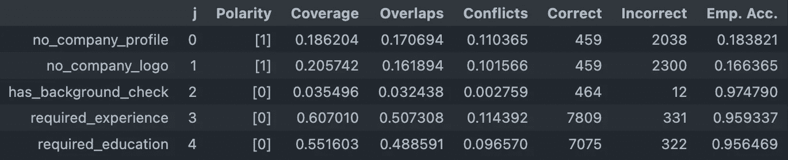
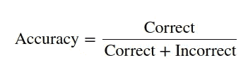
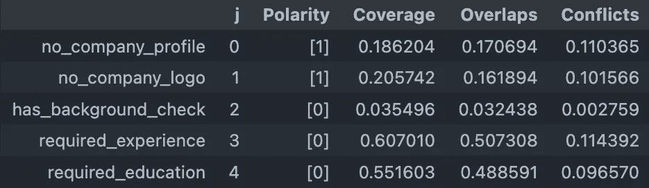
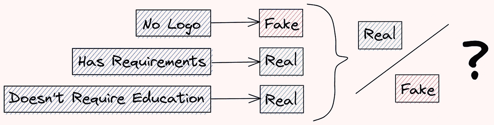
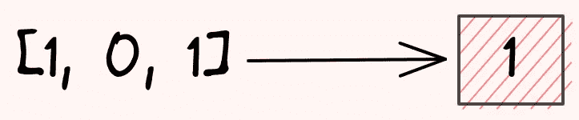
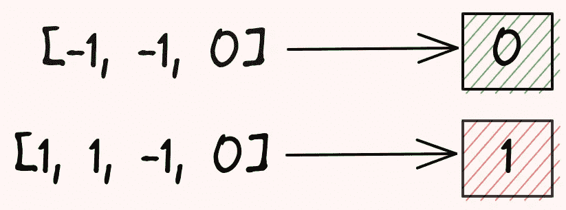
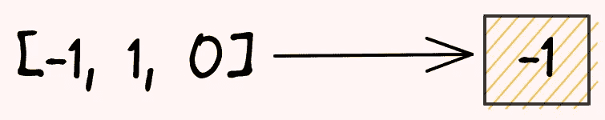

# 通气管——构建训练数据的人在回路平台

> 原文：<https://towardsdatascience.com/snorkel-programmatically-build-training-data-in-python-712fc39649fe>

## 停止手工标记您的数据。而是以编程方式对其进行标记

# 动机

想象一下，你试图判断一份招聘启事是不是假的。你想出了一些关于虚假招聘的假设，比如:

*   几乎没有描述要求的招聘信息很可能是假的。
*   没有公司简介或标识的招聘信息很可能是假的。
*   一份需要一些教育或经验的工作很可能是真实的。

如何测试这些特征在预测欺诈方面的准确性？如何将不同要素的冲突预测合并到一个标注中？


作者图片

这时候浮潜就派上用场了。

# 什么是浮潜？

[snuck](https://www.snorkel.org/)是一个开源的 Python 库，用于以编程方式构建训练数据集，无需手动标记。有了通气管，用户可以在几小时或几天内创建一个训练数据集，而不是在几周或几个月内手动标记它们。

通气管支持不同的操作，但本文将只回顾标记操作。

要安装通气管，请键入:

```
pip install snorkel
```

# 加载数据

我们将在 Kaggle 的数据集[真实/虚假职位发布预测](https://www.kaggle.com/shivamb/real-or-fake-fake-jobposting-prediction)上使用浮潜来预测职位发布是虚假还是真实。I [对数据](https://github.com/khuyentran1401/Data-science/blob/master/feature_engineering/snorkel_example/processing.ipynb)进行预处理，并将其分成训练集和测试集。

让我们看看训练数据集是什么样的:

```
import pandas as pd

train_df = pd.read_pickle("https://github.com/khuyentran1401/Data-science/blob/master/feature_engineering/snorkel_example/train_fake_jobs.pkl?raw=true")
test_df = pd.read_pickle("https://github.com/khuyentran1401/Data-science/blob/master/feature_engineering/snorkel_example/test_fake_jobs.pkl?raw=true")

train_df
```

`fraudulent`栏表示招聘信息是否是假的。

现在我们有了数据，我们如何给每个招聘信息贴标签呢？

# 创建标签功能

让我们根据对假公司的假设创建标签函数:

*   假公司没有公司简介或标识
*   真正的公司需要背景调查
*   真正的公司需要一定的经验或教育水平

让我们使用 scupco 的`labeling_function`装饰器来测试这些假设。`labeling_function`装饰器允许我们使用函数快速标记数据集中的实例。

```
from snorkel.labeling import labeling_function

# Give a meaningful name to each value
FAKE = 1
REAL = 0
ABSTAIN = -1

# Create labeling functions

@labeling_function()
def no_company_profile(x: pd.Series):
    return FAKE if x.company_profile == "" else ABSTAIN

@labeling_function()
def no_company_logo(x: pd.Series):
    return FAKE if x.has_company_logo == 0 else ABSTAIN

@labeling_function()
def has_background_check(x: pd.Series):
    return REAL if "background check" in x.requirements else ABSTAIN

@labeling_function()
def required_experience(x: pd.Series):
    return REAL if x.required_experience else ABSTAIN

@labeling_function()
def required_education(x: pd.Series):
    return REAL if x.required_education else ABSTAIN
```

关于上述标签功能的详细信息:

*   每个函数都试图根据一些条件来确定样本是否是假的。
*   `ABSTAIN`或`-1`表示预测是不确定的。

# 对数据应用标注函数

让我们使用这些标注函数来标注我们的训练数据集:

```
lfs = [
    no_company_profile,
    no_company_logo,
    has_background_check,
    required_experience,
    required_education,
]

applier = PandasLFApplier(lfs=lfs)
L_train = applier.apply(df=train_df)
```

查看训练数据集:

```
# Get the shape
>>> L_train.shape 
(13410, 5)

# View the first two samples
>>> L_train[0:2]
array([[-1, -1, -1,  0,  0],
       [-1, -1, -1, -1, -1]]) 
```

`L_train`的第一维是样本数。`L_train`的第二维度是来自五个标记函数的预测。

# 使用真实标签评估标签功能

既然我们已经使用每个标注函数创建了标签，那么我们如何确定这些标签的准确性呢？有了`LFAnalysis`，这可以很快完成。

让我们将预测与实际标签进行比较，以评估每个标签功能:

```
from snorkel.labeling import LFAnalysis

LFAnalysis(L=L_train, lfs=lfs).lf_summary(Y=train_df.fraudulent.values)
```



上表中的详细统计数据:

*   **极性**:该 LF 输出的唯一标签集合(不包括弃权)
*   **覆盖率**:数据集被标记的部分
*   **重叠**:这个 LF 和至少一个其他 LF 一致的数据集部分
*   **冲突**:该 LF 与至少一个其他 LF 不一致的数据集部分
*   **修正**:该 LF 标注的数据点数正确
*   **不正确**:该 LF 标注的数据点数不正确
*   **经验精度**:该 LF 的经验精度，通过以下公式计算:



作者图片

从表中可以看出`has_background_check`、`required_experience`、`required_education`标注函数的精度都在 0.95 以上。

如果不进行测试，我们就无法猜测这些特征是虚假招聘的有力证据。

# 评估没有真实标签的标签功能

在评估没有真正标签的标签功能时，通气管也是理想的选择。

```
LFAnalysis(L=L_train, lfs=lfs).lf_summary()
```



## 评估冲突

我们可以看到标签功能之间存在一些冲突。这可能意味着一个标注函数预测一个职位发布是假的，而另一个标注函数预测一个职位发布是真的。

可能会有一些招聘广告要求特定的经验，但没有公司的标志。让我们用`get_label_buckets`找到这些招聘信息。

```
from snorkel.analysis import get_label_buckets

buckets = get_label_buckets(L_train[:, 1], L_train[:, 3])

train_df.iloc[buckets[(FAKE, REAL)]].sample(10, random_state=1)[
    ["has_company_logo", "required_experience", "fraudulent"]
]
```

上表可以看出，很多公司要求具体经验，但是没有公司 logo。这导致了两个标记函数之间的预测差异。

# 组合预测

在本节中，您将学习两种在不同标注函数的预测不一致时组合它们的方法。



作者图片

## 多数标签投票人

一个简单的方法是使用多数票。如果有两个`1s`和一个`0`，那么预测将是`1`。



作者图片

如果没有连接，忽略`-1`(无标签)。



作者图片

如果有平局，则返回`-1`。



作者图片

让我们尝试一下这个标签模型，看看它在测试集上的表现如何:

```
from snorkel.labeling.model import MajorityLabelVoter

# Create the model
majority_model = MajorityLabelVoter()
preds_train = majority_model.predict(L=L_train)

# Get test predictions
L_test = applier.apply(df=test_df)

# Get train and test labels
Y_train = train_df["fraudulent"]
Y_test = test_df["fraudulent"]

# Evaluate
majority_acc = majority_model.score(L=L_test, Y=Y_test)[
    "accuracy"
]
print(f"{'Majority Vote Accuracy:':<25} {majority_acc * 100:.1f}%")
```

```
Majority Vote Accuracy:   80.7%
```

成绩还算不错！

## 标签模型

注意，`MajorityLabelVoter`没有考虑不同标记函数的变化统计以及这些函数之间的相关性。如果两个特征高度相关，特定信号将在基于多数投票的模型中被过度表示。

`LabelModel`通过产生噪声感知训练标签来更恰当地处理这些问题。你可以在本文中了解更多关于`LabelModel`的信息。

```
from snorkel.labeling.model import LabelModel

label_model = LabelModel(cardinality=2, verbose=True)
label_model.fit(L_train=L_train, n_epochs=500, log_freq=100, seed=1)

# Evaluate the model
label_model_acc = label_model.score(L=L_test, Y=Y_test)["accuracy"]
print(f"{'Label Model Accuracy:':<25} {label_model_acc * 100:.1f}%")
```

```
Label Model Accuracy:     72%
```

`LabelModel`的精确度不如`MajorityLabelVoter`的精确度。然而，在不同的数据集或不同的标记函数集中，`LabelModel`可能比`MajorityLabelVoter`执行得更好。

# 结论

恭喜你！您刚刚学会了使用不同的标注函数进行快速测试，并使用通气管为您的训练数据集创建标注。我希望这篇文章能激励你自动化你的标注过程，而不是花费数周或数月来手工标注你的数据。

随意发挥，并在这里叉这篇文章的源代码:

[](https://github.com/khuyentran1401/Data-science/tree/master/feature_engineering/snorkel_example)  

我喜欢写一些基本的数据科学概念，并尝试不同的算法和数据科学工具。你可以在 LinkedIn 和 Twitter 上与我联系。

如果你想查看我写的所有文章的代码，请点击这里。在 Medium 上关注我，了解我的最新数据科学文章，例如:

[](/similarity-encoding-for-dirty-categories-using-dirty-cat-d9f0b581a552) [## 使用 dirty_cat 对脏类别进行相似性编码

towardsdatascience.com](/similarity-encoding-for-dirty-categories-using-dirty-cat-d9f0b581a552) [](/kats-a-generalizable-framework-to-analyze-time-series-data-in-python-3c8d21efe057)  [](/supercharge-your-python-string-with-textblob-2d9c08a8da05)  [](/sentiment-analysis-of-linkedin-messages-3bb152307f84)  

# 参考

Shivam Bansal 。2020–02–29.真/假职位发布预测。
CC0:公共领域。从[https://www . ka ggle . com/shivamb/true-or-fake-fake-job posting-prediction](https://www.kaggle.com/shivamb/real-or-fake-fake-jobposting-prediction)检索 2022–01–25。