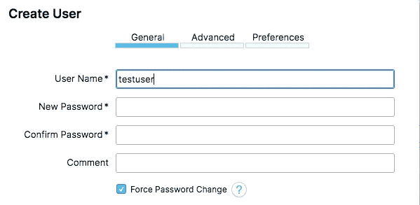
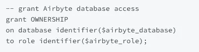
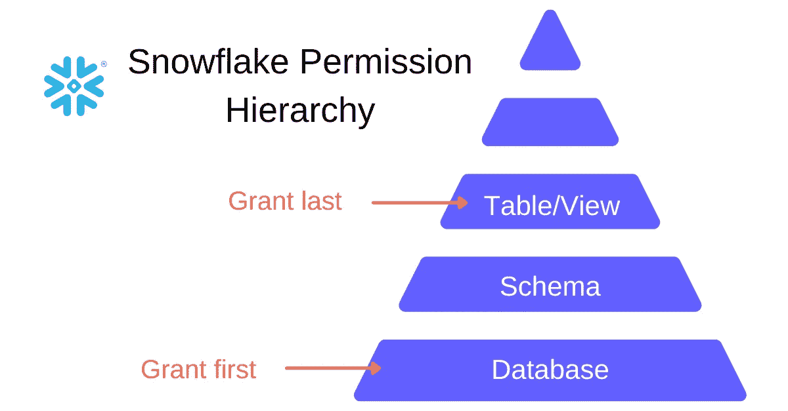
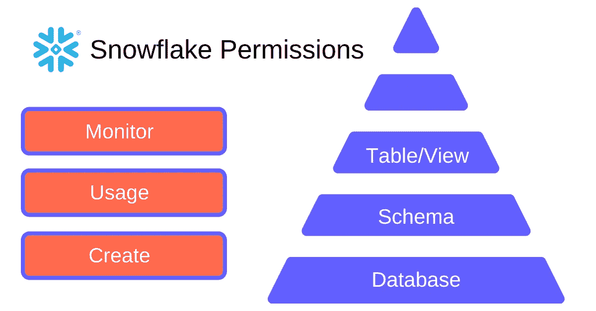

# 针对用户、角色和权限的雪花最佳实践

> 原文：<https://towardsdatascience.com/snowflake-best-practices-for-users-roles-and-permissions-3cd9d286b82a>

## 正确设置数据仓库的指南


在 [Unsplash](https://unsplash.com/s/photos/security?utm_source=unsplash&utm_medium=referral&utm_content=creditCopyText) 上由[Towfiqu barb huya](https://unsplash.com/@towfiqu999999?utm_source=unsplash&utm_medium=referral&utm_content=creditCopyText)拍摄的照片

数据仓库中的安全性是雪花架构中最重要的部分，也是经常被搁置的部分。很多时候，我们认为它没有数据本身重要。然而，设置正确的角色和权限是保持数据完整性的关键。从一开始就对此进行配置可以确保防止出现问题。

让我描述一下可能会出错的地方。您可以在 Snowflake 中创建一个角色，供业务中的所有用户使用。分析师、营销人员和工程师对每个数据库都有相同类型的访问权限。您有一个用于一次性分析的报告和数据分析(RDA)数据库，以及一个存储所有原始数据的数据库。一名营销人员正在寻找一份在 RDA 数据库中运行的报告，但意外地在原始数据库上运行了一个命令。他们覆盖数据，现在原始数据永远消失了。

你明白了。不是组织中的每个人都知道如何使用雪花或者正确地查询数据。您希望降低风险，以便他们可以使用这些数据，而您可以放心地生活，知道它是安全的。

当配置您的雪花环境时，我发现从创建您的用户开始更容易，然后使用用户来确定您的环境所需的雪花角色。在这里，您可以创建相应的仓库，并重置每个用户的默认值。让我们从创建我们的用户开始。

# 用户管理

**每个访问你的数据仓库的人和工具都应该有自己的用户。**这意味着分析师 Josh 需要自己的雪花用户，工程师 Sarah 需要自己的用户，连接到您的数据仓库的每个工具都需要自己的用户。这将严格控制谁有权访问某些资源。它还允许您跟踪信用使用情况和所做的更改。

让每个人和工具都有自己的用户名和密码是最佳的安全做法。这样，密码就不会到处乱放，而且你知道每个人都可以访问你公司的数据。此外，请记住，您可能不希望公司的每个人都可以访问雪花。

# 创建用户

要在雪花中创建用户，请运行以下命令:

```
CREATE USER <user’s name> PASSWORD=<dummy password> DEFAULT_ROLE=<role name> DEFAULT_WAREHOUSE=<warehouse name> MUST_CHANGE_PASSWORD=true
```

创建用户时，您必须为他们分配一个临时密码。出于安全目的，请确保设置 MUST_CHANGE_PASSWORD=true。这将强制用户在首次登录时更改密码。您也可以在用户界面上这样做，只需选中底部的复选框:



作者图片

但是，如果您正在为工具创建用户，您不希望选择此项。例如，如果您使用 [Airbyte](https://docs.airbyte.com/) 作为您选择的数据集成工具，您将创建一个用户 AIRBYTE_USER。您不希望选中需要更改密码的复选框。该工具无法在登录时更改其密码，因此请确保您从一开始就为其分配了安全密码，并将其存储在 1Password 等密码管理器应用程序中。

请注意，在使用命令创建用户时，我还设置了某些默认值，如角色和仓库。这很重要，尤其是当用户第一次学习如何使用雪花的时候。他们可能不明白如何改变自己的角色或使用正确的角色。为他们分配一个默认角色，以帮助管理他们拥有的权限。例如，分析师将最经常地分析数据，因此他们的默认角色应该是与报告相关的角色，即使他们有时可能会转换数据。

# 设置默认仓库

您还需要设置一个默认仓库来帮助管理数据仓库的成本和使用。这不一定是一项安全功能，但它将帮助您了解您的雪花积分被用于何处。为用户分配与其角色相关的仓库。接下来我们将更多地讨论具体的角色。

您创建的仓库应该与您创建的角色相匹配。这意味着，对于每一个角色，你都应该有一个对应的仓库。我有一个“加载 _WH”，“转换 _WH”，“分析 _WH”，“报告 _WH”。每个仓库对应于我将在下一部分中提到的角色。这将有助于组织资源，并允许您跟踪数据管道的哪些部分使用了最多的雪花配额。

# 角色管理

我们刚刚讨论了与您应该设置的默认仓库相关的角色，但是您首先应该在您的仓库中创建什么角色呢？在这里，我们将讨论不同类型的角色以及他们应该拥有的特定权限。虽然这因业务而异，并且取决于访问您的仓库的用户类型，但原则是相同的。

在深入研究角色类型和应该授予它们的权限之前，让我们简单讨论一下我是如何组织我的雪花数据仓库的。我有一个原始数据库，它吸收了我所有的原始数据。我的基本数据库从这个原始数据库中读取数据，以创建供我的数据模型使用的视图。然后我有了 DATA_MART_DEV 和 DATA_MART_PROD 数据库，用于在开发和生产中运行我的核心数据模型。最后，我有一个用于一次性报告和查询的 RDA(报告和数据分析)数据库。你可以在这里阅读更多关于我为什么这样组织我的雪花数据仓库的信息。

现在，我们来谈谈角色吧！

# 角色类型

最佳实践是为组织内的摄取工具、分析师、工程师和业务用户创建不同的角色。您还可以为 BI 工具或者反向 ETL 工具(如果您使用的话)创建特定的角色。为每个用户和工具创建不同的角色将允许您控制每个用户在每个数据库及其模式中可以做什么和不可以做什么。

**摄取工具权限:**

*   获取原始数据
*   可以查看、选择和创建 RAW

是的，你没看错——你的摄取工具应该有自己的角色！这是应该允许写入原始数据库的唯一角色。您的摄取工具是唯一应该在原始数据位置创建模式和表的工具。绝不允许公司内的任何人写入此内容。

> 摄取工具是将原始数据写入数据库的唯一方法。‍

这是数据库中最重要的角色，因为它拥有访问原始数据的能力。您的原始数据需要尽可能地安全，因为所有数据模型的完整性都依赖于它。如果公司内部的人在戳戳这些原始数据，你永远无法确定它是 100%准确的。这一角色的存在增加了人们对该数据可靠性的信心。

我将这个角色称为“加载器”，因为它是将原始数据加载到您的数据仓库中的工具。这是在将数据源中的数据接收到雪花中时，您将为 Airbyte 提供的角色。你可以阅读更多关于为了正确使用 Airbyte 你需要给角色的特定[权限](https://docs.airbyte.com/integrations/destinations/snowflake)的信息。为特定工具创建角色时，阅读该工具文档中的需求总是很有帮助的。



作者图片

Airbyte 提供了一个脚本来设置所有需要的权限，以便该工具将数据接收到您的仓库中。

**分析工程师权限:**

*   访问 RAW、BASE、DATA_MART_DEV、DATA_MART_PROD 和 RDA
*   可以从原始、基本和数据集市产品中查看和选择
*   可以在 DATA_MART_DEV 和 RDA 中查看、选择和创建

分析工程师，或者任何编写 dbt 数据模型的人，应该是唯一能够访问原始数据库的人。但是，他们应该只能查看和选择，而不能创建或删除。这样他们就无法更改原始数据。

在我的数据仓库中，我将这个角色称为“转换器”。它由转换数据的人和工具使用。具有此角色的用户有权从原始数据库中读取数据，并向存储模型的所有其他数据库中写入数据。

**分析师权限:**

*   对 BASE、DATA_MART_PROD 和 RDA 的访问
*   可以查看和选择基本数据和数据集市产品
*   可以在 RDA 中查看、选择和创建

因为分析师不创建基础模型，他们没有理由访问原始数据。他们需要的所有东西都应该放在基地里，减少意外删除原始数据的风险。此外，他们应该只拥有对 BASE 和 DATA_MART_PROD 的查看和选择权限，因为他们只是在查询中选择这些内容，而不是写入这些内容。

我把这个角色叫做“分析者”。他们不直接在数据仓库中转换任何数据，而是使用数据模型运行查询，并将它们写入“RDA”。

**业务用户权限:**

*   对 BASE、DATA_MART_PROD 和 RDA 的访问
*   可以查看并从中选择

业务用户应该能够查看数据和进行基本选择，但不能以任何方式修改数据。

我称这个角色为“报告者”，因为这个角色仅仅是*报告*数据，而不是写数据。Tableau 和 Looker 等数据可视化工具也使用这个角色。

# 创建角色和分配权限

为了在雪花中创建角色，您可以运行以下命令:

```
CREATE_ROLE <role_name>;
```

为了向雪花中的角色授予权限，您可以运行以下命令:

```
GRANT <privledge> to ROLE <role_name>;
```

最后，确保将您的角色分配给适当的用户。您可以通过以下方式实现:

```
GRANT ROLE <role_name> to USER <user_name>;
```

# 雪花的权限层次结构

您需要授予数据库、模式、表/视图和未来的*表/视图一定的权限。Snowflake 的权限是独一无二的，因为**您不能将权限分配给数据库，并期望它也应用于数据库**中的模式和表/视图。*



作者图片

# 授予数据库权限

首先，让我们回顾一下您可以在数据库级别授予角色的最重要的权限。

*   监视器允许角色查看对象的详细信息；您需要将此权限授予所有希望查看数据库的角色。
*   用法允许角色使用数据库；您需要将此权限授予任何希望查询数据库的角色。
*   CREATE 授予角色在数据库中创建对象*的能力。这对于在数据库“BASE”、“DATA_MART_DEV”和“DATA_MART_PROD”上分配您的 TRANSFORMER 角色非常重要。您的 LOADER 角色应该被授予“RAW”权限，而 ANALYZER 角色应该被授予“RDA”权限。*

# 向架构授予权限

现在，让我们回顾一下模式级别的重要权限。

*   同样，您需要将数据库中模式的 MONITOR 权限授予角色。
*   用法允许角色使用架构；您需要将此权限授予任何希望查询模式的角色。
*   CREATE 也存在于模式级别。您需要将它分配给我上面提到的数据库中模式的所有角色。



作者图片

# 授予表和视图权限

最后，这是事情变得不同的地方。表和视图拥有来自数据库和模式的独有特权。

*   SELECT 允许角色从表或视图中进行选择。您会希望将它分配给允许查询某个对象的每个角色。
*   INSERT 和 DELETE 都是应该授予您的 TRANSFORMER 角色在“DATA_MART_DEV”和“DATA_MART_PROD”上的权限。因为这是分配给 dbt 用户的角色，所以它需要能够对表进行更改。dbt 需要这些权限来运行[增量模型](https://docs.getdbt.com/reference/resource-configs/snowflake-configs)。请记住，这些权限只适用于表，不适用于视图。

对于表、视图和模式，您还需要确保对模式或数据库中的未来表和视图授予权限。这将使您不必对创建的新对象授予访问权限。

```
-- for tables
grant select on future tables in schema FACEBOOK to role ANALYZER;-- for views
grant select on future schemas in database BASE to role TRANSFORMER;
```

# 结论

在运行任何雪花命令之前，最好记录您的雪花架构，尤其是每个角色的权限。如果您没有清楚地记录每件事，授予权限可能会令人困惑。我知道当你认为你已经授予了所有需要的权限，然后一个角色仍然不能访问你需要的权限时，会很沮丧。

慢慢来。不要因为沮丧就授予一个角色所有可用的权限。记录良好的雪花用户、角色和权限是安全数据仓库的关键。随着您的组织的成长，并且开始越来越依赖于您已经建立的数据生态系统，最初的工作会有很长的路要走。

更多分析工程领域的最佳实践，[订阅](https://madisonmae.substack.com/)我的时事通讯。