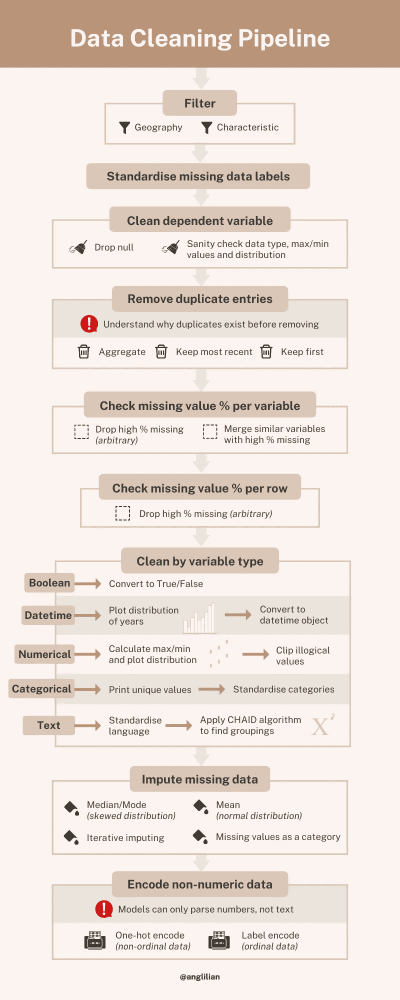
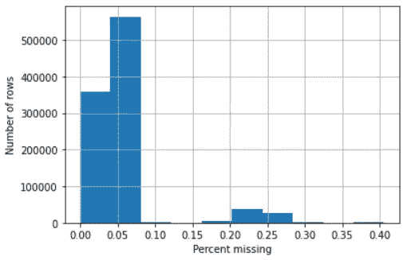
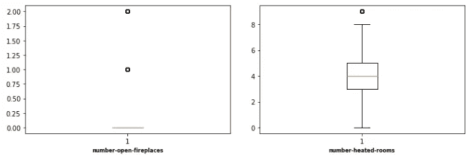

# 所以你得到了一个非常大的数据集。这是你清洁它的方法。

> 原文：<https://towardsdatascience.com/so-youve-got-a-dataset-here-s-how-you-clean-it-5d0b04a2ed86>

## 用 Python 进行数据清理的详细分步指南，并附有示例代码。


图片来自[马库斯·斯皮斯克](https://unsplash.com/photos/hvSr_CVecVI) (Unsplash)

在抓取、合并或直接从互联网上下载之后，你就有了一个数据集。你在想你能在上面运行的所有漂亮的模型，但是首先，你必须清理它。你可以有一百万种不同的开始方式，老实说，每次我开始的时候都会让我选择麻痹。

在处理了几个*杂乱的*数据集之后，下面是我如何构建我的数据清理管道。如果您有更有效的代码或对这些步骤的修改来减少偏见，请留下评论，我会将它合并到文章中！

查看我制作的这个概览图，并继续阅读每个步骤的更多细节。我提供的代码片段是用 Python 编写的，将主要使用 Pandas 和 matplotlib 库。



# 过滤器

如果您正在处理数据的子集，您希望确保数据代表感兴趣的子集。筛选特定列的特征以确保。

对于地理数据，使用感兴趣区域的 shapefile 和 geopandas *sjoin* 函数过滤掉外部数据。

```
# Dataframe of point coordinates
points_gdf **=** geopandas**.**GeoDataFrame(
    df[['uprn', 'LATITUDE', 'LONGITUDE']],
    geometry**=**geopandas**.**points_from_xy(df**.**LONGITUDE, df**.**LATITUDE),
    crs**=**'epsg:4326') # make sure shp_file crs is the same*# Filter for points within boundary*
points_in_boundary **=** geopandas**.**tools**.**sjoin(points_gdf, shp_boundary,         how**=**'right')
```

# 标准化缺失的数据标签

有时，丢失的数据被编码为“无数据”、“0”、“不适用”或只是一个空字符串。为了便于清理，将所有这些转换成 *np.nan.*

```
df **=** df**.**replace(['NO DATA','N/A', 0, ''],np**.**nan)
```

# 干净因变量

如果您预测的变量没有值，那么在最终数据集中包含该条目就没有意义。检查最大值和最小值是否在变量的逻辑界限内，以及所有行是否都属于同一数据类型。

# 删除重复条目

有重复表示数据输入可能有错误。在删除所有重复项之前，请询问:

> 为什么数据集中有重复项？

答案会改变你去除它们的策略。例如，如果在同一个数据库中根据一个惟一的属性标识符更新一所房子的记录，我们可能会发现最近的条目最相关。这是否意味着我们应该简单地扔掉所有的旧条目？使用旧记录来估算任何缺失的字段有意义吗？

在另一个场景中，我们可能有玩家的游戏记录。最近的条目可能是最新的，但是通过聚合过去的记录我们会得到更丰富的数据吗？游戏的机制使得只有最近或第一个记录重要吗？

不要这么快删除重复的！

# 检查每个变量的缺失值百分比

```
percent_missing **=** df**.**isnull()**.**sum() ***** 100 **/** len(df)percent_missing**.**sort_values(ascending**=False**)
```

如果缺少的值太多，您会希望删除该列。但是分界点是什么呢？

> 一般来说，丢失超过 50%的数据会使该列看起来毫无用处，但是在删除任何列之前**要理解为什么会有这么多数据丢失**。

该列可能只在某些情况下被填充。例如，如果表单要求提供饮食限制，而您选择了“其他”，表单可能会提示您填写另一个字段来指定限制。在这种情况下，包含有用信息的缺失值的百分比会非常高。该信息可以被清除并与另一列合并以保留数据。

类似地，如果具有互补数据的两列具有高百分比的缺失值，则可以使用它们来精确地估算数据。例如，如果一列显示一所房子是否有太阳能热水，另一列显示太阳能电池板覆盖的屋顶的百分比，我们可以创建一列来显示太阳能电池板的缺失值。

> 每一列数据都是费了一番功夫才收集起来的，并且显示了一些可能很重要的东西。如果你决定放弃这个专栏，要清楚为什么，并确保你已经想清楚了！

# 检查每行缺失值的百分比

如果整行没有数据或数据很少，删除它可能比以后用估算数据填充整个条目更好。在删除行之前，一定要问清楚为什么行是空的！

```
percent_missing_rows = df.isnull().sum(axis=0) / len(df.columns)missing_plt = percent_missing_rows.hist()missing_plt.set_xlabel('Percent missing')missing_plt.set_ylabel('Number of rows')
```



每行 null 百分比直方图。[图片来自作者]

对于这个数据集，我没有删除任何行，因为我处理的调查数据后来添加了新字段，增加了早期数据中缺失的百分比。

# 按变量类型清理

我们希望确保每一列都有我们期望的数据。如果有很多列，那么按类型(广义地说):布尔型、日期时间型、数值型(int/float)、分类型和文本型来审计变量会更容易。

```
df**.**select_dtypes(include**=** 'INSERT_TYPE')**.**columns**.**tolist() 
```

## 布尔代数学体系的

将所有布尔列标准化，以 True/False 作为对象，而不是其他形式，如 Y/N 或 Yes/No。

## 日期时间

将该列转换为 datetime 对象，并在直方图中绘制日期，以确保它在逻辑范围内。

## 数字的

对于数字数据，绘制箱线图以获得分布的快照，并查看哪些变量具有不合理的最大/最小值，应该进行剪裁。但是在剪辑之前，请确保您理解变量的含义。

```
num_var **=** df**.**select_dtypes(include**=** 'number')**.**columns**.**tolist()plt**.**figure(figsize**=**(20,10))

**for** i, var **in** enumerate(num_var):
  plt**.**subplot(4,7,1**+**i)
  plt**.**boxplot(df[var]**.**dropna())
  plt**.**xlabel(var,fontsize**=**8, weight**=**'bold')

plt**.**tight_layout()
```


在这个关于房屋的数据集中，一个房子有 50 个壁炉和超过 60 个加热房间是没有意义的。这表明应该对这些变量进行剪裁。[图片来自作者]

```
audit_num **=** df[clip_var]**.**describe(percentiles **=** [0.01, 0.99])*# Clips the variables with the upper bound of the 99% confidence 
# interval for variables with many outliers variance (no lower clip)*plt**.**figure(figsize**=**(20,10))

**for** i, var **in** enumerate(clip_var):
  df[var]**.**clip(lower**=-**9999.0, upper**=**audit_num[var]['99%'], inplace**=True**)
  plt**.**subplot(3,4,1**+**i)
  plt**.**boxplot(df[var]**.**dropna())
  plt**.**xlabel(var,fontsize**=**8, weight**=**'bold')

plt**.**tight_layout()
```



剪切变量后的方框图。[图片来自作者]

## 绝对的

打印每个分类列的所有唯一变量，并确保这些值是它们应有的值。否则，合并列。如果类别太多，考虑将它们分组以降低复杂性。

## 文本

有时你会得到文本形式的数据，这是一种标准化的形式，但大多数是不同输入的一大堆东西。尽可能使用正则表达式来标准化条目，然后我们可以使用 **CHAID(卡方自动交互检测器)**来减少唯一值的数量。

通常，该算法会创建一个决策树。它将独特的反应随机分组到一个节点中，并确定节点中的哪个分裂使我们更接近准确预测结果。它使用的度量是卡方，这是一个统计测试，告诉我们两个分类变量是否独立。我们将获取完成的树中具有唯一响应的最佳分组的节点，并使用它们来减少列中唯一值的数量。

你可以在这里阅读关于方法[的更深入的内容。下面的原码来自](https://select-statistics.co.uk/blog/chaid-chi-square-automatic-interaction-detector/)[这里](https://github.com/datasciencecampus/energy-efficiency/blob/master/01_Code/01_EPC/02_Preprocessing/05_CHAID.ipynb)。

```
**from** CHAID **import** Treechaid_dict **=** {}
**for** var **in** cat_var:
    *#Set the inputs and outputs*
    *#The imputs are given as a dictionary along with the type*
    *#The output must be of string type*
    *#I have assume all features are nominal, we can change the features dictionary to include the ordinal type*
    features **=** {var:'nominal'}
    label **=** 'VARIABLE_TO_PREDICT'
    *#Create the Tree*
    chaid_dict[var] **=** {}
    tree **=** Tree**.**from_pandas_df(df, i_variables **=** features, d_variable **=** label, alpha_merge **=** 0.0)
    *#Loop through all the nodes and enter into a dictionary*
    print('\n\n\nVariable: %s' **%** var)
    print('p-value: %f' **%** tree**.**tree_store[0]**.**split**.**p)
    print('Chi2: %f' **%** tree**.**tree_store[0]**.**split**.**score)
    **for** i **in** range(1, len(tree**.**tree_store)):
        count **=** tree**.**tree_store[i]**.**members[0] **+** tree**.**tree_store[i]**.**members[1]
        **if** count **!=** 0:
          rate **=** tree**.**tree_store[i]**.**members[1] **/** count
          print('\nNode %i:\n\tCount = %i\tRate = %f' **%** (i,count,rate))
          print('\t%s' **%** tree**.**tree_store[i]**.**choices)
        chaid_dict[var]['node' **+** str(i)] **=** tree**.**tree_store[i]**.**choices
```

作为一种启发，您可以按原样进行分组，但值得将其作为一个起点，看看如何对唯一的条目进行分组。

# 估算缺失数据

如果有丢失的数据，你就不能运行一个模型，所以这里有一些我们可以填充丢失数据的方法。

一种简单的方法是根据列中的其他值来填充缺失的数据。如果该列有倾斜的数据，则取中值(数值)或众数(非数值)，以便从大多数数据中提取数据，而不会最终改变分布。如果该列有未分块的数据，基于同样的原因取平均值！

另一种方法叫做**迭代插补**，依次使用每个特征的数据来填充缺失数据。我们预测缺失值百分比最低的要素中的缺失值，就像我们在解决回归问题一样。然后，它使用清理后的要素来预测缺失值百分比次低的要素，直到所有要素都被估算完毕。见[此处](https://machinelearningmastery.com/iterative-imputation-for-missing-values-in-machine-learning/)为教程。

对于分类数据或文本数据，您也可以通过将 *np.nan* 替换为‘MISSING’来将缺失数据视为一个数据类别。也许数据丢失的事实本身就具有预测性。

# 编码非数字数据

计算只对数字起作用，所以我们需要通过编码将文本转换成数字。

如果你有顺序数据，你可以使用标签编码**将一个按字母排序的类别转换成一个数字序列。['A '，' B '，' C'] = [1，2，3]。**

当顺序与数字的递增值相对应时，效果最佳，例如:['short '，' average '，' tall'] = [1，2，3]。但是当应用于像:['苹果'，'梨'，'香蕉']=[1，2，3]这样的无序数据时，模型得到的感觉是香蕉>梨>苹果，这是不正确的！

```
**from** sklearn.preprocessing **import** LabelEncoderlabel_encoder **=** LabelEncoder()
df[var] **=** label_encoder**.**fit_transform(df[var])
```

相反，我们使用**一键编码**，将数字转换成向量。所以数据像:['苹果'，'梨'，'香蕉'] = [[0，0，1]，[0，1，0]，[1，0，0]]。但是，在基数较高的地方(很多唯一值)，这些向量会变得非常大，占用大量内存，所以要小心。

```
*# One hot encode non-ordinal variable* **from** sklearn.preprocessing **import** OneHotEncoder  
enc **=** OneHotEncoder(handle_unknown**=**'ignore')
df[var] **=** enc**.**fit_transform(np**.**array(df[var])**.**reshape(**-**1,1))**.**toarray()
```

# 准备建模！

这绝不是一个关于清理数据的详尽指南。根据您的数据集，您可以执行更多的步骤，但我发现这是一个至少对开始有帮助的管道。请让我知道，如果有其他步骤，我应该添加和其他功能，可能有助于使这个过程更容易。

至少现在，去运行一些模型吧！