# 测量特征重要性的 Sobol 指数

> 原文：<https://towardsdatascience.com/sobol-indices-to-measure-feature-importance-54cedc3281bc>

## 理解模型的输出在业务驱动的项目中起着重要的作用，Sobol 可以提供帮助

马丁·桑切斯在 [Unsplash](https://unsplash.com/s/photos/ranking?utm_source=unsplash&utm_medium=referral&utm_content=creditCopyText) 上的照片

# **简介**

每个数据项目自然包括一个**初始阶段的预处理**来获得:

*   适当**格式**的数据，允许项目的下一阶段正常运行。
*   **高质量数据**确保最佳性能。

这第二点包括数据科学家的两个众所周知的步骤:**特征选择**和**特征工程**。

*   **特征选择**是**丢弃相对“不重要”的变量**同时**最小化信息损失**的过程。
*   **特征工程**是从现有变量**中创建新变量**的过程，这些变量在直觉上或“统计上”**很重要。**通常，变量的**变换**或**交互**。

然而，要执行这些步骤，一个关键问题出现了:**如何衡量一个变量的重要性？**

> 在本文中，我将介绍一个鲜为人知的方法来回答这个问题:**Sobol 指数**

# 衡量重要性

目标是**排列每个输入对输出的影响。**论文**【2】**提出变量的**重要性通过两个因素依赖于其**分布**:**

*   **其权重**:其分布可以增加或减少其重要性。比方说，我们正在研究性别和其他因素在泰坦尼克号死亡概率中的重要性:在女性群体中，我们预计性别占主导地位，而对于男性，另一个因素可能更重要。
*   **相互作用**:一个变量的分布会受到另一个变量分布变化的影响

通常有三种**方法**来衡量变量的重要性:

*   通过**线性回归**近似模型，并通过 p 值分析**权重**
*   执行更多的**高级统计测试** (chi2，t student，fisher，ANOVA …)
*   **功能分解**

Sobol 指数尤其基于后者——应用于**方差**的**函数分解**。

# Sobol 指数

## 直觉

一个**输入变量 *X_i*** 的重要性由其负责的 Y 的方差的**部分来衡量，即如果我们固定 ***X_i*** ，我们看**(Y 的)方差减少了多少**。如果**显著下降**，那么变量 ***X_i*** 测量的是 Y 的大部分方差，因此 ***X_i* 是一个重要变量**。因此，**Y 的不确定性归因于*X _ I*的不确定性，因为它主要代表其方差。****

## 一阶

Sobol 指数**有不同的顺序，反映了相互影响的变量数量**。因此，一阶量化了由于唯一变量 *X_i* 导致的 Y 中的方差份额**。如果有 **p** 变量，就会有 **p** 一阶指数。数学上，关系如下:**

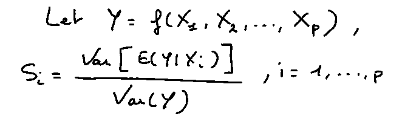

一阶 Sobol 指数

**期望值 *𝔼(Y|X_i)*** 是 ***Y*** 的平均值，其中只有 ***X_i*** 的值是有条件的(**固定**)。

**除以总方差 *V(Y)* 简化了结果**的解释:指数越接近 1，变量(如果顺序为 1)或变量组(顺序为> 1)越重要。

k 阶的索引使得 **k 个变量相互作用** ***X_i1*** ， ***X_i2*** ，…，以及 ***X_ik*** 通过**以与第一阶相同的方式**固定它们的值。下一部分的目的是尽可能简单地描述到达**广义公式**(针对每一个订单)的路径。

## 通式

起点是 ANOVA 的**功能分解。**将其他假设(例如正交性)添加到这个定理中，Sobol 证明了这个分解是**唯一的**。他将定理中的**方差**积分，得到如下等式:

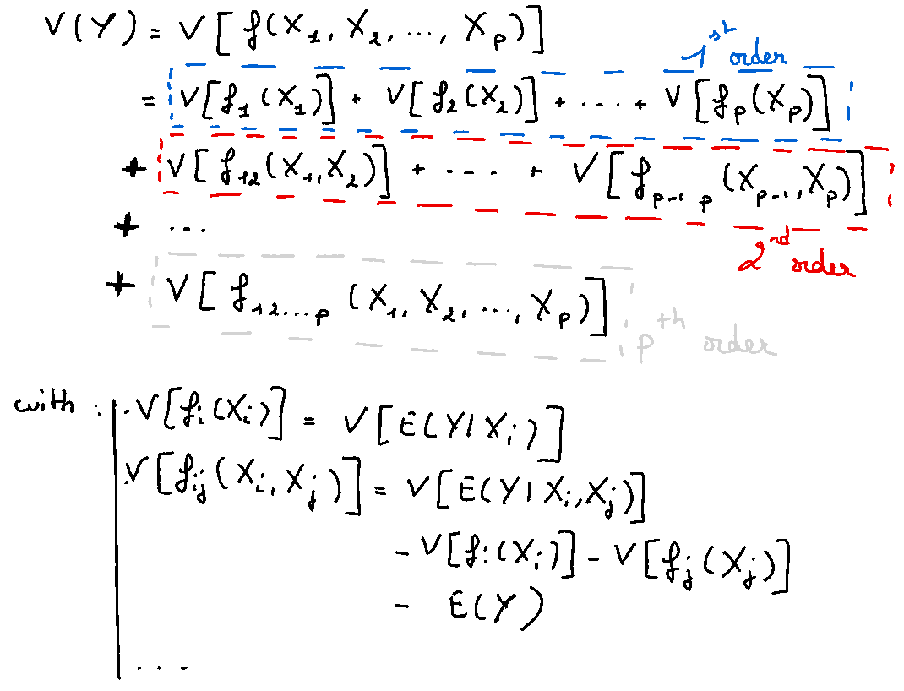

Sobol 的泛函分解是基于 ANOVA 的分解(在某些假设下)

最后，**阶 k** 的 Sobol 指数的正式定义是:

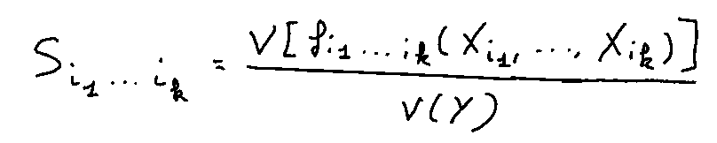

所有订单的 Sobol 索引(1 到 p)

这种方法的缺点是它的**算法成本**。的确，有“p 选 1”的一阶指数，有“p 选 2”的二阶指数或 p*(p-1)/2 指数，…，也只有一个 p 阶指数，综上，有 **2^p — 1 指数**。这种**指数级**的复杂性使得在高维空间中研究灵敏度变得困难。

幸运的是， **Homma 和 Saltelli** 已经找到了解决这个问题的方法:计算变量的总索引。该指数汇总了感兴趣的变量出现的所有**指数**。例如，对于 3 个变量，S_T1 = S_1 + S_12 + S_13 + S_123。

他们建立了**以下关系**:

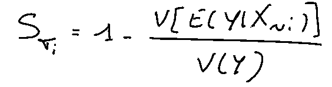

总指数

***【v(𝔼(y|x~i】)*这一项是 X~i** 的一阶效应，即这一项是 y 条件作用对所有变量**的期望方差，除了*****x _ I***所考虑的变量。

如果我们用一阶指数减去总数，我们就可以得到特定变量的指数之和**大于 1** 。当然，我们没有每一阶的精确值，但是这允许我们**对更高阶的一组值**有所了解。

## 在实践中

现实中，直接计算是不可能的。因此，我们使用**估计器**，特别是**蒙特卡罗方法**。

后者基于来自原始数据集的 N 个示例的两个样本，从而使用了两个不同的矩阵，如下所示:

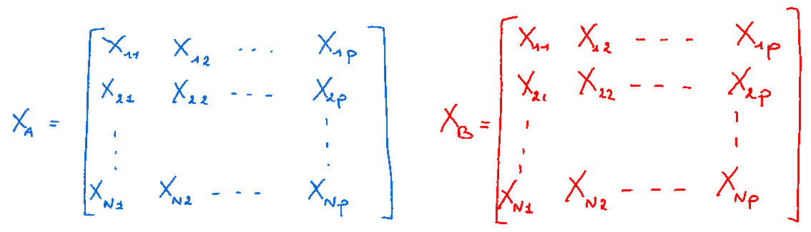

对于 **p** 变量的 **N** 示例的数据的 2 个样本

如果 ***i1、… ik*** 是我们感兴趣的指数的 ***k*** 变量，我们定义一个**三阶矩阵等于 *B*** ，但是用*的值来表示 ***k*** 变量:*

*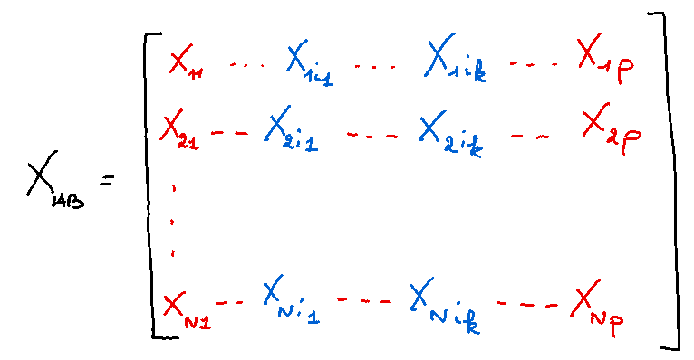*

*矩阵 B 中 k 个变量的值来自 A*

*3 个输出写如下:*

*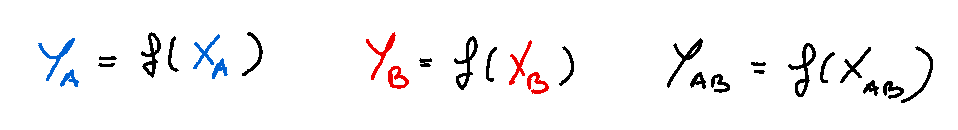*

*输出符号*

*对于一阶，Sobol 的方法在于重写等式，如下所示:*

*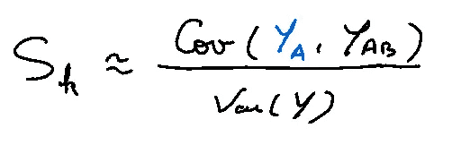*

*Sobol 方法下的一阶指数*

*因此，可以估计每个量，以获得第 k 个变量的一阶指数:*

*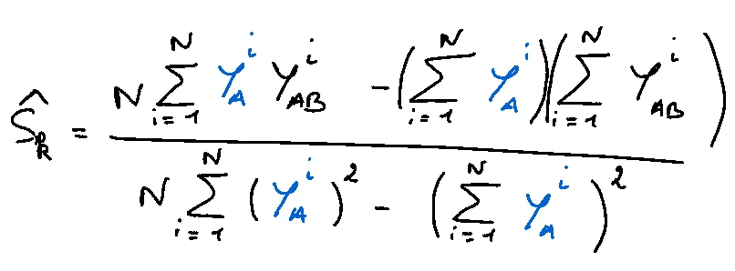*

*第 k 个变量的一阶估计量(Y_i 是向量列 Y 的第 I 个元素)*

*以同样的方式，总索引被重写:*

*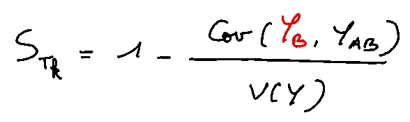*

*计算第 k 个变量总指数的 Sobol 方法*

*这导致以下估计量:*

*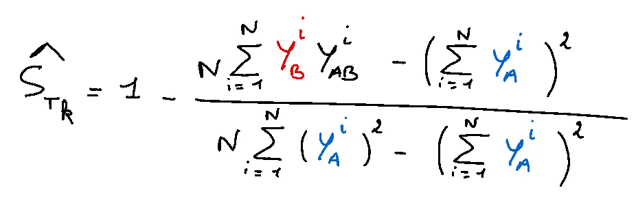*

*变量 k 总效应的估计量*

*根据定义， **S_Tk 大于 S_k** ，因为它**包含了输入变量 X_k 的主要效应和所有交互作用***

*现在，让我们把这个方法应用到一个**玩具的例子中！***

## *应用*

*我将使用一个 [**数据集**](https://archive.ics.uci.edu/ml/datasets/Seoul+Bike+Sharing+Demand) ，根据一些天气变量(温度、降雨量(毫米)、能见度……)以及下表所示的其他变量，给出首尔**每小时租赁的自行车数量**。*

*使用的原始数据集*

*预处理阶段将被省略，因为主题是索引。但是，必须提到一个步骤:需要在 0 和 1 之间标准化**数据。事实上，ANOVA 函数分解依赖于一个**强假设**:函数的定义域必须在 **0 和 1** 之间，才能有一个**唯一的**分解(**必要条件**)。***

*代码可分为 **3 块。***

## *第一区*

*在**清理**数据后，我实现了 **3 个函数**，分别创建矩阵 A、矩阵 B 和矩阵 AB。代码如下:*

*为了简单起见，为了生成两个数据样本，我应用了最简单的样本替换技术。(可选择其他样品技术)*

## *第二区*

*然后，我创建了一个主函数，它将为一个特定的变量计算它的**一阶效应和总效应**，这样:*

*计算变量的 Sobol 索引(第一个和全部)的函数(在参数中称为“varaible_index”)*

## *第三区*

*最后，我展示了一个简单的**函数来绘制**一个堆叠条形图，以方便地表示每个变量的第一阶**效应和总**:*

*plot 函数得到下图(X 是训练数据)*

## *结果*

**

*将上述 3 个模块的应用结果应用于之前显示的数据集*

*经过几次测试和不同的数据后，我注意到对于 1000 个例子来说，估计量是无效的。**从 5000** 开始，我开始得到如上的不错的成绩。*

*Sobol 指数从**的另一个角度**提供结果:*

*   *温度在每小时租赁自行车的数量中起着主导作用，因为几乎 80%的 Y 的变化似乎是由温度估计的。*
*   *对于除温度之外的所有变量，由于**相互作用** **产生的 Sobol 指数在一阶上占优势**。也就是说，单独来看，这些变量对输出没有主要贡献，但是**它们与其他变量的相互作用使得变量更加重要**。*
*   *值得注意的是，在没有提及**标准偏差**的情况下，数值分析仍然**统计性较差**。比如我们看到变量“露点温度”有一个**负一阶**，理论上**不可能**。如果我们有标准偏差和 p 值，我们可能会看到这个变量**对模型来说可能不重要**。*

# *结论*

*在一个项目中，这种方法可以用来支持其他更传统的测量**变量重要性**的方法(线性回归，统计测试)。此外，对于非科学观众来说，这个解释可能很难。然而，它通过估计器和统计效率进行计算的简单性可能会吸引那些想用另一种方法来衡量独立变量重要性的科学家。*

> ***注:**每一个手工人物都是我亲手制作的。*

# *来源*

*   *https://artowen.su.domains/pubtalks/siamUQ.pdf[(索博尔指数的深层数学解释)](https://artowen.su.domains/pubtalks/siamUQ.pdf)*
*   *[2][https://foundation . SCOR . com/sites/default/files/2022-01/Silvia _ Bucci _ Memoire _ ia-light . pdf](https://foundation.scor.com/sites/default/files/2022-01/Silvia_Bucci_Memoire_ia-light.pdf)(一篇有趣的提到 Sobol 指数的法国论文)*