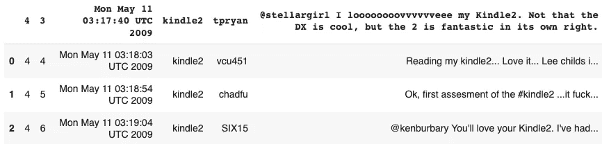
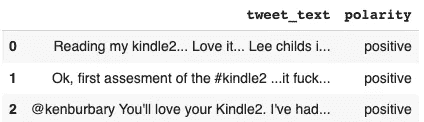
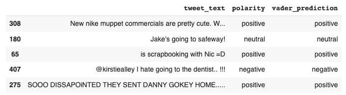
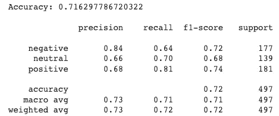

# 使用 Python 和 VADER 进行社交媒体情感分析——无需培训！

> 原文：<https://towardsdatascience.com/social-media-sentiment-analysis-in-python-with-vader-no-training-required-4bc6a21e87b8>

## 词典和基于规则的情感分析库。


照片由[你好我是尼克](https://unsplash.com/@helloimnik)在 [Unsplash](https://unsplash.com/photos/LUYD2b7MNrg)

# 介绍

建立一个模型可能比你想象的要容易得多。不是每个分类任务都需要机器学习模型。即使非常简单的方法也能给你带来好的表现。本文涵盖了`**VADER**`，这是一个基于词典和规则的情感分析模型。我们将首先了解什么是 VADER，最后评估它在分类任务中的性能。

# 什么是 VADER？

价感知词典和情感推理机或简称 VADER 是一个词典和简单的基于规则的情感分析模型。

它可以有效地处理词汇、缩写、大写、重复标点符号、表情符号(😢,😃,😭等。)，等等。通常在社交媒体平台上采用来表达个人情感，这使得它非常适合社交媒体情感文本分析。

VADER 的优势在于评估任何给定文本的情感，而不需要之前的训练，因为我们可能需要机器学习模型。

VADER 生成的结果是一个由 4 个关键字 **neg** 、 **neu** 、 **pos** 和 **compound** 组成的字典:

**neg** 、 **neu、**和 **pos** 分别表示阴性、中性和阳性。它们的和应该等于 1，或者用浮点运算接近 1。

**复合词**对应于词典中每个单词的价分值之和，并且确定情感的程度，而不是与之前的值相反的实际值。其值介于-1(最极端的负面情绪)和+1(最极端的正面情绪)之间。使用复合分数足以确定文本的潜在情感，因为:

*   一个**正向**情绪，**复合≥ 0.05**
*   一个**负**情绪，**复合≤ -0.05**
*   一个**中性**情绪，**复合在-0.05，0.05[** 之间

现在我们已经理解了主要概念，让我们深入到实现中。

# 如何使用 VADER？

本节的目标是为您提供所有的先决条件，如依赖性、数据集和 VADER 的实际实现。

如果您喜欢视频，可以观看本文的视频演示:

## 先决条件和基础知识

正如标题中提到的，我们将使用 VADER 库，为此我们需要安装`[nltk](https://www.nltk.org/_modules/nltk/sentiment/vader.html)` **，**下载，并按照以下说明导入词典。

vader_basics.py

`SentimentIntensityAnalyzer.polarity_score()`功能提供文本的极性，呈现之前解释的字典格式。为了能够执行预测，我们需要预先创建一个`SentimentIntensityAnalyzer`**(**行** **12** )的实例。**

**让我们通过预测以下例子的潜在情绪来热身。**

**示例 1.py**

```
# Output of example1
{'neg': 0.0, 'neu': 0.585, 'pos': 0.415, 'compound': 0.75}
```

****观察例 1** :上一个结果显示该句没有任何负面信息(neg=0)。它有一些中性和积极的音调(neu=0.585 和 pos=0.415)。不过，总体情绪是积极的，因为复利> 0.05**

**示例 2.py**

```
# Output of example2
{'neg': 0.0, 'neu': 0.373, 'pos': 0.627, 'compound': 0.8284}
```

****观察例 2:** 从这个例子可以看出，复合词跳到了 0.82，这使得句子比第一个例子的句子更加肯定。**

```
# Output of example3
{'neg': 0.619, 'neu': 0.381, 'pos': 0.0, 'compound': -0.8449}
```

****观察例 3:** 从这最后一句话，我们可以看出，该句没有任何正面信息(pos=0)。它有一些中性和消极的音调(neu=0.424 和 neg=0.576)。总的来说，由于复合得分接近-1，它具有最极端的负面情绪。我的猜测是，去掉感叹词会让情绪不那么消极。为什么不试试呢:)**

# **大型数据集上的性能**

**既然我们了解了基础知识，让我们尝试评估 VADER 在大数据上的性能。在此之前，我们将需要执行一些预处理。**

## **加载数据进行预处理**

**我们将使用[感知 140](http://help.sentiment140.com/for-students) 网站上的这个 ***免许可*** 推特数据集，以便了解 VADER 做得有多好。**

**vader_read_data.py**

****

**数据集的前 3 行(图片由作者提供)**

**我们只对两个主要栏目感兴趣。**

*   ****‘4’**，对应推文极性(0:负极，2:中性，4:正极)。**
*   **“@stellargi”..右'，对应实际推文。**

**下面的函数将这些列重命名为更容易理解的格式，然后在数字和极性的字符串格式之间建立对应关系，最后返回格式化的数据。**

**格式 _ 数据. py**

**下图对应于对原始数据集应用`format_data()`函数后的前 3 行(**行** **16** 和 **17** )。**

****

**对原始数据应用 format_data 函数后的前 3 行(图片由作者提供)**

## **VADER 的数据有多好？**

**在此之前，我们将使用以下助手函数，这些函数将立即返回极性( **pos** 、 **neg** 或 **neu** )，而不是字典输出。**

**维德 _ 预测 _ 助手. py**

**在**行** **19** 上，我们创建一个新列`vader_prediction()`对应 VADER 的预测。然后，在**第 22 行**我们显示了 5 行随机数据**

****

**包含原始标签和 VADER 预测的 5 行随机数据(图片由作者提供)**

**从最初的**极性**栏和 VADER 的预测，我们可以最终生成运行这几条指令的性能(精度、召回和 f1 分数)。**

**维德 _performance.py**

****

**VADER 对数据的准确性和分类报告(图片由作者提供)**

**该模型似乎做得很好，因为它比随机猜测(精确度= 0.5)好得多！从每个极性的**f1-分数**中可以得出相同的观察结果。**

# **结论**

**恭喜你！🎉 🍾您刚刚学习了如何使用 VADER 进行社交媒体情感分类。在进一步构建机器学习模型之前，VADER 可以成为一个很好的起点，并可以用作此类任务的基线模型。我希望您喜欢阅读这篇文章，并且它给了您执行分析所需的技能。请在下面找到更多资源来帮助您进一步学习。**

**欢迎在 LinkedIn 上添加我，或者在 Twitter 上关注我。讨论人工智能，人工智能，数据科学，自然语言处理的东西总是令人愉快的！**

**[Google Colab 上的源代码](https://colab.research.google.com/drive/1_Y7LhR6t0Czsk3UOS3BC7quKDFnULlZG?usp=sharing)**

**[Github 上的 VADER 文档](https://github.com/cjhutto/vaderSentiment)**

**[NLTK 文档](https://www.nltk.org/_modules/nltk/sentiment/vader.html)**

**再见🏃🏾**