# 图和网络中的社会网络分析和谱聚类

> 原文：<https://towardsdatascience.com/social-network-analysis-and-spectral-clustering-in-graphs-and-networks-40c8d878e946>

## 图的中心性度量和划分技术简介

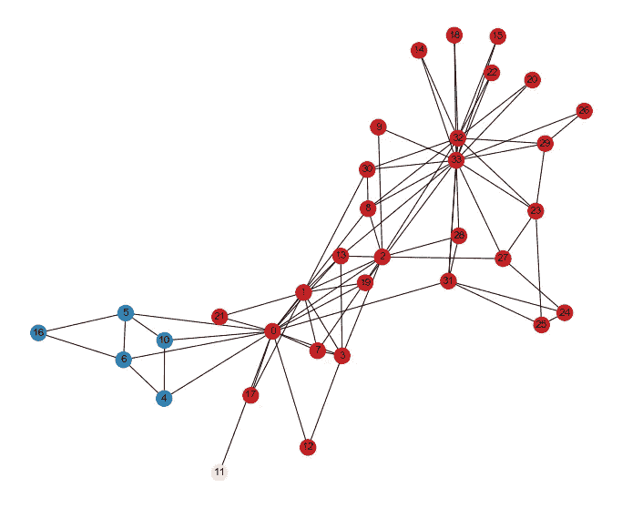

图片来源——由作者使用 Jupyter 笔记本准备。

# 1.介绍

## 1.1 图和网络的基础

网络被定义为由线连接的点组成的图。这些点是节点、顶点，甚至是角色，而连接被称为边。例如，当考虑大学中的学生的社交网络时，每个学生代表一个节点，并且任何一对彼此熟悉的学生表示他们之间的边(友谊)。假设我们将节点定义为 V(与顶点同义)为{V1，V2，V3，…，Vn}，那么图的大小为|V|=n，即图中节点的数量。类似地，边被定义为给定节点对之间的关系。考虑将边定义为 E = {E1，E2，E3，…..，Em}，那么边的数量表示为|E|=m。

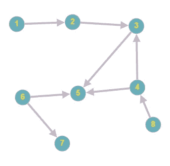

**图一。**有向图的例子。网络或图中的边可以具有方向，例如，w.w.w(万维网)是有向图。边通常使用端点来表示，并且通常被定义为弧。在无向图中，这些定义方向的箭头通常是缺失的——这是作者准备的图像。

表示一个图很简单，但是我们需要处理某些组件。下面的网络是无向图的一个例子。对于图中的任何节点 V，例如 Sharanya，它通过边连接到的节点集被称为它的邻居，并被表示为 N(v)。例如 N(Sharanya) = {Tabish，Angel，Panini}。类似地，连接到任何节点的边的数量被称为该节点的度(在下图中表示为每个节点顶部的数量)。在下面的例子中，Sharanya 连接到三个节点，因此度为 3。

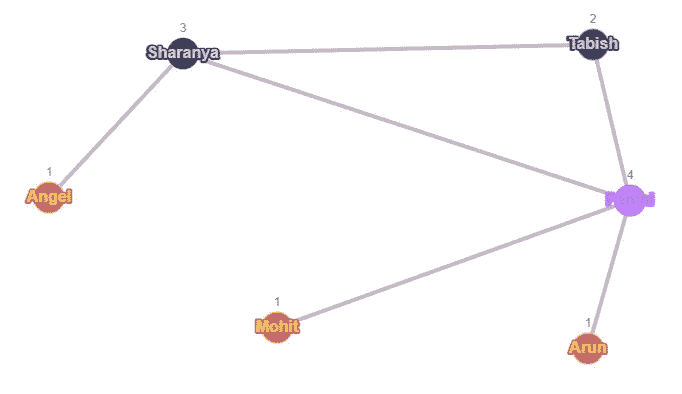

**图二。**说明了一个无向图。每个节点代表一个个体，而节点之间的连接则代表程度——作者准备的图像。

## 1.2 学位与分布

在剩下的文章中，我们将考虑图 2 所示的无向图的例子。在无向图中，*度数的总和是图中边数的两倍。*

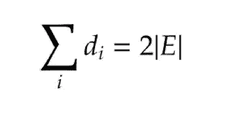

例如，图 2 中的总边数是 6。如果我们对每个节点的度数求和(1+3+2+4+1+1) = 12，则定理本身成立。

在处理可拓图时，节点的度分布是一个需要分析的关键概念，被定义为度分布。例如，让我们考虑 R(d)作为上图中可能的度数序列。R(d) ={1，2，3，4}。我们将分数定义为图中节点总数上度数为“d”的节点数。这可以用来分析**幂律度分布。许多用户在像脸书这样的社交网站上朋友较少，然而也有一小部分用户拥有大量的朋友。**

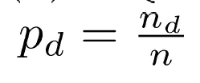

计算:P1=3/6 = 50%(图中 3 个节点的度数为 1，6 个节点)。P2 = 1/6 = 17% (1 个度为 2 的节点，参考上图中的 Tabish，共 6 个节点)。

## 1.3 邻接矩阵

捕捉图中节点之间连接的矩阵表示是邻接矩阵。

Ai，j = 1，如果在节点 Vi 和 Vj 之间有边，否则我们将其标记为 0。这是表示社会网络、学术研究中的引用网络等的常用方法。该图的邻接矩阵如下所示。


**图三。**说明了一个无向图。每个节点代表一个个体，而节点之间的连接则代表程度——作者准备的图像。

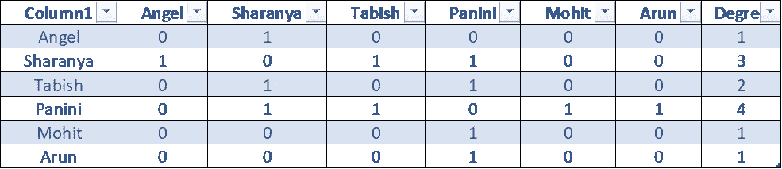

**图四。**显示了上图的邻接矩阵以及每个节点的度数。图片由作者准备。

# 2.节点的中心性度量

中心性允许我们计算数据中每个节点的重要性。假设在墨尔本有一场澳大利亚和韩国之间的足球世界杯预选赛，组织者想向上面网络中最有影响力的人分发一些免费门票。量化中心性的一种方式是通过使用邻接矩阵计算每个节点的度，即给定行中所有 1 的总和。在上面的例子中，帕尼尼拥有最高的度，值为 4，表明他在网络中有多个连接。然而，这可能并不总是正确的方法。想象帕尼尼有多个朋友，但他的朋友只有更少的朋友。为了避免这样的问题，我们可以使用特征向量来计算中心性。

特征向量给每个节点一个与其所有邻居分数之和成比例的分数。给定一个邻接矩阵 A，V 是 A 的一个特征向量，如果乘以 A 并不改变 V 所指的方向，它只是将它缩放一个因子λ，即 A×V =λ×V

## 2.1 Zachary 的空手道俱乐部网络数据用 Python 中的 NetworkX

在这个例子中，我们将使用 Zachary 的空手道俱乐部网络数据来学习一些图形的基本概念。我们将研究图的节点、边、度、视觉表现等。我们还将学习如何使用谱聚类算法来执行图聚类。

```
# !pip install networkx%matplotlib inlineimport networkx as nx
import numpy as np
import pandas as pd
import matplotlib.pyplot as plt
import seaborn as snsimport warnings
warnings.filterwarnings(‘ignore’) # — — — — — — to get rid of warning messages# — — — — — — — Remove scientific notations and display numbers with 2 decimal points instead — — — — — — — pd.options.display.float_format = ‘{:,.2f}’.format# — — — — — — — Update default background style of plots — — — — — — — 
sns.set_style(style=’darkgrid’)
```

> L 加载数据。请注意，数据是作为 networkx 库的一部分出现的。

```
# — — — — — — — — — — — -Reading Data — — — — — — — — — — — kn=nx.karate_club_graph()# — — — — — — — — — — — -The example below is a network from Zachry’s Karate club — — — — — — — — — — — # — — — — — — — — — — — -Display Number of Nodes — — — — — — — — — — — num_nodes = kn.number_of_nodes()print(‘number of nodes: ‘ + str(num_nodes))print(“-”*50)# — — — — — — — — — — — -Display Number of Edges — — — — — — — — — — — num_edges = kn.number_of_edges()print(‘number of edges: ‘ + str(num_edges))
```

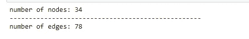

**输出 1。**说明了网络中节点和边的数量。图片由作者使用 Jupyter 笔记本制作。

```
with sns.axes_style(‘darkgrid’):

 fig = plt.subplots(1, figsize=(12,10))

 nx.draw_networkx(kn, edge_color=’#a7a7a5', with_labels=True, font_color=’white’)

 plt.axis(‘off’)
```

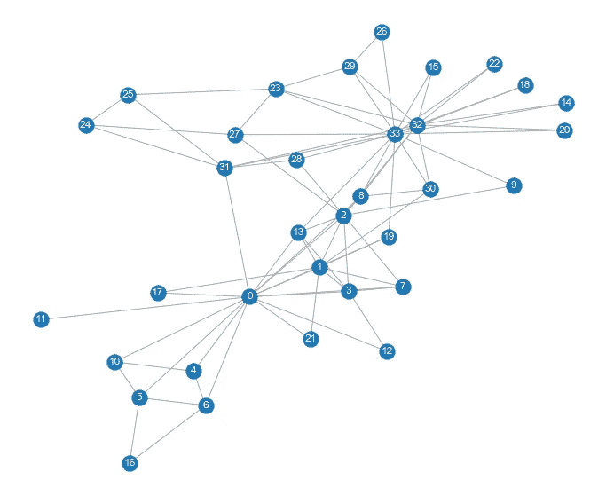

**输出 2。**说明了数据的网络表示。图片由作者使用 Jupyter 笔记本制作。

## 2.2 度中心性

节点 v 的度中心性是它所连接的节点的分数。度中心性值通过除以简单图 n-1 中的最大可能度来归一化，其中 n 是 g 中的节点数。

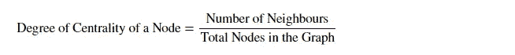

**一级方程式赛车。**举例说明度中心性的计算。图片由作者使用 Jupyter 笔记本和 Latex 制作。

```
# — — — — — — — — — let us store the degree centralities for each nodes for a graph in a dictionarydeg_cen = {}graphs=[kn]for g in graphs:

 deg_cen[g] = nx.degree_centrality(g)print(deg_cen)
```

我们可以使用上面定义的公式进行计算。我们选择图中的第 4 个节点进行验证。

```
num_nodes = graphs[0].number_of_nodes()print(‘number of nodes: ‘ + str(num_nodes))list_nodes=list(graphs[0].nodes)print(list_nodes)num_neighbors = graphs[0].degree(list_nodes[4])print(‘degree of node ‘, list_nodes[4], ‘is ‘, num_neighbors )print(“Degree of Centrality:”, round(num_neighbors/(num_nodes-1),3))
```

## 2.3 中间性

该度量确定网络中的哪些节点充当其他节点之间的“桥梁”。这是通过首先识别所有最短路径，然后计算每个节点落在其中一条路径上的次数来实现的。

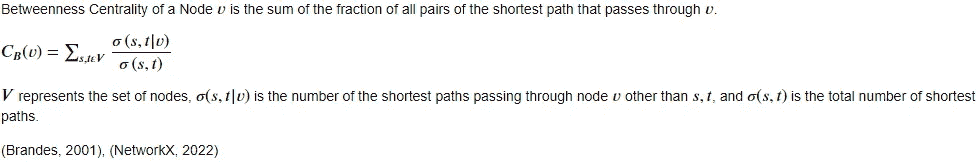

**配方二。**说明了之间中心性的计算。图片由作者使用 Jupyter 笔记本和 Latex 制作。

```
# Betweenness Centralitybetw_cen = {}
for g in graphs:
 betw_cen[g] = nx.betweenness_centrality(g)betw_cen
```

理解一个节点的最短路径序列。

```
paths= nx.all_pairs_shortest_path(graphs[0])path_5_1=nx.all_shortest_paths(graphs[0],5,1)for p in paths:

 if p[0]==5:

 print(p)
 print(“-”*50)

for p in path_5_1:

 print(p)
```

## 2.4 紧密中心性

图中任何节点(比如 v)的接近中心性可以通过在所有 n-1 个可到达的节点上找到到 v 的平均最短路径距离，然后取它的倒数来计算。

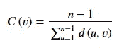

**配方三。**说明了亲密度中心性的计算。图片由作者使用 Jupyter 笔记本和 Latex 制作。

```
# Closeness Centralityclo_cen = {}for g in graphs:
 clo_cen[g] = nx.closeness_centrality(g)

clo_cen
```

我们可以使用上面定义的公式进行计算。我们选择图中的第 5 个节点进行验证。

```
s=0print(len(list_nodes))for node in list_nodes:

 if node!=5:

 shortest_path_length=nx.shortest_path_length(graphs[0],5,node)

 s+=shortest_path_length

print((len(list_nodes)-1)/s)
```

## 2.5 特征向量中心性

特征向量中心性使用其邻居的中心性来计算节点的中心性。对于节点 I，特征向量中心性是 A’X X =λX X，其中 A’被定义为具有λ特征值的图 G 的邻接矩阵。

```
# Eigen Vector Centralityeig_cen = {}for g in graphs:

 eig_cen[g] = nx.eigenvector_centrality(g)eig_cen
```

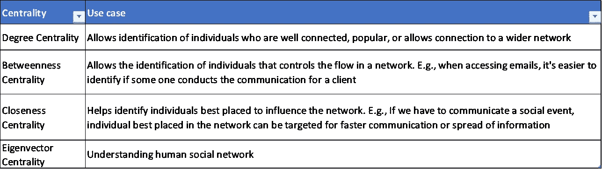

**图 5。**说明了现实世界问题中不同中心性测量的用例(迪士尼，2019)。图片由作者用 Excel 制作。

## 2.6 可视化图中的重要节点

```
# let us now sort the degree centrality measure and identify the important nodes.for ix, g in enumerate(graphs):

 temp_dict = {}

 for w in sorted(deg_cen[g], key=deg_cen[g].get, reverse=True):

 temp_dict[w] = deg_cen[g][w]

 print(“Sorted Importance of nodes in terms of deg_cen for Graph {} is {}”.format(ix+1, list(temp_dict.keys())[:5]))

 print()
```

对于图 1，根据 deg_cen，节点的排序重要性是[33，0，32，2，1]。

```
graph2 = kn
color = []fig = plt.subplots(1, figsize=(12,10))for node in graph2:
 if (node == 33 or node == 0 or node == 32 or node==2 or node==1):
 color.append(‘red’)
 else:
 color.append(‘blue’)

nx.draw_spring(graph2,node_color=color,with_labels=True)
```

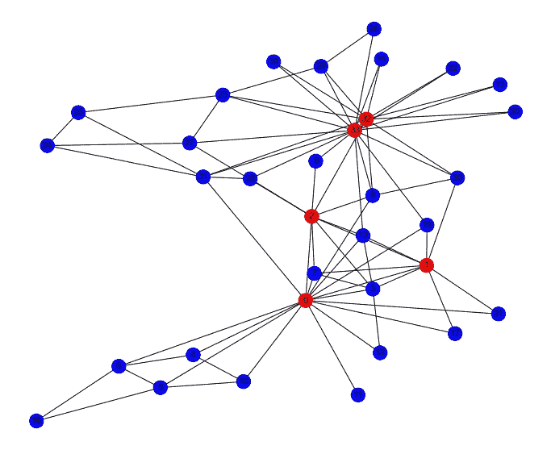

**输出 3。**用重要节点说明数据的网络表示。图片由作者使用 Jupyter 笔记本制作。

# 3.谱聚类

谱聚类算法用于根据图的连通性将图分成 K 个组。谱聚类中涉及的步骤包括:

1.  预处理:构造图的拉普拉斯矩阵。拉普拉斯矩阵是邻接矩阵和对角矩阵之间的差异。L = D — A。
2.  分解——计算拉普拉斯矩阵的特征值和特征向量，然后我们需要将每个点映射到一个更低维的表示。
3.  k 表示算法—使用上述数据创建聚类组。

## 3.1 预处理

```
G_p1=graphs[0]A=nx.adjacency_matrix(G_p1)print(“ — — — — — — — — — -ADJACENCY MATRIX — — — — — — — — — — — -”)print(A.todense())print(“-”*50)print(“ — — — — — — — — — -DIAGONAL MATRIX = DEGREE OF EACH NODE — — — — — — — — — — — -”)print(G_p1.degree)L = nx.laplacian_matrix(G_p1).astype(float)print(“-”*50)print(“ — — — — — — — — — -LAPLACIAN MATRIX — — — — — — — — — — — -”)print(L.todense())
```

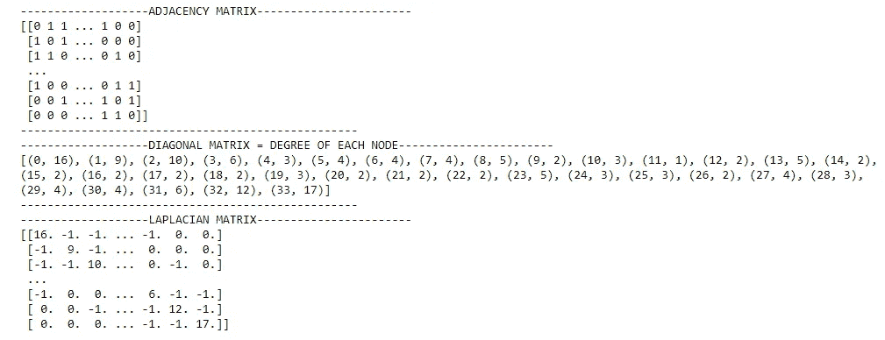

**输出 4。**说明了网络的拉普拉斯矩阵、邻接矩阵和对角矩阵。图片由作者使用 Jupyter 笔记本制作。

## 3.2 分解

```
import scipy as spw,v = sp.sparse.linalg.eigsh(L, k = 3, which=’SM’)print(w)
print(v)
```

## 3.3 K 表示聚类

请注意，我们已经创建了 3 个集群作为假设场景。然而，在现实世界的应用中，使用轮廓分数、间隙统计，甚至肘图来验证 K 的良好值是很重要的。对于图划分，更常见的度量是 F-Measure、Precision、Recall、Purity、Mutual Information 和 Normalized Mutual Information。

```
from sklearn.cluster import KMeansX = v*wkmeans = KMeans(init=’k-means++’, n_clusters=3, n_init=10)
kmeans.fit_predict(X)
centroids = kmeans.cluster_centers_
labels = kmeans.labels_
error = kmeans.inertia_fig = plt.subplots(1, figsize=(12,10))colors = ['#d7191c', '#ffffbf', '#2b83ba']
node_colors = [ colors[labels[v]] for v in G_p1.nodes()]
nx.draw(G_p1, node_color=node_colors, with_labels='True')
```


**输出 5。**用三个集群说明了数据的网络表示。图片由作者使用 Jupyter 笔记本制作。

# 4.参考

1.  布兰德斯大学(2001 年)。中间中心性的快速算法。*《数理社会学杂志》*， *25* (2)，163–177 页。[https://doi.org/10.1080/0022250x.2001.9990249](https://doi.org/10.1080/0022250x.2001.9990249)
2.  *在线创建图形并寻找最短路径或使用其他算法*。(未注明)。https://graphonline.ru/en/
3.  迪士尼，A. (2019 年 7 月 26 日)。*社交网络分析:中心性测量*。剑桥情报局。[https://Cambridge-intelligence . com/keylines-FAQ-social-network-analysis/](https://cambridge-intelligence.com/keylines-faqs-social-network-analysis/)
4.  NetworkX。(2022).*between ness _ centrality—NetworkX 2 . 7 . 1 文档*。Networkx.org。[https://networkx . org/documentation/stable/reference/algorithms/generated/networkx . algorithms . between ness _ centrality . html # networkx . algorithms . centrality . between ness _ centrality](https://networkx.org/documentation/stable/reference/algorithms/generated/networkx.algorithms.centrality.betweenness_centrality.html#networkx.algorithms.centrality.betweenness_centrality)

*关于作者:高级分析专家和管理顾问，通过对组织数据的商业、技术和数学的组合，帮助公司找到各种问题的解决方案。一个数据科学爱好者，在这里分享、学习、贡献；可以和我在* [*上联系*](https://www.linkedin.com/in/angel-das-9532bb12a/) *和* [*推特*](https://twitter.com/dasangel07_andy)*；*