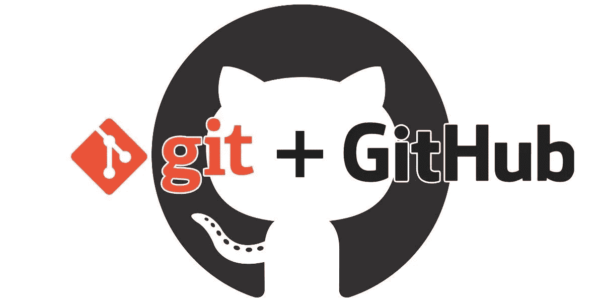
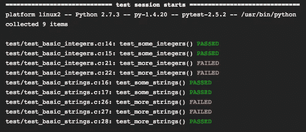

# 数据科学的软件工程工具和最佳实践

> 原文：<https://towardsdatascience.com/software-engineering-tools-and-best-practices-for-data-science-6a484fea641>

## 伟大的代码带来伟大的机器学习


由[谷仓图片](https://unsplash.com/@barnimages?utm_source=medium&utm_medium=referral)在 [Unsplash](https://unsplash.com?utm_source=medium&utm_medium=referral) 上拍摄

如果你对数据科学感兴趣，你可能对这个工作流程很熟悉:你通过启动一个 jupyter 笔记本开始一个项目，然后开始编写你的 Python 代码，运行复杂的分析，甚至训练一个模型。

随着包含所有函数、类、图表和日志的笔记本文件变得越来越大，您会发现自己面前有一大堆完整的代码。如果你幸运的话，事情会很顺利。那对你有好处！

但是，jupyter 笔记本是万恶之源。它们隐藏了一些严重的陷阱，可能会将您的编码变成人间地狱。

> ***本文讨论了 Jupyter 笔记本电脑何时以及为何会产生反效果，并介绍了一些可改善您的数据科学工作流程的软件实践。***

事不宜迟，让我们来看看🔍。

# Jupyter 笔记本的问题


由 [Kelly Sikkema](https://unsplash.com/@kellysikkema?utm_source=medium&utm_medium=referral) 在 [Unsplash](https://unsplash.com?utm_source=medium&utm_medium=referral) 上拍摄的照片

如果您想让 jupyter 原型更上一层楼，事情往往不会如您所愿。以下是我过去使用这个工具时遇到的一些情况。

希望您对此耳熟能详:

*   所有的对象(函数或类)都在一个地方定义和实例化，**可维护性变得非常困难**:即使你想对一个函数做一个小的改变，你也必须在笔记本的某个地方找到它，修复它，然后重新运行代码。你不想那样的，相信我。将逻辑和处理功能分离在外部脚本中不是很简单吗？
*   由于其交互性和即时反馈，jupyter 笔记本推动数据科学家在全局名称空间中声明变量，而不是使用函数。这在 python 开发中被认为是[糟糕的实践](https://stackoverflow.com/questions/19158339/why-are-global-variables-evil/19158418#19158418)，因为它**限制了有效的代码重用。**它还会损害再现性，因为您的笔记本变成了一个保存所有变量的大型状态机。在这种配置中，您必须记住哪个结果被缓存，哪个没有，并且您还必须期望其他用户遵循您的单元执行顺序。
*   笔记本在幕后格式化的方式(JSON 对象)使得**代码版本化变得困难。**这就是为什么我很少看到数据科学家使用 GIT 来提交笔记本的不同版本，或者为特定功能合并分支。因此，团队协作变得低效和笨拙:团队成员开始通过电子邮件或 Slack 交换代码片段和笔记本，回滚到以前的代码版本是一场噩梦，文件组织开始变得混乱。以下是我在使用 jupyter 笔记本两三周后，在没有正确版本控制的项目中常见的情况:
    **analysis . ipynb
    analysis _ COPY(1)。ipynb
    分析 _ 复制(2)。ipynb
    analysis _ FINAL . ipynb
    analysis _ FINAL _ 2 . ipynb**
*   Jupyter 笔记本有利于探索和快速原型开发:它们是 EDA 和快速特别分析的最佳工具。
    然而，它们肯定**不是为可重用性或生产用途而设计的**。如果您使用 jupyter 笔记本开发了一个数据处理管道，您最多只能说您的代码只能在您的笔记本电脑或 VM 上按照单元的执行顺序以线性同步的方式工作。这并没有说明您的代码在更复杂的环境中的行为方式，例如，更大的输入数据集、其他异步并行任务或更少的分配资源。笔记本实际上很难测试，因为它们的行为有时是不可预测的。
*   作为一个将大部分时间花在 VSCode 上，利用强大的代码扩展[林挺](https://marketplace.visualstudio.com/items?itemName=ms-python.python)、样式[格式化](https://prettier.io/)、代码结构化、自动完成和代码库搜索的人，当切换回 jupyter 时，我不禁感到有些无力。与 VSCode 相比，jupyter notebook 缺少实施编码最佳实践的扩展。

好了，伙计们，现在抨击够了。我真的很喜欢 jupyter，我认为它的设计非常棒。你肯定可以用它来启动小项目或快速原型想法。

但是为了将这些想法以工业的方式传播，你必须遵循软件工程的原则，而当数据科学家使用笔记本时，这些原则碰巧被遗忘了。

让我们一起回顾一下其中的一些，看看它们为什么重要。

# 让你的代码再次变得伟大的 8 个技巧🚀

这些技巧是从不同的项目、我参加的聚会以及与我过去共事过的软件工程师和架构师的讨论中收集来的。如果你有其他的建议和想法分享，请在评论中告诉我。

## 1 —遵循 PEP8 命名约定，使用林挺并格式化您的代码


由[弗洛里安·奥利佛](https://unsplash.com/@florianolv?utm_source=medium&utm_medium=referral)在 [Unsplash](https://unsplash.com?utm_source=medium&utm_medium=referral) 上拍摄的照片

代码质量最重要的方面之一是清晰:清晰易读的代码对于协作和可维护性至关重要。

以下可能有助于您获得更清晰的代码:

*   使用有意义的变量名,它们是描述性的和隐含的类型。例如，如果您声明一个关于属性(例如年龄)的布尔变量来检查一个人是否老，您可以通过使用 **is_old 使它既具有描述性又提供类型信息。同样的道理也适用于你声明数据的方式:让它具有解释性。**

```
**# not good ...** import pandas as pd
df = pd.read_csv(path)**# better!** transactions = pd.read_csv(path)
```

*   **避免除了你没人能理解的缩写**和没人能忍受的长变量名**。**
*   **不要硬编码【幻数】**直接编码。将它们定义在一个变量中，以便每个人都能理解它们所指的内容。

```
**# not good ...**
optimizer = SGD(0.0045, momentum=True)**# better !**
learning_rate = 0.0045
optimizer = SGD(learning_rate, momentum=True)
```

*   命名对象时遵循 PEP8 约定:例如，函数和方法名用小写，单词用下划线分隔，类名遵循 UpperCaseCamelCase 约定，常量全部大写，等等。点击了解更多关于这些习俗的信息。
*   使用缩进和空格让你的代码呼吸。有一些标准约定，比如“每个缩进使用 4 个空格”，“单独的部分应该有额外的空白行”……因为我从来不记得这些，所以我使用了一个非常好的 **VSCode 扩展，叫做** [**更漂亮的**](https://prettier.io/) **，当按 ctrl+s 时，它会自动重新格式化我的代码**

在怀疑和不确定的时刻，我总是参考这个[回购](https://github.com/zedr/clean-code-python)，它聚合了一组非常有用和实用的概念，以获得一个干净的代码。

## 2 —使您的代码模块化📁

当你开始构建你认为可以在一个或多个项目中重用的东西时，你必须将你的代码组织成逻辑函数和模块。这有助于更好地组织和维护。

例如，当你在一个 NLP 项目中工作，并且有不同的处理函数来处理文本数据(标记化、剥离 URL、词条化等。)，可以把这些单元都放在一个名为 text_processing.py 的 python 模块中，并从中导入。你的主程序会轻松很多。

以下是我学到的一些关于编写模块化代码的好技巧:

*   **干:不要重复自己。尽可能概括和巩固你的代码。**
*   **功能要做一件事**。如果一个函数做多种运算，那么泛化就变得更加困难。
*   **在函数中抽象你的逻辑，但是** **不要过度设计它:**有一点点可能性，你最终会有太多的模块。运用你的判断力，如果你没有经验，看看流行的 GitHub 库，比如 [scikit-learn](https://github.com/scikit-learn/scikit-learn) ，看看他们的编码风格。

## 3 —重构您的代码📦

重构旨在重组代码的内部结构，而不改变其功能。它通常是在一个工作的(但还没有完全组织好的)代码版本上完成的。它有助于消除重复的功能，重新组织文件结构，并增加更多的抽象。

要了解更多关于 Python 重构的知识，这篇文章是一个很好的资源。

## 4 —让您的代码高效⏱

编写执行速度快、占用内存和存储空间少的高效代码是软件开发中的另一项重要技能。

编写高效的代码需要多年的经验，但这里有一些快速的提示，可以帮助你发现你的代码是否运行缓慢，以及如何提高它:

*   在运行任何东西之前，检查算法的复杂性，以评估它的执行时间
*   通过检查每个操作的运行时间来检查脚本的可能瓶颈
*   尽可能避免 for 循环，对操作进行向量化，尤其是当你使用像 [NumPy](https://numpy.org/) 或 [pandas](https://pandas.pydata.org/) 这样的库时
*   通过使用多重处理来利用计算机的 CPU 内核

## 5 —使用 GIT 或任何其他版本控制系统🔨

以我个人的经验，使用 GIT + Github 帮助我提高了编码技能，更好地组织了我的项目。因为我在与朋友和/或同事合作时使用它，它让我坚持我过去不遵守的标准。



图片由作者修改

使用版本控制系统有很多好处，无论是在数据科学还是软件开发方面。

*   跟踪您的更改
*   回滚到代码的任何先前版本
*   团队成员之间通过合并和拉取请求进行高效协作
*   代码质量的提高
*   代码审查
*   向团队成员分配任务并监控他们的进度

Github 或 Gitlab 等平台甚至更进一步，提供了持续集成和持续交付挂钩，以自动构建和部署您的项目。

如果你是 Git 新手，我推荐你看看这个[教程](https://nvie.com/posts/a-successful-git-branching-model/)。
或者你可以看看这个备忘单:


图片由作者修改

如果你想具体了解机器学习模型如何版本化，可以看看这篇[文章](https://algorithmia.com/blog/how-to-version-control-your-production-machine-learning-models)。

## 6 —测试您的代码📐

如果您正在构建一个执行一系列操作的数据管道，确保它按照设计目的执行的一种方法是编写检查预期行为的**测试**。

测试可以简单到检查输出形状或函数返回的预期值。



作者图片

为您的函数和模块编写测试有很多好处:

*   它提高了代码的稳定性，使错误更容易被发现
*   它防止意外输出
*   它有助于检测边缘情况
*   它防止将损坏的代码推向生产

## 7-使用🗞测井

一旦代码的第一个版本运行，您肯定希望在每一步都监控它，以了解发生了什么，跟踪进度，或者发现错误的行为。这里是您可以使用日志记录的地方。

以下是一些有效使用日志记录的技巧:

*   根据您想要记录的消息的性质，使用不同的级别(调试、信息、警告)
*   在日志中提供有用的信息，以帮助解决相关问题。

```
**import** **logging**
logging.basicConfig(filename='example.log',level=logging.DEBUG)
logging.debug('This message should go to the log file')
logging.info('So should this')
logging.warning('And this, too')
```

## 8 —使用可靠的原则。

如果您想编写更好的代码，并以可维护性、可读性和可扩展性为目标，请考虑 Robert C. Martin 的《坚实的原则》。

*   单一责任:每个软件组件(一个类，一个方法，一个函数)应该只有一个责任。
*   开闭原则。每个实体都应该对扩展开放，对修改关闭。这意味着添加新功能不会改变现有代码。
*   Liskov 替换:你需要能够用子类替换每个类。这意味着子类的接口应该以与基类相同的方式运行。
*   接口分离:每个对象都应该有一个接口(=一组方法)，在内聚性方面尽可能小。它应该做一件事。
*   依赖倒置:与另一个类交互的类不应该知道它的内部工作方式。例如，如果您使用数据库，请不要在代码中使用原始查询。你需要将它们隐藏在抽象背后。

# 参考

*   https://github . com/A2Amir/Software-Engineering-Practices-in-Data-Science。
*   [https://towards data science . com/5-reasons-why-jupyter-notebooks-suck-4d c201 e 27086](/5-reasons-why-jupyter-notebooks-suck-4dc201e27086)
*   [https://medium . com/@ _ orca man/jupyter-notebook-is-the-cancer-of-ml-engineering-70b 98685 ee71](https://medium.com/@_orcaman/jupyter-notebook-is-the-cancer-of-ml-engineering-70b98685ee71)
*   [https://data pastry . com/blog/why-I-dont-use-jupyter-notebooks-and-you-should not-than/](https://datapastry.com/blog/why-i-dont-use-jupyter-notebooks-and-you-shouldnt-either/)
*   [https://visual git . readthe docs . io/en/latest/pages/naming _ conventi on . html](https://visualgit.readthedocs.io/en/latest/pages/naming_convention.html)
*   [https://towards data science . com/unit-testing-for-data-scientists-DC 5 E0 CD 397 FB](/unit-testing-for-data-scientists-dc5e0cd397fb)

# 结论

数据科学家通过制作不与公司系统和基础设施进行任何通信的报告和 jupyter 笔记本找到出路的日子已经一去不复返了。
如今，数据科学家开始开发可测试和可运行的代码，与 IT 系统无缝集成。**因此，遵循软件工程最佳实践成为必须。我希望这篇文章能让你对这些最佳实践有一个大致的了解。**

感谢阅读！

# 新到中？您可以每月订阅 5 美元，并解锁各种主题的无限文章(技术、设计、创业……)您可以通过点击我的推荐链接[来支持我](https://ahmedbesbes.medium.com/membership)

<https://ahmedbesbes.medium.com/membership>  

由[卡斯滕·怀恩格特](https://unsplash.com/@karsten116?utm_source=medium&utm_medium=referral)在 [Unsplash](https://unsplash.com?utm_source=medium&utm_medium=referral) 上拍摄的照片