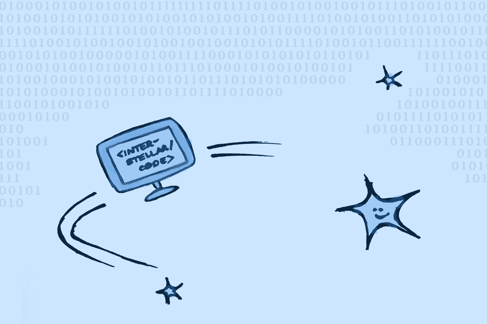
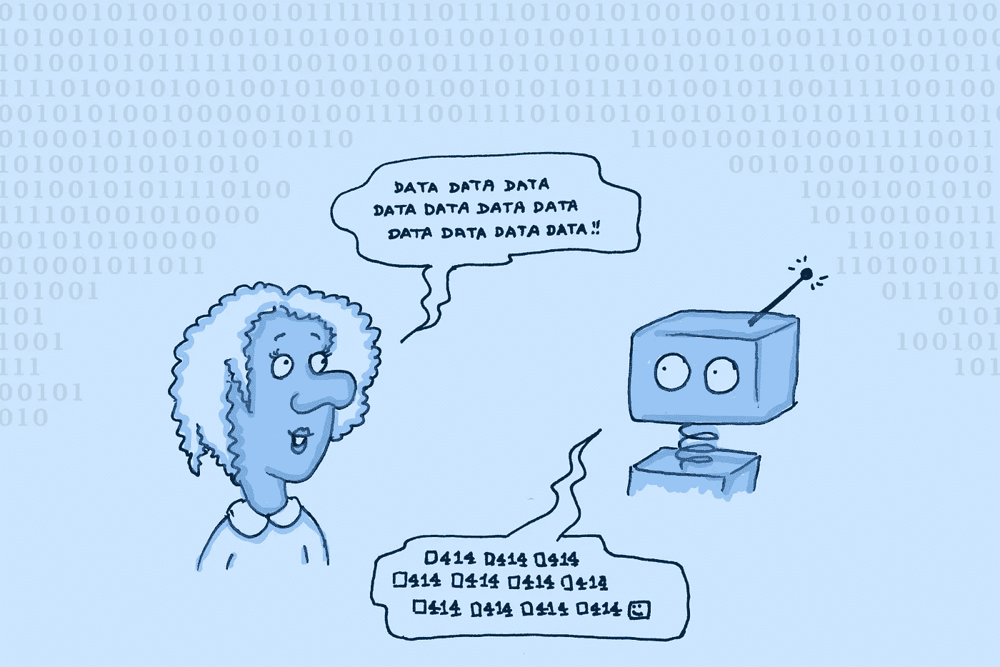
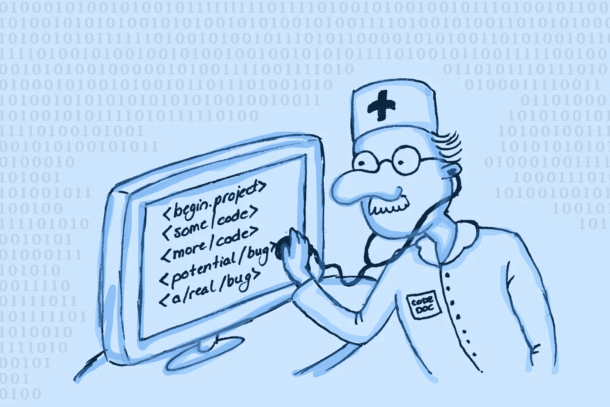
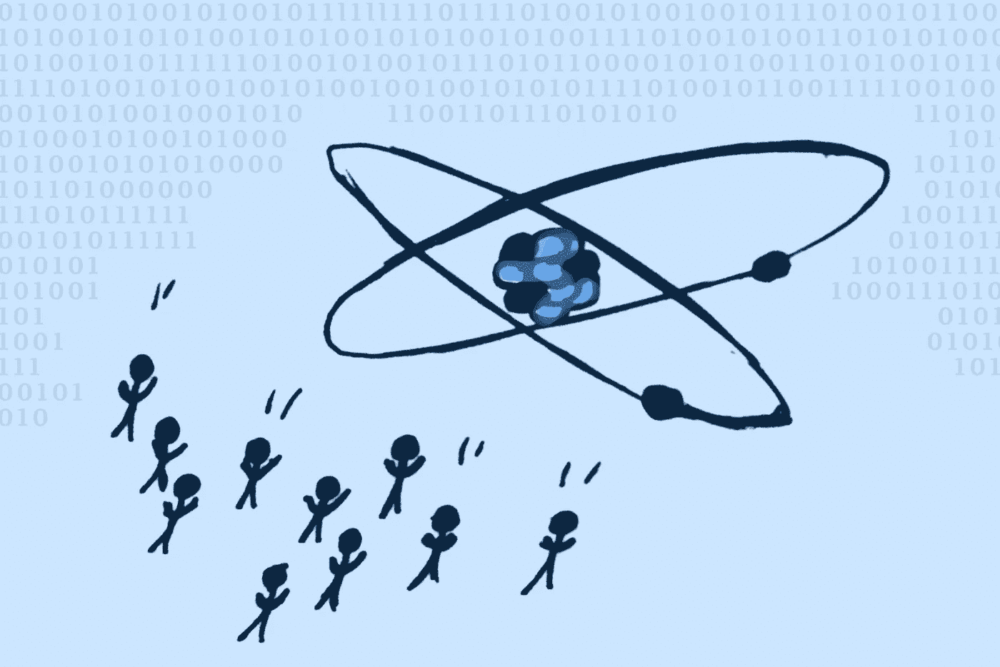

# 软件！在！太空！

> 原文：<https://towardsdatascience.com/software-in-space-23a6c5aa0521>

## 当人们想到太空探索时，他们往往会想到直冲云霄的火箭。但是成功的任务不仅仅是宇宙飞船。

是的，太空中已经有软件了！作者图片

当我们想到太空探索时，我们往往会想到宇航员、火箭或国际空间站。也许我们还会想到坐在中国[或美国](https://www.bbc.com/news/science-environment-57122914)[航天局办公室里的一组专家，当他们成功地在火星上着陆时，爆发出阵阵喜悦。](https://mars.nasa.gov/msl/mission/team/)

我们往往会忽略那些编写软件的人，这些软件让卫星在轨道上运行，让火箭在轨道上运行。许多人在火箭发射前筛选来自卫星传感器的数据或模拟火箭发射。他们也在做火箭科学。但是这样想就不那么直观了。

我们在媒体上看到的许多图像显示，专家团队在庆祝自己，或者酷的漫游者和火箭在外层空间巡航。它们满足了我们人类的好奇心和我们对跨越新的边界和扩展我们视野的永恒渴望。同时，这些类型的故事让事情变得足够简单。任何人都可以意识到人类已经在火星上登陆了一些漫游者。另一方面，需要大量的专业知识来了解火星车是如何建造的，驾驶它需要什么，以及哪些技术使它适合火星上的生活。

许多人想了解太空。他们想知道它看起来像什么，以及人类正在做什么来探索它。但是如果没有详细的知识，很难理解太空技术到底是如何工作的。

这就是成为一名软件工程师的好处。即使你不太了解物理，或者火箭材料，编码人员也能理解太空中使用了什么类型的软件技术，以及为什么。

虽然美国宇航局公开了很多代码，但很难找到空间技术软件工程师日常活动的细节。不过，埃隆·马斯克的项目中也有一些故事。考虑到在 SpaceX 或 Starlink 工作是许多工程师的梦想，这些将是我在这里的重点。

 [## 艾是来找你工作的吗？

towardsdatascience.com](/is-ai-coming-for-your-job-2f593ab72b55) 

# Starlink，卫星计算自己的路线

早在 1945 年，当科幻作家亚瑟·C·克拉克第一次提出卫星电视时，这听起来像是一个白日梦。尽管花了三十年，这项技术最终[成为现实](https://study.com/academy/lesson/satellite-television-definition-history.html)。现在，许多人在他们的屋顶上有卫星接收器，并且认为它没什么。卫星相对于有线电视的主要优势是它们可以到达农村地区，这对于很长的有线电视来说是不划算的。

同样，卫星互联网对许多人来说听起来仍然像是白日梦。但是需求是存在的:[四分之一的美国农村人认为他们缺乏高速互联网接入是一个主要问题。断断续续的互联网接入也是火车、飞机和轮船等移动物体的一个问题。任何试图在旅行中使用 WiFi 的人都可以证明这一点。](https://www.pewresearch.org/fact-tank/2018/09/10/about-a-quarter-of-rural-americans-say-access-to-high-speed-internet-is-a-major-problem/)

然而，这些问题可能很快就会得到解决。Starlink 是私营部门火箭先锋 SpaceX 的一个分支，正在为更广泛的互联网接入奠定基础。Starlink 互联网于 2015 年首次发布，如今已经在美国许多地方推出。

为了确保互联网不会太慢，卫星需要离地球非常近。因此，它们每次只能在头顶上停留几分钟。因此，与它们通信的地面天线需要经常改变与哪个卫星通信。并且卫星网络需要足够密集，以便在任何给定时刻为天线提供信号。

该网络由数百颗卫星组成；新的不断被添加，旧的不断被替换。因此，Starlink 软件负责人 Andy Bohn [说](https://stackoverflow.blog/2021/05/11/building-a-space-based-isp/)团队没有时间将每颗卫星送入自己指定的轨道。相反，每颗 Starlink 卫星都自己导航。为了管理繁忙的交通状况，地球端的网络给每颗卫星一个位置，卫星把自己控制在它的位置上。

这个过程需要巨大的计算量。首先，卫星不仅有相互碰撞的风险。它们也可能与低轨道上的飞机和其他卫星相撞。Starlink 卫星已经参与了[一半的太空中的近碰撞](https://www.space.com/spacex-starlink-satellite-collision-alerts-on-the-rise)，其中两个物体彼此之间的距离小于 1 公里(0.6 英里)，所以这种风险是真实存在的。

卫星需要处理大量数据。作者图片

第二，干扰的可能性导致大量的计算需求。当两颗卫星的信号重叠时，它们可能会失真，甚至相互抵消。为了避免干扰，需要将信号放入稍微不同的频段。但这并不像听起来那么简单，而且可能的频段数量有限。因此，波段过于相似的两颗卫星不能靠得太近。这一要求使卫星导航更加复杂。

你可能想知道为什么卫星的位置需要在地球上计算，而不是直接在卫星上计算。首先，如果卫星内部出了问题，去那里修理就困难多了。此外，在外层空间，事情比在地球上更容易出错。因为地球大气层外的太阳辐射强得多，[比特更容易翻转](https://www.businessinsider.fr/us/cosmic-rays-harm-computers-smartphones-2019-7)。比特是所有计算机的 0 或 1 编码单位，当它们翻转它们的值时，会破坏整个软件程序。为了防止这种情况扰乱卫星的轨道，不同的机器共享软件，如果软件损坏，可以重新加载正确的副本。

Starlink 的软件是用众所周知的编程语言编写的。由于其可靠性和裸机编程能力，Starlink 在其卫星中使用 C++编写大部分代码。该公司还使用 Python 进行一些原型开发，因为它通常内置起来更快。这反映了开发者在[自动驾驶汽车技术](https://medium.com/@olley_io/what-software-do-autonomous-vehicle-engineers-use-part-1-2-275631071199)中的应用。

卫星互联网是一个非常雄心勃勃的项目，它伴随着许多困难的挑战。Starlink 无疑是这一领域的先驱，但其他公司和太空机构也在迅速跟进。一二十年后，它可能会像今天的卫星电视一样成为标准。

 [## 产品设计师和开发人员发生冲突，这很糟糕

### 不过，还是有解决办法的，而且这个市场正在增长

uxdesign.cc](https://uxdesign.cc/product-designers-are-clashing-with-developers-and-its-ugly-59e9875d9866) 

# SpaceX，还是努力不失败

同样雄心勃勃的是 SpaceX，Starlink 是它的一个分支。向外太空发射火箭、[与国际空间站](https://www.nasa.gov/press-release/nasa-s-spacex-crew-2-astronauts-headed-to-international-space-station/)对接，或者[瞄准火星](https://www.cnbc.com/2021/04/23/elon-musk-aiming-for-mars-so-humanity-is-not-a-single-planet-species.html)都需要近乎完美的硬件和软件工程。[测试当然可能会失败](https://phys.org/news/2021-03-spacex-starship-rocket-failure-musk.html)。但在最后的任务中，不允许出现任何差错。如果火箭系统的一部分不能正常工作，所有其他部分都需要补偿这一故障。

SpaceX 火箭的所有飞行软件都是围绕控制周期构建的[。首先，读取所有输入，例如来自传感器的数据或来自地面的命令。然后，这些数据得到处理，重要的事情得到计算，如火箭的位置或生命支持系统的状态。然后程序进入睡眠状态几分之一秒，以节省计算能力，之后整个循环再次开始。](https://stackoverflow.blog/2021/05/10/dont-push-that-button-exploring-the-software-that-flies-spacex-starships/)

不同的子系统控制火箭的不同部分。为了防止大的灾难，这些需要彼此隔离。例如，如果驾驶飞机的导航系统出了问题，生命支持系统也不需要陷入混乱。如果有一件事出了差错，演出必须继续进行。

这种设置与许多其他科技公司的运营方式不同。以谷歌为例。他们[记录每一次失败](https://www.inc.com/justin-bariso/meet-postmortem-googles-brilliant-process-tool-for-learning-from-failure.html)，选择那些看起来最重要的，并试图从中为未来吸取教训。换句话说，谷歌让失败发生，并试图从失败中吸取教训。

对于谷歌来说，这种方法非常有效。但是搜索引擎(以及翻译器、文档编辑器、云服务提供商等等)的操作与火箭略有不同。如果谷歌的一个进程失败了，也许一个搜索查询会返回可怕的结果。然而，如果载人火箭转向错误的方向，人类的生命将处于危险之中。

由于所解决问题的高风险性质，SpaceX 尽最大努力避免失败。虽然该公司的工程师确实接受火箭测试失败，但在这些情况下，他们几乎是故意让项目失败，以便为未来学习。然而，当火箭开始真正的任务时，一切都需要工作。这意味着即使火箭的一部分发生故障，它也必须保持完整。

虫子永远不会让太空任务失败。作者图片

# 测试、测试和测试代码

火箭软件需要尽可能的可靠。因此，毫不奇怪，美国国家航空航天局(NASA)和 T2 太空探索技术公司(SpaceX)的质量要求很高，尤其是与常规商业应用相比。精心设计的系统已经到位，以确保没有人通过将错误的东西与主分支合并来破坏代码。也就是说，SpaceX 的测试相关工具在软件开发领域都是前所未闻的。

在开发人员可以发出拉请求之前，他们需要满足一组详细的标准。在合并之前，代码要经过两次测试，在实际合并之后还要再测试一次。

SpaceX 的[持续集成环境](https://stackoverflow.blog/2021/05/11/testing-software-so-its-reliable-enough-for-space/)很大程度上基于 HTCondor，其元数据用 PostgreSQL 管理。此外，该公司使用 Python 进行后端测试运行，构建流程编排和 web 服务。对于这些 web 服务的前端，它使用 Angular，JavaScript 和一些 TypeScript。在集装箱化方面，SpaceX 使用 Dockers，以及一点点 Kubernetes。

因此，工具和语言的选择与你在陆地公司的期望非常相似。然而，满足质量要求和合并要严格得多。

# 构建帮助建造火箭和卫星的软件

除了部署在火箭和卫星内部和周围的软件，航天项目还涉及应用软件。这种类型有助于将火箭带到发射台，并准备发射，涉及供应链、制造、金融、库存等领域。

随着许多行业的趋势，SpaceX 的应用软件[已经从单一架构转向微服务，具体来说就是从 AngularJS、C#和 MySQL 转向 Angular、PostgreSQL 和容器化。其优势在很大程度上与 SpaceX 的所有其他系统相同:如果一个部件损坏或等待维修，这种延迟不会对其他部件产生太大影响。](https://stackoverflow.blog/2021/05/13/building-the-software-that-helps-build-spacex/)

SpaceX 的应用软件部门与其他公司的同类部门不同之处在于，他们有四个非常不同的项目需要支持:向外太空运送货物的猎鹰、专注于载人航天的龙、专注于星际运输的 Starship 和卫星互联网的 Starlink。这个项目范围甚至使它与美国国家航空航天局有所不同。

与其他领域一样，太空技术公司使用的工具和遵循的趋势与其他公司基本相同，但项目的范围和种类比大多数地面公司要多得多。

换句话说，如果你是一名经验丰富的软件开发人员，并且正在考虑在 NASA、SpaceX 或 Starlink 工作，那么你不需要学习更多的工具和框架。但是你应该为更多样的任务、更高的质量要求和更紧张的工作做好准备。

我们应该大肆宣传太空飞行吗？作者图片

# 太空软件也让地球人受益

当我们甚至不能正确处理我们在地球上的问题时，我们有理由问为什么要探索外层空间。在持续的疫情，种族和社会不平等，洪水和野火，加上所有生活中的小问题，难道我们不应该把目光从天空移开一分钟吗？

不。这是真的，每一次火箭发射都燃烧了[数量惊人的燃料](https://www.theguardian.com/science/2021/jul/19/billionaires-space-tourism-environment-emissions)。没错，每一个在星际飞船上工作的软件开发人员都不是在开发一个打败疫情的应用程序，或是为贫困社区开发一个支付处理器。诚然，投资于外层空间的每一美元并没有投资于公平的住房、更好的教育或保护野生动物。

那些火箭发射、工人和美元以其他方式回来。[例如，美国国家航空航天局的开源软件](https://www.nasa.gov/press-release/nasa-software-benefits-earth-available-for-business-public-use)可以帮助减少飞机排放，计算太阳能系统的大小和功率需求，或者优化风力涡轮机的效率。因此，通过为外层空间编写代码，一些开发人员可能只是在为其他领域变得更加绿色做出贡献。

此外，私营公司在太空中的崛起并不一定是件坏事。如果一小群富人因为把自己发射到月球或更远的地方而损失了一部分钱，那就这样吧。

通过制定明智的法规，我们确实需要确保这些人不会殖民太空和重复历史。[这些法规的存在](https://www.unoosa.org/oosa/en/ourwork/spacelaw/treaties.html)确保没有一个国家将太空称为自己的领土，每个国家都可以自由探索太空，不允许任何实体对太空或环境造成损害，等等。只要我们确保这些规则得到尊重，我们就不会拿不太富裕的人的未来冒险，我们不会浪费税收，我们可以获得开源代码的好处，我们可以满足人类对新领域的好奇心。听起来对我来说是三赢三赢。

*本文原载于* [*内置于*](https://builtin.com/software-engineering-perspectives/software-space) *。*

*成为* [*中等会员*](https://arijoury.medium.com/membership) *对我的内容拥有完全访问权限。*