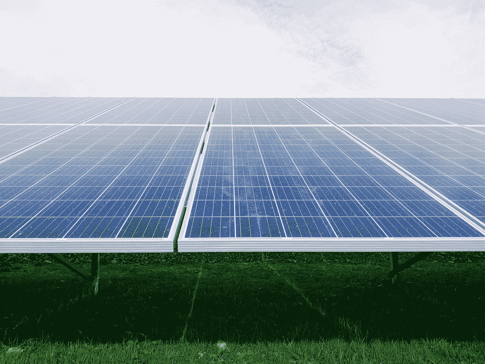
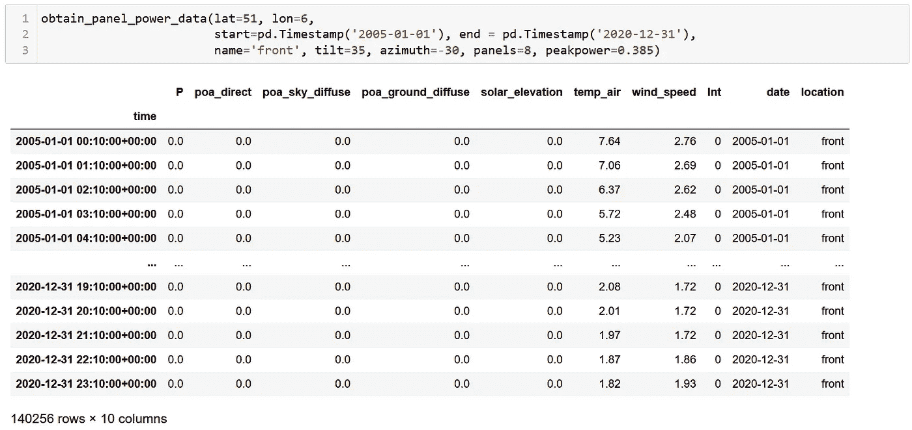
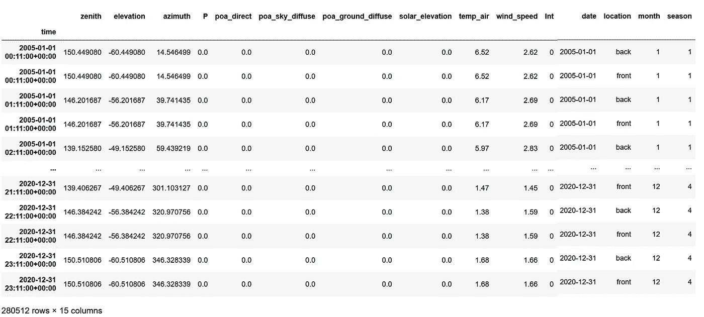
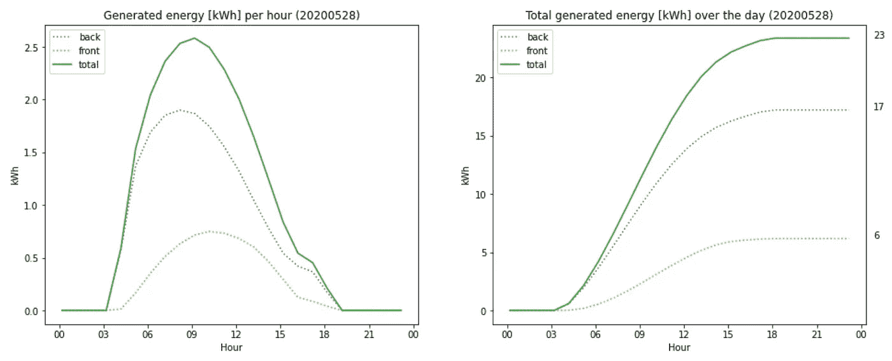
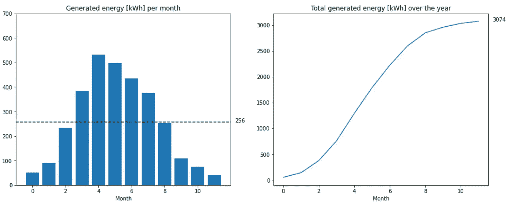
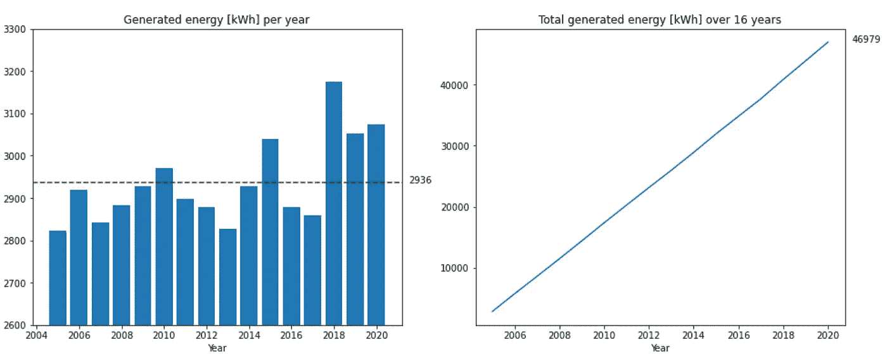
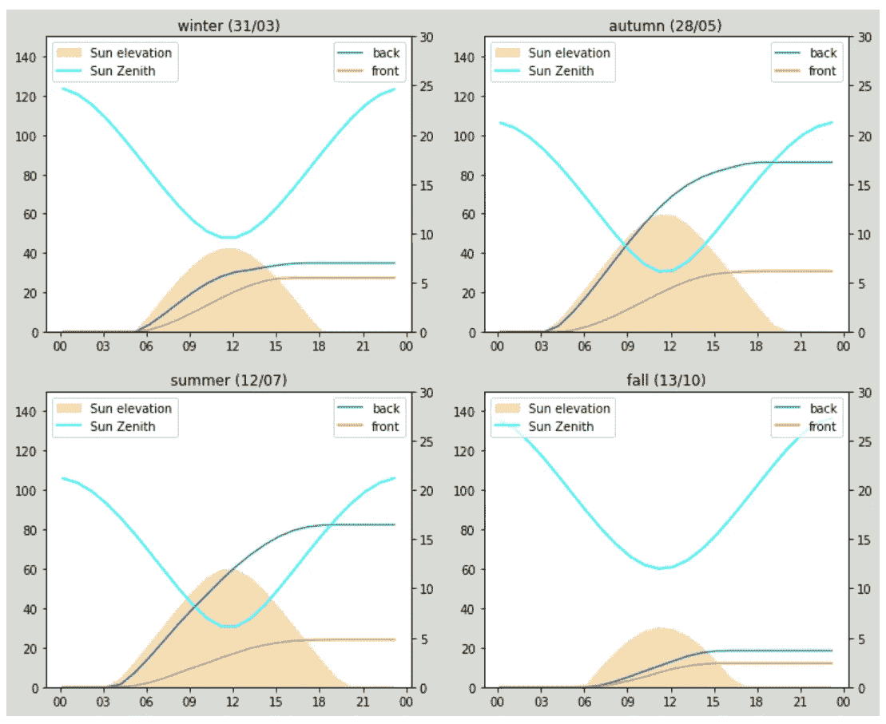

# 太阳能电池板发电分析

> 原文：<https://towardsdatascience.com/solar-panel-power-generation-analysis-7011cc078900>

## 你的太阳能电池板能产生多少能量？做出你自己的计算来保持控制



玛丽安娜·普罗恩萨在 [Unsplash](https://unsplash.com?utm_source=medium&utm_medium=referral) 上的照片

在过去的几个月里，我一直在选择一家供应商为我的房子安装太阳能电池板。我注意到的是，所有供应商都使用他们自己的计算方法，而我的房子没有默认朝向，这让他们很难接受。我的处境很不幸，大部分太阳能电池板需要安装在垂直的墙上，而不是屋顶上。

因此，为了比较不同供应商的发电量，并对倾斜 90 度的电池板进行良好的计算，我开始自己进行计算。为此，我创建了一个计算方法，您可以为几个具有各自特征的配线架位置输入自己的配置。这些位置的结果将被合并。例如，不同的位置可以是你房子的前后屋顶。

## 获取太阳辐射信息

我开始做自己的太阳路径计算，但在 [github](https://github.com/pvlib/pvlib-python) 找到了优秀的 pvlib 包。它帮我解决了大部分问题，拯救了我的一天。

pvlib 包用于确定太阳辐射量和太阳能电池板的发电量。在我的案例中，它使用了欧洲委员会提供的 2005 年到 2020 年的太阳辐射数据。使用真实生活数据，而不是一直有阳光照射的一些最佳情况。

以下代码获取一组面板的数据:

获取太阳能电池板电网的太阳辐射和发电

这种方法采用位置(纬度、经度)和面板配置来获取辐射和功率数据。面板配置包括面板数量、方位角、倾斜角和峰值功率。else 语句和以下代码需要能够指定零个面板。当未指定面板时，库无法处理“0”的峰值功率。对于不同布局选项的比较，指定零可能是有用的。所使用的数据源包含 2005 年至 2020 年的数据。

一个请求产生一个数据帧:



获取 _ 面板 _ 功率 _ 数据的结果(图片由作者提供)

该数据框包含 2005 年 1 月 1 日到 2020 年 12 月 31 日之间每天每小时的太阳辐射和发电量。

请注意，方位角“0”是指南方，而不是北方。正方位是东方，负方位是西方。

## 面板位置

并非所有面板都可以放置在同一个屋顶上，因此我们希望能够指定几个位置的配置(例如，屋顶、棚子上、地面上、墙上等)。这种配置如下:

```
[{'name': 'front', 'tilt': 35, 'azimuth': 30, 'nopanels': 2, 'power': 0.385},
 {'name': 'back', 'tilt': 35, 'azimuth': 150, 'nopanels': 8, 'power': 0.385}]
```

可以指定每个部分的方位角(南= 0°)、倾斜度、面板数量和每个面板的峰值功率。如果使用不同的面板，则需要最后一个。

围绕`obtain_power_panel_data`方法构建了一个包装器，它接受配置并获取每个屋顶/部分的数据。

此方法接受包含面板位置的字典，并返回包含所有面板的太阳能数据的数据框。它还获得太阳位置(第 27-30 行)并将其添加到太阳辐射信息中。为了方便起见，增加了月份和季节栏。

一个示例用法是:

这指定了位置名称“front ”,两个面板在屋顶上以 35 度角向西南方向看。第二个位置朝向西北方向，包含 8 个相同角度为 35 度的面板。使用相同的太阳能电池板，峰值性能为 0.385 kW。

可以用一行代码创建字典，但是数组是为了可读性。生成的数据帧为:



综合太阳数据(作者截图)

这是我们评估所需的完整数据集；对于每组太阳能电池板，每天的每个小时都有太阳辐射和产生的电力可用。每个记录还包含太阳在天空中的位置。我们现在准备评估太阳能电池板的性能。

## 一天中的表现

首先，我们将评估一天的表现。为此，我们首先在数据集中搜索辐射最高的一天。然后我们画出这一天的发电量。每个屋顶和总发电量。

首先，我们搜索产量最高的一天。在这种情况下是 2020 年(第 35 行)。过滤今年的数据集(第 2 行)，然后计算每天的发电量总和(列“P”)(第 3 行)，返回一个数据框，其中日期为索引，发电量为列。用`idxmax` (第 4 行)找到最大值后，相应的日期以字符串形式返回，格式为 2020–05–28 第 5 行)。

这个日期和完整的数据帧被提供给`plot_a_day`方法，该方法产生:



一天的发电量(图片由作者提供)

在过滤给定日期的数据(第 7 行)后，生成了两个图。左图显示了一天内每单位时间的发电量，右图显示了一天内的累计发电量。单独的面板位置用虚线标出，所有面板的总数用实线标出。

第 9 行为图形创建了两个轴。第 10 行遍历所有面板位置。第 11 行过滤当前位置的数据，并在左图中用虚线绘制每小时的数据(`day_data[day_data.location == name][‘P’]`)。第 12 行绘制了右侧图中的累积数据(`…[‘P’].cumsum()`)。第 13 行和第 14 行将每日总数添加到图表的右侧。第 16 行到第 19 行做了同样的事情，但是是针对所有位置的合计。最后，第 21 到 31 行格式化轴、图表并添加适当的标签。

## 过去几个月的业绩

下一步是查看一年中几个月的表现:

这将生成每月发电量和全年累计发电量的概览:



一年的发电量(图片由作者提供)

代码遵循的结构与一天的图表大致相同，但过滤是在一年的水平上完成的，而汇总是在几个月内完成的。

此外，第 8 行计算每月的平均值，第 9 行将该值绘制为水平虚线，第 10 行在该行旁边绘制平均值。

## 多年来的业绩

数据框包含 2005 年至 2020 年的数据。这意味着我们可以计算多年来的性能(不考虑性能下降)。这模拟了太阳能电池板在此期间已经就位的情况:

导致:



历年表现(图片由作者提供)

同样，该方法从汇总数据开始，但现在是每年一次。然后(第 5-7 行)画出每月发电量和累计总和。添加每月的平均值(第 13-14 行),最后格式化图表。

正如我们在这张图表中看到的，每年的业绩远非稳定。在本例中，每年的发电量在 2800 千瓦时和 3200 千瓦时之间波动，具体取决于每年的天气情况。

## 奖励:季节性表现

有了太阳能电池板，你一年的总发电量就差不多了。但是在这一年中，会有一些惊人的结果，这取决于你的地理位置。太阳的路径在一年中是不同的，这会影响太阳能电池板的效率。当我们选取本文中的面板位置并绘制每个季节中的一天(发电量最高的一天)时，可以看到一些显著的结果:



季节性表演(图片由作者提供)

该图显示了一天中的太阳位置、太阳的高度以及每个电池板位置的发电量。在秋季和夏季，面板“背面”比面板“正面”表现更好(3 倍)。但在冬季和秋季，差异很小(约 1.2 倍)。“前”面板的性能在一年中相对稳定，除了秋季。

绘制这些图表有点复杂:

`plot_seasons` 方法过滤请求年份的数据(第 22 行)并确定最大发电功率(第 23-24 行)，四舍五入到十位，这将用于为所有图表提供相同的 y 轴限值。接下来，为这四个图创建一个网格(第 26–27 行)。

对于每个季节，发电量最高的一天由`get_best_day_of_season` 确定，这一天绘制在四个网格区域之一。

`plot_day_extended`方法将轴分为左轴和右轴，并在左轴(第 9-10 行)绘制太阳高度和天顶，在右轴(第 11-12 行)绘制面板性能。第 13–19 行完成了图形的格式化。

## 结论

pvlib 库简化了太阳能电池板性能的计算。这使得比较不同承包商的报价更加容易。他们的报价都使用不同的方法来计算有效性，与上述代码，他们可以比较等效。

财务影响的计算不在此比较范围内，因为这高度依赖于经济环境和低点。比较产生的功率更透明。

完整的笔记本可以在 [github](https://github.com/lmeulen/SolarPower) 上找到。作为额外的奖励，它包含将地址地理编码为经度坐标的代码，以简化使用。可以在倒数第三个单元格中指定地址和面板位置。尽情享受吧！

**遗言**

我希望你喜欢这篇文章。要获得更多灵感，请查看我的其他文章:

*   [对 CSV 文件中的列执行功能](https://towardsdev.com/perform-a-function-on-columns-in-a-csv-file-a889ef02ca03)
*   [根据你的活动跟踪器的日志创建热图](/create-a-heatmap-from-the-logs-of-your-activity-tracker-c9fc7ace1657)
*   [用 Python 删除文本中的个人信息](/remove-personal-information-from-text-with-python-232cb69cf074)
*   [使用 Python 的并行 web 请求](/parallel-web-requests-in-python-4d30cc7b8989)
*   [所有公共交通工具都通向乌得勒支，而不是罗马](/all-public-transport-leads-to-utrecht-not-rome-bb9674600e81)

如果你喜欢这个故事，请点击关注按钮！

*免责声明:本文包含的观点和看法仅归作者所有。*