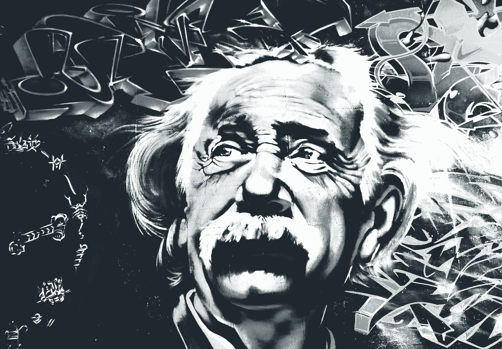
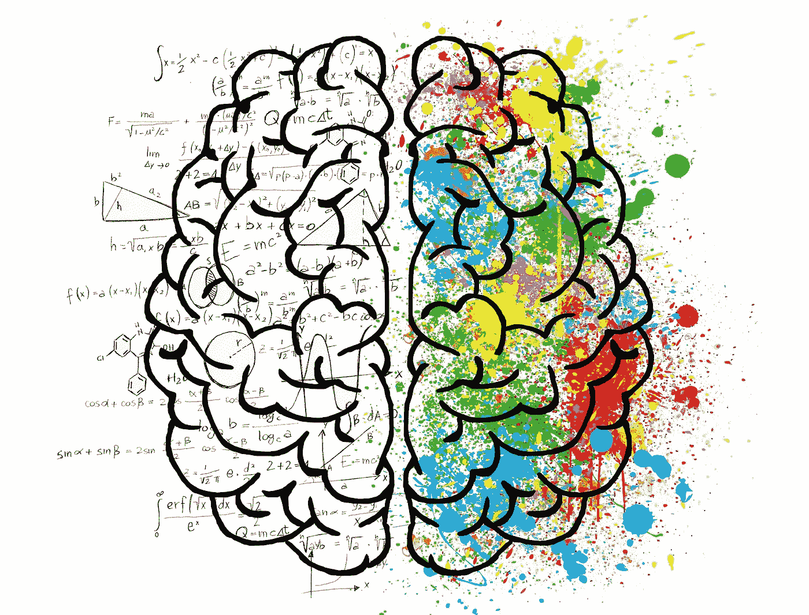

# 像物理学家一样解决问题

> 原文：<https://towardsdatascience.com/solve-problems-like-a-physicist-c42b795161c0>

## 适用于数据科学和许多其他领域的分步指南

解决问题的能力和数据技能是 21 世纪的超级力量。在这篇文章中，我描述了我解决问题的科学方法，重点是与数据相关的问题。

图片由 BarbaraALane ( [Pixabay](https://pixabay.com/de/photos/einstein-albert-einstein-streetart-2197302/) )提供。

我是一名物理学家，但我[离开了学术界](https://thomas-baumgartner.medium.com/you-got-your-university-degree-now-what-e6d538c7c385)，现在在数据领域工作。我做的一些事情通常被归因于“数据科学家”的角色，但我对这个被深深误解的术语有一点问题——因为许多自称的数据科学家完全缺乏科学部分。此外，我认为在各种数据工作角色(数据科学家/分析师/工程师等)之间划分界限会适得其反。)—毕竟，这些是强烈相互依赖的。这就是为什么我更喜欢把“面向数据的工作”作为所有需要良好数据技能的紧密交织的角色的总称。

我发现，我在学习期间和作为实验物理学博士后研究员的工作中所学到的东西，对以数据为导向的工作非常有帮助。这是因为物理学就是解决问题的。当然，物理学中有很多东西你可能不需要，比如一堆自然常数和广义相对论方程。但是如果没有解决问题的能力，所有这些东西都是毫无用处的。

但是什么是解决问题的能力呢？任何能力都包括知识和经验。你必须学习你需要的东西(比如编码和[统计](/stats-gist-list-an-irreverent-statisticians-guide-to-jargon-be8173df090d))，你必须实际解决问题来积累经验。但是除此之外，拥有一个你可以应用的结构化的方法是很有帮助的。要遵守的准则。科学的方法。

我想了很多我自己解决问题的过程，我决定为你把它分成六个步骤。顺便说一下，这些在大学里都没有明确地教给我。以上是我根据多年的学习和经验总结出来的想法。这是你像物理学家一样解决问题的方法。

警告:解决复杂的问题需要大量的大脑活动。图片由 ElisaRiva ( [Pixabay](https://pixabay.com/de/illustrations/gehirn-geist-psychologie-idee-2062057/) )提供。

# 1.明确目标

虽然看起来很明显，但这第一步是许多解决问题的尝试失败的地方。假设我向你提出了一个问题:气候变化。现在安全了吗？当然不是。我要你想出减轻温室效应的策略吗？或者我想让你预测一下，如果排放量保持在目前的水平，气候会如何变化。或者我可能对气候变化如何影响全球经济感兴趣。

如果你不知道别人对你的期望是什么，你就不可能表现得很好。这就是为什么你解决问题的第一步是明确目标。问这两个问题:

我应该回答哪些问题？

这些问题应该尽可能精确，以避免误解。你的作业可能不会以问题的形式呈现给你(例如，“为这个项目建立一个数据库。”)，但是您可以通过提问来查看它(例如，“什么数据库架构最适合我们？”).

*2)我在为谁准备结果？*

这很重要，因为你应该始终考虑你的观众的背景和期望。向有全新背景的人解释复杂的分析与向营销人员展示相同的数据是非常不同的。

别忘了提问来明确你的目标。图片由 terimakasih0 ( [Pixabay](https://pixabay.com/de/photos/fragen-unterzeichnen-design-kreativ-2341784/) )提供。

# 2.检查您的数据

一旦你知道你想发现什么，下一步就是问自己做一个清单:

我有哪些数据？

也许更重要的是，我没有什么数据？

你知道这些问题的正确答案是没有答案吗？比如，“爱丽丝比鲍勃大两岁。查理比黛西小 1 岁，黛西比爱丽丝大 3 岁。鲍勃多大了？”要回答这个问题，你需要知道他们中至少一个人的年龄。

如果你运气不好，你应该解决的问题可能就是这样，只是更复杂，使它的不可解决性不那么明显。这就是为什么你必须经常检查你是否有解决问题所需的所有数据。如果没有，您有两个选择:

*1)与你的客户或经理讨论缺乏数据的问题。*

如果丢失的数据可以很容易地得到，那就是要走的路。如果没有，他们可能会重新考虑你应该回答的问题。但我猜他们更有可能希望你选择第二个选项:

*2)对缺失数据进行假设。*

这可能相当棘手，当然值得单独写一篇[文章。这里我想强调的是，在假设的时候，透明度是超级重要的。清楚地传达你的假设，并尝试给出不确定性估计/可信区间。这对于判断结果的预期准确性非常重要。](/how-to-handle-missing-data-8646b18db0d4)

检查一下你有什么数据，缺少什么。图片由 Alexas_Fotos ( [Pixabay](https://pixabay.com/de/photos/puzzle-zusammenf%c3%bcgen-einsetzen-3223740/) )提供。

# 3.分解和简化

让我们说，你有理由相信你有解决问题所需的所有数据。现在怎么办？下一步有两个重要的方法可以应用:分解和简化。我在这里一口气提到它们，是因为它们紧密交织在一起。我们将从分解开始。

我所说的分解是指把一个问题分解成更小的问题。例如，你的任务可能是回答这样一个问题:“到目前为止，我们发出的哪种类型的电子邮件是最成功的？”一种方法是首先想出一种方法来对所有的简讯进行分类(例如，使用[决策树模型](/https-medium-com-lorrli-classification-and-regression-analysis-with-decision-trees-c43cdbc58054)，然后计算统计数据，例如每个这样获得的简讯类型的平均阅读率和点击率。通过这样做，您将问题分解为两个相对独立的部分。

分解以两种方式让你的生活更轻松:

1.  它给你的问题增加了结构。这让你更容易找到解决问题的方法，并解释你的解决过程。
2.  当您将来面临类似的问题时，它会使重用代码变得更加容易。

现在我们来谈谈简化，它和分解一样重要。物理学家喜欢简化。有一种误解，认为物理学家喜欢做大量复杂的数学运算。我们没有。事实上，大多数物理学家在做数学时都很懒。这就是我们简化问题的原因。

为了简化问题，问自己这些问题:

*1)在不太改变结果的情况下，我可以忽略什么？*

例如，当你计算一个相对较慢、较重的物体(如篮球)的轨迹时，你通常会忽略空气阻力。这使得方程更简单，对结果的影响也很小。

我可以用更方便的方式描述不应该被忽略的特征吗？

物理学家经常面临这样的情况:给定条件的复杂性阻碍了寻找精确解。在这种情况下，我们做一个近似。一个很好的例子是摩擦:我们不用考虑两个接触物体表面上微观上的微小凸起，而是简单地使用一个称为摩擦系数的平均值。

当我提到特性和近似值时，您可能会想到[主成分分析](/essential-math-for-data-science-eigenvectors-and-application-to-pca-6f85d11ceb64)。这不是我在这里谈论的。PCA 当然有它的使用案例，但是它应该(如果有的话)在稍后阶段应用。解决过程的当前步骤发生在你的头脑中。为什么？因为如果你在寻找一个好的解决方案，没有什么比深入了解问题更重要的了。

简化的难点在于避免过度简化。确保你明白你的简化将如何影响你的结果，以及在什么情况下它们是有效的。继续摩擦的例子:当你处理的物体很小，它们的大小并不比它们的表面凸起大多少时，基于摩擦系数的计算将不再有效。

把你的问题分成小块。图片由 markusspiske ( [Pixabay](https://pixabay.com/de/photos/axt-holz-hacken-holzhackschnitzel-1748305/) )提供。

# 4.想办法

如果你到了这里，你应该已经对你的问题有了很好的了解。你知道你想找出什么，你有什么数据，你的问题如何分解和简化。在这一点上，你可能会忍不住要打破你的关节，直接跳到实现中去。我反对这样做。

并不是说我是万里挑一的聪明人，总是有完美的计划。只是我经常犯“谁需要计划——让我们开始吧”的错误，我知道这是个坏主意。发生的情况是，你首先取得了快速的进步，然后在某个时候你意识到你忘记了一些重要的事情。然后，你倒退，重写你的代码，重新运行你的评估，模拟，或实验，最终浪费时间。很多时间。

首先，抑制住开始实施的冲动，仔细规划。我推荐以下几点，特别是对于要通过编码解决的问题:

1.  把问题形象化。画一个流程图，概述达成解决方案所需的各个步骤。为这些步骤以及它们的输入和输出命名，这些可能会成为您代码的函数及其参数和返回值的名称。
2.  从流程图的最后一步开始往回走，问自己:“考虑到前一步的结果，需要做什么才能实现这一点？”这将帮助您识别流程图中的错误，例如特定步骤所需的数据在执行流程的这一点上不可用。
3.  对于每一步，记下到底需要做什么。尽量精确，对更复杂的步骤做一个有序的列表。

规划可能需要一些艰苦的思考。图像由 blend 12([pix abay](https://pixabay.com/de/photos/tier-primat-affe-langeweile-3086397/))生成。

# 5.实施

有一个计划是好的，但是——令人惊讶的是——你也需要实施它来获得结果。不幸的是，这通常是最困难的部分。就智力挑战而言不一定——毕竟，在前面的四个步骤中，你已经对这个问题进行了大量的思考。但是写数百行代码或者(这是为物理学家准备的)一页一页地试图解决一个复杂的积分可能会非常乏味。

对于任何相当复杂的问题，在这个阶段你可能会经历一些麻烦。可能是这样

1.  你的代码不能像预期的那样工作，你很难调试它。
2.  您陷入了困境，因为您不知道如何处理一个困难的数学表达式，也不知道如何实现数据转换所需的算法。
3.  你意识到你在之前的阶段忽略了一些重要的东西。

第(3)点可能被认为是最糟糕的，因为它迫使您离开实现阶段，重新访问前面的步骤。但它发生了，这不是世界末日。意识到有些事情出了问题，并以有意义的方式处理它，远比产生一个不正确的解决方案或完全放弃这个问题要好得多。

对于第(1)和第(2)点，我的建议是坚持下去。你已经走了这么远，所以现在不要放弃。继续以结构化的方式工作，彻底测试你的代码(或者检查你的计算)。如果你停滞不前，找不到取得进展的方法，你可能需要回到上一步，获得新的视角，从不同的角度解决问题。打个物理学的比方:如果基于粒子的问题描述对你不起作用，也许你需要切换到基于波的描述([波粒二象性](https://en.wikipedia.org/wiki/Wave%E2%80%93particle_duality)允许你这么做)。

实施可能是一项艰巨的工作。图片由 powertools ( [Pixabay](https://pixabay.com/de/photos/schleifer-hitachi-elektrowerkzeug-1412227/) )提供。

# 6.质疑你的结果

这可能是我列表中最被忽视和低估的一点。我怎么强调这一点都不为过，尤其是如果你自称是数据科学家的话。科学方法论的核心是试图证明某些事情是错误的。无论一个理论有多么复杂和数学上的美丽，如果任何人发现了与该理论相矛盾的东西(实验的结果或数学中的反例)，该理论就被证明是错误的。而错误的理论显然不是科学的目标。因此，每个科学家都有义务尝试证明他们自己的理论是错误的，并质疑他们的结果。这也适用于数据科学家，但不幸的是，它经常被忽视，正如我在之前的文章中对[的评论。](https://thomas-baumgartner.medium.com/data-scientist-is-a-deeply-misunderstood-term-2d53ed97ef74)

那么，你如何去质疑你的结果呢？我建议问自己以下几个问题。

*1)我的结果现实吗？*
因此，在看到结果之前，你应该有所期待。如果你得到的与你的预期相差甚远，是时候重新审视你的解决过程了。

*2)我的解决方案真的能发挥应有的作用吗？*

你可能听说过[聪明的汉斯效应](https://en.wikipedia.org/wiki/Clever_Hans)，这原本是一个心理学术语，在机器学习应用中也会导致错误的结果，正如[这篇 Nature 文章](https://www.nature.com/articles/s41467-019-08987-4)中所解释的。本质上，所发生的事情是你构建了一些看似解决了一个给定问题的东西，但它实际上解决了另一个恰好与你的问题相关的问题。显著地改变你的输入参数，检查这样得到的解是否合理。

我是在欺骗自己吗？

如果你的结果看起来可疑的好，问问自己这个问题。你可能通过做出某些假设，无意中根据你最初的期望形成了你的解决方案。总是检查你的假设对你的结果有多大影响。

只有当你的解决方案通过了这最后一步，才是时候宣称你解决了问题。你用科学的方法做到了——像物理学家一样！

确保你不会被自己的数据魔法所迷惑。图片由 anncapictures ( [Pixabay](https://pixabay.com/de/photos/zauberei-zaubern-zauberk%c3%bcnstler-2034146/) )提供。

感谢您的阅读。如果你觉得这篇文章很有趣，请考虑[订阅](https://thomas-baumgartner.medium.com/subscribe)以在未来获得更多这样的内容。如果你还没有中级会员，你可以在这里得到一个。