# 用图论和 Python 解决一个星空谷路径问题

> 原文：<https://towardsdatascience.com/solving-a-stardew-valley-routing-problem-with-graph-theory-python-fd4471077b3a>

## 探索“真实世界”用例的最短路径和最小生成树算法

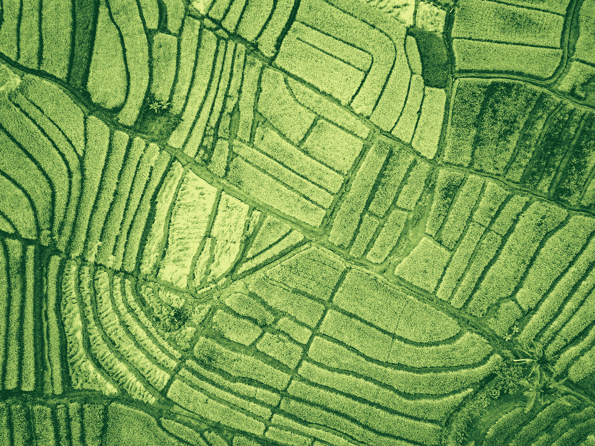

伊万·班杜拉在 [Unsplash](https://unsplash.com?utm_source=medium&utm_medium=referral) 上的照片

# 介绍

在电子游戏*星谷*中，种植作物是创收和生产葡萄酒、泡菜和果冻等手工制品的好方法。我的温室里有一块 12x10 的作物，我一直在种植和收获。最近，我迷上了用图论优化我的收割路线的想法。

作者图片

为什么是图论？为什么不测试每条路线，计算出最快的一条？在许多现实世界的问题中，比如设计电网、规划飞行路线和优化互联网路由，有太多的可能性。我们需要更聪明地找到最佳路线。

在本文中，我将带您了解我如何将我的 *Stardew Valley* 农场概念化为一个图，我探索的最短路径和最小生成树问题的算法，以及这些如何启发了我用 Python 编写的算法，以找到收获作物的最快方式。

# 什么是图论？

简而言之，图论是研究由顶点(或节点或点)组成的图，以及它们如何通过边(或链接或线)连接或不连接。

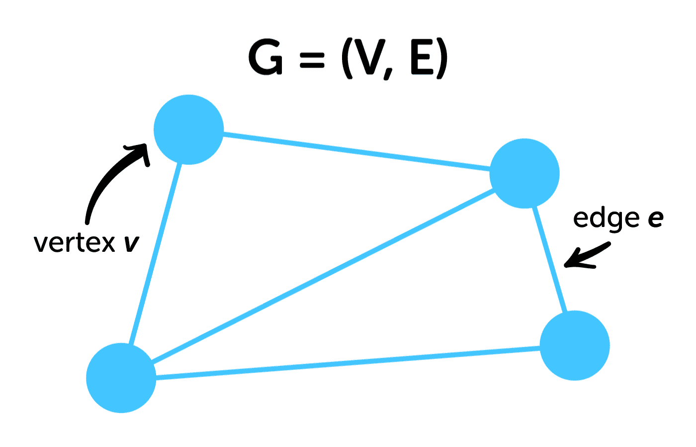

作者图片

一些数学符号将有助于以后阅读算法:

*   一个图可以定义为 ***G = (V，E)*** 其中 ***V*** 是一组顶点， ***E*** 是一组边。一个图中顶点或边的数目记为 ***|V|*** 或 ***|E|*** 。
*   在一条边 ***e = (u，v)*** ， ***u*** 和 ***v*** 是端点顶点，称它们彼此相邻。
*   边可以具有表示为 ***w(u，v)*** 的权重，并且可以表示例如在*和 ***v*** 之间穿行所花费的距离或时间。*
*   *一个算法的总运行时间可以用大 O 符号来表示。这给了我们一个简化的、最坏情况下的表达式，表示算法如何随着输入(在这种情况下，***| V |*| 和/或 ***|E|*** )的增加而增长。举个例子，如果我们有一个算法，在最坏的情况下对每个顶点检查一次，那么它的时间复杂度将是 ***O(|V|)*** ，或者干脆就是 ***O(V)*** 。***

*在上面的图的定义中，一对顶点可以通过不超过一条边连接，并且不能包含环(其中边将顶点连接到自身)。我们将在接下来的用例中看到，这个定义经常需要扩展以解决现实世界的问题。*

*除了本用例所涵盖的内容之外，还有大量类型的图和算法，但希望本文能让您更好地理解如何用图的形式来概念化路由问题。*

# *定义我们的 Stardew Valley 用例*

*我们可以把我的 12x10 的庄稼想象成一个图，其中每个庄稼是一个顶点，庄稼之间的可行走路径(在游戏方向上向右、向左、向上和向下)是边。*

*还记得我说过简单图形的定义经常需要扩展以解决现实世界的问题吗？这不是一个简单的图表。事实上，我们的图表有很多规则。*

## *边覆盖*

*首先，让我们来谈谈我对这个图表的目标。我想找到一条接触所有农作物的路径，以最大限度地减少沿着这条路径旅行的时间(希望这比我以前只向左向右走的路线快)。我所描述的是边覆盖，即一个图的边的子集连接所有顶点，这可以用最小生成树来解决。*

## *无固定来源*

*只要我有最快的收割路线，它从哪个顶点开始或结束都没关系。尽管我探索的算法可以找到从起点到终点的最短路径，但这更多是为了理解这种思维如何应用于我的问题。*

## *连续的*

*我希望路径是一个连续的，可以在游戏中行走。*

## *衡量过的*

*收割时在作物之间行走需要不同的时间，这些时间根据你行走的方向而变化(例如:向右收割比向左收割快)。这些时间充当边缘权重。*

**

*作者图片*

## *多重图*

*因为边的权重是根据方向而变化的(即: ***w(u，v)*** 与 ***w(v，u)*** 不一样)，每对相邻的顶点从技术上讲都有两条边。每个方向一个。*

## *未受指导的*

*我们的图是有向的还是无向的是一个棘手的问题。有人可能会说这是一个有向图，因为在两个顶点之间往返会导致两个不同的边权重。我决定将它定义为一个无向图，因为我们可以在任何时间向任何方向旅行，直到动态创建了一个边权重，两个顶点之间的边才是不同的。这也使得后面的最小生成树算法变得不那么复杂。*

## *动态的*

*我们的旅行时间根据我们在一个给定的方向上走了多少步而变化。我们的边权重需要动态填充。*

**

*作者图片*

*剧透一下，没有一种算法能回答所有这些规则。最后，我自己写了一个(不太好的)算法，让我走了大部分的路。但是当我们探索不同的算法时，我们会看到它们是如何让我们更接近解决收割路线问题的。*

# *Python 设置和 NetworkX*

*让我们设置我们需要的 Python 库，并使用名为 NetworkX 的库来绘制我们的图形。NetworkX 允许你存储图形的数据——顶点、边、权重等。—让建模和可视化变得轻而易举。*

*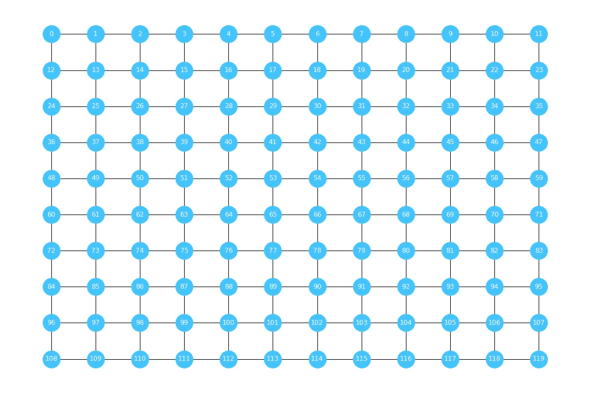*

*作者图片*

*在上面的示例中，我创建了一个顶点列表，在 for 循环中将顶点和边添加到图形中，将顶点放置在 12 层或 12 列中以模拟我的 12x10 裁剪面片，并使用 NetworkX 和 Matplotlib 绘制图形。*

*我现在已经忽略了边权重，因为它们对于路径是动态的。让我们探索一些有助于我们实现这一目标的算法。*

# *让我们从这个问题的一个简单版本开始*

## *寻找最短路径的广度优先搜索*

*让我们后退几步，想象我们正在处理一个简单的、未加权的图，其中所有边的权重都是 1。我们如何找到一个源或起始顶点 ***s*** 和所有其他顶点 ***v*** 之间的最短路径？这是一个单源最短路径问题。*

*最好使用的算法是广度优先搜索(BFS)，它计算从一个顶点到下一个顶点的最短路径树，从 ***s*** 到任意 ***v*** 的最短路径是两者之间最短路径的总和。*

*该算法由以下值组成:*

*   **这些是顶点的水平集合，其中 ***k*** 表示距离源顶点 ***s*** 的距离或步数。该算法将每个顶点 ***v*** 放置在水平集中。**
*   **对于每个 ***v*** ，我们会找到最短的 ***d(s，v)*** 这是从 ***s*** 到 ***v*** 和 ***P(v)*** 的距离，这是为了到达 ***v*** 而遍历的前一个顶点。**

**算法是这样的:**

*   **初始化 ***L₀*** 为 ***{s}*** 其中 ***d(s，s)*** 为 0。**
*   **将 ***i*** 初始化为 1。**
*   **而上一级集合不为空时***lᵢ-₁≦{ }***，让*成为上一级集合 ***Lᵢ-₁*** 的顶点。对于每一个不在一个水平集合中并且与*相邻的*v*v*到*，设置 ***d(s，v)*** 到 ***i* (第一次运行时，*会被 ***s*** 。)*********
*   **对于不可达顶点，设置 ***d(s，v)*** 为∞(无穷大)。**

**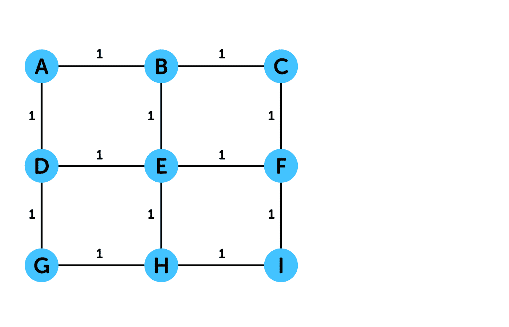**

**作者图片**

**现在我们有了从 ***s*** 到所有其他 ***v*** 的最短距离。从 ***s*** 到任意 ***v*** 的最短路径可以通过从 ***v*** 回溯所有 ***P(v)*** 找到。**

**总运行时间是 ***O(V+E)*** 因为我们在检查每个顶点和它们所有的邻居。这以线性时间运行(随着输入的增加，运行时间成比例地增长),并且是最快的路由算法之一。**

**让我们看看这与我们的图表规则有什么关系。**

****

**作者图片**

**BFS 将处理有向图和无向图(以及我们作为无向图的多重图)，并提供从 ***s*** 到 ***v*** 的连续路径。让我们在此基础上添加边权重，使我们更接近用例中的图表。**

# **不是所有的边都是相等的**

## **Dijkstra 的加权最短路径算法**

**Dijkstra 的算法是另一种单源最短路径树算法。它建立在 BFS 的基础上，允许边权重不为 1，最短路径被定义为具有最小总边权重的路径。**

**如果一个图中所有的边权重都是正的，那么 Dijkstra 是最好的算法。其思想是通过使用数据结构找到到 ***s*** 的最短距离的下一个***【v】***来找到从 ***s*** 到所有其他*的最短路径。***

***该算法由以下值组成:***

*   ******Q*** 是一个优先级队列，包含每个*的项目和关键字 ***(v，d(s，v))* 。该算法将为每个*找到最短的 ***d(s，v)*** 。*******
*   **为了更容易追溯最短路径，我们可以做一些修改。我们可以为每个*分别存储 ***(v，P(v))*** ，并且我们可以为已经在*中访问和处理过的顶点存储 ***(u，d(s，u))*** 。****

**算法是这样的:**

*   **将 ***d(s，s)*** 初始化为 0，将所有其他 ***v*** 的***【s，v】***初始化为∞。**
*   **将 ***S*** 初始化为空集 ***{}*** 。**
*   **而 ***Q*** 不为空，设*为 ***v*** 与 ***Q*** 中最小的***【s，v】***。从*中删除 ***(u，d(s，u))*** ，增加到 ***S*** 。(第一次运行时， ***u*** 会被 ***s*** 。)****
*   **对于每一个与**相邻的**中的***v***Q**，如果***【s，v】>d(s，u) + w(u，v)*** ，则将 ***d(s，v)*** 设为距离更短的 ***d(s，u) + w(u)*******
*   ****对于不可达顶点， ***d(s，v)*** 保持∞。****

********

****作者图片****

****要找到 ***s*** 和一个目标*之间的最短路径，我们可以从*和 ***d(s，v)*** 回溯所有 ***P(v)*** 的最短距离。对于一个已知的目标 ***v*** ，算法可以在从 Q 中删除*后停止，因为它已经被访问、处理并且已经找到它的最短的 ***d(s，v)*** 。*******

****总运行时间是 ***O(VlogV + E)*** ，不包括修改，因为我们最多执行*Q***| V |***次操作，并且对于 ***E*** 中的每条边，我们都要更新一次最短距离，可能是两次。 ***LogV*** 是如果使用斐波那契堆作为数据结构并且是一个很小的数。性能几乎可以和 BFS 一样好，而且它的运行时间也是线性的。*****

****现在我们增加了使用边缘权重的能力。非常好。****

********

****作者图片****

## ****负边权重怎么办？****

****如果我们处理的权重代表货币成本之类的东西，而边权重是负的呢？问题是可能存在负权重循环(循环是指路径的起始顶点和结束顶点相同)。我们可以重复遍历负权重循环，得到一条总权重为-∞的最短路径。然而，这并不一定是我们在实践中想要的！****

****这就是贝尔曼-福特算法发挥作用的地方。贝尔曼-福特计算在 ***s*** 和所有其他 ***v*** 之间的最短路径，其中路径使用最多 ***k*** 条边——从 ***k = 0*** 迭代到 ***k = |V|*** 。这有助于检测负体重周期(万岁！)但是运行时间更长(时间复杂度为 ***O(VE)*** )因为它创建了每个顶点的 ***|V|+1*** 版本和每个边的 ***|V|*** 版本。我们现在运行的是多项式时间，比线性时间慢。****

****我们用例中的图不包含负的边权重。这只是一个有趣的话题。****

## ****所有对最短路径算法****

****到目前为止，我们已经讨论了寻找从 A 点到 b 点的最短路径。有一些算法可以找到所有顶点对之间的最短路径。****

****Floyd-Warshall 算法使用动态规划——将问题分解成子问题并组合答案。其思想是，在*和 ***v*** 之间的最短路径或者是在*和 ***v*** 之间的最短已知路径或者是在*和 ***k*** 加上在 ***之间的最短已知路径时间复杂度为 ***O(V )*** ，是稠密图的最佳解。**********

***对于稀疏图，更好的算法是 **Johnson 的**，它运行一次 Bellman-Ford，将所有边权重(包括负权重)重新加权为正权重，同时保持路径的距离。然后运行 Dijkstra ***|V|*** 次。这与运行 Dijkstra***| V |***times***O(V logV+VE)***具有相同的时间复杂度。***

***所有成对最短路径算法意味着我们不必使用固定的源。但是我们还没到那一步。***

******

***作者图片***

***网上有很多关于上述算法的 Python 实现指南。 [NetworkX](https://networkx.org/documentation/stable/reference/algorithms/shortest_paths.html) 对每一个也有一个 Python 函数。它们获取一个图 ***G*** 、源和目标顶点(如果是单个源)以及权重(可选)并返回最短路径中的顶点列表。***

***虽然上述最短路径算法可以用来拼凑一个更大的路径，提供边缘覆盖，这不会是最有效的练习。让我们继续讨论为边覆盖设计的最小生成树算法。***

# ***吃豆人在寻找最小生成树***

## ***Prim 最小生成树算法***

***生成树是构成接触图的所有顶点的树的边的子集。最小生成树是具有最小总边权重的生成树。***

***Prim 的算法类似于 Dijkstra，它会找到与生成树距离最短的下一个 ***v*** 并将其添加到生成树中。***

***该算法由以下值组成:***

*   ******s*** 是任意的起始顶点。***
*   ******Q*** 是一个优先级队列，包含每个 ***v*** 的项目和关键字 *(v，w(u，v))* 。该算法将找到连接***【v】***到 ***S*** 的最小值***【u，v】***。***
*   ******S*** 是一个空集，其中顶点 ***v*** 将被添加到生成树中。***
*   ***为了更容易追溯最小生成树，我们可以为每个 ***v*** 分别存储 ***(v，P(v))*** 。***

***算法是这样的:***

*   ***将 ***w(s，s)*** 初始化为 0，将所有其他 ***v*** 的 ***w(u，v)*** 初始化为∞。***
*   ***将 ***S*** 初始化为 ***{}*** 。***
*   ***而 ***Q*** 不为空，设*为最小 ***w(u，v)*** 的***。从 ***Q*** 中删除 ***(u，w(u，v))*** ，增加 ***S*** 。(第一次运行， ***u*** 会被 ***s*** 。)*******
*   ****对于每个*中的 ***v*** 与*u 相邻，如果***【w(u，v)*** <中的**w(u，v】***Q***，设置****键************
*   ****记住，为了有一棵最小生成树，每个顶点都需要连通！我们不能有任何不可到达的顶点。****

********

****作者图片****

****为了找到最小生成树，我们可以回溯所有的 ***(v，P(v))*** 这些就是我们的边。****

****总运行时间与 Dijkstra 相同—如果使用斐波那契堆 ***O(VlogV + E)*** 。****

****Prim 给了我们边缘掩护，但是它形成的树并不一定是游戏中可以行走的连续路径。****

********

****作者图片****

****让我们看看另一种最小生成树算法。****

## ****克鲁斯卡尔算法****

****Kruskal 算法背后的思想是，图的全局最小权重边在最小生成树中。它按权重将所有边按升序排序，并迭代选择最小权重的边(不会产生循环)添加到生成树中。****

****如果你的图不包含太多要排序的边，这是一个有效的算法。总运行时间是***O(sort(E)+Eα(V))***，因为我们按权重对 ***E*** 进行排序，并检查所有边。****

****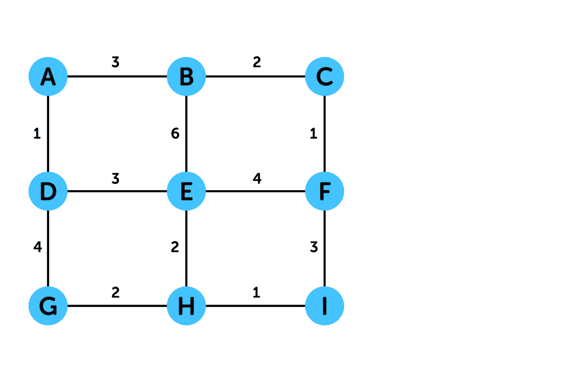****

****作者图片****

****克鲁斯卡尔让我们离图表的规则更远了。这证明了我需要一棵更像路径的最小生成树。****

********

****作者图片****

****[NetworkX](https://networkx.org/documentation/stable/reference/algorithms/generated/networkx.algorithms.tree.mst.minimum_spanning_edges.html) 还有一个寻找最小生成树的 Python 函数。它需要一个图 ***G*** ，要使用的算法和权重，并返回最小生成树中边的迭代器。****

# ****把它们拼凑在一起****

## ****农夫莉莉的算法****

****我们研究的算法中的两个核心思想告诉我们如何用动态边权重来解决我们的收获路由问题。****

1.  ****讨论的算法大多是**贪婪算法**。他们迭代地做出局部最佳决策，忽略了对未来的影响。BFS、迪克斯特拉、普里姆和克鲁斯卡尔一步一步地做决定，走向下一个最近的顶点。这并不总是可行的(我们很快就会看到)，但它使合并动态边权重变得容易。****
2.  ****就像在 Dijkstra 和 Prim 中一样，我们可以使用一个**数据结构**来有效地做出局部最佳决策。这对于计算动态边权重和选择要行进到的下一个顶点最有意义。****

****我的算法由以下值组成:****

*   *******s*** 是任意的起始顶点。****
*   *******Q*** 是未访问的优先级队列，相邻顶点 ***v*** 并包含 ***(v，方向，w(u，v))*** 。该算法将找到连接***【v】***到 ***S*** 的最小值***【u，v】***。****
*   *******C*** 是一个列表，记录我们连续在某个方向上行进的次数。****
*   ****在每次迭代中，我们存储 ***上一个方向*** 和 ***下一个方向*** ，以便 ***C*** 能够保持计数。****
*   ****我们从旅行时间列表中得到 ***w(u，v)***——每个方向一个列表右、左、上、下。下一个*的 ***方向*** 和对应的 ***C*** 中的计数告知要查找哪个列表以及在列表中的位置。*****
*   *******S*** 是一个空集，其中顶点 ***v*** 将被添加到路径中。****

****算法是这样的:****

*   ****将 ***w(s，s)*** 初始化为 0，将 ***方向*** 初始化为空。****
*   ****初始化 ***C*** 为***【0，0，0，0】***为右、左、上、下。****
*   ****初始化 ***S*** 为 ***{}*** 。****
*   ****而 ***V*** 不为空，设 ***u*** 为 ***v*** 与最小的****Q***。从*中删除 ***u*** 增加 ***(u，方向，w(u，v))*** 到 ***S*** 。(第一次运行时，*将会是 ***s*** 。)*******
*   ****设置***previous _ direction***到 ***direction*** 中的最小值 ***Q*** 。****
*   ****删除 ***Q*** 中的值，在 ***Q*** 中设置新值，包含 ***(v，方向，w(u，v)) f*** 或与*相邻的每个***v***—计算 ***w(u)如果某个方向不可用或者已经被访问过，则将 ***v*** 和 ***方向*** 设置为空，将***【w(u，v)*** 设置为*。*********
*   ****设置***next _ direction***为 ***方向*** 中的最小值 ***Q*** 。****
*   ****如果***previous _ direction***等于***next _ direction***，则在 ***C*** 中该方向加 1。否则，使 ***C*** 中的一切为 0，然后在下一个方向加 1。(第一次运行时，下一个方向将加 1。)****
*   ****因为这是一个贪婪的算法，它总是对给定的 ***s*** 做出相同的决定。****

****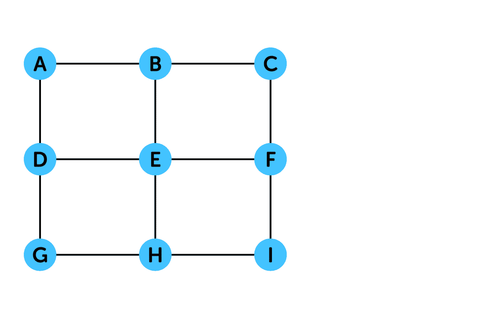****

****作者图片****

****下面是 Python 代码。****

****我们可以使用 ***S*** 将路径作为边添加到我们的 NetworkX 图中，并将其可视化。我们将 ***G*** 初始化为多重图(有向多重图)以保持路径的方向。让我们也使路径和 ***s*** 不同的颜色，这样更容易阅读。****

****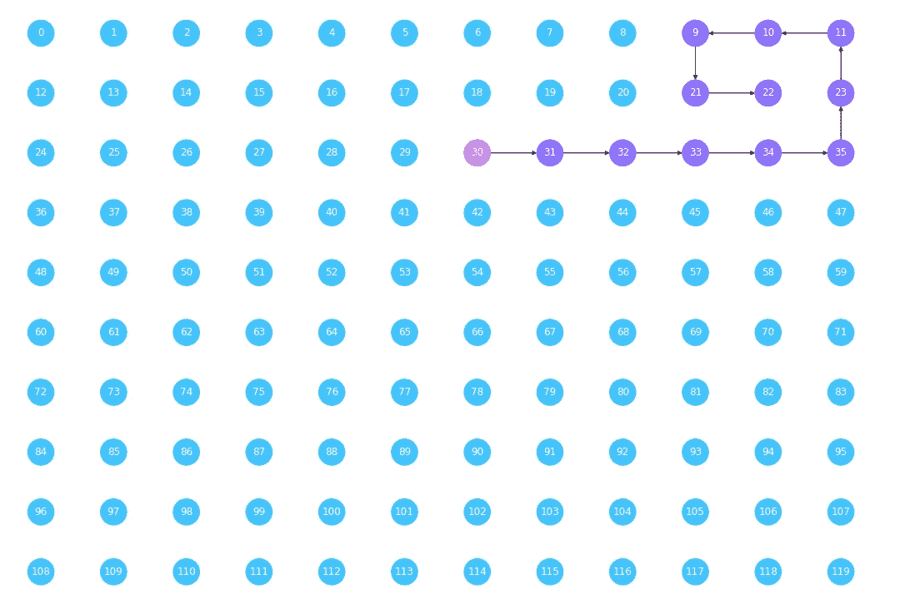****

****作者图片****

****正如我从我的第一次模拟中很快了解到的那样，当算法访问一个所有相邻顶点都已被访问过的顶点时，它有可能(并且很可能)被卡住，并且它无处可去。你可能会从代码中注意到，为了让它工作，我们真的应该把这个加到算法中:****

*   ****如果*中的最小值***【w(u，v)】***是***∞****，则意味着没有未访问的、相邻的顶点可用，停止算法。******

*****我们如何让算法做出更聪明的决定，使它不被卡住？我考虑了很多理论上的东西，但是超出了我想投入多少时间的范围。我稍后会介绍这些内容。但是现在，我想要一个快速的解决方案，添加这个很有效:*****

*   *****如果 ***Q*** 中的最小值 ***w(u，v)*** 为*，意味着没有未访问的、相邻的顶点可用，则以 0.4 的代价在任何方向上两步走到下一个最佳未访问的顶点(走两条边且中间没有裁剪所需的时间)。如果这不可用，停止算法。******
*   *****将 ***C*** 中的所有内容重置为 0。*****

****这条路就是这样继续走下去的。****

****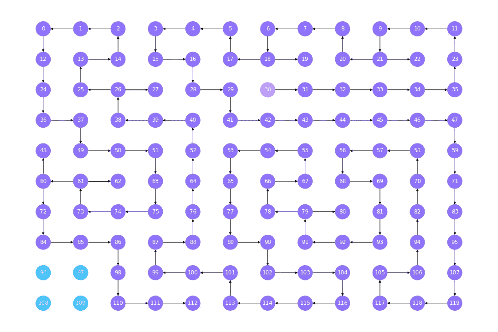****

****作者图片****

****现在这个算法给了我很多工作路径。****

****这是到达每个顶点的最快路径，从顶点 60 开始，总重量为 65.39 秒——比我过去的左右穿越路线节省了 6%。它首先利用了向右和向上的优势，这是最快的方向。当它不能再向右移动时，它就向左上下移动。它又回到起点，一直向右，然后又向上又向下。****

****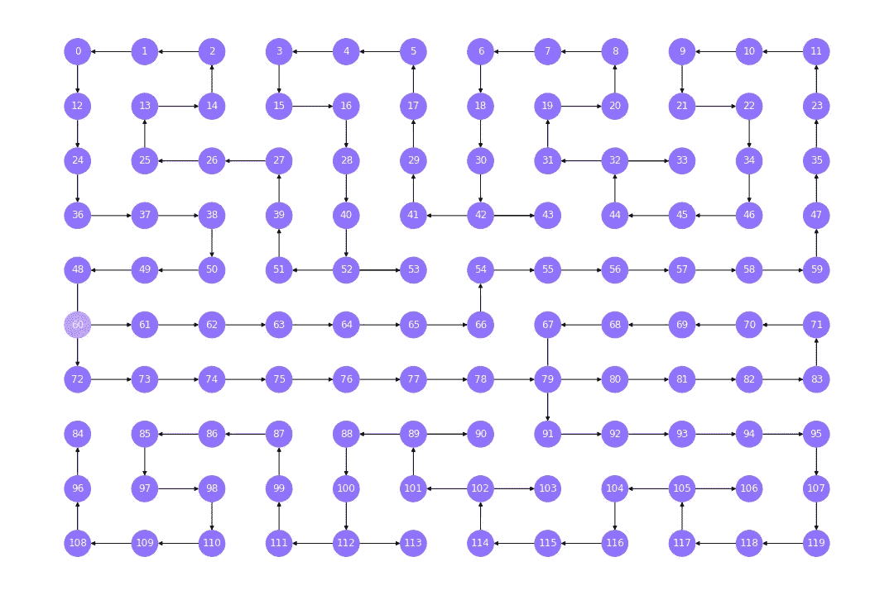****

****作者图片****

****尽管这是该算法最快的路径，但它有一些反直觉的东西:它总是向左走，尽管向左是迄今为止最慢的方向。(更不用说，试图在游戏中行走是疯狂的。)但基于算法的逻辑，它正确地优先选择了向右和向上，它必须找到最快的方式向左返回。****

****我从中得到的是，上和下——相当于向右，最快的方向——是一个快速编队，在算法的大多数最快路径中都有某种形式。****

****我试着从离这里更近的地方开始——顶点 108——它离底部的温室入口更近。它可以上上下下，向右穿越——完全避免向左。****

****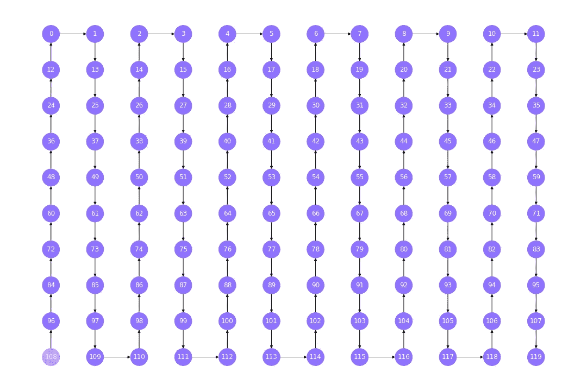****

****作者图片****

****在 64.53 秒的总重量下，这比从顶点 60 开始快 1%，它减少了从温室入口(中间底部)走到开始顶点的时间，并且在游戏中走起来更简单，更直观。更棒的是，比我以前的路线快了 8%。万岁！****

****但请注意，这条路径是根据我的人类直觉构建的，基于我在算法的最快路径中看到的内容。****

****这是算法从相同的起始顶点 108 开始所做的。****

****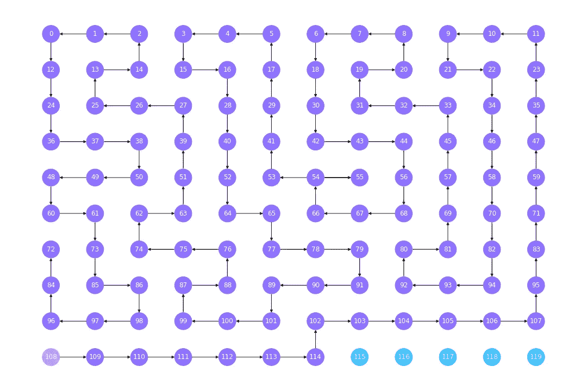****

****作者图片****

****它再次优先考虑先右后上，根据其逻辑这是正确的，但我们开始看到它的局限性。****

## ****进一步的考虑****

****如前所述，这是一个让我走了大部分路的算法。人类的直觉找到了一条更快的路径，我相信更复杂的算法会找到更快的路径。这是一个贪婪算法本身是不够的例子。****

****这里有一些关于如何进一步调整算法的思考。****

*   ****使用**启发式算法**,使算法有方向感或目标感，访问总权重最小的每个顶点。这有助于对不一定是局部最优的决策进行优先级排序，但有助于降低整体最小权重。****
*   ****使用**动态规划**来解决更小的子问题，并将答案放在一起以解决整个图。于是思考变成了*更小的子问题应该是什么才能比贪婪算法*更有效率？****
*   ****保持算法的贪婪性，但内置了当算法停滞时**回溯**多个步骤并做出下一个最佳决策的能力。接下来的思考变成了*it 应该如何决定后退多少步并做出不同的决定？*****
*   ****在每一步使用一个**单源最短路径算法**，每次找到最快的下几步，而不仅仅是下一步。****

# ****结论****

****我们已经看到了图论是如何成为构建和解决问题的强有力的方法。****

****更多的时间可以用来完善算法，特别是如果问题每次都需要一个新的最优解(例如:像导航应用程序)。****

****然而，将人类的直觉添加到不完美的算法中以找到更好的解决方案，并在真实世界条件下进行测试，可能同样有价值。****

****虽然这是一个相对小规模的问题，但思考和解决问题的过程可以扩大。在“现实世界”中，即使是很小的路线优化也有可能带来巨大的收入增长或成本节约。****

*****请注意:在本文中，我忽略了能够一次收获三行的游戏机制，以及一些顶点是洒水器，目的是以可理解的方式演示图论。我还假设我在游戏中测量的旅行时间在每次游戏加载时都是相同的。*****

# ****参考****

****[1] [广度优先搜索](https://ocw.mit.edu/courses/electrical-engineering-and-computer-science/6-006-introduction-to-algorithms-spring-2020/lecture-videos/lecture-9-breadth-first-search/)，麻省理工学院开放课件****

****[2] [贝尔曼-福特](https://ocw.mit.edu/courses/electrical-engineering-and-computer-science/6-006-introduction-to-algorithms-spring-2020/lecture-videos/lecture-12-bellman-ford/)，麻省理工学院开放式课程****

****[3] [迪杰斯特拉](https://ocw.mit.edu/courses/electrical-engineering-and-computer-science/6-006-introduction-to-algorithms-spring-2020/lecture-videos/lecture-13-dijkstra/)，麻省理工学院开放式课件****

****[4] [动态规划:所有对最短路径](https://ocw.mit.edu/courses/electrical-engineering-and-computer-science/6-046j-design-and-analysis-of-algorithms-spring-2015/lecture-videos/lecture-11-dynamic-programming-all-pairs-shortest-paths/)，麻省理工学院开放课件****

****[5] [贪婪算法:最小生成树](https://ocw.mit.edu/courses/electrical-engineering-and-computer-science/6-046j-design-and-analysis-of-algorithms-spring-2015/lecture-videos/lecture-12-greedy-algorithms-minimum-spanning-tree/)，麻省理工学院开放课件****

****[6] D. Galvin，[图论符号](https://www3.nd.edu/~dgalvin1/60610/60610_S09/60610graphnotation.pdf) (2009)，离散数学 2009 年春季****

****[7] G. Cattaneoa，P. Faruoloa，U. Ferraro Petrillob，G. F. Italiano，[维护动态最小生成树:一项实验研究](https://www.sciencedirect.com/science/article/pii/S0166218X09003928) (2010)，应用数学，2010 年 3 月****

****【8】[什么是大 O 批注？](https://www.youtube.com/watch?v=Q_1M2JaijjQ&t=421s)，可还原****