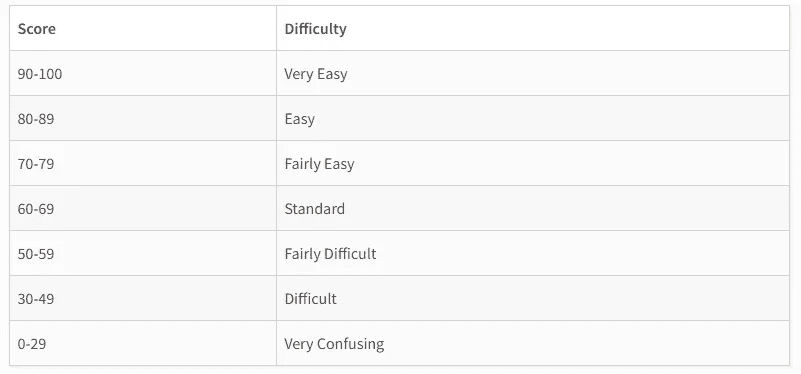
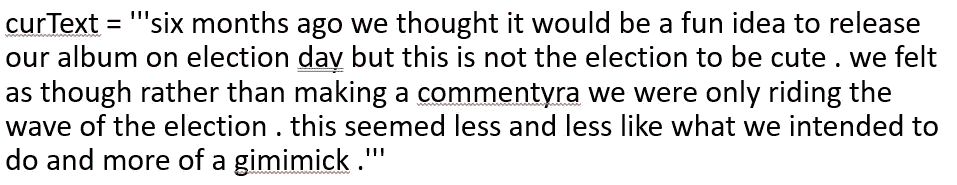
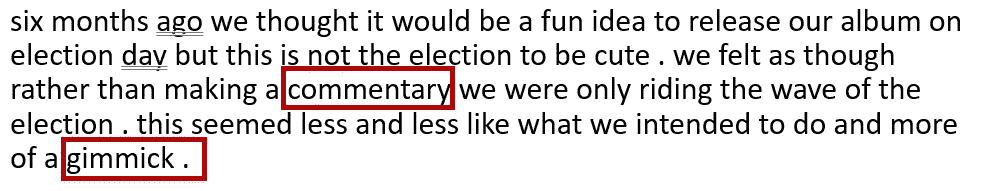
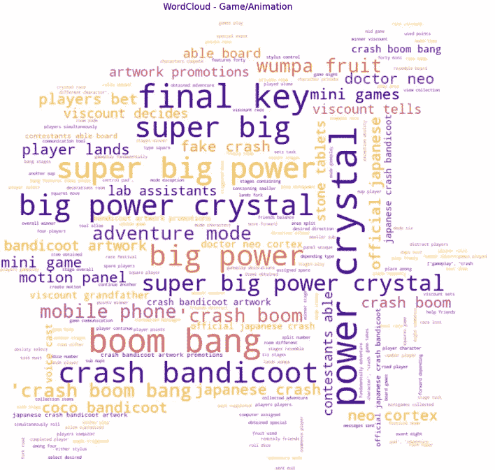

# 使用 5 个鲜为人知的 Python 库解决复杂的 NLP 任务

> 原文：<https://towardsdatascience.com/solving-complex-nlp-tasks-with-5-simple-python-snippets-libraries-7d4dfab131e8>

## 一口大小的 Python 代码块

随着非结构化数据的增长，实现文本处理或 NLP 任务的解决方案变得越来越迫切。

在本文中，我为您的下一个 NLP 项目编译了 5 个有用的 Python 食谱。我们还将查看定期出现的各种用例，以利用这些代码块。

在这个练习中，我们将使用图层 [***WikiText 数据集***](https://app.layer.ai/layer/wikitext)——一个包含从维基百科上的一组高质量文章中提取的超过 1 亿个令牌的公共数据。使用{ ***图层*** }可以直接拉取该数据集。

您还可以在这里找到更多带有 *WikiText 数据* [的项目。](https://app.layer.ai/layer/wikitext/)

## (1)使用{textstat}检查文本数据的度量

[Textstat](https://pypi.org/project/textstat/) 是一个易于使用的库，用于计算文本数据统计，如阅读时间和字数。它还为你文本分配一个可读性分数，以帮助确定它的复杂程度和等级。



[Textstat 等级级别](https://pypi.org/project/textstat/)

***代码片段*** *:*

```
## curText = doc_set[27310]
curText = '''george washington johnson was born on may 27 , 1811 near georgetown in scott county , kentucky , the son of major william and betsy payne johnson . major johnson died soon after the close of the war of 1812 , in which he was a participant , and george johnson was reared in the home of his stepfather , john allen.'''
```

***用户案例/应用*** :

当给利益相关者写论文、博客或报告时，你会希望确保内容简明易懂。Textstat 提供的度量可以帮助测量文本的属性。如果你对媒体上的文章进行了评估，你会发现短小、易读的文章比冗长的半学术性文章更受欢迎。

**** * *加入我们的 YouTube 社区🎦*** [***【数据与 Kat 谈判】***](https://www.youtube.com/channel/UCbGx9Om38Ywlqi0x8RljNdw) ***😄我帮你提升数据科学、分析和编码水平:***

## (2)用{pyspellchecker}纠正拼写错误

[Pyspellchecker](https://pyspellchecker.readthedocs.io/en/latest/) 顾名思义，提供纯 Python 的拼写检查和纠正。它使用一种 [Levenshtein 距离](https://en.wikipedia.org/wiki/Levenshtein_distance)算法来查找和比较原始单词的排列，然后确定最有可能的正确结果。

***代码片段*** :标记出错别字`commentyra` 和`gimimick`



这是发现并纠正了错别字的返回结果，

`{‘commentyra’: ‘commentary’, ‘gimimick’: ‘gimmick’}`

现在，下面的一行程序使我们能够用正确的单词替换错别字:



***用例/应用:***

直截了当，识别并纠正拼写错误！当 NLP 项目带有包含错别字的杂乱文本数据时，Python 中的拼写检查器/校正器将是数据清理和数据预处理的有用工具。


[图片来源:Pixabay](https://pixabay.com/photos/mistake-error-correction-wrong-968334/)

## (3)用{下一个单词预测}进行下一个单词预测

[下一个单词预测](https://pypi.org/project/next-word-prediction/)是一个生成式预训练转换器 2，又名 GPT-2，用于语言建模。这是一个方便的工具来实现一个心血来潮的下一个单词预测器。

***代码片段*** :

```
curText = “falafel has become popular among vegetarians and vegans , as an alternative to meat @-@ laden street foods , and is now sold in packaged mixes in health @-@ food stores . falafel ‘s versatility has allowed for the reformulating of recipes for meatloaf , sloppy 
joes and spaghetti and meatballs into vegetarian [MASK]”
```

我们根据之前的上下文预测了'*素食者*'之后的前 5 个下一个最有可能的单词，代码吐出了这 5 个单词/字符串:`[‘dishes’, ‘and’, ‘,’, ‘-’, ‘recipes’]`。现在，与我们的维基文本数据中的原始文本相比，

```
falafel has become popular among vegetarians and vegans , as an alternative to meat @-@ laden street foods , and is now sold in packaged mixes in health @-@ food stores .falafel ‘s versatility has allowed for the reformulating of recipes for meatloaf , sloppy joes and spaghetti and meatballs into vegetarian [dishes].
```

单词“`***dishes***`”被正确预测为最有可能出现的单词，这难道不令人惊讶吗！

***用例/应用:***

下一个单词预测是自然语言处理的基本任务之一。你可以每天在 WhatsApp、电子邮件、Facebook Messenger 或谷歌搜索等应用上使用它。这种自动完成功能为用户节省了时间，也可以被虚拟助手用来完成句子。

## (4)创建有效的词云

Word Cloud 是一个简单而强大的可视化工具，可以量化和突出显示您基于文本的见解。生成一个词云并不是一个困难的过程；现在，让我们使用来自 *WikiText* `doc_set[8319:8334]`的文本列表来揭示这个非结构化子数据集的核心内容。

***代码片段(Part1):*** *文本清理和构建 N 元模型*

这里，我们创建了一个短语长度为 2-5 个单词的 N 元模型。

***代码片段(Part2):*** *字云*

`“Super Big Power Crystal”, “Wumpa Fruit”, “Coco Bandicoot”`！你认为这些维基页面是关于什么的？任天堂的派对游戏***Crash Boom Bang***！！



作者可视化

***用例/应用:***

人脑更喜欢视觉表现，而不是其他任何形式。您可以将最重要的信息转换成文字云，帮助您的受众定量地理解非结构化数据，而不是向您的利益相关者展示长篇大论的文本。

## (5)语义相似度分析

与[的字典编纂相似度](https://en.wikipedia.org/wiki/Lexicography)，[的语义相似度](https://en.wikipedia.org/wiki/Semantic_similarity)基于它们的意思来衡量文档/句子/短语的相似度。最有效的方法是使用强大的转换器对 ***的*** *句子进行编码，得到它们的* ***嵌入*** *，然后使用* ***余弦相似度*** *计算它们的距离/相似度得分*。

为了证明，我们有以下三个句子，

```
sentences = ['''in italy , plum cake is known by the english name , baked in an oven using dried fruit and often yoghurt''',

 '''plum cake in the united states originated with the english settlers. this original fruitcake version of plum cake in the united states has been referred to as a reigning " standard american celebration cake through the time of the civil war''', 

 '''the song received positive reviews , peaking at eighteen in the united states. the song 's accompanying music video was also received warmly''']
```

***代码片段*** :

计算两个嵌入之间的余弦距离给出了“相似性”分数，

```
Similarity between Sent1 and Sent2 = 0.703 ## Both about plum cakes
Similarity between Sent1 and Sent3 = 0.249
Similarity between Sent2 and Sent3 = 0.462 ## moderate; mentioned US
```

***用例/应用:***

它广泛应用于信息检索和文本摘要，例如，从多个文档中提取前 N 个最相似的句子。相似性分数也可以用来减少维度和寻找相似的资源。

本文到此为止。所有的代码都可以在[这个 Colab 笔记本](https://colab.research.google.com/drive/131x3tLv1esXM8bDA02qco6XU6je09zDo#scrollTo=lDTNf8azLTXt)里找到。继续尝试这些，并在下面评论哪一个是你最喜欢的？✨

***想要更多数据科学和编程技巧？使用*** [***我的链接***](https://yilistats.medium.com/membership) ***注册 Medium，获得我所有内容的全部访问权限。***

**你可能会发现其他博客也很鼓舞人心，**

[](/6-sql-tricks-every-data-scientist-should-know-f84be499aea5) [## 每个数据科学家都应该知道的 6 个 SQL 技巧

### 提高分析效率的 SQL 技巧

towardsdatascience.com](/6-sql-tricks-every-data-scientist-should-know-f84be499aea5) [](/best-of-both-worlds-automated-and-dynamic-sql-queries-from-python-5b74a24501b0) [## 两全其美:来自 Python 的自动化和动态 SQL 查询

### 通过 SQL 和 Python 集成将自动化带到新的高度

towardsdatascience.com](/best-of-both-worlds-automated-and-dynamic-sql-queries-from-python-5b74a24501b0) [](/4-hidden-gems-for-idiomatic-pandas-code-99c706e6ce93) [## 地道熊猫代码的 4 个隐藏的宝石

### 分享更多熊猫提示来提高你的数据处理水平

towardsdatascience.com](/4-hidden-gems-for-idiomatic-pandas-code-99c706e6ce93)