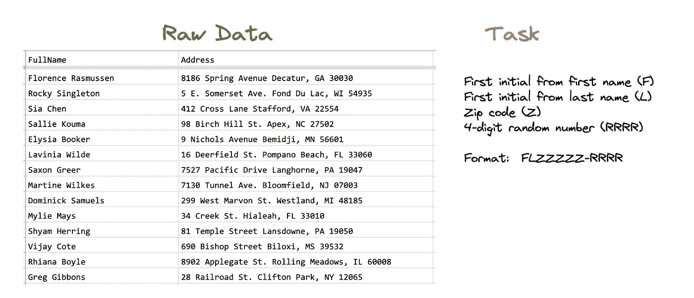
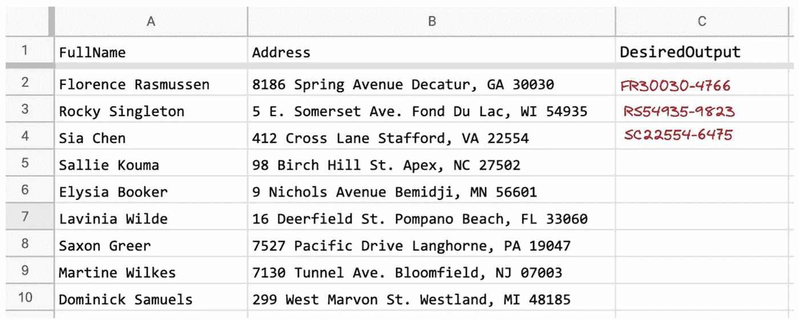
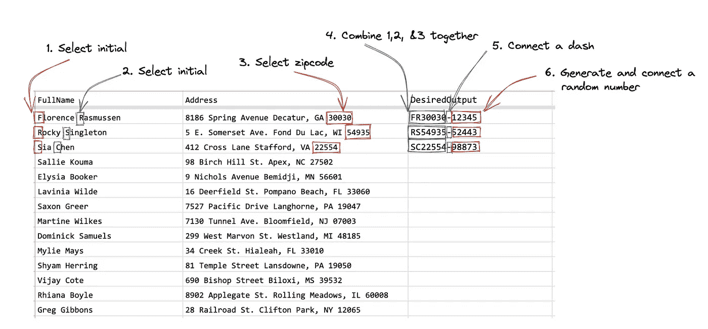
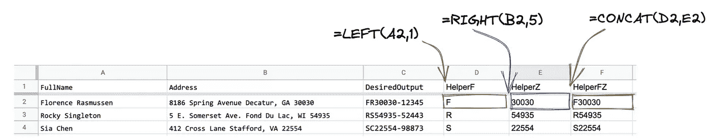
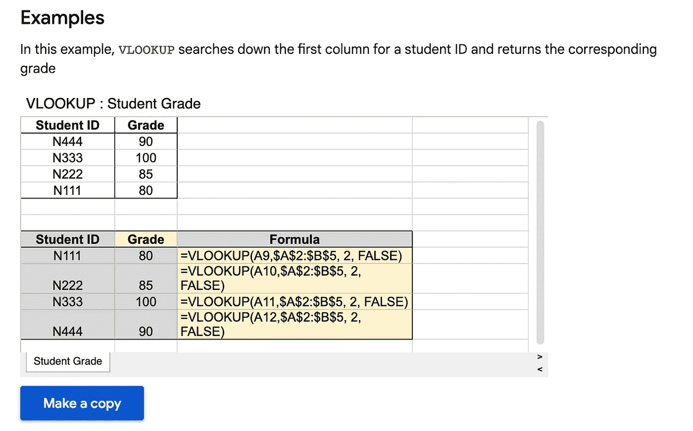
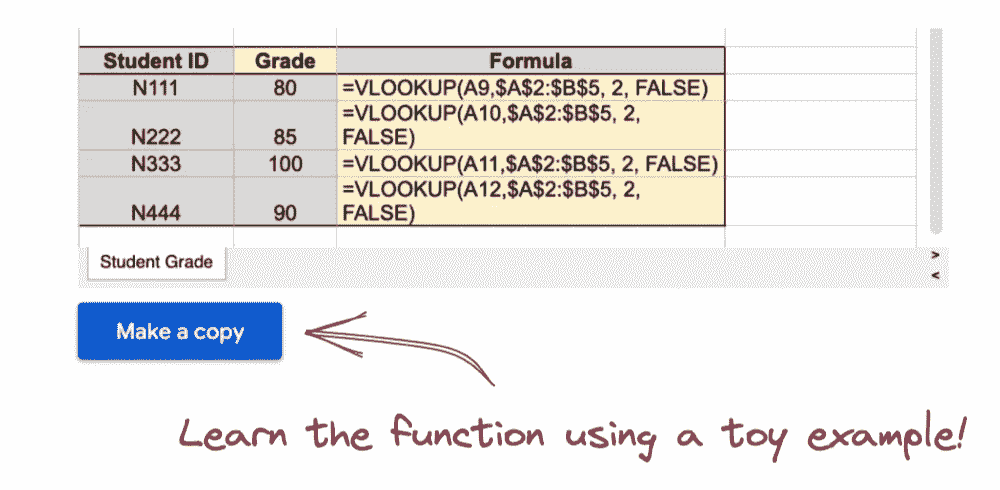

# 解决数据问题:初学者指南

> 原文：<https://towardsdatascience.com/solving-data-problems-22ab8ac792bd>

# 解决数据问题:初学者指南

翻倒的卡车(中国云南红河)——图片由作者提供

我喜欢和对学习用数据解决现实世界问题感兴趣的学生一起工作。新学员在学习过程中经常会遇到挫折，因为他们希望高效地解决问题，但却要花大部分时间面对错误信息和进行谷歌搜索。让我给你省点悬念吧——那些问题不会完全消失。

如果你处理数据，你会看到许多错误信息，并发现自己在谷歌上花费时间。这些问题不会消失。然而，有了正确的资源和**实践**，你解决问题的技巧将变得更加有效和高效。本文提供了一组不同的策略，帮助您在处理数据时培养解决问题的技能。

在本文中，我使用电子表格作为工作示例，因为我认为电子表格是学习数据的理想起点，正如我在[的一篇早期文章](/10-tips-for-students-with-a-non-technical-background-interested-in-developing-data-skills-3fd14cf4d316#:~:text=9.%20Embrace%20spreadsheets)中所讨论的。然而，这里介绍的策略是软件不可知的，因此它们适用于您可能正在使用的任何软件。

# **了解你的问题**

在你能解决一个问题之前，你必须先了解这个问题。避免一头扎进软件。确保你确切地知道你想要做什么。例如，假设您需要创建一个唯一的 ID，它基于 1)名的首字母，2)姓的首字母，3)他们居住的邮政编码，以及 4)一个四位数的随机 ID 的组合。邮政编码和四位数的随机 ID 用破折号隔开。

您查看任务旁边提供的数据，很快发现您没有正确的数据。数据是存在的，但必须从几个不同的领域提取并拼凑在一起:

数据是模拟的。图片作者。

许多新的学习者将开始搜索过程，好像存在一个单一的函数来解决这个问题。但是，在现实中，大多数问题都是通过一系列精心安排的步骤解决的。在寻找任何功能或采取下一步行动之前，花时间了解你需要完成什么。写出期望的输出有助于揭示解决问题所需的步骤。

如果您不熟悉学习数据，请尝试为剩余的行提供所需的结果。对于随机数字，你可以随意编造。

数据是模拟的。图片作者。

# 把问题分解成小步骤

解决问题的基本策略之一是将问题分解成尽可能小的步骤——原子步骤。试着描述每一步。不要写任何代码或开始寻找神奇的公式。用简单的语言做笔记。您可能不知道要使用的正确术语，这不是问题。尽量用简单明了的语言描述你需要做的事情。

数据是模拟的。图片作者。

本例中的动词——*选择*、*组合*、*连接*、*生成*——不是正确的函数。没关系。把你想做的事情写出来，可以帮助你更好的理解问题。

# 确定你能解决的部分问题

有些问题看起来让人不知所措。你能多接近想要的输出？支持你能解决的问题的要素。一个有用的策略是创建助手列。这些柱子很像一个储存容器，允许你保存溶液的一部分。例如，让我们假设您知道 LEFT 函数，并且可以很容易地捕获名和姓的首字母。并且，如果您知道左边的函数，您可能会计算出右边的函数来捕获邮政编码。也许你也知道 CONCAT。在处理问题的剩余部分时，将这些值存储在一个 helper 列中。

数据是模拟的。图片作者。

在这一点上，想想你的拼图缺少的部分。为了达到你想要的结果，你需要解决哪些具体的事情？虽然你没有解决整个问题，但要承认你在解决部分问题上的成就。认可微小的成就对于建立效能感至关重要。自我效能是参与式学习的基础。

# 制定有效的搜索

一项会给你的职业生涯带来回报的技能是搜索技能。搜索技能包括制定有效的搜索和有效地找到最相关、信息丰富和用户友好的资源。下面的例子展示了一个基本的搜索策略。用这些元素写一个简洁的句子，然后去掉所有的填充词。

图片作者。

当你参与搜索过程时，你将开始建立一个语言库，并找到提供丰富答案的网站。StackOverflow 将是你必不可少的资源。事实上，我猜想你的几乎所有问题都已经在这个网站上被问过和回答过了。要发展的技能是有效地搜索和应用解决方案。我将讨论向 StackOverflow 发帖，但是在你第一次发帖之前，我们还需要讨论一些问题。

# **阅读文档！**

迟早，你可能会听到有人告诉你“阅读文件！”这是一个合理的建议，因为你可能会错过一个小而重要的细节。例如，VLOOKUP 函数会绊倒许多学生，因为这些列必须以特定的方式排序。你在处理数据时可能用到的每一个软件都会有一些相应的文档。该文档提供了几乎所有内容的完整描述，包括用于操作数据的函数。文档内容丰富，但并不有趣。被预先警告。

开始学习如何浏览您正在使用的任何软件附带的文档。当你学习一个看起来有用的新函数时，花时间去学习它的参数和功能。高质量的文档通常包括小玩具示例，这是学习如何应用它们的极好起点。下面是 Google Sheets 的文档中 VLOOKUP 的一个例子:

图片来自 Google Sheets 文档。

# 用玩具例子调试

预计您将处理大型数据文件。但是，在解决问题时，当你做一个小的玩具例子时，这个过程会更有效率。通过将数据限制在几行和几列，消除环境中的大量干扰，帮助您只关注问题的本质部分，您可以轻松地创建一个玩具示例。

如果您可以让您的解决方案处理几行数据，您就可以更容易地将该解决方案推广到更广泛的数据集。此外，如果数据集很大，可以节省大量处理时间。有时文档中包含玩具示例，就像 Google Sheets 文档中包含的许多函数一样。这种发现式的学习方法非常有效。

图片来自 Google Sheets 文档。

# 不要忽略错误消息

每个人都害怕错误消息，但是错误消息可能是有益的。错误消息通常包含解决问题的线索，或者在执行搜索时提供附加信息。在一些软件环境中，错误信息可能会直接显示出来，比如 Google Sheets 中的这个例子。电子表格中的错误消息通常隐藏在一个小图标后面。所以，无论你使用什么软件，一定要知道错误信息在哪里。

图片作者。

# 寻求帮助时遵循最佳实践

根据我的经验，数据社区在开发我的数据技能和解决具体问题方面帮助很大。几乎每一种处理数据的软件都有一个活跃的社区。寻求支持时，花些时间精心设计你的问题，以遵循最佳实践和你正在使用的资源的礼仪。请记住，有人自愿花时间来帮助你。以清晰有效地传达您的信息需求的方式提问。StackOverflow 有一个写好问题的极好的帖子，我强烈建议在发布到网站之前阅读。如果你偏离了这些建议，你可能会收到非常严厉的回应。

当你从其他网站寻求帮助时，这里有一些你可以遵循的一般提示。

1.清晰简明地解释你试图解决的问题。

2.指明您使用的软件——如果软件在本地运行，您还应该指明您使用的是 Mac、PC 还是 Linux。

3.说明你在解题时已经尝试过的。人们对那些只想快速得到作业问题答案的学生的帖子感到沮丧。证明你已经付出了努力。提供这种背景可以帮助支持人员从你停止的地方继续下去，使这个过程更有效率。

4.提供您收到的错误消息。

5.尽可能提供一个可复制的工作实例。你可以创建一个小玩具数据集来演示你的问题。但是，请始终确保您共享的文件不包含任何敏感数据。模拟或伪造的数据总是更好的选择。如果无法共享文件，请附上截图。当你没有完整的背景时，解决问题是困难的。

6.如果你在使用降价格式的在线论坛或讨论板上发帖，请使用降价格式！Markdown 很容易学习，也让帖子更容易阅读。[这里有一个简单的降价指南](https://www.markdownguide.org/basic-syntax/)让你开始行动。

# 后续步骤

当你继续发展你的数据技能时，小心不要因为得不到你想要的结果而感到气馁。当你调试问题和寻找解决方案时，你会学到很多东西。只要确保当你没有发现你在某些问题上取得进展时，你能接触到更广泛的数据社区。