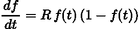
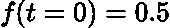
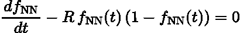
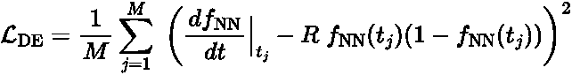
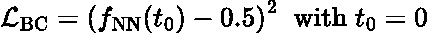
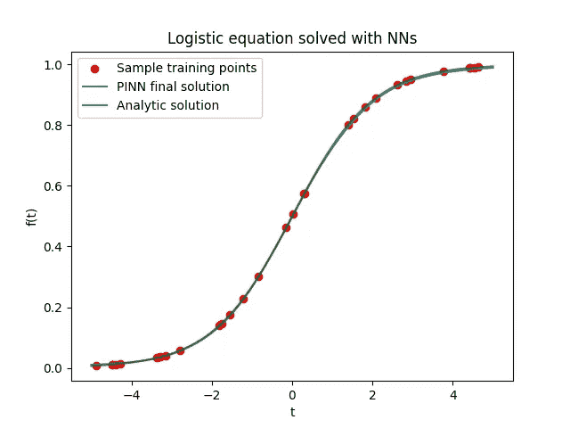
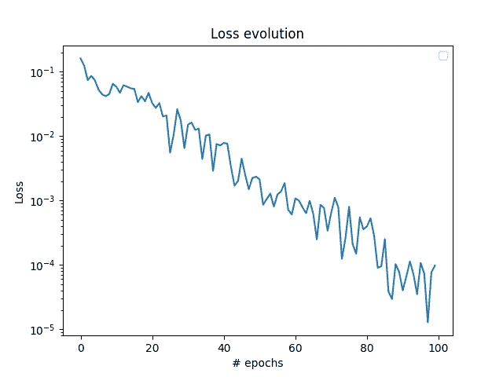

# 物理学信息神经网络导论

> 原文：<https://towardsdatascience.com/solving-differential-equations-with-neural-networks-afdcf7b8bcc4>

## PyTorch 实践教程

照片由[达维德·马泽基](https://unsplash.com/@djmalecki?utm_source=medium&utm_medium=referral)在 [Unsplash](https://unsplash.com?utm_source=medium&utm_medium=referral) 拍摄

在过去的几十年里，人工神经网络已经被用于解决各种应用领域的问题，例如计算机视觉、自然语言处理等等。最近，在科学机器学习(ML)社区中出现了另一个非常有前途的应用:使用人工神经网络解决偏微分方程(PDEs)，使用通常被称为**物理信息神经网络** (PINNs)的方法。PINNs 最初是在开创性的工作[1]中引入的，今天它们不再局限于一个纯粹的研究主题，而是在行业中也获得了牵引力，足以进入 2021 年著名的 Gartner 新兴技术炒作周期。

偏微分方程在从流体动力学到声学和结构工程的许多工程和基础科学领域中起着至关重要的作用。有限元建模(FEM)方法是工业中普遍采用的标准求解器。尽管 FEM 方法很受欢迎，但它们也显示出一些局限性，例如它们对于大型工业问题的计算成本(主要是由于所需的网格尺寸)以及利用外部数据源(例如传感器数据)来驱动 PDEs 解的问题。

本文中讨论的 PINNs 方法被认为是 FEM 方法的一种有前途的替代方法，可以弥补其中的一些局限性。这种方法与标准的监督式 ML 截然不同。事实上，它不是纯粹依赖数据，而是使用 PDE 本身的物理属性来指导训练过程。已知的数据点可以很容易地添加到基于物理的损失函数之上，以加快训练速度。

这篇文章简单介绍了 PINNs 背后的主要概念，然后展示了如何从头构建一个 PINN 来求解一个简单的一阶常微分方程。为了构建神经网络，我将使用令人惊叹的 PyTorch 库。我们开始吧！

# 基于物理学的神经网络是如何工作的

为了更好地理解 PINNs，让我们从选择一个微分方程开始。为了简单起见，在本文中，我们将重点放在[逻辑微分方程](https://mathworld.wolfram.com/LogisticEquation.html)上，这是一个著名的一阶常微分方程，用于模拟人口增长:

模拟人口增长的一阶 logistic 微分方程

这里，函数 *f(t)* 表示随时间的人口增长率 *t* 并且参数 *R* 产生最大人口增长率，并且它强烈地影响解的形状。为了完全指定该方程的解，需要施加边界条件，例如在 *t = 0* 处，例如:

logistic 方程的边界条件。

尽管这个方程的解可以很容易地通过分析得出，但它代表了一个简单的游戏场来说明 PINNs 是如何工作的。下面解释的所有技术都适用于更复杂的常微分方程和偏微分方程。然而，对于更复杂的场景，为了获得良好的收敛性，将需要额外的技巧。

PINNs 基于 NNs 的两个基本属性:

*   已经正式证明[2]神经网络是**通用函数逼近器**。因此，一个神经网络，只要它足够深和有表现力，就可以逼近任何函数，因此也可以逼近上述微分方程的解。
*   使用**自动微分** (AD)计算神经网络输出相对于其任何输入(当然还有反向传播期间的模型参数)的导数既简单又便宜。AD 实际上是最初让神经网络如此高效和成功的原因。

这些都是很好的特性，但是我们怎样才能让神经网络真正学习到解决方案呢？PINNs [3，4]背后有一个令人惊讶的简单但非常聪明的想法:我们可以构造 NN 损失函数，使得当最小化时，PDE 自动得到满足。换句话说，最重要的损耗贡献取为微分方程的残差，如下所示:

微分方程残差。

其中 f *_NN(t)* 是具有一个输入的神经网络的输出，其导数使用 AD 计算。很容易看出，如果神经网络的输出符合上述方程，实际上就是在解微分方程。为了计算来自 DE 残差的实际损耗贡献，需要在方程域中指定一组点(通常称为**同位点**，并评估均方误差(MSE)或其他损耗函数，作为所有选定同位点的平均值:

由一组配置点上平均的微分方程残差给出的损失贡献。

然而，仅基于上述残差的损失并不能确保方程有唯一的解。因此，让我们以与上述完全相同的方式将边界条件添加到损失计算中:

加入 MSE 损失的边界条件损失贡献。

因此，最终损失简单地写道:

在优化过程中，这被最小化，并且 NN 输出被训练以考虑微分方程和给定的边界条件，从而逼近最终的 DE 解。

PINN 框架非常灵活，使用上面介绍的思想，人们可以添加更多的边界条件，包括更复杂的条件，例如对 *f(x)* 导数的约束，或者使用具有多个输入的 NN 处理时间相关和多维问题。

现在让我们看看如何用 PyTorch 构建一个简单的神经网络来构建这样的损失函数。

# 从零开始建设 PINN

## 神经网络

PINN 的主要成分当然是神经网络本身。在这篇文章中，我们选择了一个基本的神经网络架构，它由一堆带有标准激活函数的线性层组成。由于我们有一个独立变量，即时间 *t* ，NN 应该将一个特征作为输入，并返回一个输出，该输出表示给定当前模型参数的最佳 DE 解决方案猜测。下面是这种架构的 PyTorch 实现，其中神经元和隐藏层的数量作为输入(超级)参数。

PyTorch 实现了一个简单的 PINN 架构。

PINNs 是一个非常活跃的研究领域，并且已经设计了更加复杂并且通常是针对问题定制的神经网络架构。关于这些架构的讨论超出了这篇介绍性博客的范围。

## 建立损失函数

既然我们已经定义了我们的通用函数逼近器，让我们建立损失函数。如前所述，这是由 DE 残差项和边界条件项组成的，其中 DE 残差项用作物理意义上的正则化，边界条件项驱动网络在无限可能的解中收敛到所需的解。

首先，需要选择一组协同定位点。因为我们正在解决一个非常简单的问题，所以我们可以在时域中选择一个均匀间隔的网格:`t = torch.linspace(0, 1, steps=30, requires_grad=True)`或者我们可以在优化器的每次迭代中从时域中随机采样新的同位点。对于更复杂的问题，同位点的选择极其重要，并且会强烈影响结果。

为了计算模型输出及其导数，我们使用了最新的`functorch`软件包，该软件包通过将参数从模型本身解耦，使 PyTorch 模型完全起作用。关于`functorch`的全面介绍请参考[这篇文章](https://wandb.ai/functorch-examples/functorch-examples/reports/Working-with-FuncTorch-An-Introduction--VmlldzoxNzMxNDI1)。

PyTorch 的函数方法在处理 NN 输出相对于其输入的(高阶)导数时非常方便，PINNs 通常就是这种情况。在下面的代码中，我们首先使用`functorch`使上面的模型函数化，然后我们生成正向传递和梯度计算的函数形式。

注意，对`grad`的调用可以无限制地组合，从而允许计算关于输入的任意阶导数。使用上面定义的函数，MSE 损失可以很容易地计算为每个同位点的 DE 贡献和边界贡献之和。注意，给定正向传递和衍生的函数性质，损失函数也必须将模型`params`作为输入参数:

就是这样！上面定义的自定义损失确保在训练过程之后，NN 将逼近所选微分方程的解。现在，让我们看看它是如何工作的。

## 用 PINNs 解微分方程

PyTorch 目前没有提供支持上述 API 函数的优化器。然而，令人惊叹的 PyTorch 社区来拯救我们，人们可以使用`[torchopt](https://github.com/metaopt/torchopt)` [库](https://github.com/metaopt/torchopt)获得大多数 PyTorch 优化器的功能版本。这个库的界面非常直观，任何 PyTorch 用户都会很快熟悉它。我们的功能模型的基本训练循环如下所示。请注意，我们在每次迭代中随机采样解域。

让我们看看一些结果。我们使用学习率为 0.1 的 Adam 优化器，在每个优化时期从域中均匀采样 30 个训练点。考虑到所选微分方程的简单性，100 个历元足以几乎完美地再现最大增长率设置为 *R = 1* 的分析结果:

用物理信息神经网络方法求解逻辑斯谛方程。还显示了一组随机训练点。

在上面的图中，在 100 个均匀间隔的点上评估解决方案，每个时期的损耗变化(其中 y 轴是对数标度)如下所示:

使用 Adam 优化器的损失函数值的演变。该图在 y 轴上有对数刻度。

这里我们解决了一个非常简单的一维问题。对于更复杂的方程，收敛就不那么容易了。特别是对于与时间相关的问题，过去几年已经设计了许多有用的技巧，例如将解域分解为使用不同神经网络求解的不同部分，对不同损失贡献进行智能加权以避免收敛到平凡解等等。我将在以后的帖子中介绍其中的一些技巧，敬请关注。

这篇文章对物理学神经网络进行了简单的高级介绍，这是一种解决(偏)微分方程的有前途的机器学习方法。虽然需要进一步的进展才能使 PINNs 常规应用于工业问题，但它们是一个真正活跃和令人兴奋的研究领域，代表了标准微分方程求解器的一个有前途的替代方案。

这篇帖子的完整代码可以在 [GitHub](https://github.com/madagra/basic-pinn) 上找到。如有任何问题或评论，请随时通过 [LinkedIn](https://www.linkedin.com/in/mariodagrada/) 联系我。

# 参考资料和进一步阅读

[1] Raissi M，Perdikaris P，Karniadakis GE .*物理学信息神经网络:一种深度学习框架，用于解决涉及非线性偏微分方程的正向和反向问题。*计算物理学报(2019)

[2] Kurt Hornik，Maxwell Stinchcombe 和 Halbert White，*多层前馈网络是通用逼近器，*神经网络 **2** ，359–366(1989)

[3] George Em Karniadakis，Ioannis G. Kevrekidis，，Paris Perdikaris，Wang 和刘洋，*物理学通知机器学习*，《自然评论物理学》 **3** ，422–440(2021)

[4]本·莫斯利，[那么，什么是物理信息神经网络呢？—本·莫斯利](https://benmoseley.blog/my-research/so-what-is-a-physics-informed-neural-network/)