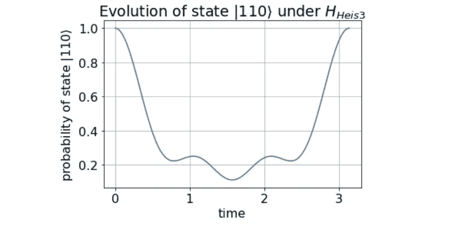
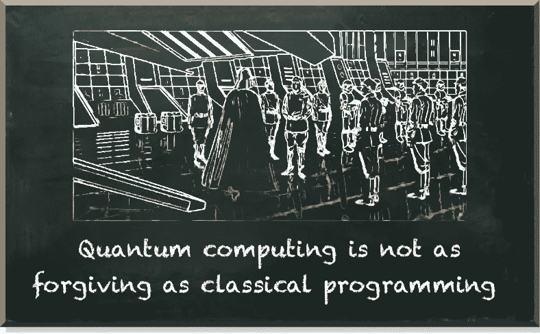
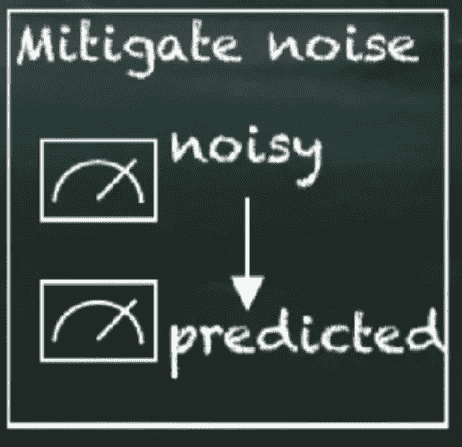
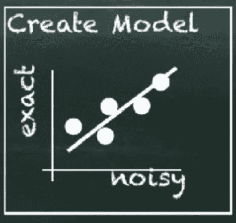
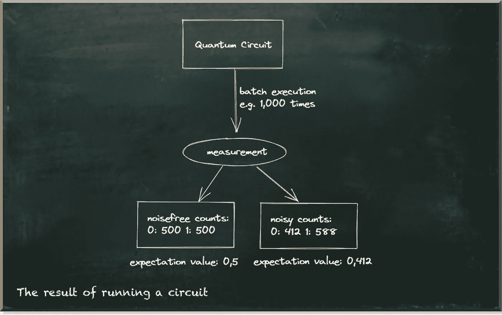

# 解决 IBM 的量子开放科学奖

> 原文：<https://towardsdatascience.com/solving-ibms-quantum-open-science-prize-806dc982a47f>

## 一个实用的方法来确定是否从事量子计算的职业

量子机器学习要不要入门？看看 [**动手量子机器学习用 Python**](https://www.pyqml.com/page?ref=medium_solving&dest=/) **。**

量子计算可能是 21 世纪最具颠覆性的技术。这是一种基于量子力学的不同形式的计算，它有望解决我们用经典计算机无法解决的问题。其中一个问题是分子的模拟。

这是 IBM 量子开放科学奖的挑战。他们想让我们用 trotterization 模拟一个三粒子分子。

分子不是静态的，而是进化的动态系统。所以，悬而未决的问题是:它们是如何进化的？

作者图片

Trotterization 是回答这个问题的最先进的方法。它利用了这样一个事实，即时间片的快速交替收敛到给定的哈密顿量，代表量子态的总能量。

这似乎只有拥有博士学位的物理学家才能理解。

作者图片

没错:量子计算并不完全是一个适合初学者的领域。但是，你不需要成为物理学家(或数学家)。所以，不要让任务描述把你吓跑了。

仔细观察即将到来的挑战会发现一个惊喜！

[实际问题不是使用 Trotterization](https://pyqml.medium.com/how-to-find-out-whether-to-pursue-a-career-in-quantum-computing-today-d1c7093811e8) 模拟三粒子系统的海森堡模型哈密顿量。事实上，IBM 提供了这种模拟的工作示例。

相反，问题是当前的量子计算机容易出错，并且对环境中的噪声敏感。因此，即使我们知道模拟分子的算法，我们仍然需要应对计算误差。

不幸的是，我们不能简单地纠正这些错误，因为我们没有足够的资源。我们能做的最好的事情就是减少误差对计算的影响。

本质上，IBM 挑战说:

> 这里有一个非常酷的模拟粒子的量子算法。但是在我们现在的量子设备上不行，因为噪音太大。请帮助我们想出一个在我们嘈杂的设备上工作的算法。

当然，我们可以用不同的方式应对这一挑战。例如，我们可以致力于改进量子化算法和/或使用备用量子位。IBM 希望我们使用的量子计算机有七个量子位，但模拟算法只需要三个。

我们在解决方案中使用的另一种策略是在后处理步骤中减少错误。这种策略旨在基于有噪声的测量和外推模型来预测可观测值的无噪声值。

作者图片

诸如零噪声外推和 Clifford 数据回归等策略已经显示出前景，但是当然这种方法的性能取决于外推模型。

一般一个模型有一个简单的形式: *y=f(x)* 其中 *x* 为自变量(有噪值) *f* 为模型， *y* 为因变量(无噪值)。如果 *x* 和 *y* 是单号，我们可以用我们高中的知识创造 *f* 。例如，如果 *f* 是一个线性函数，我们可以通过线性回归来创建模型——画一条最适合数据点的线。

作者图片

但是 IBM challenge 根据量子态断层扫描的保真度来评估我们的提交。这是一个基于一系列测量计数重建量子态的过程。

Qiskit 中的测量计数以字典的形式出现。这些是键-值对，其中键表示测量的状态，值表示我们观察该状态的次数。一个三量子位系统有八种不同的状态，从 000，001 到 111。

尽管可观测值的期望值和测量值紧密相关，但从计算角度来看，它们是不同的东西。在[这篇文章](/how-to-implement-quantum-error-mitigation-with-qiskit-and-mitiq-e2f6a933619c)中，我们更详细地观察了可观察到的现象。

这对外推模型的形式有影响，因为我们有八个输入和八个输出值——我们需要一个多维模型。

我们创建的模型由一系列修改器组成。考虑上图中指定的一个量子位的例子。无噪声计数为`0: 500`和`1: 500`。噪声计数为`0: 412`和`1: 588`。对于每个可能的测量，我们计算一个修正值，将噪声值变为无噪声值。这种情况:`0: 500/412=1.21`和`1: 500/588=0.85`。给定噪声计数，我们可以使用修饰符来计算无噪声计数。

因此，当我们再次运行电路并测量`0: 418`和`1: 592`时，修改器会告诉我们真实值是`0: 418*1.21=506`和`1: 592*0.85=503`。非常接近！

上面的例子有一个重要的先决条件。必须能够计算无噪声计数来计算修正因子。事实上，我们可以很容易地在经典电脑上模拟一个三量子位元系统。因此，我们可以计算无噪声计数，测量噪声计数，并计算修改量。有了这样的修改器，我们可以获得 90%以上的保真度！

但是，我们会错过挑战的目的。对量子计算机的大肆宣传源于这样一个事实，即它们可以计算经典计算机不能计算的东西。如果我们可以经典地计算一些东西，那么经历使用量子计算机的挣扎根本没有意义。在这种情况下，我们不需要首先处理错误。

所以，我们需要想出不同的修饰词。

trotterization 算法由许多 trotter 步骤组成。这些是我们用来划分系统进化的时间片。我们使用的步骤越多，模拟就越精确，但也容易出错。

每个 trotter 步骤由三个子电路组成，分别命名为 XX、YY 和 ZZ。

因此，整个算法包含 3 倍 trotter 步骤的子电路。对于 12 个快步，有 36 个子电路。现在，我们要做的是根据每个电路覆盖两个子电路的无噪声计数来计算修改量。

这些电路包含

*   一个 XX 和一个 YY 支路
*   一个 YY 和一个 ZZ 支路
*   一个 ZZ 和一个 XX 支路

这三个回路加在一起的长度相当于两个快步。因此，如果我们计算 6 次(trotter 步数除以 2)，那么我们覆盖的门与整个电路相同。

因此，八个状态中的每一个都有 3*6=18 个修饰符。这 18 种改性剂的乘积形成最终改性剂。

使用这些修改器，**我们得到了 12 个快步的大约 50%** 的保真度。因此，我们以 30%的保真度满足参加 IBM 量子开放科学奖的参赛标准。

凭借 96%的无噪声保真度和 11%的绝对保真度，我们实现了 46.8%的总体误差降低。

这种方法仅仅建立在后处理的基础上。我们不使用任何额外提供的量子位。虽然我们肯定错过了一些潜力，但它允许我们将这种方法与其他团队提出的解决方案结合起来。

这篇文章结束了我们三个月前开始的旅程。我们开始一周接一周地剖析这个挑战。我们学到了很多关于量子错误缓解方法的知识，并且我们编写了 Python 代码——很多！

起初，我不确定我们是否能达到 30%保真度的准入标准。我更高兴的是我们达到了 50%。

你可以在这里找到这篇投稿[。所有代码都是开源的，可以在](https://ibmquantumawards.bemyapp.com/#/projects/6253e846dca8820031006542) [GitHub](https://github.com/quantum-machine-learning/Hands-On-Guide-On-IBMs-Quantum-Open-Science-Prize-2021) 上获得。

量子机器学习要不要入门？看看 [**动手量子机器学习用 Python**](https://www.pyqml.com/page?ref=medium_solving&dest=/) **。**

在这里免费获得前三章。