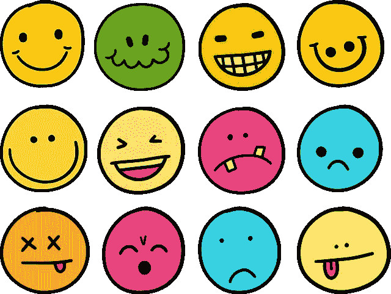
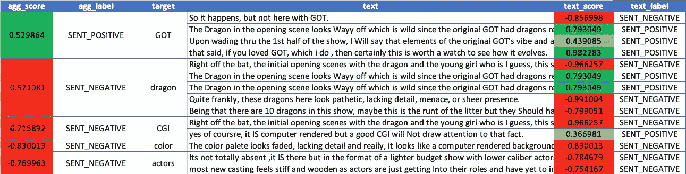

# 用 IBM Watson NLP 快速解决 NLP 问题

> 原文：<https://towardsdatascience.com/solving-nlp-problems-quickly-with-ibm-watson-nlp-42fa50900a47>

## 让我们探索 IBM Watson NLP 提供的一些现成的 NLP 模型



来源: [Pixabay](https://pixabay.com/illustrations/emotions-emoji-emoticons-icons-5153993/)

作为数据科学家，在开始开发模型之前，通过尝试查找和下载开源模型或自己开发模型，将所有这些方便地用几行代码实现不是很好吗？这正是我今天在这篇博文中要向你展示的。使用 [Watson NLP](https://dataplatform.cloud.ibm.com/docs/content/wsj/analyze-data/watson-nlp.html?context=cpdaas&audience=wdp) ，您可以获得大量 NLP 用例的最先进的预训练模型，这些模型可以让您在几个小时内启动并运行。如果需要的话，这些模型还可以用定制的领域特定知识进行再培训。

在这个例子中，我们将采用情感分析的 NLP 用例；我们需要做三件事。

1.  提取文本的情感。
2.  提取自定义目标提及。
3.  提取目标词的情感。

对于这个例子，我们将使用 IMDB 上关于《权力的游戏前传，龙之家》的评论。以下是评论。

> 这种情况经常发生在一部非常成功的电视剧取得成功后制作续集或前传的时候……一旦设定了基准，就很难遵循，如果不是不可能的话……这里的情况就是如此..这个规则也有例外，比如旧的原版系列的《太空堡垒卡拉狄加》翻拍版，其中的继任者在每个指标上都超过了原版..因此，它发生了，但不是在这里与 GOT…马上，最初的开放场景与龙和年轻的女孩谁是我想，这显示了版本的 Daneerys，所有这些场景显示了一个 CGI 严重缺乏相比，GOT…颜色 palete 看起来褪色，缺乏细节，真的，它看起来像一个电脑渲染的背景，不会愚弄任何人…是的，这是电脑渲染，但一个好的 CGI 不会引起人们的注意..它会让你相信…但在这里不是这样的…开场中的龙看起来很狂野，因为原版中的龙是以最高级别的电影质量呈现的…坦率地说，这里的龙看起来很可怜，缺乏细节，威胁或纯粹的存在…它不存在…在这场表演中有 10 条龙，也许这是一窝中最矮小的，但他们应该做得更好..至于表演，最初我对演员阵容感到失望，正如许多人评论的那样，我没有感觉到与这里的任何人有直接的联系……在费力地看完这部剧的前半部分后，我要说的是，原版《GOT》的氛围和氛围的元素在那里，并注入了一些场景， 尤其是那些小公主和她的父亲以及父亲和达蒙的对话…它不是完全不存在，它是存在的，但以一种更轻的预算节目的形式，演员、效果和布景较低…它不是那么糟糕，你不能进入它，我建议暂停肯定会来的判断，直到你在系列中有几个节目…几乎没有任何新的系列不需要几个节目 大部分新演员感觉僵硬和呆板，因为演员们刚刚进入角色，还没有完全融入角色，没有达到令人信服的程度…是的，这部剧也在做 wokeness 主题和政治正确的多样性舞蹈，就像这些天的所有事情一样 ..这就是它，它是新世界意识的一部分，它注入了一切…当作家和演员试图符合并使故事符合这些当前趋势时，它看起来太“强迫”而不是故事情节的自然表达…也就是说，如果你喜欢 GOT，我也喜欢，那么这当然值得一看，看看它是如何演变的…当一个最喜欢的系列被进一步表达时，为什么要抱怨呢？享受它的本来面目，那些不想看到它的人，打开别的东西……就这么简单！

对于这个练习，我们将需要语法分析模型(处理基本的自然语言处理操作，如标记化、词汇化、词性标注等)，一个基于规则的提及模型，检测目标关键字在哪里被提及，以及一个目标情感模型。

## 下载并加载模型。

```
import watson_nlp
from watson_nlp.toolkit.sentiment_analysis_utils.output.document_sentimet import predict_document_sentiment# download and load the Syntax model
syntax_model = watson_nlp.download_and_load(‘syntax_izumo_en_stock’)# download and load the Sentence sentiment model. 
sentiment_model = watson_nlp.download_and_load(‘sentiment_sentence-bert_multi_stock’)# download and load the Target sentiment model
targeted_sentiment_model = watson_nlp.download_and_load(‘sentiment_targeted-cnn_en_stock’)
```

## 目标情感

我们将首先配置基于规则的模型，以提取评论中提到的目标。我们将设置目标颜色、龙、权力的游戏(GoT)、CGI 和演员。这可以通过创建一个包含两列**标签**和**条目的 CSV 文件来完成。**条目将包含文本中出现的关键字。这需要是单词的基本版本，因为算法也进行词条匹配。比如说；如果您将其设置为鼠标，该算法也将检测鼠标的提及。Label 将包含您要对其下的目标进行分组的标签。比如说；关键词猫和狗可以在同一个标签动物下。

```
import os
import watson_nlp
module_folder = “NLP_Dict_Module_1” 
os.makedirs(module_folder, exist_ok=True)# Create a table dictionary
table_file = ‘features.csv’
with open(os.path.join(module_folder, table_file), ‘w’) as features:
 features.write(“\”label\”,\”entry\””)
 features.write(“\n”)
 features.write(“\”COLOR\”,\”color\””)
 features.write(“\n”)
 features.write(“\”DRAGON\”,\”dragon\””)
 features.write(“\n”)
 features.write(“\”Game of Thrones\”,\”GOT\””)
 features.write(“\n”)
 features.write(“\”CGI\”,\”CGI\””)
 features.write(“\n”)
 features.write(“\”ACTOR\”,\”actor\””)
 features.write(“\n”)# Load the dictionaries
dictionaries = watson_nlp.toolkit.rule_utils.DictionaryConfig.load_all([{
    'name': 'feature mappings',
    'source': table_file,
    'dict_type': 'table',
    'case': 'insensitive',
    'lemma': True,
    'mappings': {
        'columns': ['label', 'entry'],
        'entry': 'entry'
    }
}])# Train the rule based model on the above targets
custom_dict_block = watson_nlp.resources.feature_extractor.RBR.train(module_folder, 
language='en', dictionaries=dictionaries)
```

既然提取目标提及的规则库模型已经被训练，我们称之为情感分析模型。请注意，模型需要按顺序调用，因为一个模型的输出需要成为另一个模型的输入。我们从语法模型开始，然后是提及模型，最后是目标情感模型，它将语法和提及模型的输出作为输入。

```
def **get_lemma**(target):
    “””
    Gets the lemma of a target text.
    “””
    lemmas = [token[‘lemma’] if token[‘lemma’] != “” else token[‘span’][‘text’] for token in syntax_model.run(target, parsers=(‘token’, ‘lemma’)).to_dict()[‘tokens’]]
    return “ “.join(lemmas)def **get_text_label**(text):
    “””
    Gets the label of a text from the target feature list csv. 
    “””
    text = get_lemma(text)
    try:
        label = feature_df[feature_df[‘entry’].str.lower() == text.lower()][‘label’].values[0]
    except:
        label = None
    return labeldef **extract_mentions**(text):
    “””
    Extracts the spans where the target features have been mentioned in the text.
    “””
    mentions = defaultdict(list)
    for mention in custom_dict_block.run(text):
       mentions[get_text_label(mention.text)].append((mention.begin, mention.end))

    return mentions.values()def **target_sentiment_of_line**(text):
    syntax_result = syntax_model.run(text, parsers=(‘token’, ‘lemma’))

    targetMentions = extract_mentions(text)
    targeted_sent_result = targeted_sentiment_model.run(syntax_result, targetMentions, show_neutral_scores=False)
    return targeted_sent_result
```

我们现在可以将文本传递给上面定义的**target _ opinion _ of _ line**函数，并获得下面的结果(我们得到一个 JSON 响应，但为了可读性，我将它格式化为 excel 文件)。



**target _ opinion _ of _ line**函数的输出，Excel 格式

对于每个目标，我们得到一个总分数，以及检测到目标的每个句子的分数。例如，在四个句子中检测到 GOT，并且总体情绪是积极的。然而，第一次提及 GOT 被检测为负面，其余提及为正面。

情感得分可以在-1 和 1 之间。-1 是最消极的情绪，1 是最积极的情绪，而 0 是中性的。值-0.4 不如值-0.98 负。类似地，值 0.3 不如值 0.99 积极

## 总体情绪

我们也通过调用如下所示的句子情感模型来获得文本的整体情感。

```
def **sentiment_of_line**(text):
    # Run the syntax model on the input text
    syntax_prediction = syntax_model.run(text) # Run the sentiment model on the result of syntax
    sentiment_result = sentiment_model.run_batch(syntax_prediction.get_sentence_texts(), syntax_prediction.sentences) # Aggregate the sentiment of all the sentences in the text
    document_sentiment = predict_document_sentiment(sentiment_result, sentiment_model.class_idxs, combine_approach="NON_NEUTRAL_MEAN") return document_sentiment
```

在将文本传递给函数 perspection _ of _ line 时，我们得到的总体情绪是负面的，得分是-0.424164。

## 结论

总之，对我来说，Watson NLP 的亮点是能够在工作中快速开始使用 NLP 用例，而不必担心收集数据集，从头开发模型。这有助于快速起床和跑步。如果需要，我们可以很容易地用领域特定的数据重新训练模型。