# 用 120 行代码求解诺诺姆图

> 原文：<https://towardsdatascience.com/solving-nonograms-with-120-lines-of-code-a7c6e0f627e4>

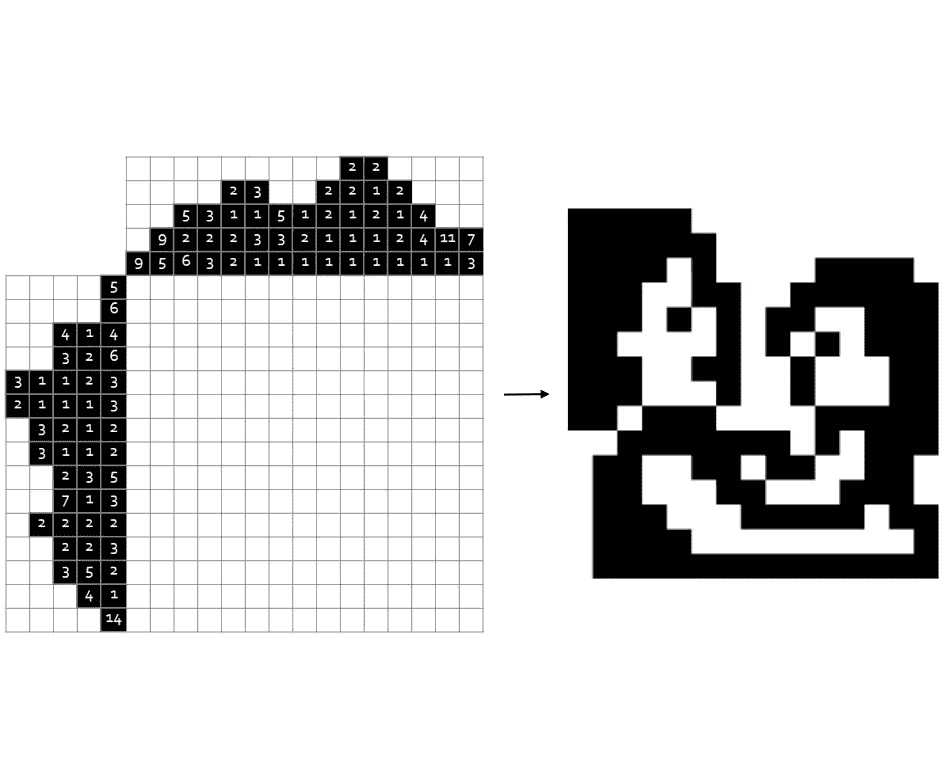

从左到右怎么走？这篇文章解释了这一切。图片作者。

## 拼图，组合和解决方案 gif。

在这篇文章中，通过计算每一行的选项，展示了一种没有任何错误的解决 Nonograms 的方法。这不是最有效的解决方法，在文章的最后你可以找到更多关于最快方法的信息。在我看来，这是最有趣的方式，因为它没有犯错的余地。作为奖励，你会学到更多关于计算问题的知识！让我们跳进来吧！

# 游戏解说

一个 Nonogram(又名 Griddler，由数字绘制，韩杰或 Picross)是一个你试图揭示一个图片的难题。这是一个有简单规则的逻辑难题。你有一个方格，每个方格都应该变成黑色或白色。网格边上和顶部的数字显示了应该在每一行和每一列中的黑色方块组。

## 求解过程

让我们从一个空的 Nonogram 开始:

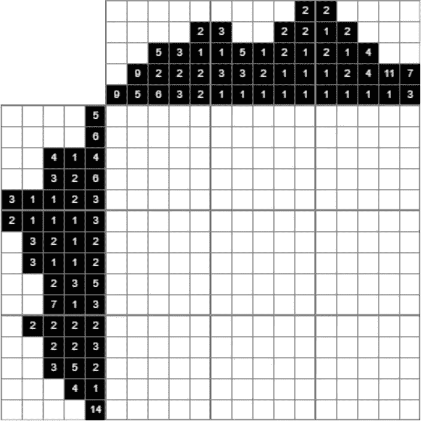

空 Nonogram。图片作者。

第三列的值为 5、2 和 6。这表示有五个、两个和六个填充方块的集合，按此顺序，在连续的集合之间至少有一个空白方块。因为 5 + 1(白方)+ 2 + 1(白方)+ 6 等于 15，这条线很好解，只有一个可能的解:

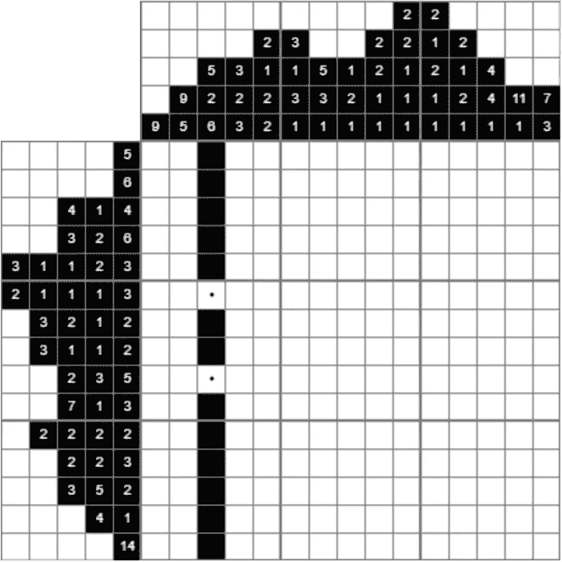

第三列只有一个可能的解决方案，因为值和空方块加起来是 15。图片作者。

圆点是帮助标记，表示这些方块应该是空的。

我们继续。最下面一行包含一组 14 个黑色方块，因为整个行有 15 个方块长，所以我们可以填充除第一个和最后一个方块之外的所有方块:

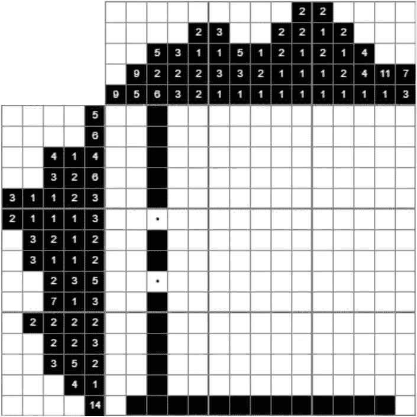

填满最后一行的方块:因为应该有一组 14 个填满的方块，我们可以确定填满这些方块。图片作者。

我们可以使用这些实心方块，因为它们与底部的列值相对应:

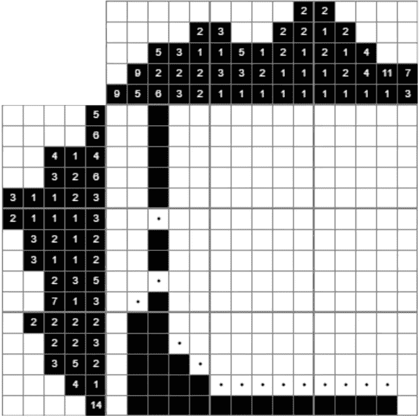

使用底部行的黑色方块:它们只能属于底部的列值。所以第二列有五个黑色方块，第四列有三个，依此类推。图片作者。

明白了吗？通过使用一些逻辑很容易解决这个 Nonogram！你可以自己试试这个或者继续看，让电脑帮你解决。

> 剧透提示:最后会有一张 gif 展示这个 Nonogram 的求解过程。

# 以编程方式求解 Nonogram

在了解了游戏规则之后，如何才能让计算机用数学解出 Nonograms 呢？

该计划包括三个步骤。第一步只发生在最开始，也是最复杂的一步，而第二步和第三步很容易理解，会一直重复，直到谜题解开。

## **第一步。计算每行和每列的所有选项**

我们首先计算所有选项，为每一行和每一列选择黑色方块(下一节将解释如果事情变得更复杂，该如何做)。这只会发生在游戏开始的时候。假设我们有一排五个正方形，我们想用一组三个正方形来填充它:

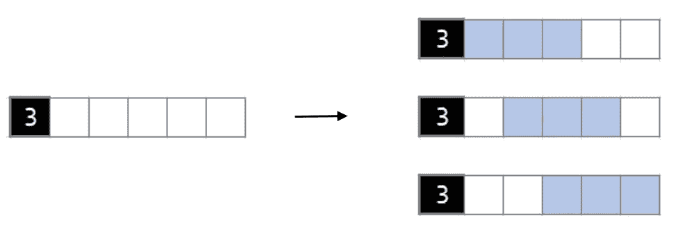

一组 3 个黑色方块的所有选项。图片作者。

这给了我们右边的三个选项。

## **第二步。填充只有一种可能性的方块**

如果您查看某一行的选项，发现某个正方形只有一种可能性，因为在所有选项中正方形都是黑色的，或者在所有选项中正方形都是白色的，所以正方形只能用这种颜色填充。这个例子说明了这一点:

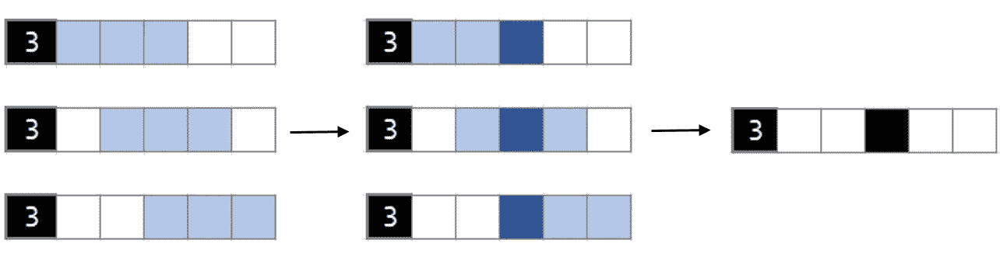

将 3 个一组放置在一排 5 个正方形中，在左侧您会看到放置该组的所有选项，在中间您会看到中间的正方形被标记，因为对于所有选项，该正方形都被填充。这个正方形应该是黑色的。图片作者。

## **第三步。从相应的行或列中删除选项**

在填充一个正方形(或使其变成白色)后，我们可以查看相应的行或列，并删除该正方形是另一种颜色的所有选项。因为这些选择已经不可能了。示例:

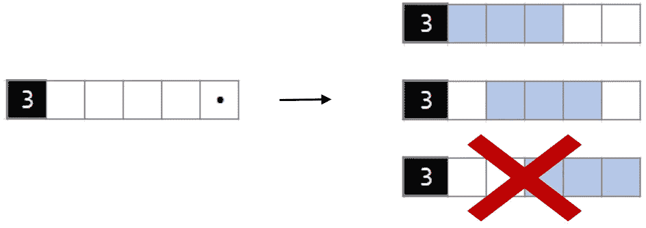

如果我们确定最后一个正方形(我们发现由于列值的原因它应该是白色的)，那么第三个选项就不再可能了，所以我们将它从这一行的选项中删除。图片作者。

## **如何计算每行每列的所有选项？**

在上面的例子中，选项的计算很简单，我们将三人组向左滑动，直到到达行尾。但是，如果我们采用一个更复杂的值列表，并试图找到所有可能的选项，会发生什么呢？另一个例子:

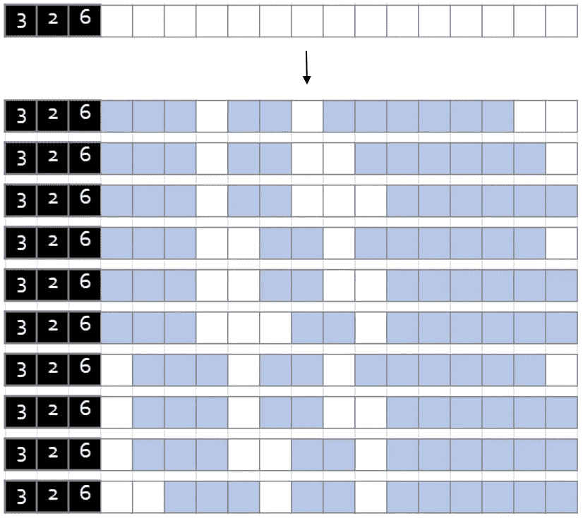

将 3、2 和 6 个黑色方块放在一排 15 个方块中的所有选项。图片作者。

在上面的例子中，我们将组 3、2 和 6 排成一排，每排有 15 个方块。我们需要至少 13 个方块来组合这些组:
*6 + 1 个白方+ 3 + 1 个白方+ 2 = 13* 这意味着我们还剩 2 个空方块(15 减 13 = 2)。

值得注意的一件有趣的事情是，对于总选项的数量，你只需要知道剩下的空方块的数量和你得到的组的数量。直观的证明:

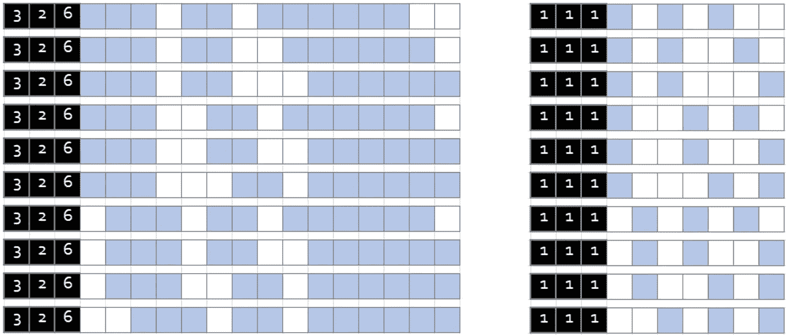

取三个组，每组一个，最后有两个空方块，我们得到的选项数与组值为 3、2 和 6 的例子中的选项数完全相同。你看到模式了吗？图片作者。

好的，我们有进展了！在本例中，我们看到，如果我们有三组值(左边是 6，2，3，右边是 1，1，1)，还有两个空方块，那么可能的选项总数是 10。

如果我们忘记了组与组之间的白色方块(无论如何，这些方块都应该在那里)，我们可以使用组合来计算选项的数量。我们得到了 5 个位置(3 组+ 2 个空方块)，需要从 5 个中选择 3 个(我们要放置 3 组)。[在这里你可以找到更多关于组合的信息](https://www.mathsisfun.com/combinatorics/combinations-permutations.html)。使用 python 和 itertools 很容易[计算出所有的组合。](https://docs.python.org/3/library/itertools.html#itertools.combinations)

```
from itertools import combinationsopts = combinations(range(n_groups+n_empty), n_groups)
```

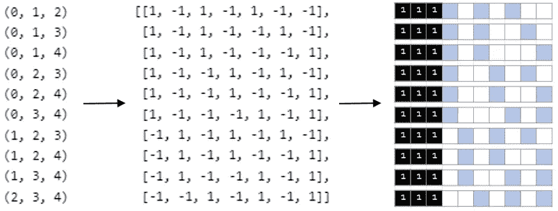

从组合到选项，再到选项的可视化。图片作者。

这也适用于 3、2、6 值，只是我们现在在以下位置放置了更多的 1:

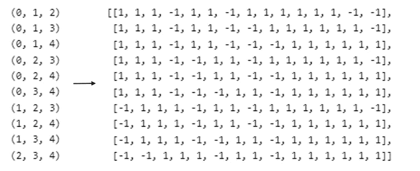

组变得有点大，但是组合和以前完全一样。

就是这样！这适用于所有的价值观。我们只需要剩下的空方块的数量和组的数量来使用组合创建所有可能的选项。

# 解决方案 gif

在创建这个程序之后，不需要手动解决一个 Nonogram。来解几个 Nonograms！🤓

先说一个小的:


作者 Gif。

它能解决我们开始的 Nonogram 吗？


作者 Gif。

是的，当然！

最后一个，一个真正大的 Nonogram 呢？


作者 Gif。

工作速度也很快！😀👌

# 密码

想用这个程序解决诺诺图吗？下面你可以找到 python 代码的要点。您只需要将行值指定为列表的列表，将列值指定为列表的列表。如果你调用`NonogramSolver`类，它将开始解析你的 Nonogram。您可以通过指定`savepath`变量来选择保存所有步骤。

# 结论

我们创建的 Nonogram 求解器有一些好处:它永远不会填充一个没有完全确定的正方形。这种方法的缺点是计算时间。如果谜题变得更大，行和列就有更多的选项，解决谜题的时间也会变得更长。另一个缺点是它不能用多解来求解 Nonograms。

幸运的是，有些人已经解决了这些问题。因此，如果你正在寻找一个超级快速的非诺姆解算器，能够处理有更多解的非诺姆解算器，你可能会觉得这篇文章很有趣。

## 有关系的

[](/how-i-learned-my-computer-to-play-spot-it-using-opencv-and-deep-learning-ad1f017a3ec3)  [](/snake-played-by-a-deep-reinforcement-learning-agent-53f2c4331d36)  [](/solving-mtvs-are-you-the-one-is-it-possible-to-never-lose-992488277099)  

*别忘了* [*订阅*](https://hennie-de-harder.medium.com/subscribe) *如果你想在我发表新文章时收到电子邮件。*