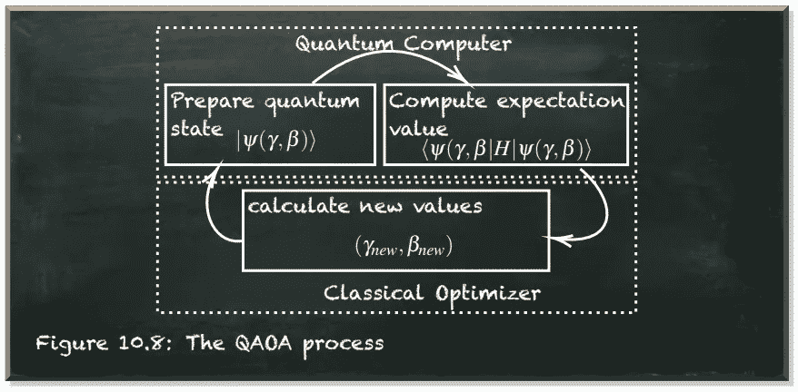
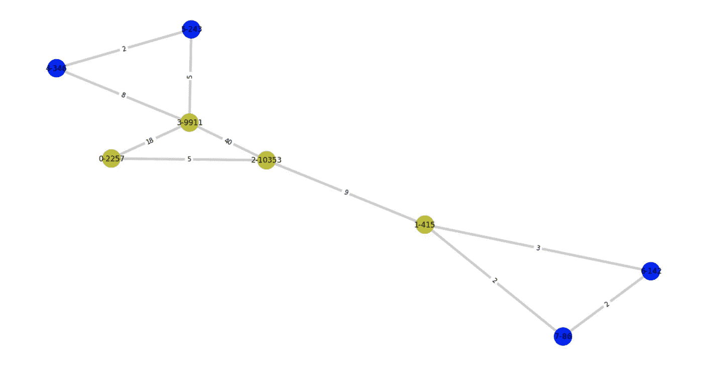
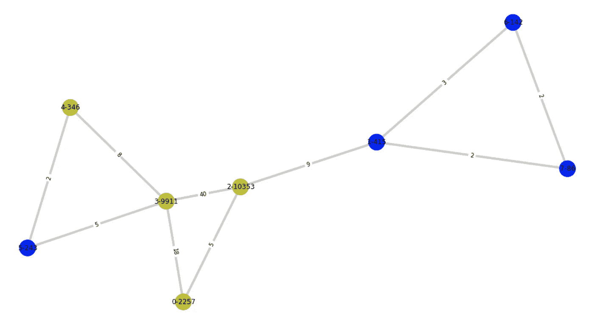
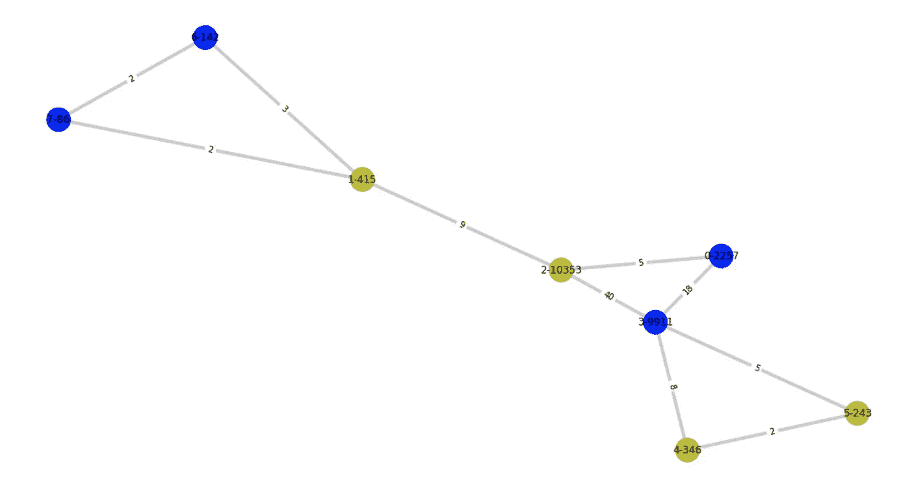

# 用量子计算机解决最优化问题出奇的容易

> 原文：<https://towardsdatascience.com/solving-optimization-problems-with-a-quantum-computer-is-surprisingly-easy-b89afd3bbbb3>

## 使用量子近似优化算法(QAOA)解决图划分问题

量子机器学习要不要入门？看看 [**动手量子机器学习用 Python**](https://www.pyqml.com/page?ref=medium_qaoaex&dest=/) **。**

*你可以在* [*下的*](https://creativecommons.org/licenses/by/3.0/)[*Kaggle*](https://www.kaggle.com/csanhueza/the-marvel-universe-social-network)*上访问这篇文章中使用的数据集。*



作者图片

假设您有一个计算密集型任务。例如，你打算从头开始训练 GPT-3。但是你不想等几百年才能完成训练。为了加快速度，你必须将所有需要的计算并行化。但是，当然，你不能简单地用 GPU 来解决问题。但是，您必须指定如何在可用的 GPU 之间分配计算。此外，你必须收集所有的解决方案部分，并把它们放回一起，以获得一个训练有素的 GPT-3。这些任务，分离和合并，需要沟通。

这个问题是图划分问题的一个实例。所以，我们用图来表示这个问题。然后，一个节点代表一个需要的计算，一条边代表它们之间的通信。

此外，我们可以使用权重来表示相关计算或通信的成本。假设我们有不止一个处理器来执行计算。由此产生的问题是如何分配它们。为了有效地并行化这样一个问题的计算，我们需要在处理器之间平衡计算，并最小化所需的通信。我们需要把图分成子图。

形式上，我们要求将节点𝑁集划分为两个大小相等的子集，以最小化连接这两个子集的边的数量。

Qiskit 在他们的`qiskit_optimization.applications`模块中提供了这个问题公式的实现。它允许我们用几行代码解决问题。

```
from qiskit_optimization.applications import GraphPartition

graph_partition = GraphPartition(use_network(8))

qaoa_optimizer = MinimumEigenOptimizer(QAOA(
    quantum_instance=QuantumInstance(Aer.get_backend("qasm_simulator"))
))

result = qaoa_optimizer.solve(
    graph_partition.to_quadratic_program()
)

print("solution:", graph_partition.interpret(result))
print("time:", result.min_eigen_solver_result.optimizer_time)
#CAPTION Solving the graph partitioning problem
```

```
solution: [[4, 5, 6, 7], [0, 1, 2, 3]]
time: 18.636014461517334
```

首先，我们导入问题公式`GraphPartition`(第 1 行)并创建一个基于八节点网络的实例(第 3 行)。

*备注:* `*use_network*` *和* `*draw_graph*` *功能是创建指定规模网络的便利功能。为了完整起见，你可以在本文末尾找到它们的实现。*

我们创建一个相应的优化器(`MinimumEigenOptimizer`)并提供一个特征求解器的实例(这里是`QAOA`)和一个`QuantumInstance`(第 5-7 行)。最后，我们基于它的二次程序表示(第 10 行)来解决这个问题(第 9 行)。结果我们得到了两个数组。让我们看看他们。

```
draw_graph(use_network(8),  ''.join(str(int(x)) for x in result.x[::-1]))
#CAPTION Display the solution
```



作者图片

乍一看，分离似乎是合理的。我们给每组分配了四个节点。然而，它不是最佳的。直觉上，我们期望有两个连接组的解决方案。但是，第一组被分成了两半。但是，看看这三个节点`0`、`2`、`3`。它们的边缘重量很大，所以切割它们的成本很高。但是，如果我们的目标是两个完全相连的组，我们将不可避免地穿过这个子组。

另一方面，两个节点`2`和`3`本身具有非常高的权重。因此，将它们放在同一个集合中似乎不是最佳的。让我们尝试改进解决方案，指定对`QAOA`(第 5-7 行)的重复次数，并重复该过程。

```
qaoa_optimizer = MinimumEigenOptimizer(QAOA(
    quantum_instance=QuantumInstance(Aer.get_backend("qasm_simulator")),
    reps=3
))
#CAPTION Specify repititions
```

```
solution: [[1, 5, 6, 7], [0, 2, 3, 4]]
time: 45.2559118270874
```

```
draw_graph(use_network(8),  ''.join(str(int(x)) for x in result.x[::-1]))
#CAPTION Display the solution
```



作者图片

同样，该解决方案没有分离节点`2`和`3`。但是，它减少了切割边的数量(3，4 之前)及其总重量(16，18 之前)。值得看看`GraphPartition`类的实现(见[源代码](https://qiskit.org/documentation/optimization/_modules/qiskit_optimization/applications/graph_partition.html#GraphPartition))。

我们在下面描述的函数`to_quadratic_program`中找到相关代码。

```
class GraphPartition(GraphOptimizationApplication):
    def to_quadratic_program(self) -> QuadraticProgram:
        mdl = Model(name="Graph partition")
        n = self._graph.number_of_nodes()
        x = {i: mdl.binary_var(name=f"x_{i}") for i in range(n)}
        for w, v in self._graph.edges:
            self._graph.edges[w, v].setdefault("weight", 1)
        objective = mdl.sum(
            self._graph.edges[i, j]["weight"] * (x[i] + x[j] - 2 * x[i] * x[j])
            for i, j in self._graph.edges
        )
        mdl.minimize(objective)
        mdl.add_constraint(mdl.sum([x[i] for i in x]) == n // 2)
        op = from_docplex_mp(mdl)
        return op
#CAPTION The graph partitioning problem in Qiskit
```

该函数首先定义`Model`(第 3 行)、变量(第 4-5 行)，以及未指定的边的默认权重(第 6-7 行)。

重要的部分是定义我们要最小化的目标函数(第 8-11 行)(第 12 行)。只有当一条边连接两个不同类的节点时，它才对这条边的权重求和(第 9 行)。这里，`i`和`j`表示边缘的位置(在第 10 行中定义)。`x[i]`和`x[j]`表示这些节点的分配。他们不是`0`就是`1`。所以。只有当`x[i]`和`x[j]`不同时，术语`(x[i] + x[j] - 2 * x[i] * x[j])`才是`1`。否则整个学期都是`0`。

此外，这个程序包含一个约束。所有节点分配的总和必须等于节点总数除以 2。因此，正好一半的节点必须在类`0`中，另一半在类`1`中。

显然，这个目标函数没有考虑节点的权重。因此，让我们自定义它并考虑节点的权重。

```
class NodeWeightedGraphPartition(GraphPartition):
    def to_quadratic_program(self) -> QuadraticProgram:
        mdl = Model(name="Graph partition")
        n = self._graph.number_of_nodes()
        x = {i: mdl.binary_var(name=f"x_{i}") for i in range(n)}
        for w, v in self._graph.edges:
            self._graph.edges[w, v].setdefault("weight", 1)
        objective = mdl.sum(
            self._graph.edges[i, j]["weight"] * (x[i] + x[j] - 2 * x[i] * x[j])
            for i, j in self._graph.edges
        ) + mdl.sum(
            self._graph.nodes[i]["weight"] * (1-2*x[i])
            for i in self._graph.nodes
        )**2
        mdl.minimize(objective)
        mdl.add_constraint(mdl.sum([x[i] for i in x]) == n // 2)
        op = from_docplex_mp(mdl)
        return op
#CAPTION The extended graph partitioning problem
```

我们创建一个新的类`NodeWeightedGraphPartition`，它有父类`GraphPartition`。所以，我们只需要覆盖我们想要改变的函数——`to_quadratic_program`函数。

我们所做的唯一更改是将节点的权重添加到`objective`函数的计算中(第 11-14 行)。除了切割边的权重，我们将所有节点的权重相加，每个乘以`(1-2*x[i])`，其中`i`是节点的索引，`x[i]`是节点的类。术语`1-2*x[i]`要么是`1`(如果`x[i]`是`0`)要么是`-1`(如果`x[i]`是`1`)。通过对这些值求和，我们最终得到两个类的节点权重之间的总差值。因为这个可以小于零，我们取平方。因此，我们对来自两个同等权重类别的解进行惩罚。

让我们看看结果如何。

```
node_graph_partition = NodeWeightedGraphPartition(use_network(8))

qaoa_optimizer = MinimumEigenOptimizer(QAOA(
    quantum_instance=QuantumInstance(Aer.get_backend("qasm_simulator"))
))

result = qaoa_optimizer.solve(
    node_graph_partition.to_quadratic_program()
)

print("solution:", node_graph_partition.interpret(result))
print("time:", result.min_eigen_solver_result.optimizer_time)
```

```
solution: [[0, 3, 6, 7], [1, 2, 4, 5]]
time: 1.92722749710083
```

```
draw_graph(use_network(8),  ''.join(str(int(x)) for x in result.x[::-1]))
#CAPTION Display the solution
```



作者图片

我们获得了与以前完全不同的解决方案。现在，节点`2`和`3`被分配到不同的类。但是，切割边缘的总数(6)和它们的重量(63)增加了。

## 结论

最重要的是要清楚我们要求我们的算法优化什么。

量子计算是一个强大的工具，在未来将变得越来越重要。尽管大多数关于这个话题的资源都非常依赖数学，但你并不需要成为数学家来理解它。像 IBM 的 Qiskit 这样的库，在避免使用量子经典优化算法的大部分复杂性方面做得非常出色。

然而，这些库并没有让您摆脱对优化目标的理解。你需要确保明确你要解决的问题。如果你在问题表述上马虎，你可能会得到错误问题的正确答案。

[](https://pyqml.medium.com/membership)  

不要错过下一集，订阅我的[子栈频道](https://pyqml.substack.com/)。

量子机器学习要不要入门？看看 [**动手用 Python 学习量子机器**](https://www.pyqml.com/page?ref=medium_qaoaex&dest=/) **。**


在这里免费获得前三章。

## 附录

下面的清单包含了本文中使用的便利函数的源代码。我们使用“漫威宇宙”数据集。在[attribute 3.0 un ported(CC BY 3.0)](https://creativecommons.org/licenses/by/3.0/)许可下，它可以在 [Kaggle](https://www.kaggle.com/csanhueza/the-marvel-universe-social-network) 上免费获得

```
def select_heroes(size):
     return dict(item for cnt, item in enumerate({
        'MEDUSA/MEDUSALITH AM': 0,
        'ARCLIGHT/PHILLIPA SO': 1,
        'WOLVERINE/LOGAN ': 2,
        'SCARLET WITCH/WANDA ': 3,
        'ARAGORN': 4,
        'OVERMIND/GROM': 5,
        'BATTLEAXE/': 6,
        'ION/': 7,
        'PINK PEARL/': 8,
        "BLACK PANTHER/T'CHAL": 9,
        'PRINCESS ZANDA': 10,
        'INFERNO III/SAMANTHA': 11,
        'MOTHER NIGHT/SUSAN S': 12,
        'VIPER II': 13,
        'IRON MAIDEN/': 14,
        'CARNIVORE/COUNT ANDR': 15,
        'HULK III/BRUCE BANNE': 16,
        'DEADPOOL/JACK/WADE W': 17,
        'BLIND AL/ALTHEA': 18,
        'WEASEL/JACK HAMMER': 19,
        'MONTGOMERY': 20
    }.items()) if cnt < size)
#CAPTION Select a subset of heroes

def use_network(size):
    data = pd.read_csv('./data/hero-network.csv')
    heroes = select_heroes(size)

    # filter the relations from the raw data
    relations = data[(data.hero1.isin(heroes.keys())) & (data.hero2.isin(heroes.keys()))]
    relations = pd.DataFrame(np.sort(relations.values, axis=1), columns=relations.columns)

    # build unique relations with counts
    relations['relation'] = [' - '.join(x) for x in np.sort(relations.to_numpy(), axis=1)]    
    summed_relations = relations.groupby(['relation']).size().reset_index().rename(columns={0:'count'})
    summed_relations = pd.merge(summed_relations, relations, on='relation', how='right').drop_duplicates(subset=['hero1', 'hero2'])

    # count the overall appearences of the heroes
    count_series1 = data.groupby(['hero1']).size()
    count_series2 = data.groupby(['hero2']).size()
    appearences = count_series1.add(count_series2, fill_value=0)

    # create the graph
    graph = nx.Graph()
    graph.add_nodes_from(heroes.values())
    graph.add_edges_from([(
            heroes[rel[1][2]],
            heroes[rel[1][3]]
        ) for rel in summed_relations.iterrows()])

    # add node weight
    for hero in heroes:
        graph.nodes[heroes[hero]]["weight"] = appearences[hero]
        graph.nodes[heroes[hero]]["name"] = hero

    # add edge weights
    edge_weights = dict((
            (heroes[rel[1][2]], heroes[rel[1][3]]),
            rel[1][1]
        ) for rel in summed_relations.iterrows())
    nx.set_edge_attributes(graph, edge_weights, "weight")

    return graph
#CAPTION Create the network graph

def draw_graph(graph, solution=None, seed=None):
    labels = dict( (key, f"{key}-{val:.0f}") for (key, val) in nx.get_node_attributes(graph, 'weight').items())
    edge_labels = nx.get_edge_attributes(graph, 'weight')

    plt.figure(1,figsize=(16,6)) 
    plt.tight_layout()
    plt.subplots_adjust(bottom=-.5, right=0.5, left=-.5)

    node_color = ["b" if solution[-1-i] == '0' else "y" for i in range(len(solution))] if solution is not None else "#ABABAB"

    pos = nx.spring_layout(graph, seed=seed)
    nx.draw_networkx_nodes(graph, pos=pos, node_color=node_color, node_size=800)
    nx.draw_networkx_edges(graph, pos, width=4, edge_color ="#CDCDCD")
    nx.draw_networkx_labels(graph,pos=pos, labels=labels, font_color="#000", font_size=12)
    nx.draw_networkx_edge_labels(graph, edge_labels=edge_labels, pos=pos)
    plt.show()
#CAPTION Draw the simple graph
```