# 使用 Python 中的 NetworkX 解决德国的旅行推销员问题

> 原文：<https://towardsdatascience.com/solving-the-travelling-salesman-problem-for-germany-using-networkx-in-python-2b181efd7b07>

## 使用 Christofides 算法，在访问德国 16 个联邦州的首府城市时，发现穿越每个城市的最短路线。

我已经在德国住了六年了。德国是由 16 个联邦州组成的，到目前为止我已经访问了 5 个州的首府。最近，我想到了一个想法:

> 我想穿越所有 16 个联邦州的首府，并且从柏林开始，到柏林结束，每个城市只去一次。这样做的最短路线是什么？

这类问题被称为**旅行推销员问题(TSP)** 。顾名思义，旅行推销员会挨家挨户，或在一个特定的地域内挨家挨户地推销自己公司的产品或服务。TSP 处理寻找恰好一次覆盖所有点的最短路线，因为这将是在成本、时间和能量方面最有效的路线。


图片由[安德鲁·怀斯](https://unsplash.com/@joincapture)在 [Unsplash](http://www.unsplash.com) 上拍摄。

# TSP 是一个 NP 难问题

决策问题是一个有“是”或“否”答案的问题。可能有不同的复杂度等级来解决它。比如:

*   P 是一个复杂类，其中决策问题可以通过确定性图灵机(DTM)在多项式时间内解决。对于某个非负整数 *k* ，多项式时间算法的执行时间为 *O(nᵏ)* 级，其中 *n* 是输入的复杂度。

可以用多项式时间算法解决的问题称为易处理问题。这种算法的例子有线性搜索 *(O(n))* 、二分搜索法 *(O(log n))* 、插入排序 *(O(n ))* 、合并排序 *(O(n log n))* 和矩阵乘法 *(O(n ))* (Bari，2018 和 Maru，2020)。

*   **NP** (非确定性多项式时间)是指一组可以用非确定性图灵机(NTM)在多项式时间内解决的决策问题。一个 NTM 可以有一组动作来解决问题，但是每次执行的转换都是不确定的(随机的)。一旦为 NP 问题提供了潜在的解决方案，DTM 可以在多项式时间内验证其正确性(Viswarupan，2016)。

一个算法，今天是非确定性的，如果明天有人找到它的解，它也可以是确定性的(Bari，2018 和 Maru，2020)。这意味着 DTM 在多项式时间内可以解决的问题也可以由 NTM 在多项式时间内解决。因此， **P 是 NP** 的子集。

*   **NP-hard** 是“至少和 NP 中最难的问题一样难”的决策问题的复杂性类别。一个问题 *H* 是 **NP-hard** 当 NP 中的每一个问题 *L* 都可以在多项式时间内 [**约化**](https://www.cs.umd.edu/class/fall2017/cmsc451-0101/Lects/lect19-np-reduc.pdf) 为*H*；即假设求解 *H* 需要 1 个单位时间，那么 *H* 的解可以用来在多项式时间内求解 *L* 。 *H* 和 *L* (是或否)的解法也必须相同。

TSP 是一个 NP 难问题。这意味着，如果有大量的城市，在“合理”的时间内评估每个可能的解决方案是不可行的(Hayes，2019)。

# 哈密尔顿/哈密尔顿循环

要解决旅行商问题(TSP)，首先需要理解哈密尔顿圈(也称为哈密尔顿圈)的概念。一个**哈密尔顿循环**是一个图循环(闭环)，它通过一个图恰好访问每个节点一次(Mathworld，2022a)。这是以威廉·罗恩·汉密尔顿爵士的名字命名的，他通过一个叫做哈密尔顿难题的游戏引入了这个概念。

在具有`n`个节点的图中，如果我们将顺时针和逆时针路径视为两条不同的路径，则可能的哈密尔顿圈的总数由`(n-1)!`给出。如果我们认为顺时针和逆时针路径相同，就有`(n-1)!/2`可能的哈密顿圈。

让我们以四个城市为例:柏林、杜塞尔多夫、汉堡和慕尼黑。我的目标是穿越这四个城市，起点和终点都在柏林，同时正好经过这四个城市之间的一次。本例中可能的唯一路径(哈密尔顿圈)的数量由(4–1)给出！= 3!= 6.

在下面的代码中，`cities`是这四个城市的列表，但是`start`和`end`是柏林。其他三个城市定义为`*rest`。这三个城市的排列一次占据所有三个城市，导致所有可能的汉密尔顿循环。这显示在下面的 Python 代码中。

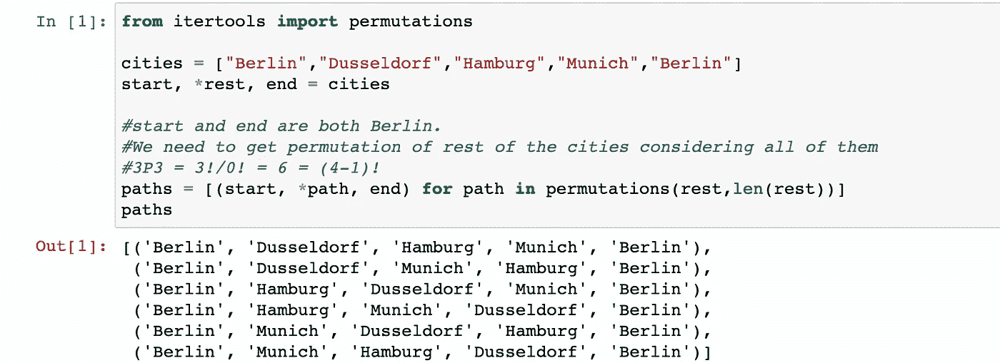

Python 代码生成除柏林之外的三个城市的排列，一次取全部三个。图片作者。

在下面的要点中，`make_tsp_tree`函数首先创建一个 Hamilton 路径列表，然后从这些路径列表中创建一个有向前缀树，然后通过删除根节点和 nil 节点返回 graph 对象`G`。使用 Graphviz 的[点布局](https://graphviz.org/docs/layouts/dot/)设置`G`中每个节点的位置，Graphviz 在有向图中设置层次结构。

这四个城市列表的哈密尔顿路径如下图所示:

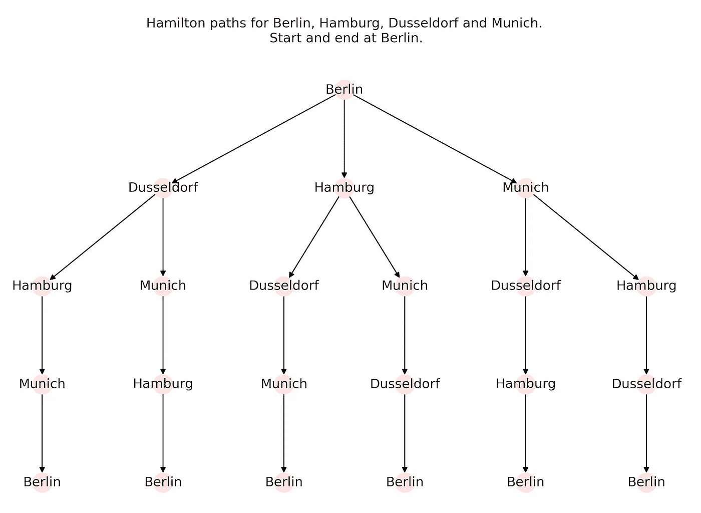

示例中四个城市的汉密尔顿路径。图片作者。

# 在德国地图上对 16 个州的首府进行地理编码和绘图

我把德国 16 个州首府的列表定义为`capitals`。使用一个叫做地理编码的过程，我可以得到所有 16 个城市的`coordinates`。在这个[故事](https://medium.com/towards-data-science/network-and-interconnection-in-python-maps-6c797580b3b1)中详细描述了使用 geopy 包进行地理编码的过程。

```
capitals = [‘Berlin’, ‘Bremen’, ‘Dresden’, ‘Dusseldorf’,
            ‘Erfurt’, ‘Hamburg’, ‘Hannover’, ‘Kiel’,
            ‘Magdeburg’, ‘Mainz’, ‘Munich’, ‘Potsdam’,   ‘Saarbrucken’, ‘Schwerin’, ‘Stuttgart’, ‘Wiesbaden’]
```

使用 GeoPandas 包，我在名为`germany`的地理数据框架中提取德国地图。为了绘制`germany`中的`capitals`，首先我使用 NetworkX 创建一个图形对象`G`。然后我创建 16 个节点，每个城市一个。接下来，我为`positions`创建一个每个城市的节点和坐标的字典。我为`labels`创建了另一个节点和首都名称的字典。下面的截图给出了代码和生成的地图。

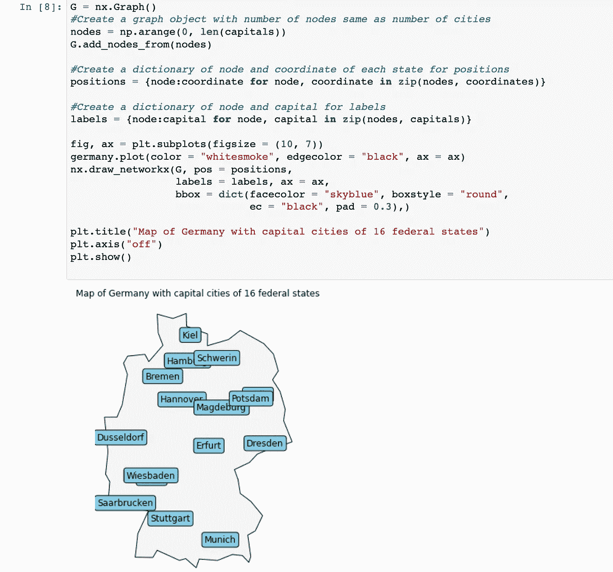

使用 GeoPandas 和 NetworkX 在德国地图上绘制 16 个联邦州的首府。图片作者。

# 德国任何两个首都之间所有可能的路径

下一步是确定和绘制德国任何两个城市之间所有可能的路径。由于我们的列表中有 16 个城市，因此任意两个城市之间的可能路径数为ⁿCᵣ = ⁶C₂ = 120。在现有的图形对象`G`中，我添加了任意两个节点之间的边，除了它本身，如下所示:

```
for i in nodes:
     for j in nodes:
          if i!=j:
               G.add_edge(i, j)
```

用带有最近添加的边的`germany`绘制更新的图形对象`G`,如下所示:

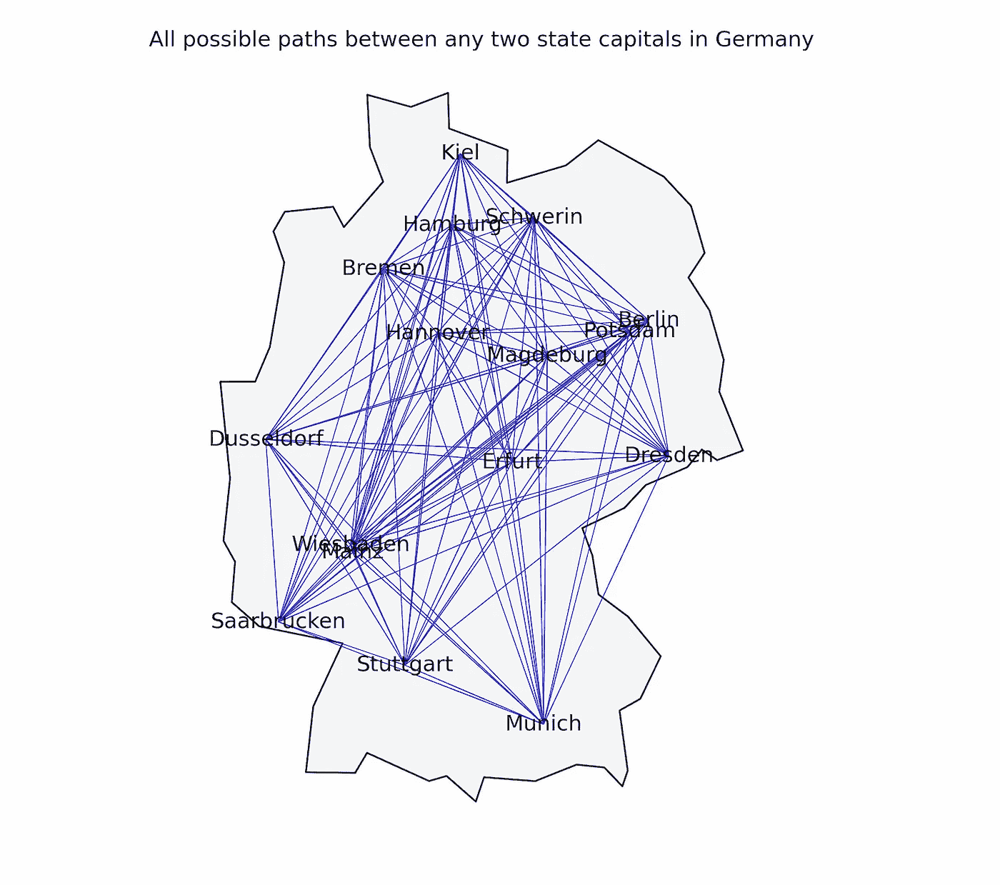

所有可能的路径(120)由德国 16 个联邦州中任意两个城市之间的蓝色边缘表示。图片作者。

我创建了`H`作为`G`的备份供以后使用。

接下来，我计算德国所有两个城市之间的欧几里德距离，这些信息作为边的权重存储在`G`中。因此，`G`现在是一个**完全加权图**，其中一条边连接每对图节点，并且每条边都具有与之相关联的权重。

```
H **=** G**.**copy()

*#Calculating the distances between the nodes as edge's weight.*
**for** i **in** range(len(pos)):
     **for** j **in** range(i **+** 1, len(pos)):

        *#Multidimensional Euclidean distan* dist **=** math**.**hypot(pos[i][0] **-** pos[j][0], pos[i][1] **-** pos[j][1])
          dist **=** dist
          G**.**add_edge(i, j, weight**=**dist) 
```

城市之间的距离可以在下表中以矩阵形式观察到。在下表中，在主对角线上观察到的城市之间的距离为零。主对角线上方的所有条目都反映在对角线下方的相等条目中。因此，它是一个**中空(零对角线)对称矩阵**的例子。


德国 16 个联邦州首府之间的距离矩阵。图片作者。

# 求解 TSP 的算法

为了找到解决方案`cycle`，NetworkX 对无向图**、**使用默认算法 **Christofides 算法**，作为解决方案`cycle`一部分的边列表存储为`edge_list`。这在下面的代码中实现:

```
cycle **=** nx_app**.**christofides(G, weight**=**"weight")
edge_list **=** list(nx**.**utils**.**pairwise(cycle))
```

## 克里斯托菲迪斯算法

Christofides 算法在距离形成一个[度量空间](https://www.britannica.com/science/metric-space)的情况下找到 TSP 的近似解(它们是对称的，并且遵守三角形不等式，即在 ABC 中，a+b≥c ) (Goodrich 和 Tamassia，2014)。这种算法是以塞浦路斯数学家尼科斯·克里斯托菲德斯的名字命名的，他在 1976 年发明了这种算法。到目前为止，该算法提供了解决 TSP 的最佳近似比(克里斯托菲德斯，2022)。

下面给出了该算法的基本步骤。这些步骤已经在 NetworkX [这里](https://networkx.org/documentation/stable/_modules/networkx/algorithms/approximation/traveling_salesman.html#christofides)的源代码中实现。我还说明了我们的问题的算法逐步实施。

1.  **求 *G* 的最小(重量)生成树 *T* 。**

加权、连通、无向图的最小生成树(此处为`G`)是由连接所有连通节点(此处为 16 个)的边的子集组成的图，同时最小化边上权重的总和。

NetworkX 使用一个 [Kruskal 算法](https://www.programiz.com/dsa/kruskal-algorithm#:~:text=Kruskal%27s%20algorithm%20is%20a%20minimum,be%20formed%20from%20the%20graph)来寻找最小生成树(NetworkX，2015)。对于德国及其 16 个联邦州的首都来说，情况如下:

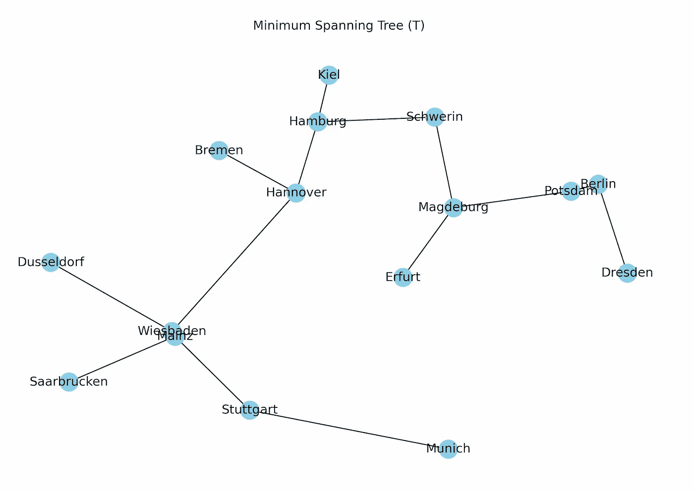

最小生成树( *T)* 为德。图片作者。

**2。在 *T* 中做一组奇数度 *O* 的节点。**

在下一步中，创建一组名为 *O* 的节点，其中每个节点的度数都是奇数。从上面的树中，我们看到柏林、波茨坦、斯图加特和施韦林的度都是 2，即偶数。因此，这些节点在新的集合 *O* 中被移除，如下所示:

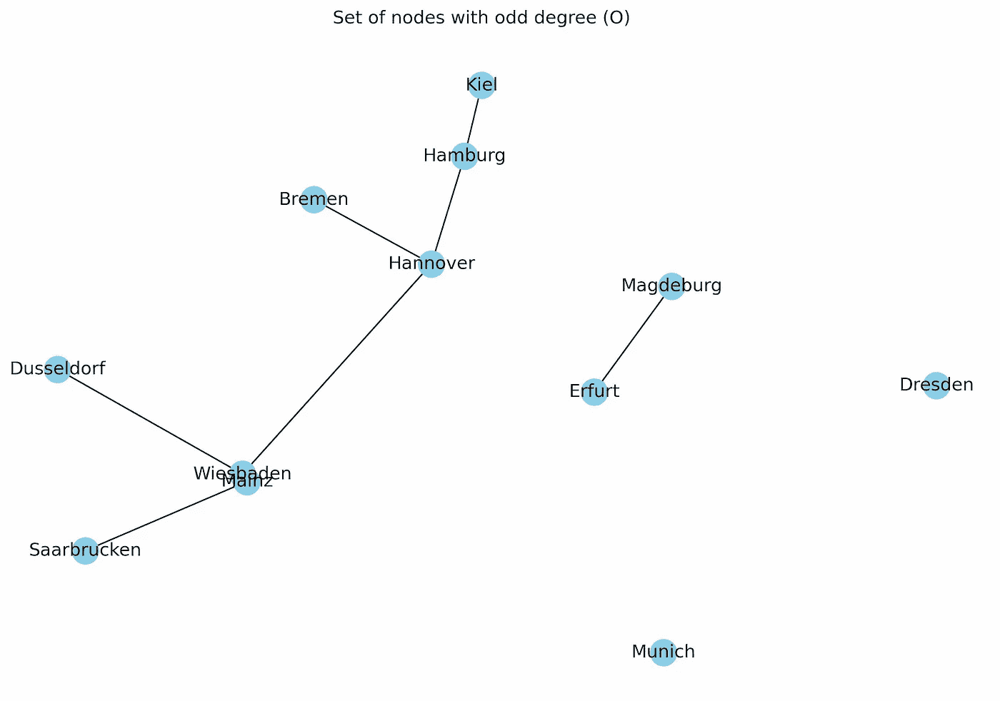

T 中奇数度(O)的节点集。图片作者。

**3。从 *O* 的顶点给出的诱导子图中找到一个** [**最小权完美匹配**](https://networkx.org/documentation/stable/reference/algorithms/generated/networkx.algorithms.matching.min_weight_matching.html) ***M* 。**

为了有一个**完美匹配**，在一个图中需要有个偶数个节点，并且每个节点恰好与另一个节点相连。因此，完美匹配是包含 n/2 条边的匹配(最大可能)(Mathworld，2022b)。

最小权重完美匹配 *M* 计算完美匹配，使匹配边的权重最小化，如下图所示。

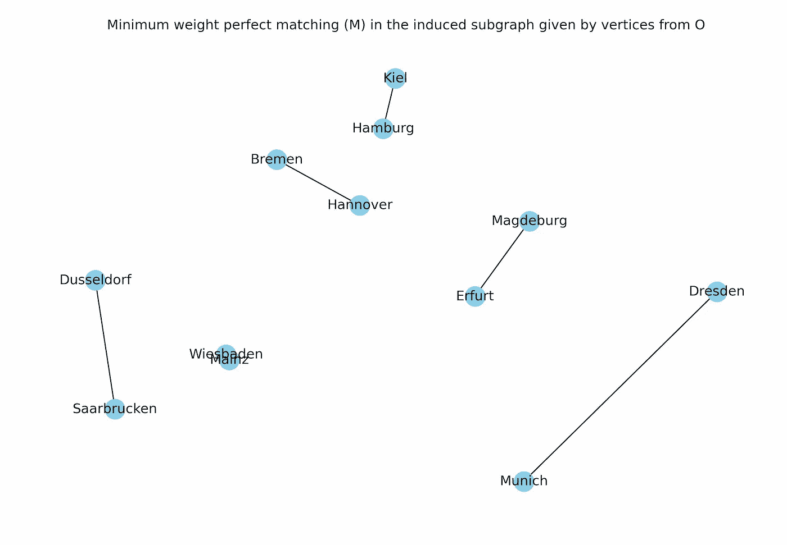

由 O. Image 的顶点给出的诱导子图中的最小权完美匹配(M)。

**4。将 *M* 和 *T* 的边缘组合在一起，形成一个相连的多联图 *H* 。**

在下一步中，该算法将步骤 1 中的*T**的边与步骤 3 中的 *M* 的边组合起来，以形成连通的多图 *H* 。*

*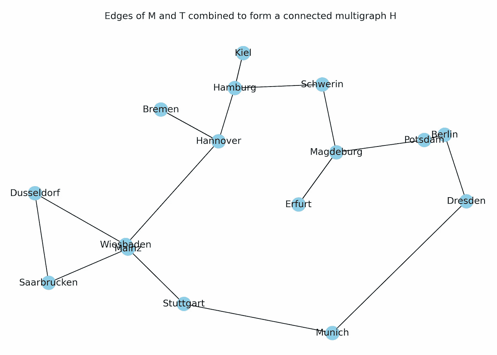*

*步骤 1 中 T 的边和步骤 3 中 M 的边的联合产生作者的 H. Image。*

***5。用 M 和 t 的边建立一个欧拉电路***

*下一步，Christofides 算法使用 *M* 和 *T* 的边缘构建欧拉电路。欧拉回路是有限图中恰好访问每条边一次的轨迹。欧拉电路中的每个节点都必须有偶数度(麻省理工开放式课程，2016)。哈密尔顿圈和欧拉圈的区别在于，哈密尔顿圈恰好经过每个节点一次，结束于初始节点，而欧拉圈恰好经过每个边一次，结束于初始节点。*

*注:一个循环可以是汉密尔顿循环，也可以是欧拉循环。*

***6。通过跳过重复的节点，将欧拉循环转换为哈密尔顿循环。***

*在我们的 TSP 的例子中，在欧拉电路中可能有一些重复的节点。这种节点的度大于 2，即该节点被访问了不止一次。Christofides 算法利用一个**快捷**函数从欧拉电路中移除重复节点，并创建一个`cycle`。因此，TSP 的解决方案是通过使用`cycle`中节点之间的连续边列表来实现的。*

*Christofides 算法产生的解的权重在最优值的 3/2 以内(麻省理工学院开放课件，2016)。*

*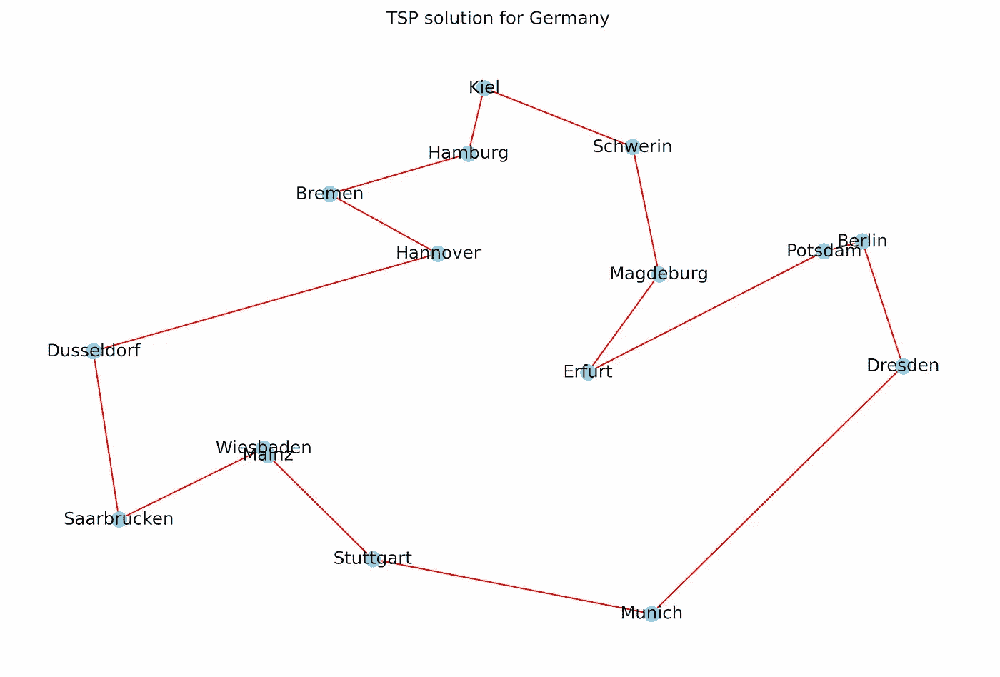*

*德国 TSP 解决方案。图片作者。*

# *使用 NetworkX 直接实施 TSP 解决方案*

*使用如上所述的克里斯托菲迪斯算法，TSP 的解由`cycle`给出。由于`cycle`只包含了`capitals`城市的指数，我得到了表示城市顺序为`tsp_cycle`的求解路线，如下图所示。*

*如下面截图中的[17]所示，我在德国地图上用蓝线标出了任意两个城市之间所有可能的路径。红线代表`edge_list`，它包含城市之间的边列表，这些边是解决方案`cycle`的一部分。*

*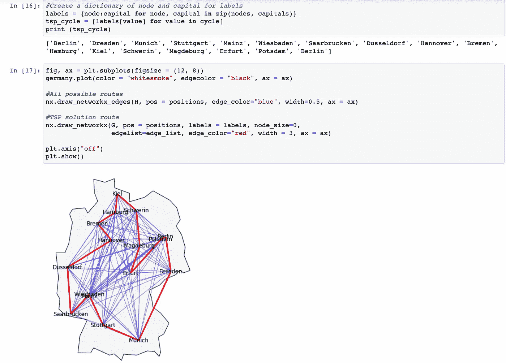*

*获得针对德国的 TSP 的解决方案路线，并将其绘制在德国地图上。图片作者。*

*下图通过移除两个城市之间的蓝色(所有可能的)边，仅用红色绘制德国 TSP 的解决方案，提供了一个更清晰的解决方案。*

*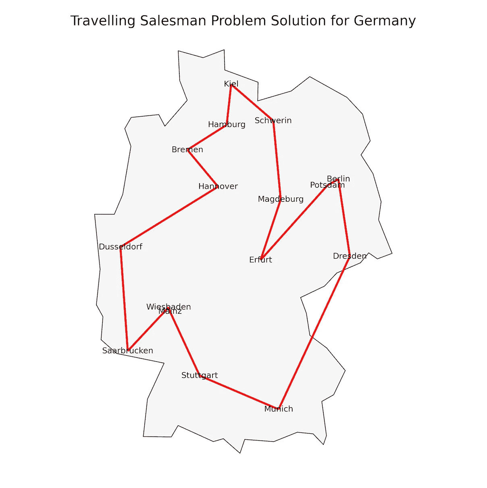*

*德国 TSP 的解决方案路线，用红边表示。图片作者。*

## *用独特的颜色为每条边绘制解决方案*

*我想让我的解决方案更吸引人一点，为城市之间的每条边绘制一种独特的颜色。*

*计算机显示器上使用的任何颜色都可以表示为可见光谱中 RGB(红、绿、蓝)的比例(Mathisfun，2021)。因此，在 Python 中，任何颜色都可以表示为#RRGGBB，其中 RR、GG 和 BB 具有从 00 到 ff 的十六进制值。#000000 代表白色，而#ffffff 代表黑色。*

*我创建一个名为`get_colors(n)`的函数，根据十六进制的#RRGGBB 的随机值创建一个随机颜色列表。*

```
*import random
get_colors = lambda n: list(map(lambda i: “#” +”%06x” % random.randint(0, 0xffffff),range(n)))*
```

*在下面的代码中，我将`get_colors(16)`作为`edge_color`进行传递。*

```
*fig, ax = plt.subplots(figsize = (20, 12))germany.plot(ax = ax, color = “whitesmoke”, edgecolor = “black”)# Draw the route
nx.draw_networkx(G, pos = positions, labels = labels, 
 edgelist=edge_list, edge_color=get_colors(16), width=3,
 node_color = “snow”, node_shape = “s”, node_size = 300,
 bbox = dict(facecolor = “#ffffff”, boxstyle = “round”,ec = “silver”),
 ax = ax)plt.title(“Travelling Salesman Problem Solution for Germany”, fontsize = 15)
plt.axis(“off”)*
```

*结果，我得到了下面的图，这是丰富多彩的，比前面的更有吸引力，解决方案中的每个边都有独特的颜色。*

*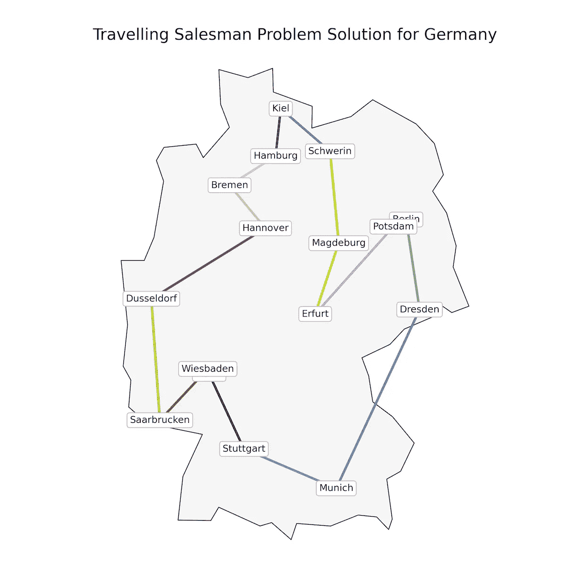*

*适用于德国的 TSP 解决方案，每条边都有独特的颜色。图片作者。*

## *使用叶子绘制解决方案*

*也可以使用[叶](https://python-visualization.github.io/folium/)包在交互式传单地图中绘制上面的图。*

*为此，我将`coordinates`修改为`folium_coordinates`，将`cycle`修改为`route`。这些都是相同的数据，但是采用了新的格式:一个 GPS 坐标列表(纬度和经度)的列表，与 folium 兼容。*

*接下来，我在北纬 51 度、东经 10 度的位置创建了一张地图`m1`，这是德国的大概坐标。我选择 OpenStreetMap 图块和 6 点的`zoom_start`。我在地图上每个城市的坐标处添加一个标记。最后，我使用反映 TSP 解决方案的`route`在地图上绘制折线覆盖图。*

*生成的图显示在交互式传单地图中:*

**

*德国 TSP 的解决方案路线使用 lyus 绘制。为每个城市添加标记，并在地图上绘制解决方案路线。图片作者。*

# *结论*

*这篇文章的问题陈述是寻找最短的路线穿越德国 16 个联邦州的首都城市，从柏林开始，到柏林结束，同时访问中间的每个城市一次。我首先描述了解决任何决策问题的不同复杂性类别:P(多项式时间)、NP(非确定性多项式时间)和 NP-hard。接下来，我讨论了哈密尔顿循环的概念。*

*我使用地理编码找到了德国 16 个联邦州的首府城市的坐标，并使用 GeoPandas 包将它们绘制在德国地图上。我添加了地图上任意两个城市之间的所有边。接下来，我演示了 Christofides 算法如何通过它的逐步实现为旅行推销员问题提供解决方案。最后，我使用 NetworkX、GeoPandas 和 Matplotlib 包为这个问题绘制了一个清晰的解决方案。我还用独特的颜色绘制了每个边缘的解决方案，并使用 follow 包绘制了活页包装中的解决方案。*

*这个故事中的分析实现可以在这个 [GitHub 存储库](https://github.com/hbshrestha/Geospatial-Analysis)中获得。如果你想进一步了解 Python 图形可视化的基础知识，你可以参考下面的故事和本系列的其他相关故事。*

*[](/graph-visualisation-basics-with-python-part-ii-directed-graph-with-networkx-5c1cd5564daa) [## Python 图形可视化基础第二部分:NetworkX 有向图

### 用 NetworkX 软件包创建有向无环图

towardsdatascience.com](/graph-visualisation-basics-with-python-part-ii-directed-graph-with-networkx-5c1cd5564daa) 

感谢您的阅读！

# 参考

巴里，2018。 [NP 难和 NP 完全问题](https://www.youtube.com/watch?v=e2cF8a5aAhE)。

克里斯托菲德斯，2022 年。[旅行商问题新启发式算法的最坏情况分析](https://link.springer.com/article/10.1007/s43069-021-00101-z)。

古德里奇和塔玛西亚，2014 年。[算法设计与应用| Wiley](https://www.wiley.com/en-us/Algorithm+Design+and+Applications-p-9781118335918)

海耶斯，2019。[用 Python 解决旅行推销员问题。](/solving-travelling-salesperson-problems-with-python-5de7e883d847)

丸，2020。 [P，NP，NP 难和 NP 完全问题|归约| NP 难和 NP 难|多项式类](https://www.youtube.com/watch?v=ivkQBh74SNo)。

马图塞克，1996 年。[多项式时间算法。](https://www.seas.upenn.edu/~cit596/notes/dave/p-and-np2.html#:~:text=A%20polynomial%2Dtime%20algorithm%20is,algorithm%20are%20called%20tractable%20problems.)

Mathisfun.com，2021 年。[十六进制颜色。](https://www.mathsisfun.com/hexadecimal-decimal-colors.html#:~:text=Hexadecimals&text=So%20one%20hexadecimal%20digit%20can,256%20different%20levels%20of%20color)

数学世界，2022a。[哈密顿循环](https://mathworld.wolfram.com/HamiltonianCycle.html#:~:text=A%20Hamiltonian%20cycle%2C%20also%20called,to%20be%20a%20Hamiltonian%20graph.)。

数学世界，2022b。[完美搭配。](https://mathworld.wolfram.com/PerfectMatching.html)

麻省理工学院开放式课程，2016。 [R9。近似算法:旅行推销员问题](https://www.youtube.com/watch?v=zM5MW5NKZJg&t=1098s)

NetworkX，2015。[最小生成树。](https://networkx.org/documentation/networkx-1.10/reference/generated/networkx.algorithms.mst.minimum_spanning_tree.html)

Tutorialspoint，2022。[非确定性图灵机](https://www.tutorialspoint.com/automata_theory/non_deterministic_turing_machine.htm#)。

维斯瓦鲁潘，2016。 [P vs NP 问题](https://niruhan.medium.com/p-vs-np-problem-8d2b6fc2b697)。*