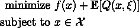
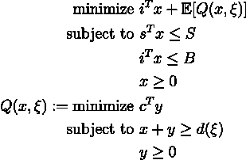
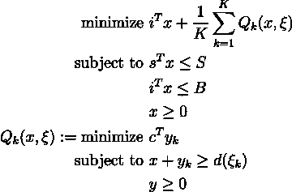

# 在 Gurobi 中求解两阶段随机规划

> 原文：<https://towardsdatascience.com/solving-two-stage-stochastic-programs-in-gurobi-9372da1e3ba8>

泰勒·维克在 [Unsplash](https://unsplash.com/s/photos/servers?utm_source=unsplash&utm_medium=referral&utm_content=creditCopyText) 上的照片

## 两阶段随机服务器群问题的公式化和求解

随机规划(SP)是一个框架，用于建模包含不确定性的优化问题[1]。在许多情况下，SP 模型采取两阶段问题的形式。第一阶段包括寻找最优的确定性决策。这些决定是基于我们知道是确定的信息(也就是此时此地的决定)。考虑到我们第一阶段的决策，第二阶段涉及做出依赖于随机性的决策(也称为求助决策)。优化问题旨在最小化第一阶段决策导致的损失(或最大化利润)加上第二阶段决策导致的预期损失。从数学上讲，这可以写成以下格式:

2SP 通用表格(图片由作者提供)

在本文中，我将演示如何使用 Gurobi 来制定和解决其中的一个问题。

# 激励范例

让我们用一个例子来透视这个框架:一个服务器场问题。假设我们正在尝试为公司设计一个服务器群，考虑到我们拥有的空间和购买服务器的前期预算，我们需要安装 CPU、GPU 和 TPU 核心来帮助处理公司的计算资源。我们对每个资源下个月的需求以及它们的分布有一个大概的估计。为了简单起见，我们将忽略下个月以后的几个月(尽管可以通过一个多阶段随机程序来处理这个问题)。

未来运行服务器将花费少量成本，但如果我们不能满足需求，我们将不得不利用云计算资源，这将大大增加我们的运营成本。
在这个例子中，我们的第一阶段决策(此时此地的决策)是购买每种资源的数量。第二阶段(追索权)决策是购买云计算的数量。我们的目标是最小化服务器群的运营成本。这个优化问题可以写成如下:

服务器群 2SP 公式(图片由作者提供)

其中 *x* 表示我们将购买每个内核的数量， *y* 表示我们将利用多少云计算， *i* 是我们的安装成本， *B* 是我们的安装预算， *s* 是内核的大小， *S* 是我们的可用空间， *c* 是我们的云计算成本， *d(xi)* 是我们的随机需求。

# 解决 SP

为了解决上面的问题，我们将实现一种叫做样本平均近似的技术[【2】](https://doi.org/10.1137/S1052623499363220)。这种方法包括通过蒙特卡罗抽样生成随机变量的大量( *K* )潜在实现(场景)，并将每个实现视为一个单独的子问题[【2】](https://doi.org/10.1137/S1052623499363220)。这有助于将随机性离散化，从而在不损失太多信息保真度的情况下使其可解。这意味着我们将有 *K* 个变量，而不是只有一组第二阶段变量，第二阶段值的期望值是我们实现的平均值。这样，我们的公式变为:

SAA 重构(图片由作者提供)

虽然该公式可以在各种编程语言和线性编程求解器(例如 SCIP、CPLEX、CVXPY)中实现，但我们将专注于使用商业级、最先进的数学编程求解器 Gurobi 来解决这个问题。Gurobi 有针对 Python、MATLAB、R 和 Java 等语言的 API，但是它的大多数用户更喜欢使用 Python API [4]，所以我们将在这里使用它。

首先，我们将导入我们的包(`numpy`和`gurobipy`)并为我们的问题初始化(组成)数据。

这个问题中`i`是投资成本，`s`是每个项目占用的空间，`B`是我们的预算，`S`是我们的最大空间。另一个值得注意的变量是每个场景中的需求`d_xi`。然后我们可以用古罗比来解决我们的问题。首先，我们将使用`gp.model()`定义我们的模型，设置目标(最小化)以及初始化我们的决策变量。

从上面的例子中可以看出，我们的需求(`d_xi`)和我们的第二阶段决策变量(`y`)都不是一维向量，而是一个矩阵，因为这两个变量在我们的公式中都有一个场景索引。在此之后，我们可以定义我们的目标函数:

Gurobi 的一个优点是，在定义约束和目标时，它支持`numpy`矩阵乘法运算，如果考虑矩阵乘法(例如`i @ x`)。Gurobi 还支持求和运算，这也降低了进入门槛。这里我们计算第一阶段的成本，然后取第二阶段的平均成本。

我们现在可以继续定义我们的约束条件:

第一行代码确保安装内部服务器的成本不会超出我们的预算`B`。第二行确保我们只购买我们有空间的服务器。第三行代码确保场景 k 中安装的服务器数量和利用的云计算资源数量足以满足场景 k 中的需求。

现在问题已经完全定义好了，我们可以简单地通过调用`m.optimize()`来解决问题并得到我们的最优决策:

最佳变量值存储在我们定义的每个变量中，可以通过`variable_name.x`访问。虽然我们可能已经获得了 *x* 和 *y* 变量的最优值，但是我们只关心我们现在可以做出的决定( *x* )。

# 限制

这种方法为我们提供了高质量的解决方案，但也有缺点。

第一个不利之处是，随着场景数量的增加，模型将变得更加难以求解。例如，我们只需要做出 6 个真正的决策，但是使用样本平均近似值使我们的模型做出了 153 个决策(50 个场景中的 3 个第一阶段，3 个第二阶段)。这意味着分解算法(如线性 SPs 的 Benders 分解[3])通常需要用于并行化计算。

另一个考虑是，不幸的是，Gurobi 不是自由软件。虽然 Gurobi 确实提供了许多学生和研究人员利用的学术许可证，但不属于大学的个人可能会发现很难获得该软件的访问权限。Gurobi 的一个开源替代方案是 SCIP [5]。两者共享相似的建模语言，因此 Gurobi 用户可以很容易地适应 SCIP，反之亦然。出于个人偏好以及 Gurobi 的快速求解性能，我选择用 Gurobi 而不是 SCIP 来演示这个概念。这并不意味着 SCIP 就低人一等。事实上，许多专注于开发或改进优化算法的优化研究人员更喜欢 SCIP，因为它的开源特性允许用户调整求解器的每个部分，从而允许他们尝试新的方法。

# 资源和参考资料

这个问题的完整代码可以在[这里](https://gist.github.com/upadhyan/0473135e849d167a574c7f9bac5e1426)找到。

**作品引用**

[1] A. Philpott，[什么是随机规划](https://stoprog.org/what-stochastic-programming?qt-inroduction_quicktab_block=1#qt-inroduction_quicktab_block)。(2022)，随机规划学会。

[2] A. J. Kleywegt，A. Shapiro，T . Homem-de-Mello[随机离散优化的样本平均逼近法](https://doi.org/10.1137/S1052623499363220) (2002)，SIAM 优化杂志。

[3]尼尔森，泽尼奥斯。[随机线性规划的可扩展并行 Benders 分解](https://doi.org/10.1016/S0167-8191(97)00044-6) (1997)，并行计算第 23 卷，第 8 期。

[4]古罗比。[从古罗比开始](https://www.gurobi.com/resources/starting-with-gurobi/) (2022)，古罗比网站

[5] Bestuzheva 等人。艾尔。[SCIP 优化套件 8.0](https://www.scipopt.org/index.php#welcome) (2021)，在线优化