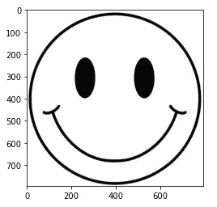
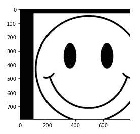
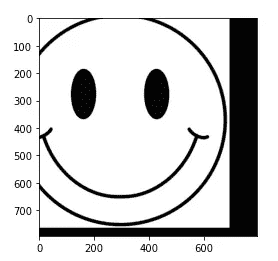
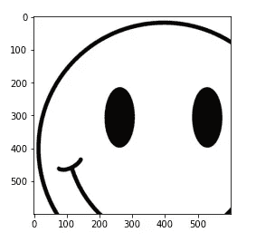
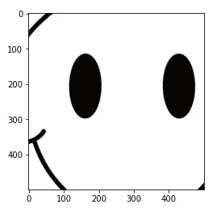

# Python 初学者的一些基本图像预处理操作

> 原文：<https://towardsdatascience.com/some-basic-image-preprocessing-operations-for-beginners-in-python-7d297316853b>


由 [Unsplash](https://unsplash.com?utm_source=medium&utm_medium=referral) 上的 [Shubham Dhage](https://unsplash.com/@theshubhamdhage?utm_source=medium&utm_medium=referral) 拍摄的照片

## OpenCV 初学者:移动或平移、调整大小和裁剪

Python 用户最常用的图像处理和操作库之一是 openCV。对于图像分类、物体检测或光学字符识别，在人工智能世界中，任何与图像相关的工作大多数时候都需要某种图像处理和操作。我决定在 OpenCV 上写几个教程。

在本教程中，我们将重点介绍 OpenCV 的几个基本功能。这些都是基本的，有时也会非常有用。我们将通过例子来学习它们。所以，让我们准备好弄脏你的手吧。

在开始之前，这些是我们今天将使用的库。

```
import cv2
import matplotlib.pyplot as plt
```

我们将根据需要导入其他库。

本教程将使用一个简单的笑脸图像。请随意从以下链接下载图片:

<https://github.com/rashida048/OpenCV/blob/main/smiley.jpg>  

在这行代码中，cv2.imread 函数用于读取图像并将其存储为数组。

```
image = cv2.imread('smiley.jpg')
```

如果您对 OpenCV 完全陌生，下面是“image”变量的样子:

```
 array([[[255, 255, 255],
        [255, 255, 255],
        [255, 255, 255],
        ...,
        [255, 255, 255],
        [255, 255, 255],
        [255, 255, 255]],

       [[255, 255, 255],
        [255, 255, 255],
        [255, 255, 255],
        ...,
        [255, 255, 255],
        [255, 255, 255],
        [255, 255, 255]],

       [[255, 255, 255],
        [255, 255, 255],
        [255, 255, 255],
        ...,
        [255, 255, 255],
        [255, 255, 255],
        [255, 255, 255]],

       ...,

       [[255, 255, 255],
        [255, 255, 255],
        [255, 255, 255],
        ...,
        [255, 255, 255],
        [255, 255, 255],
        [255, 255, 255]],

       [[255, 255, 255],
        [255, 255, 255],
        [255, 255, 255],
        ...,
        [255, 255, 255],
        [255, 255, 255],
        [255, 255, 255]],

       [[255, 255, 255],
        [255, 255, 255],
        [255, 255, 255],
        ...,
        [255, 255, 255],
        [255, 255, 255],
        [255, 255, 255]]], dtype=uint8)
```

图像可以使用。imshow()函数。Matplotlib 和 OpenCV 库都有。imshow 函数。

```
plt.imshow(image)
```



作者图片

## 平移、移动或移位

我们将从如何移动图像开始。本教程将使用一个简单的笑脸图像。

定义如何移动图像并将其保存在移动变量中。让我们将图像向右移动 100 像素，向下移动 30 像素。为此，move 变量将如下所示:

```
move = np.float32([[1, 0, 100], [0, 1, 30]])
```

在这里，1 和 0 是固定的。在[0，2]位置的 100 将使图像向右移动，在[1，2]位置的 30 将使图像向下移动。

```
shift = cv2.warpAffine(image, move, (image.shape[1], image.shape[0]))
plt.imshow(shift)
```



作者图片

如果你想把图像向左上方移动，你只需要使用负号:

```
move = np.float32([[1, 0, -100], [0, 1, -30]])
shift = cv2.warpAffine(image, move, (image.shape[1], image.shape[0]))
plt.imshow(shift)
```



作者图片

使用 imutils 库也可以达到同样的效果。下面是语法:

```
import imutils
moved = imutils.translate(image, -100, -30)
```

它将生成与上一张完全相同的图像。如您所见，使用 imutils 稍微简单一些。

## 调整大小

缩放操作在图像预处理中非常常见。我们根据需要增加或减少图像的高度和宽度。以下是 OpenCV 中调整大小的语法:

```
resized = cv2.resize(image, image_shape, interpolation = cv2.INTER_AREA)
```

我用“插值”作为 cv2。地区间。对此还有其他选择。我们稍后会谈到它们。先说 image_shape。重要的是要注意长宽比，使图像看起来不失真。为此，有必要将输出图像的纵横比保持为输入图像的纵横比。

如果我们希望输出图像的高度为 500，则输出图像的图像形状需要为:

```
rsz = 500.0 / image.shape[1]
image_shape = (500, int(image.shape[0] * rsz))
```

同样的，如果我们需要输出图像的宽度为 300，我们计算输出图像的高度。

```
rsz = 300.0 / image.shape[0]
image_shape = (int(image.shape[1] * rsz), 300)
resized = cv2.resize(image, image_shape, interpolation = cv2.INTER_AREA)
```

这都是关于图像形状的。

第三个参数“插值”有几个不同的选项。以下是这些名字:

cv2。线性的

cv2。最近的

cv2。立方间

cv2。跨兰佐斯 4

如果不提供任何“插值”方法，OpenCV 使用的默认方法是 cv2。提供双线性插值的 INTER_LINEAR 方法。

如果有兴趣，请随时探索更多。

imutils 库让我们变得更容易。它为我们计算长宽比。它只需要高度或宽度。它自己计算宽度或高度。下面是语法:

```
im = imutils.resize(image, width=300)
```

在这里，我们提供的宽度和高度将自动计算，以保持纵横比不变。

## 种植

如果你曾经处理过图像，你肯定以某种方式进行过裁剪。裁剪图像的一种常见方法是简单地使用数组切片。正如我们在开始时谈到的，图像只不过是一个 NumPy 数组。

我在这里裁剪笑脸:

```
part = image[0:600, 0:600]
plt.imshow(part)
```



作者图片

所以，它取了上面的 600 个像素和左边的 600 个像素。这是另一个例子:

```
part = image[100:600, 100:600]
plt.imshow(part)
```



作者图片

这次我们从左上第 100 个像素开始。所以，这里我们从顶部的第 100 个像素到第 599 个像素，从左边的第 100 个像素到第 599 个像素。请随意尝试其他产品系列。

## 结论

OpenCV 中有很多可用的函数。我只想从这三个基本操作开始。在我接下来的教程中，我将会讲述更多的高级技术。希望这对你有帮助。

## 更多阅读

</a-step-by-step-tutorial-to-develop-a-multi-output-model-in-tensorflow-ec9f13e5979c>  </precision-recall-and-f1-score-of-multiclass-classification-learn-in-depth-6c194b217629>  </how-to-make-animated-and-racing-bar-plots-in-python-c5c7c3c648f7>  </a-complete-guide-for-detecting-and-dealing-with-outliers-bad26b1e92b6>  </regression-in-tensorflow-using-both-sequential-and-function-apis-314e74b537ca> 