# 使用通用数据库工具 DBeaver 的一些技巧

> 原文：<https://towardsdatascience.com/some-tips-for-using-dbeaver-a-univeral-database-tool-94af18d50671>

## 学习一个方便的工具来方便地管理您的数据库


图片由[威廉创作](https://pixabay.com/illustrations/server-servers-data-computer-5451985/)在 Pixabay

[DBeaver](https://en.wikipedia.org/wiki/DBeaver) 是一个通用的数据库管理工具，可以用来管理各种关系数据库和 NoSQL 数据库。DBeaver 既有免费开源的社区版(CE)，也有商业企业版(ee)。社区版支持 MySQL、PostgreSQL、Oracle 等各种关系数据库。另一方面，企业版也支持 NoSQL 数据库。

DBeaver 非常人性化，非常容易上手。它支持代码完成、代码格式化、语法突出显示和其他大量方便的特性，这些将在后面介绍。如果您一直在使用其他数据库管理工具，那么非常值得尝试一下 DBeaver。很有可能你会喜欢的。

为了让你更喜欢它，在这篇文章中，我们将介绍一些对初学者来说不容易发现的技巧。这些提示将解决您第一次使用 DBeaver 时可能遇到的问题。我们还将探索一些可以显著提高您工作效率的功能。

## 准备

请从[此链接](https://dbeaver.io/download/)下载并为您的操作系统安装 DBeaver。出于演示目的，我们将使用不需要注册或许可证的社区版。

我们将使用 DBeaver 来管理一个 MySQL 服务器，该服务器可以通过以下 Docker 命令启动:

请注意，高端口(13306)用于避免潜在的端口冲突。

然后运行下面的命令导入一些虚拟数据，稍后可以在 DBeaver 中播放。

注意，我们直接使用 Docker 容器中的 MySQL 客户端，因此不需要单独安装。如果您确实想在您的计算机上本地安装一个 mysql 客户端，您可以安装 [mysql-client](https://dev.mysql.com/downloads/mysql/) ，它包括`mysql`和`mysqldump`，以及其他有助于在命令行上管理 MySQL 数据库的工具。在 [Ubuntu](https://www.configserverfirewall.com/ubuntu-linux/ubuntu-install-mysql-client/) 上，命令是:

```
$ sudo apt-get install mysql-client
```

或者，您可以使用图形界面直接在 DBeaver 中创建数据库和表，如下所示。但是，在这样做之前，您需要首先在 DBeaver 中为我们的本地 MySQL 数据库创建一个连接。

## 在 DBeaver 中创建连接

现在让我们为 MySQL 数据库创建一个连接。单击“新建数据库连接”按钮，然后选择 MySQL 作为数据库。如果你使用 MySQL 5，你需要选择 MySQL 5。

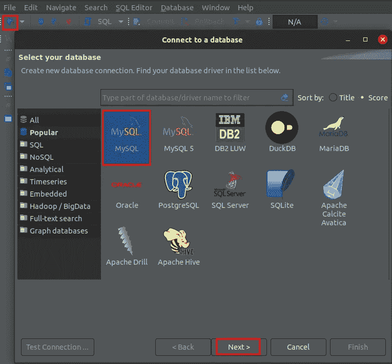

作者图片

在“连接设置”窗口中，输入主机、端口、用户名和密码。您可以在创建连接之前测试它:

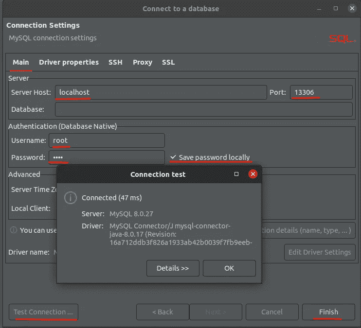

作者图片

如果你因为 SSL 问题无法连接你的数据库，你可以查看[这篇文章](https://community.atlassian.com/t5/Confluence-questions/MySQL-Public-Key-Retrieval-is-not-allowed/qaq-p/778956)作为参考。基本上，您需要为您的驱动程序添加两个属性，即“useSSL”和“allowPublicKeyRetrieval”。您可以右键单击您的连接，然后选择“编辑连接”来编辑连接。

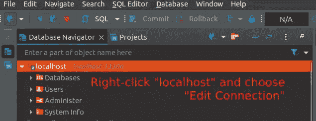

作者图片

如上所示，将打开相同的“连接设置”窗口。单击“编辑驱动程序设置”按钮打开“编辑驱动程序”窗口。然后在打开的窗口中单击“驱动程序属性”选项卡。在窗口中右键单击，为您的驱动程序添加两个新属性，即“useSSL”和“allowPublicKeyRetrieval ”,它们的值应分别设置为“false”和“true ”:

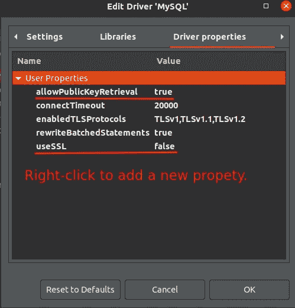

作者图片

保存对驱动程序属性的更改。

## 为您的连接设置名称

您还可以为您的驱动程序设置一个名称，这在您需要在 DBeaver 中管理多个数据库时非常有用。在“连接设置”窗口中，单击“常规”选项卡并设置连接的名称:

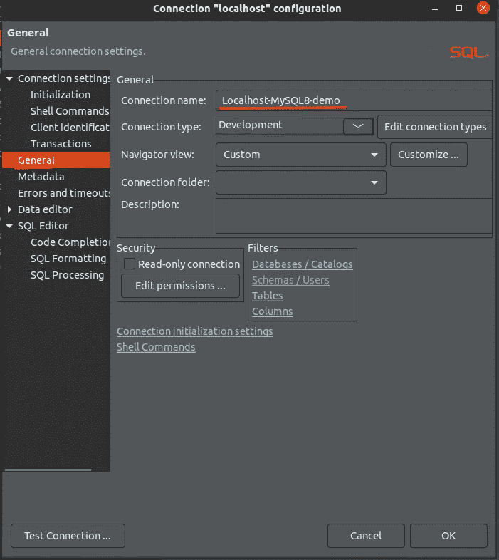

作者图片

## **设置 SQL 编辑器格式**

DBeaver 最吸引人的特性之一是代码自动完成、自动大小写转换和语法突出显示。这非常方便，因为 SQL 查询非常灵活。您可以用任何风格编写您的查询，它们将永远有效。然而，说到可读性，那就是另一回事了。DBeaver 的自动完成和自动格式化特性可以让您非常方便地编写干净、美观、易读的 SQL 查询。

我们可以为单个连接设置 SQL 编辑器格式。但是，最好全局设置格式样式，以便它适用于所有连接。

选择“窗口”菜单，然后选择“首选项”子菜单。在打开的“首选项”窗口中，选择“编辑器”= >“SQL 编辑器”= >“格式”。对于格式，建议按如下方式设置配置:

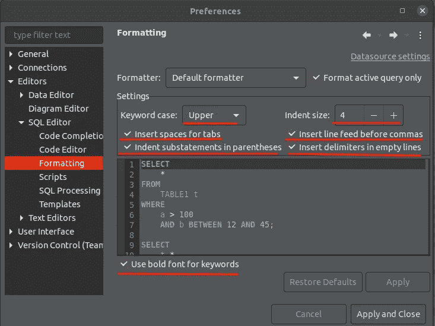

作者图片

有了这些设置，如果您选择您的 SQL 查询并按下 **CTRL + SHIFT + F** 来自动格式化它们，您的 SQL 查询将被相应地格式化。

## 启用关键字自动大小写转换

另一个我非常喜欢的便利功能是关键字自动大小写转换，即在键入 SQL 关键字后，它会自动转换为相应的大小写，即上面步骤中设置的大写。要启用关键字自动大小写转换，请在上面打开的“首选项”窗口中选择“编辑器”= >“SQL 编辑器”= >“代码编辑器”，然后启用“转换关键字大小写”。您也可以启用您喜欢的其他代码转换:

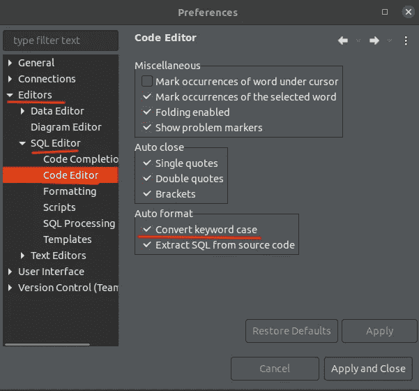

作者图片

## 在 DBeaver 中编写和执行 SQL 查询

您可以右键单击左侧导航栏上的数据库连接，然后选择“SQL Editor”= >“New SQL script”。将为您打开一个新的 SQL 脚本编辑器。现在您可以开始享受在 DBeaver 中编写 SQL 查询了，尤其是关键字自动大小写转换和代码自动完成😃。

出于演示目的，将 SQL 查询从[复制到这里](https://gist.github.com/lynnkwong/cd00ad16ac0e82e11647cce08aa1c482)，并粘贴到 SQL 编辑器中。然后单击“执行 SQL 脚本”按钮，逐个执行它们:

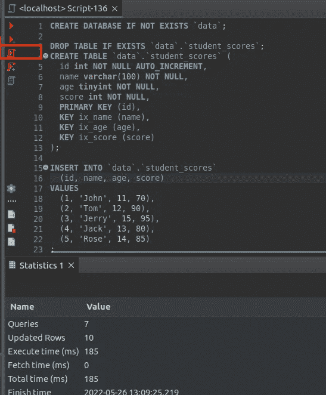

作者图片

## 探索高级副本

默认情况下，如果您复制多条记录，它们将被复制为多行，如果您希望将输出用作其他查询或程序的输入，这是不方便的。通过“高级复制”功能，您可以进行更灵活的设置，并以您想要的格式复制数据。例如，选择如下所示的所有名称，右键单击选择，然后选择“高级复制”= >“高级复制…”。在打开的“选项”窗口中，根据需要设置格式选项:

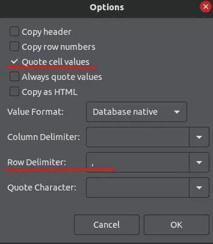

作者图片

使用这些选项，记录将作为一个单独的字符串被复制，每个条目都被引用，然后可以在其他地方直接使用。

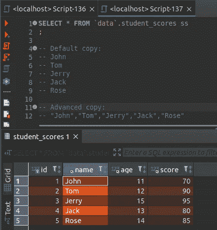

作者图片

您还可以将所有行复制为 Markdown，这便于共享查询和结果。首先选择你要复制的记录，然后右键点击选中的记录，选择“高级复制”= >“复制为 Markdown”，你会得到 Markdown 格式的结果，可以方便的分享。

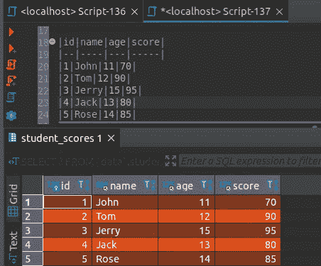

作者图片

## 以友好的方式显示 JSON 数据

如果您的表中有一个 [JSON 字段](https://lynn-kwong.medium.com/how-to-work-with-json-data-in-mysql-11672e4da7e9)，它将显示为一个不容易阅读的长字符串。您可以以非常用户友好的方式显示 JSON 字段的值，如下所示:

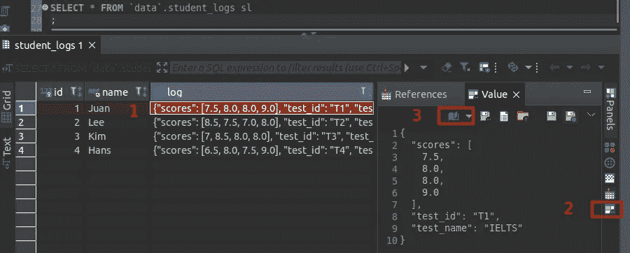

作者图片

## 以各种格式导出结果

您还可以以各种格式导出查询结果:

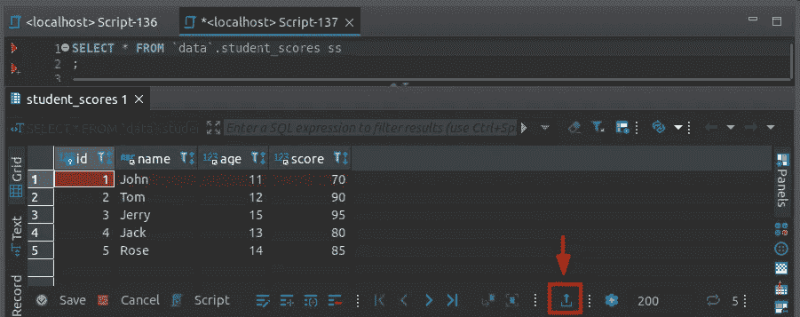

作者图片

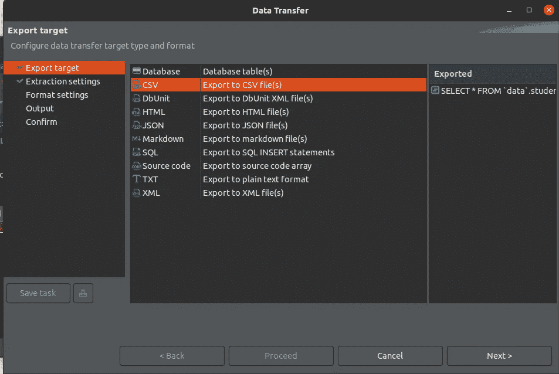

作者图片

只需选择您想要的格式，并根据说明导出数据。

## 使用快捷方式转换为大写

最后但同样重要的是，我们可以选择一些字符并按下 **CTRL** **+ SHIFT + X** 将它们转换成大写字母。这可能看起来微不足道，但如果你像我一样是一个 SQL 完美主义者，这是非常方便的。此外，该快捷方式是隐藏的，不能直接在顶部菜单或右键菜单中找到。


DBeaver 是一个非常方便的图形数据库管理工具，可以用于各种数据库。它使用起来相当直观，你可以立即上手。本文中的技巧旨在探索 DBeaver 的一些特性，这些特性对于初学者来说可能不太明显，但可以显著提高您的效率。

相关文章:

*   [如何在 MySQL 中处理 JSON 数据](/how-to-work-with-json-data-in-mysql-11672e4da7e9)