# 使用 NLP 将歌曲分类到播放列表

> 原文：<https://towardsdatascience.com/songs-to-playlist-classification-using-nlp-1821c66b1a16>

## 使用 word2vec 和逻辑回归将新歌曲分配到 Spotify 播放列表的指导方法

照片由 [Unsplash](https://unsplash.com?utm_source=medium&utm_medium=referral) 上的 [israel palacio](https://unsplash.com/@othentikisra?utm_source=medium&utm_medium=referral) 拍摄

本文将介绍一个 NLP 项目，旨在将歌曲分配到播放列表。

已经从 Spotify 中选择了两个播放列表，并且通过 Spotify API 选择了诸如艺术家、歌曲标题、流行度等信息。已下载。歌词数据不是通过 API 获得的，而是通过网络搜集获得的。

接下来，对原始歌词执行一些数据预处理步骤，以便训练 Word2Vec 模型并将文本编码成高维向量。

使用 PCA 生成每个播放列表的 2D 表示，并且我们最终使用新歌来完成播放列表分配的任务。这个任务是通过一个逻辑回归模型解决，并给出了一个图形表示。

以下是所用方法的概述:

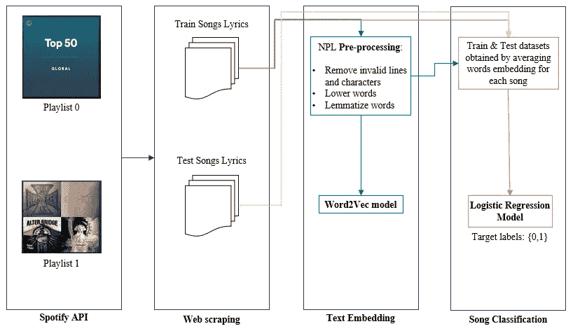

作者图片

# 目录:

[1 —数据](#43c0)
[1.1 —使用 Spotify API](#56d0)
[下载播放列表信息 1.2 —抓取歌词](#778c)
[1.3 —数据预处理](#778c)
[1.4 —播放列表概述与世界云](#1d72)
[2 —歌词嵌入](#20f3)
[2.1 — Word2Vec 模型概述](#be15)
[2.2](#31d3) [3.2 —绘制播放列表质心](#8384)
[3.3 —用逻辑回归进行歌曲分类](#7935)
[4 —结论](#788e)
[参考文献](#8551)

# 1.数据

这篇文章是基于这两个 Spotify 播放列表上的歌曲歌词:

*   第一个是[全球播放列表](https://open.spotify.com/playlist/37i9dQZEVXbMDoHDwVN2tF)，其中包括全平台用户收听的前 50 首歌曲。播放列表每天更新，通常包括流行歌曲。
*   第二个播放列表是[金属混音](https://open.spotify.com/playlist/37i9dQZF1EQpgT26jgbgRI)，包括排名前 50 的金属歌曲

两个播放列表的音乐流派似乎相当“遥远”:让我们验证这个“距离”是否也存在于我们将使用 NLP 模型获得的向量中，并让我们确认这是否将帮助我们完成播放列表分配任务。

## 1.1 使用 Spotify API 下载播放列表信息

为了使用 Spotify API，首先，我们应该在 https://developer.spotify.com/的[上创建一个开发者账户，并创建一个新的应用程序。](https://developer.spotify.com/)

接下来，通过点击我们的应用程序，我们可以获得:

*   客户端 ID
*   客户机密

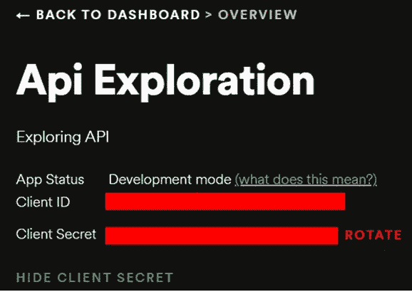

作者图片

有了以上信息，我们可以连接到 API:

最后，通过传递播放列表 id(我们可以从 Spotify 上的 URL 获得)，我们可以开发一个函数来获得我们想要的信息，具体来说就是:艺术家、标题、专辑、流行度。

(类型是手动创建的字段，用于区分两个播放列表)。

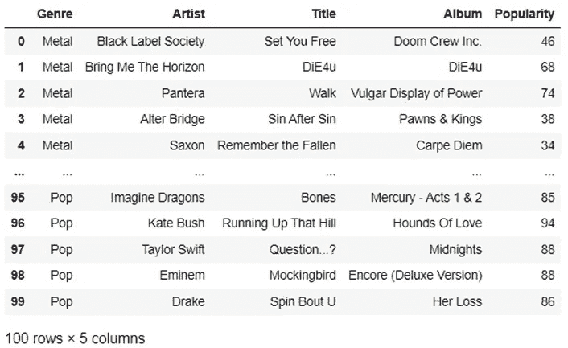

作者图片

## 1.2 刮歌歌词

在撰写本文时，Spotify API 不允许提取歌词。然而，通过艺术家和标题，我们可以执行一些网络搜集来获得歌词。

为此开发的代码相当长，超出了本文的范围。我创建了一个关于网络抓取的教程，我在这里引用了。

完成这一步后，数据最终看起来像这样:

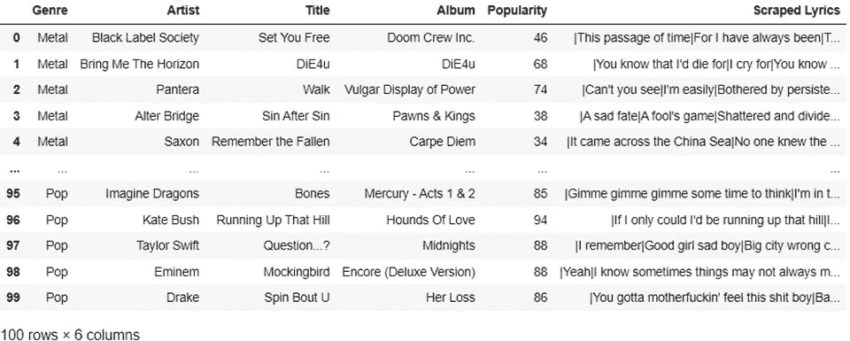

作者图片

文章中使用的数据已经上传到这个 [github 库](https://github.com/gabri-al/Spotify-Playlist-Representation)上。

## 1.3 数据预处理

我们的目标是使用 Word2Vec 模型将单词嵌入到向量中。

为了做到这一点，我们将继续下面的步骤，以便原始文本可以被清理并转换成模型可以使用的格式:

*   删除无用的行(如歌词中的“重复行”、“合唱”)数字、符号
*   降低每个单词
*   单词词条化:我们更喜欢词条化而不是词干化。这两种技术在项目中给出了非常相似的结果，但是词干化会截断单词，词汇化会将单词转换成一种常见的“基本”形式，从而给出更具可读性的结果。例如，单词“caring”将通过词干化被截断为“car ”,但通过词汇化被转换为“care”
*   (此处保留了通常在 NLP 预处理步骤中消除的停用词。删除它们并没有改善这个项目的结果——可能是因为词汇表不是很大，Word2Vec 模型可以在上下文评估中使用它们)
*   (最后，单词标记化将在模型训练时执行)

在这些步骤之后，每首歌曲都被转换成一个列表，每个列表元素都是一行歌曲:

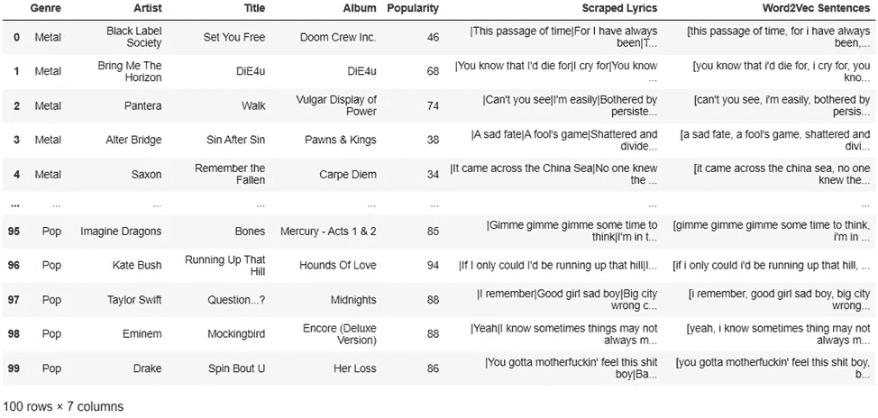

作者图片

## 1.4 世界云播放列表概述

现在，我们将通过生成两个世界云图来初步了解这些数据，每个播放列表一个。

为了产生下面的图像，所有歌曲的歌词被合并成两个变量，每个播放列表一个，然后使用遮罩生成世界云。

这些图表基于单词在每个播放列表中的出现次数，突出显示出现次数最多的单词:

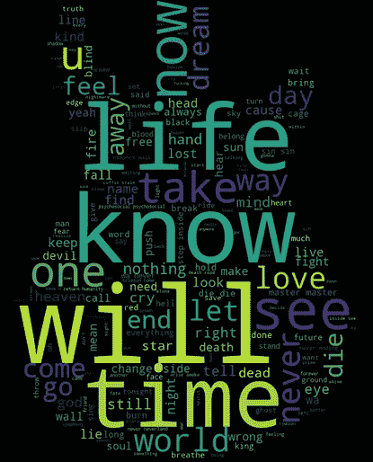

金属播放列表|作者图片

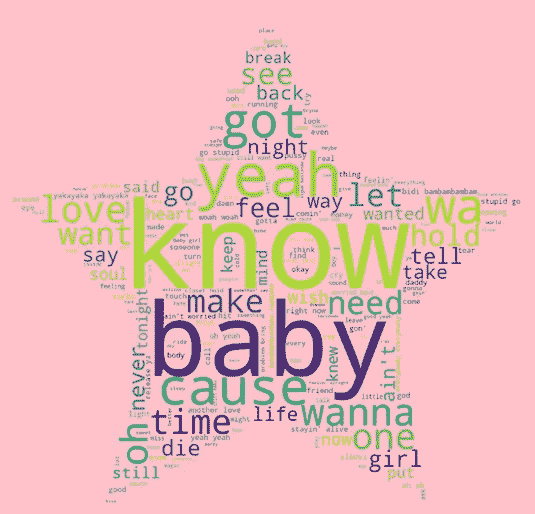

全球 plyalist |作者图片

# 2.歌词嵌入

为了训练一个能够将新歌曲分配到播放列表的模型，我们需要将歌词嵌入到向量中。

有几种策略可以做到这一点，这些策略可以分为两类:

1.  基于词频的模型，这些被称为“单词包”方法，如 Tf-Idf 模型或 N-grams
2.  使用简单神经网络提取向量表示的模型，该向量表示考虑了单词之间的“距离”(或相似性)。这些模型更先进，它们的出发点是出现在同一语境中的两个词在意义上应该“接近”。因此，有了这些模型，就有可能根据单词出现的上下文来捕捉它们之间的相似之处。这些模型可以进一步分为两种方法:

*   全局矩阵分解方法(如 LSA、LDA)
*   本地上下文窗口方法(如使用 cbow / skip-gram 的 Word2Vec)。这将是我们的重点领域。

(注意:*还有许多其他方法可以使用，例如 GloVe，它旨在使用完整的语料库从词出现的分布中提取词义— [1] Pennington et al .，2014* )。

Word2Vec 将在这个项目中使用，因为 Python Gensim 库提供的内置方法正好满足我们的目的。

## 2.1 Word2Vec 车型概述

Mikolov 等人(2013 年)[2]开发了这个模型，它由一个单隐层神经网络组成，在单词分类任务上进行训练。该网络学习单词与其上下文的句法和语义关系(在给定窗口中使用前面的和前面的单词)。

在该模型中有两种可能的算法可以使用:Skip-gram 和 continuous bag-of-words (CBOW)。

在 skip-gram 变体中，目标是在给定单词的情况下预测单词上下文；而 cbow 是镜面反射的:它的目标是预测给定上下文的单词。

skip-gram 模型在我们的项目中表现更好，其架构如下:

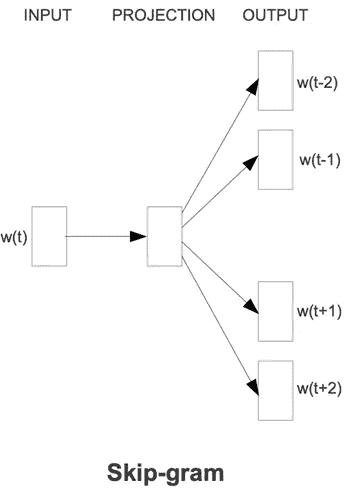

图片由 Mikolov 等人提供(2013 年)[2]

为了获得成功预测周围单词的单词的矢量表示，给定我们的当前单词，该算法最大化观察一些上下文单词的平均对数概率:

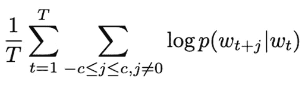

图片由 Mikolov 等人提供(2013 年)[3]

在公式中:

*   c 是“窗口”，或一个词的上下文的大小。这是一个用“单词”表示的模型超参数，例如，7 表示我们在当前单词 w_t 周围使用 7 个单词的上下文
*   t 表示训练规模(即语料库中用于训练模型的所有单词)
*   条件概率由以下 softmax 函数定义，其中“v”表示神经网络中单词 w 的输入和输出向量:

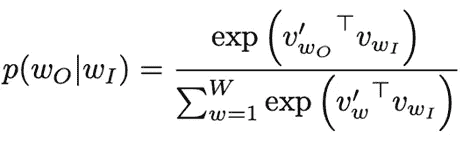

图片由 Mikolov 等人提供(2013 年)[3]

最终输出将是期望维度(另一个模型超参数)的向量(词汇表中每个单词一个)。

这些向量应该高精度地表示单词之间的关系。比如米科洛夫等人。，2013 [3]获得了可用于执行线性运算的向量，如: <king>- <man>+ <woman>将给出非常接近对应于<queen>的向量的结果。</queen></woman></man></king>

## 2.2 概率近似值

上述最大化需要计算对数概率的梯度。

米科洛夫等人的论文。，2013 [3]示出了该梯度的计算如何具有 O(V)的复杂度，即与词汇表的大小成比例(通常是巨大的)。这是实施方面的一个瓶颈。

然而，同一篇论文提出了以更有效的方式实现 word2vec 的几种策略，例如:

*   通过*分级 softmax* 得到的 softmax 的近似值。这通过使用二叉树简化了输出图层表示，从而减少了参数的数量。
*   *负采样*:这种技术允许从数据中区分“噪声”，通过训练模型从噪声分布中采样我们的目标词。

这两种技术都在项目中使用，分层 softmax 近似给出了更好的结果。

# 3.结果讨论

## 3.1 Word2Vec 模型培训

为了训练 word2vec 模型，我们首先对歌词进行标记，并选择在分类任务中表现最佳的超参数，我们将在下面介绍:

*   sg = 1 以使用跳格算法
*   hs = 1，使用分级 softmax 方法来近似概率
*   vector_size = 300 意味着每个单词的输出向量将有 300 个坐标。这与在整个 Google 新闻语料库上训练的 word2vec 模型使用的向量维度相同
*   window = 7 意味着我们的上下文将基于 7 个单词。在这个项目中，使用了不同的窗口大小，5 到 10 之间的数字给出了最好的结果。
*   min_count = 3 意味着出现次数少于 3 次的单词将从语料库中排除。这将过滤掉那些很少使用的单词，从而减少我们的词汇量。

使用这些值，模型训练得非常快，这个小数据集上的词汇大小为 1223。

## 3.2 绘制播放列表质心

训练之后，我们在播放列表中获得每个单词一个向量。因此，我们可以计算:播放列表质心，播放列表中最具代表性的单词。

*   首先，我们提取了对应于播放列表中每个单词的向量，并对它们进行平均以获得质心
*   然后，我们提取与质心相似的词，这些词是每个播放列表中最有代表性的词。

每种金属和全球播放列表的“前 10 个单词”分别是:

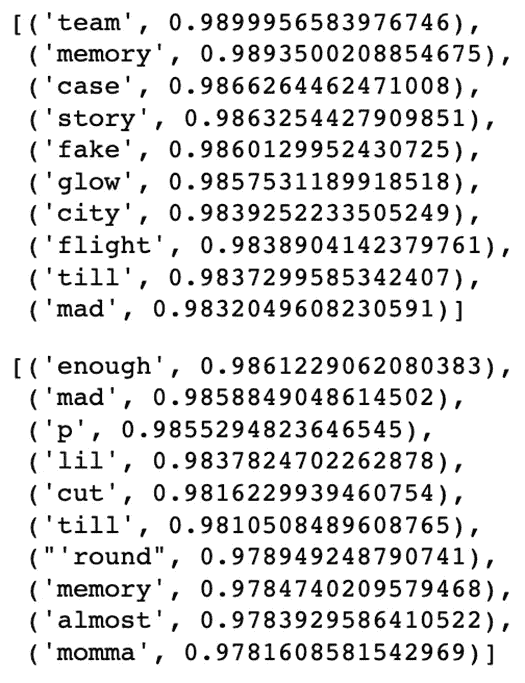

作者图片

有趣的是，我们注意到最有代表性的单词并不一定与最常用的单词相对应(如上面的单词云图片所示)。正如所料，该算法超出了词频来计算向量坐标。

我们也可以把这些单词形象化，我们将使用主成分分析来表示 2D 的 300 坐标向量:

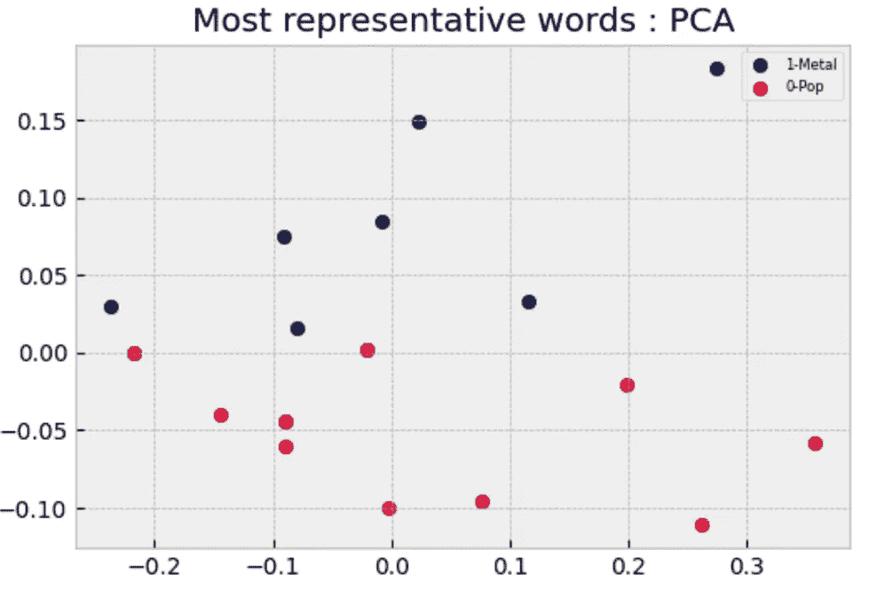

作者图片

类似地，我们可以绘制两个播放列表质心的 PCA:

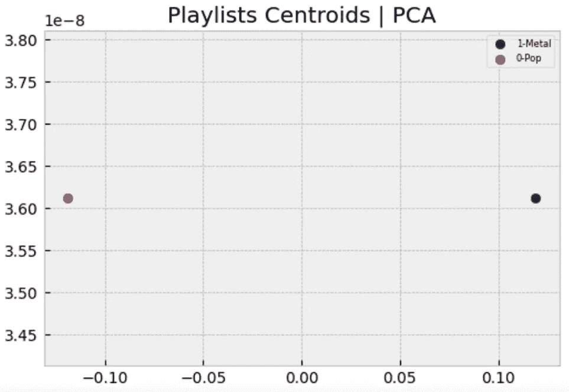

作者图片

我们可以根据最有代表性的单词和两个质心来分离这两个播放列表。让我们利用这些距离将新歌曲分配到播放列表。

## 3.3 用逻辑回归对歌曲进行分类

我们现在将使用我们的向量和播放列表标签来训练逻辑回归模型。该模型将在由 6 首未被观察到的歌曲组成的测试集上进行测试。(这些歌曲以前是 Spotify 上这两个播放列表的一部分，但现在不再是它们的一部分了)。我们将确认模型是否会将歌曲分配到正确的播放列表:

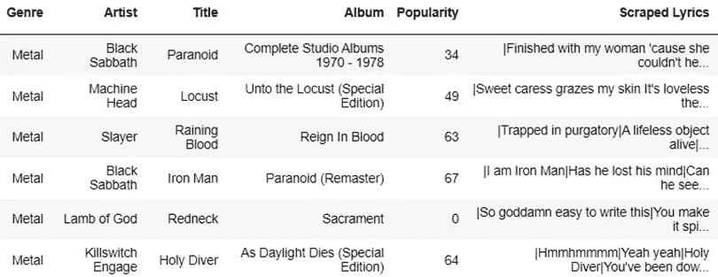

作者图片

逻辑回归是广义线性回归模型，这是一种非常常见的分类技术，特别是用于二元分类(2 类。然而，该模型也适用于多类分类问题)。

该模型返回记录属于“类 1”的概率；可以设置阈值，以便“硬”将记录分配到“类别 1”，仅当概率高于阈值时。

## ***数据预处理:***

让我们首先准备数据集:

*   我们将使用已经导入的歌词来计算每首歌的平均向量。这将是我们的火车布景。
*   我们将上传新歌曲，并使用相同的 word2vec 模型计算每首歌曲的向量(平均单词向量)。这将是我们的测试集。

## ***超参数调谐:***

接下来，我们运行交叉验证网格搜索，以确定最佳模型超参数:

## ***模型训练&测试:***

我们现在可以在训练集上训练最佳模型，然后通过对新歌曲进行分类来测试它:

我们获得了以下预测的标签和性能:在训练集上的非常高的准确度和在测试集上的一首错误分类的歌曲。

作者图片

## ***图形概述:***

通过对 Word2Vec 模型向量使用 PCA，现在可以可视化测试集歌曲(每个点代表一首歌曲，通过对单词向量进行平均获得)。让我们检查一下新歌离两个播放列表质心有多近:

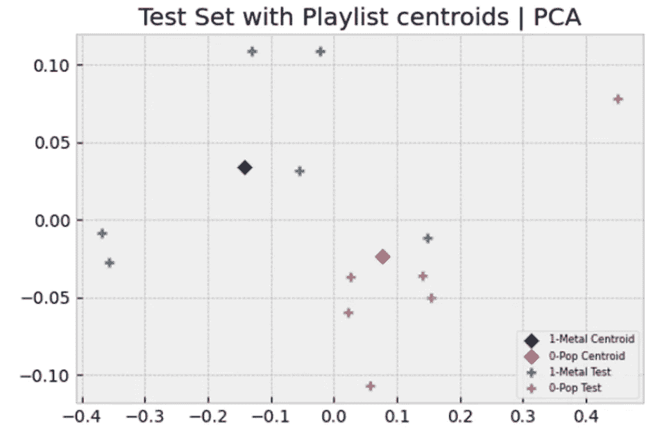

作者图片

使用这种表示，我们还可以可视化新歌曲是否非常接近播放列表的质心，从而使分类更加健壮。事实上，我们可以看到为什么一首歌被错误分类:它更接近“错误的”播放列表的质心。

# 4.结论

本文介绍了一种基于歌词将新歌曲分配到现有播放列表的可行策略。

使用 word2vec 进行歌词嵌入，使用 logistic 回归进行分类，取得了很好的效果。

为了推广这种策略，可以比较不同的嵌入技术和不同的回归模型，理想情况下使用大得多的数据集，这通常会改进单词嵌入任务。

感谢您的阅读！

# 参考

*   [1] Jeffrey Pennington、Richard Socher 和 Christopher D. Manning2014.[手套:单词表示的全局向量](https://nlp.stanford.edu/pubs/glove.pdf)
*   [2]托马斯·米科洛夫、程凯、格雷戈·科拉多、杰弗里·迪恩，2013 年。[向量空间中单词表示的有效估计](https://arxiv.org/abs/1301.3781)
*   [3]托马斯·米科洛夫、伊利亚·苏茨基弗、程凯、格雷戈·科拉多、杰弗里·迪恩，2013 年。[单词和短语的分布式表示及其组合性](https://arxiv.org/abs/1310.4546)