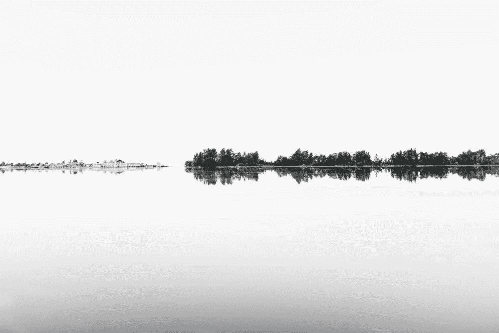
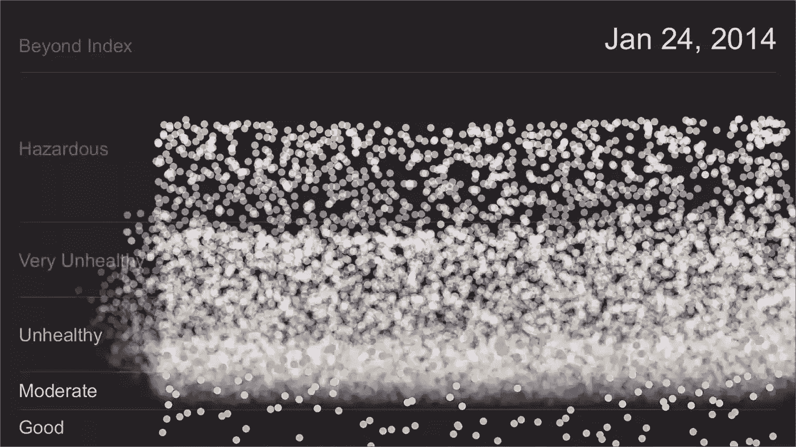
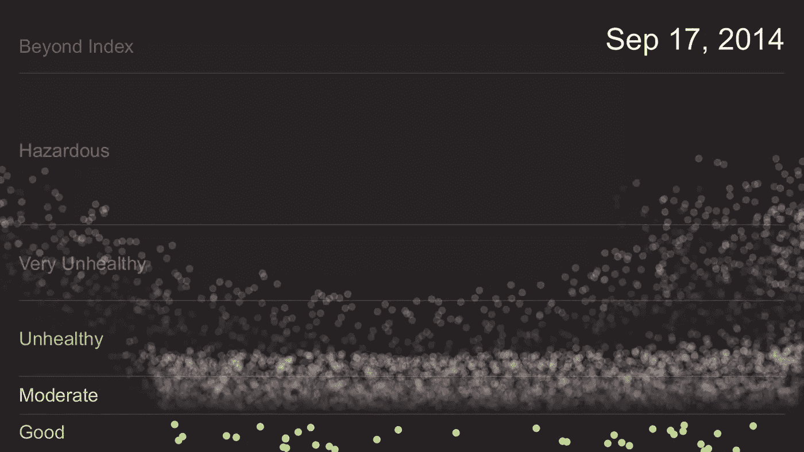

# 发音——当你超越了数据的视觉表现

> 原文：<https://towardsdatascience.com/sonification-when-you-go-beyond-the-visual-representation-of-data-cf6c7229a557>

## 以声音为指导，交流和寻找模式

这张照片看起来像别的吗？像声波一样？照片由来自 Unsplash 的 Adrien Olichon 拍摄

> "没有声音，庆祝和悲伤看起来几乎是一样的."([本·马库斯](https://en.wikipedia.org/wiki/Ben_Marcus)

声音为我们对周围环境的感知提供了独特的东西。

我总是记得走进所有这些历史地标，看到它们陈设齐全、漂亮，但同时却毫无生气。

然而，一旦你*在那些房间里演奏*当代音乐(或音效)，它们就会突然变得活跃起来。你会立刻被*传送到*那个时间点。

你可能会参加纪念路易十四的盛大舞会，或者见证《独立宣言》的撰写。

声音给原本处于休眠状态的物体、地方和时刻带来了生命。当你对数据进行声音处理时，也会发生同样的情况。

这是健康发展的下一个前沿。

# 什么是数据语音化？

这是传递信息的另一种方式。

当你展示数据时，你通常使用*视觉*提示来展示对你工作的分析。但是在这种情况下，你用*音*让事情更容易理解。

想想盖革计数器。这是一种测量周围辐射水平的电子设备。如果你去了切尔诺贝利，你可能会带上其中的一个，避免太靠近那些会损害你健康(永久)的地方。

> 为了保证你的安全，这个设备会发出声音，代表你暴露在辐射中的程度。听到的咔哒声越多(间隔越少)，辐射越高。

那是你的“离开那里”的信号。

这里有一个更直观的数据转换成声音的表示。在这种情况下，作曲家和计算机科学家 Brian Foo 希望用声音和视觉来表现北京空气污染在 3 年时间内的变化。

在音乐的基础层(一种重复的钢琴般的声音，节奏适中)之上，布莱恩创建了一种算法，根据该市每天的空气质量测量结果来改变这首歌的声音和光学元素。

截图 1 — [通过维基百科对北京空气质量的发音](https://en.wikipedia.org/wiki/File:Air_Play_-_Sonification_of_Beijing_Air_Quality_Data.webm)

一方面，当空气质量*恶化*时，你会在音乐中听到更多打击乐和噪音成分【截图 1】。这也将伴随着快节奏的笔记和图表中更高密度的点。

另一方面，当空气污染*改善*[截图 2]时，这些有节奏的部分会逐渐消失，音乐会变得更加悦耳，这也导致了饱和度较低的图形。

截图 2 — [通过维基百科对北京空气质量的发音](https://en.wikipedia.org/wiki/File:Air_Play_-_Sonification_of_Beijing_Air_Quality_Data.webm)

通过这个发音实验，布莱恩对一个紧迫的问题创造了一个独特的视角，并帮助提高了人们对这个问题的认识。

这只是两个例子，说明**声音反馈**如何帮助你以不同的方式感知世界，有时甚至更容易。声音可以是传送数据序列的有用且强大的工具。

# 你用什么技术把数据转换成声音？

同样的数据，你可以从中创建视觉图表，你也可以把声音和音乐。你可以使用不同的声音元素(音高、音量、速度)来让用户意识到你试图传达的信息的变化。

例如，[安布罗斯·索恩](https://medium.com/u/8b06ec5da3bd?source=post_page-----cf6c7229a557--------------------------------)是一家名为 ChirpShop 的音频品牌公司的联合创始人，他利用**音调的变化**来提高人们对**气候变化**的认识。

> 通过获取全球温度变化的历史数据，他将更极端的气候事件(如热浪)指定为更高的音高，将更低的音高指定为较冷的年份。
> 
> 换句话说，对于 1880 年到 2016 年之间的每一年，他都会给一个温度值分配一个特定的音高(以 MIDI 格式)。
> 
> 一旦他将它们绘制出来，他会将该文件导入到 DAW(数字音频工作站)中，在那里他会将一个虚拟乐器分配给一系列音高(实际上是音符)以将它们转换成音乐。

瞧啊！这是这个实验的结果[声音图。](https://www.linkedin.com/feed/update/urn:li:activity:6924800366299557889/?commentUrn=urn%3Ali%3Acomment%3A(ugcPost%3A6924771072051490816%2C6924828498360504320))

这样做的好处是什么？数据变活了！曾经只是对图表的概念性理解，现在变成了对信息的更深层次的理解。你参与到你所听到的事情中，并且能够感受到这些数据。

> 这不再仅仅是一连串的数字，而是与数字背后的智慧的个人联系。

还有其他**获取信息的**方式:

*   [**可听化**](https://en.wikipedia.org/wiki/Audification) :是在我们的听觉范围内(20Hz 到 20kHz)将数据值表示成声音的一种方式。例如，当你的医生将一个**听诊器**贴在你的皮肤上时，他们能够听到心脏、肺、肠甚至血液流经你的静脉和动脉时发出的声音。他们把风琴的声音变成他们容易听到的声音。
*   [**基于模型的发音**](https://sonification.de/handbook/download/TheSonificationHandbook-chapter16.pdf) :这是一个人与它互动时产生的声学反应系统。你建立一套指令(例如，当用户靠近时，提高音调)，并告诉用户如何与之交互。例如，如果你见过一种叫做 [**特雷门**](https://youtu.be/QQCcDh3QmGU) 的乐器，你就会知道，根据你如何挥动你的手，你会演奏出不同的音高、发音和音量，从而产生一种非常特别的音色。

我打赌你以前没想过这样的声音，是吗？

# 体验音频表现

我们感知声音和图像是不同的。当人们说一张图胜过千言万语时，一个**音**就会让你哑口无言。它超越了语言的范畴，很多时候你会发现自己无法描述你所听到的。

但是直到你找到一个参考框架，它会引导你找到有价值的信息。

让我们看一些例子来更好地理解这一点。

最基本的是一个[时钟](https://youtu.be/CmWXhc6QuYU)的滴答声。如果没有时间分割，这种声音不会传递任何有用的数据。但是一旦你明白它每秒滴答响，每小时响一次，你就能更恰当地使用这些信息。基本上，你听到的是一个听觉提示(滴答/响)来代表一个数据(秒/小时)。

然后你有不同程度的复杂。

你可以用**声音来代表图像**。

> 假设你有一张照片，你想把它转换成声音。一个叫做 [Photosounder](https://photosounder.com/) 的软件可以让你把像素变成高低音高。你在这个软件上从左到右处理图像。
> 
> 照片主图中包含的每个像素都将获得独特的间距。因此，如果是一个圆形，你首先会听到中间的一个音高，然后是两个方向相反的音高(一个高，一个低)，最后以中间的音高结束。
> 
> 这里有一个香蕉的例子，让你更容易理解。

一组更加复杂的数据是**将新冠肺炎刺突蛋白的氨基酸序列翻译成声音**。多亏了麻省理工学院工程学教授和音乐作曲家 Markus Buehler 的工作，研究人员现在可以通过声音的透镜听到它的结构。

这可以刺激科学家从另一个角度看待问题，增强横向思维*。如果你好奇的话，这里是这种病毒的真实声音表现。*

# 外卖

我们用来理解数据的技巧之一是将数据显示为图表、图形、信息图等等。除了用视觉术语显示数据，为什么不试着用声音来表示呢？

有一个被称为**发音**的发展领域，它不仅可以帮助人们**与他人交流想法**，还可以帮助我们**感知传统视觉可能忽略的模式**和趋势。

它有助于让信息鲜活起来。当你能够听到而不仅仅是看到事情时，你会有不同的感觉。你周围的空间充满了振动，可以到达你灵魂的最深处。感觉很有意义。

通过发音，你可以给科学增加一种感性的理解。

当你开始体验它时，声音和音乐会成为强有力的工具，但前提是我们要学会如何恰当地使用它们。

如果你喜欢这篇文章，试着读一下:

<https://medium.com/general_knowledge/how-to-become-a-music-sommelier-2966903da766>  <https://medium.datadriveninvestor.com/when-fans-become-investors-the-use-of-nfts-in-the-music-industry-59bf3172d041>  <https://medium.com/predict/were-entering-into-a-post-screen-future-sound-is-the-way-7795db0ee022>  

*如果你喜欢阅读这样的故事，并愿意支持 Medium 上的作家，考虑* [*注册成为 Medium 会员。每月只需 5 美元，你就可以无限制地阅读世界各地优秀作家的文章。*](https://pmarinko.medium.com/membership)