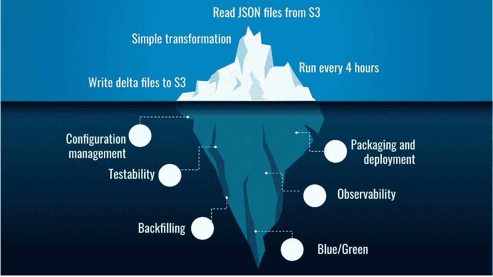
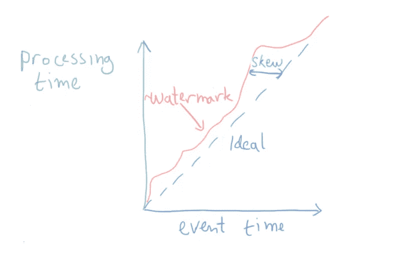
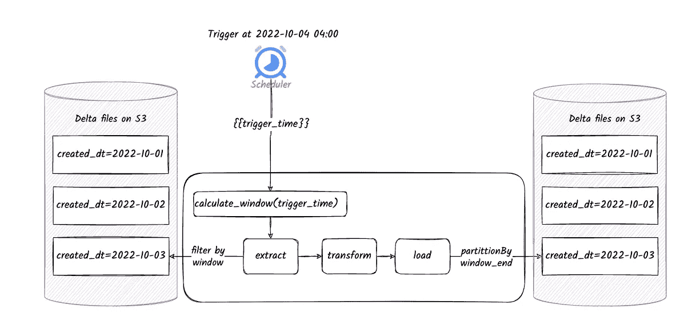
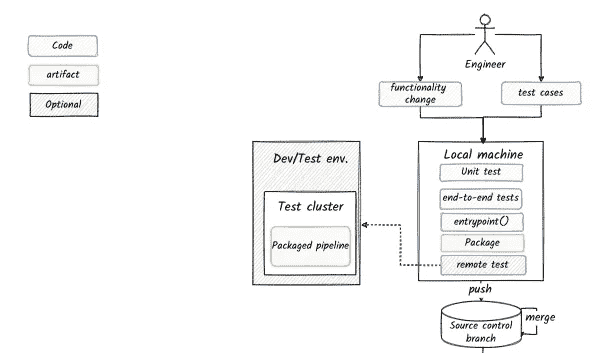
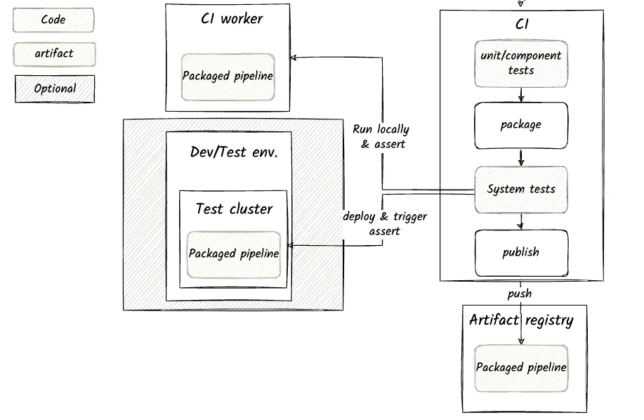
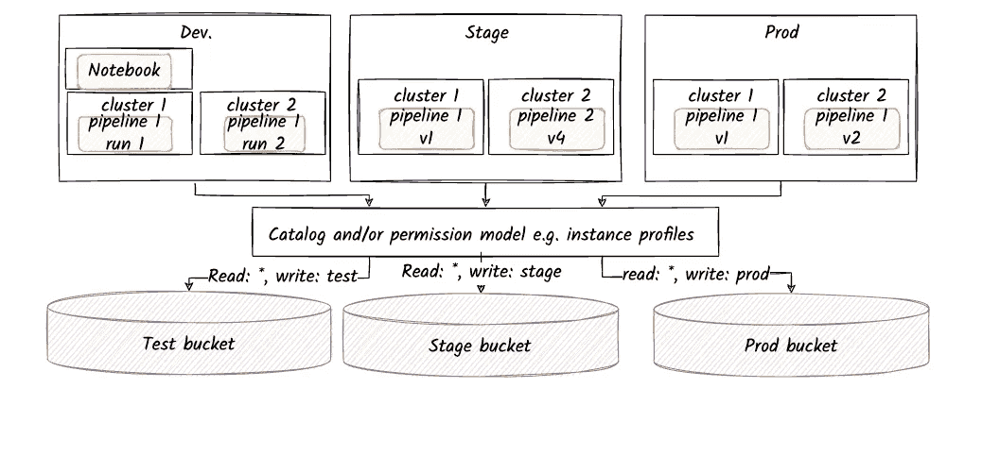
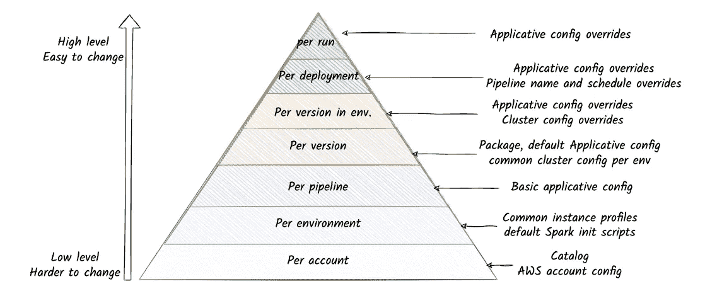

# 在云中构建 Spark 数据管道—您需要什么来开始

> 原文：<https://towardsdatascience.com/spark-data-pipelines-in-the-cloud-118f38ea90b7>

## 常见的工程挑战和解决方案


由作者稳定扩散生成

# 介绍

在过去十年左右的时间里，创作和执行 Spark 作业已经变得相当简单，这主要归功于:

*   高级 API——更容易表达逻辑。
*   **托管的基于云的平台—** 高度可扩展的对象存储和基于 spot 实例的一键式临时集群使运行作业变得无比简单(并推迟了对作业进行优化的需求)

虽然在 Spark 中*创作*逻辑和*执行*作业已经变得非常容易，但是基于 Spark 的*工程*管道仍然是一种艺术形式，几乎没有被广泛接受的标准和最佳实践。

许多第一次构建管道的团队发现，即使对于最基本的工程问题，如打包、部署、可测试性、环境隔离和可观察性，也存在陡峭的学习曲线和缺乏记录的最佳实践。

具有讽刺意味的是，这与基于 SQL 的管道形成了鲜明的对比，在社区采用 DBT 作为事实上的标准来解决许多相同的问题后，传统上这是工程实践的黑洞。



编写 Spark 代码并在集群上运行，只是“三角洲湖的冰山一角”。作者图片

# 目标

这篇文章的目标是涵盖常见的软件工程问题以及在云中构建和运行**基于 Spark 的批处理管道**的方法。

这不是一个完整的指南，其目的是涵盖几乎适用于所有管道的一些最常见和最基本的领域。

不用说，这里描述的实践和建议不能被认为是“标准”——但是希望它们可以提供一个合理的起点。

这些例子基于 Databricks 上的 PySpark，但是这些原理也应该适用于运行在其他基于云的平台上的 Java 或 Scala。

**超出范围**

*   大规模环境/复杂管道
*   Spark 代码或集群级优化
*   分析测试或数据质量方法

# 议程

## 前期制作(本岗位)

**批量数据流水线 101**

*   提取、转换、加载
*   在增量运行中处理时间
*   输入和输出划分
*   合并结果

**开发、测试和包装管道**

*   基本代码结构
*   试验
*   项目结构
*   包装
*   本地工作流程
*   海峡群岛

**环境和部署**

*   环境
*   结构管理
*   部署机制

## 生产和运营(下一个职位)

**生产中的运行作业**

*   数据和管道的可观察性
*   避免数据中毒
*   并行或蓝/绿部署

**常见运行场景**

*   重试和重新运行
*   回填数据

我们走吧！

# 批处理数据管道 101

## 提取、转换、加载

批处理数据管道通常执行一个或多个 ETL 步骤。

每一步都遵循以下模式:

*   提取—从某个位置(例如 S3)加载数据
*   转换—执行聚合、过滤、应用 UDF 等。
*   Load —将输出写入某个位置(例如，S3 上的另一个路径)

有时，管道被建模为这种步骤的 DAG。

## 增量运行和时间的概念

大多数批处理管道设计用于增量处理数据，即:

*   阅读“新数据”
*   处理它
*   将输出与之前运行的结果合并

**定义“新数据”**

大多数(但不是全部)批处理作业按计划运行，例如每天运行。因此，大多数团队从定义“新”数据开始:
“每天，对前一天的数据运行作业”。

换句话说，管道的每次运行负责处理一个(固定的)时间窗口的数据。

这种方法被称为“滚动窗口”:固定大小的连续时间帧，它们之间没有重叠。

**墙壁时间与活动时间**

一个简单的解决方案**不起作用**，用于处理具有流水线的时间窗:

*   触发管道每隔 24 小时运行一次
*   让管道代码使用“ ***墙时间***”—例如，现在*的值()减去 24 小时*作为它需要处理的时间窗口

这种方法不起作用的原因是，例如，当管道在周末发生故障时，现在您需要根据 72 小时前的数据运行它。

*此外，大多数分析关注的是实践中事件发生的时间，而不是我们收到事件发生的消息或抽出时间进行推理的时间(尽管在某些情况下，这些也很重要)。*

因此，更好的方法是根据“ ***事件时间”“*** ”来定义每次运行的时间窗口，即导致数据发生变化的真实事件发生的时间。

这意味着作业的每次运行都被分配一个固定的时间窗口，该时间窗口不直接取决于作业实际运行的时间。

(注意——在机器学习等一些用例中，这种方法可能需要改进，因为它可能会产生训练测试偏差)。

**使用调度程序创建每个时间窗口的流水线运行**

在时间窗口上运行流水线的常见方法是使用通用调度器(例如，Airflow、Prefect 等)。)

*   调度器被配置成例如每天在某个时间触发流水线
*   每个触发器在逻辑上与需要处理的不同事件时间窗口相关联(例如，前一个日历日期)。
*   每当调度程序触发一个管道运行时，它都应该给它传递触发时间
*   代码使用触发时间来计算它需要处理的时间窗口。
*   如果我们的调度程序比预期的要晚醒来，比如在 0401，它仍然应该将“正确的”触发时间传递给管道
*   如果触发器运行失败，管道应该以精确的原始触发器时间作为参数重新运行
*   如果调度程序本身关闭了，它应该注意创建关闭时丢失的触发器

因此，为了正确管理时间窗口，调度程序和管道代码之间有相当多的微妙之处和隐含契约。

此外，每个调度程序对这些契约的解释略有不同。

这里有一些来自[气流](https://airflow.apache.org/docs/apache-airflow/stable/templates-ref.html#variables)和[提督](https://docs-v1.prefect.io/api/latest/utilities/context.html#context)以及[数据块](https://docs.databricks.com/workflows/jobs/jobs.html#task-parameter-variables)的例子。

*结论之一是，管道需要能够接受代表调度程序触发时间的参数，并根据该值计算出时间窗口。*

**后期数据和水印**

不幸的是，数据总是姗姗来迟，令人恼火。

假设我们想要在整个日历日的“真实世界”数据上运行我们的批处理。
如果我们的调度程序正好在午夜触发，那么前一天的一些数据可能仍在写入，并且会被错过。

一个简单的方法是给我们的调度时间添加一个“缓冲区”——例如，设置触发器在 0400 触发，以便处理前一天的数据。
缓冲区大小可以猜测，甚至可以凭经验确定。

值得注意的几件事:

*   固定缓冲区并不能保证避免延迟数据，它只是一种风险管理技术
*   在我们采用的缓冲区大小(即数据完整性的置信度)和结果的新鲜度之间有一个明确的权衡
*   如果您的管道处理另一个批处理的输出，您通常更容易受到延迟(例如，当上游批处理失败时)
*   碰巧比缓冲区晚到达的数据很难被注意到，除非您对此采取主动措施

事实证明，管理最新数据并决定何时以最小风险安全处理数据是一个非常复杂的问题——尤其是在需要更新结果的系统中。

为了处理新鲜度和完整性之间的权衡，您需要推理 ***水印*** 的概念，即我们可以假设足够完整以便处理的近似最新时间，以及如何检测和响应较旧数据确实以比预期更大的延迟到达的情况。

*总而言之——对于大多数不经常运行的批处理作业(每天/每周),在调度中设置缓冲区是处理数据延迟的一种简单的启发式方法。*

*对于其他情况，你需要对这些假设进行一些思考，或许还需要多读一些关于这个话题的内容，例如* [*这里*](https://beam.apache.org/documentation/basics/#window) *。*



数据水印随着时间的推移而发展。作者图片

## 划分输入

当处理大量数据时，我们必须对其进行组织，以便于将它缩小到我们想要处理的部分。

Spark 支持数据分区的概念，在这种情况下，我们在文件系统上将数据组织成类似文件夹的结构，每个[通过某个列的值表示数据的一个分区。](https://spark.apache.org/docs/2.2.2/sql-programming-guide.html#partition-discovery)

如果分区是根据某个约定命名的，并且包含列名，我们可以添加一个关于分区列值的条件，Spark 可以将这个条件下推，并用作装载数据的过滤器。

一个简单的例子是按日期对数据进行分区，然后添加一个条件，告诉 spark 我们只想提取某个日期范围内的数据。

*   为了便于正确处理，尤其是在管道执行任何聚合时，最好根据事件时间和写入分区的时间来创建分区。
*   在提取阶段应用这种基于时间的过滤是一个很好的实践，并使转换逻辑保持中立。
*   Spark 只自动识别基于日期的分区文件夹的固定格式。

```
window_start = calculate_window_start(trigger)
window_end = calculate_window_end(trigger)
df = spark.read.json("s3://my-bucket").filter(f"created_dt >={window_start} and created_dt <= {window_end}")
```

## 划分输出

类似于输入分区，我们通常也需要对输出进行分区。

**当处理是简单变换时**

在管道执行转换(相对于聚合)的最简单的情况下，可以根据与输入完全相同的列来划分输出。

这有助于我们理解输入中的每一行，我们期望在输出中的什么地方找到它。

**当处理是聚合时**

比方说，我们的工作需要总结我们网站中每页的点击量。

页面 A 有三次点击，分别发生在我们的时间窗口内的 t1、t2 和 t3。

该聚合的结果将是一行，表示 A 有 3 次点击。
这可以被视为一个“聚集的”或“复杂的”事件。
这件事是什么时候“发生”的？

一种方法是将 t3 定义为“复杂事件”的时间，因为这是一个完美系统发出值“3”的时间。

虽然在分析上是准确的，但生成每个键的事件时间通常会导致在回填和重新运行期间管理数据的问题，需要覆盖结果(这将在后面讨论)。

一种分析上不太准确但解决了许多操作问题的替代方法是对整个输出使用单一日期— **窗口结束**。

虽然这不是“最严格”的时间定义，但也不是不正确的，因为它指定了系统认为事件“真实”的有效时间。

*输出的分区方案会影响您处理回填的方式，以及您向现有数据集添加新数据增量的方式。在本指南的第二部分会有更多的介绍。*

## 将增量运行的结果与更大的数据集合并

当增量运行完成时，其结果需要与所有先前计算的数据合并。

流水线运行的一个重要属性，特别是输出的合并，是我们希望它是*幂等的—* ，也就是说，允许我们重复几次作业运行和合并，而不改变结果。

当将结果写入对象存储时，我们有一些常见的策略:

*   [Append](https://spark.apache.org/docs/latest/sql-data-sources-load-save-functions.html#save-modes) —向现有输出添加新输出，包括向现有分区添加新文件。不常见，因为相同日期范围的重新运行可能会导致数据重复
*   [覆盖](https://spark.apache.org/docs/latest/sql-data-sources-load-save-functions.html#save-modes) —这是一种简单的策略，适用于所有运行都处理一个固定的时间窗口，并且相应地对输出进行划分的情况。
    **覆盖只对整个分区有效，对单个记录无效。**
    这通常需要配置动态分区覆盖(参见*spark . SQL . sources . partitionoverwritemode*)
*   [合并](https://docs.delta.io/latest/delta-update.html) —一些现代文件格式如 delta lake 或 Iceberg 支持合并增量结果的概念。
    *合并*过程包括一个根据某种条件在新数据和旧数据之间进行的类似 join 的操作。
    可以插入或删除任何一方的不匹配记录(新值或旧值)。可以使用业务逻辑逐列合并匹配的记录。

选择正确的策略是一件微妙的事情。

Merge 提供了完全的正确性和灵活性，但是在计算方面要昂贵得多。如果 99%的运行没有更新数据，而是添加或替换数据，这是一个很高的代价。

**覆盖**成本低，但对边缘情况更敏感，以确保覆盖不会导致数据丢失。

## 读/写分区数据的 ACID 属性

想象以下场景:生产者忙于将其结果合并到数据集，与此同时，消费者开始读取整个数据集。

天真地说，读者可能会得到不一致的数据视图(有些写了，有些没写)。

这是一个非常基本的问题，但是直到最近，当在云中运行时，还需要相当多的精心设计，因为对象存储解决方案不提供原子重命名操作。

如果你对这个问题的历史感兴趣，[这里的](https://medium.com/@vladimir.prus/reliable-and-fast-spark-tables-a6636e968f60)是一些背景。

在过去 2 年左右的时间里，*这个问题或多或少通过使用支持 ACID 的数据格式得到了解决，比如 delta-lake 或 Iceberg。*

不幸的是，并不是所有的上游/下游系统都能读写这些数据格式。

例如，如果您从 Kinesis firehose 在 S3 登陆数据，或者从一些旧的数据仓库技术读取管道输出。

在这些情况下，您仍然需要以其他方式解决问题。前面提到的[博客文章](https://medium.com/@vladimir.prus/reliable-and-fast-spark-tables-a6636e968f60)相当透彻地解释了替代方案。

## 简单增量管道示例

*   按日期对输入数据进行分区(如果计划在一天之内运行，则按小时)。
*   使用配置控制时间窗口大小(例如 24 小时)
*   让调度程序用一些“缓冲”来触发管道，以允许数据完全到达。
*   让调度程序将“触发时间”作为运行参数传递
*   使用 spark 可以下推的过滤器读取与时间窗口相关的数据
*   对输出进行分区:
    —如果您的管道只进行转换—保持输出分区与输入分区相同
    —如果您的管道进行聚合—按照每次运行的结束日期(或时间)对输出进行分区
*   添加增量结果:
    —如果您的数据很少更新记录(但主要是添加或替换记录)，则使用“覆盖”模式，最好使用 ACID-preserving 数据格式。
    —如果对单个记录的更新很常见，并且您有应用它们的应用逻辑，则使用“合并”模式



按计划运行的简单聚合作业，从 S3 读取和写入分区数据。作者图片

# 设计、测试和包装管道

## 设计管道代码

**提取并加载**

输入数据通常是环境的一部分。
数据接收器也是如此，它是我们存储输出的地方。

因此，最好是:

*   将*提取*和*加载*阶段与转换阶段隔离
*   使这些功能高度可配置，以便相同的代码库可以在本地笔记本电脑和云上运行。

**变换**

转换是大多数业务逻辑所在的地方。

为了使转换模块化和可测试，通常将其分解为多个函数——例如，有一个“主”转换函数调用较小的函数，每个函数接受一个或多个 Spark 数据帧，并返回一个或多个 Spark 数据帧。

在编写转换函数时，使用函数式风格是一个好主意。

**配置**

即使是最简单的管道也需要某种支持来为其注入配置。

通常，您希望能够配置提取和加载的行为，以便可以在数据以不同路径和格式驻留的不同环境中运行代码。

此外，通常还有一些与逻辑本身相关的应用配置，这些配置可能依赖于环境，也可能不依赖于环境。

稍后将详细介绍配置。

**星火会**

任何管道都需要一个初始化的 Spark 会话来运行。

会话的初始化方式通常特定于管道运行的环境。

例如，在受监控的集群上运行时发生的一些初始化可能不适用于或不适合单元测试场景。

因此，在管道本身之外初始化会话，并将其作为参数传递给管道通常是一个好主意。

```
class Task:

    def __init__(self, spark: SparkSession, config: JobConfig):
        self.config = config
        self.spark = spark

    def main(self):
        extracted = self.extract()
        transformed = self.transform(**extracted)
        return self.load(transformed)

    def extract(self):
        pass

    def transform(self, dataframes):
        pass

    def load(self, transformed, uri=None):
        pass
```

## 试验

如果你按照上面的方法设计了代码，测试它应该是相当容易的。

大多数测试将覆盖转换函数，其中许多接受一个或多个数据帧并返回一个或多个数据帧。

要设置测试，我们需要:

*   初始化测试的 spark 会话(例如作为 pytest 中的一个附件)
*   创建内存中的数据框架和期望
*   调用转换函数
*   断言函数的输出与预期结果相同或相似

见[本帖](https://medium.com/@davisjustin42/writing-pyspark-unit-tests-1e0ef6187f5e)举例。

**单元测试**

最低级别的单元测试通常在每种情况下使用非常少量的输入记录，这些记录通常以编程方式定义为测试代码的一部分。

举个例子(来自上面的博文):

```
@pytest.fixture(scope="session")
def stock_data(spark):
    schema = StructType([
        StructField("stock", StringType()),
        StructField("date", StringType()),
        StructField("price", DoubleType())
    ])
    data = [
        {"stock": "AA", "date": "20180902", "price": 200.0},
        {"stock": "AA", "date": "20181002", "price": 300.50},
        {"stock": "AA", "date": "20181102", "price": 400.50},
        {"stock": "BB", "date": "20180902", "price": None},
        {"stock": "BB", "date": "20181002", "price": 450.50},
        {"stock": "BB", "date": "20181102", "price": 200.50},
    ]
    df = spark.createDataFrame([Row(**x) for x in data], schema)
    df.cache()
    df.count()
    return df
```

**组件或集成测试**

这里触发代码的机制是相同的，但是被测试的单元更大。

因此，它通常需要更大的输入数据，例如符合数据的“真实”模式的数据。

通常将大型测试的输入数据放在文件中，与测试一起组织在一个数据文件夹中。

例如，要在一个测试输入上运行整个管道，可以如下编写测试(这里的参数通常是 *fixtures* )

```
def test_end_to_end(session, input_path, tmp_path, expected_path):
    config = {"input_path": input_path, "output_path": tmp_path}
    job = Task(session, config)
    job.main()
    output = load(tmp_path)
    expected = load(expected_path)
    assert_frame_equals(output, expected)
```

## 入口点

到目前为止，我们已经在单元测试中运行了部分逻辑。

要将 PySpark 管道作为独立作业运行(无论是本地还是远程)，我们通常需要公开一个入口点。

入口点的作用是:

*   解析命令行参数
*   如果需要，读取任何配置文件
*   创建会话
*   如果需要，实例化管道
*   调用管道的主函数

```
class Task:
    pass
```

```
def entrypoint(argv):
    args = parse_arguments(argv)
    config = load_configuration(args)
    session = initialize_session(config)
    task = Task(session=session, config=conf_model)
    task.main()
    print("done")

if __name__ == "__main__":
    entrypoint(sys.argv)
```

注意:入口点是相对通用的，可以在多个管道之间共享(例如，通过将管道的名称作为参数传递)

## 端到端测试和本地运行管道

在远程集群上启动管道之前，能够使用内存中的运行器在本地端到端地运行管道通常非常有用。

这里，我们使用 entrypoint 来完成会话和配置对象的所有初始化，例如控制作业的输入/输出路径。

编写端到端运行管道的测试是可能的，因为入口点允许您注入命令行参数。

通过在 IDE 中创建一个启动器，用正确的参数调用入口点的模块，可以进行调试。

最后，您可以在打包管道之前或之后，从 shell 中调用管道。

## 项目结构和包装

到目前为止，我们只有一个非常标准的 Python 项目。

我们需要所有的标准脚手架——

*   需求管理
*   项目打包工具
*   github 操作
*   提交前挂钩
*   等等。

你可以采用你喜欢的现代 Python 包模板比如[这个。](https://github.com/fedejaure/cookiecutter-modern-pypackage)

## 包装

我们目前拥有的是一个纯 Python 项目，因此使用基于 setuptools 的标准打包机制将其打包为. whl 文件是有意义的。

如果您遵循一个现代的 Python 项目模板，您将已经选择了您的打包机制(setup.py、pyproject.toml、poem-style 等。)

将入口点函数公开为包的 API 通常是一个好主意，例如像这样的。

这使您能够安装打包的管道，并直接触发它:

```
pip install my-pipeline
my_task arg1 ...
```

在大多数情况下，至少在 Python 中，打包没有太多神秘之处，所以您应该能够在笔记本电脑上轻松地打包本地代码，这对本地测试也很有用。

## 可选—在远程集群上运行本地代码

出于测试目的，能够将本地代码(打包后)部署到开发/测试环境中的远程集群通常很有用。

这可以在查找和修复琐碎的环境相关问题方面节省大量时间(而不是等待某个 CI/CD 管道稍后出现故障)。

如果您的部署机制设计良好，这通常是非常可行的。

我们将在这篇文章的后面讨论部署。

## 本地工作流摘要



本地开发工作流程—图片由作者提供

## 海峡群岛

在这里，您可以使用 github 操作来遵循经典的 Python CI 工作流，包括:

*   检查代码
*   为林挺和其它实施运行提交前挂钩
*   运行单元测试
*   运行更大的测试(例如端到端测试)
*   包装管道
*   把它推到某个(私有的)工件注册处



测试、打包和发布数据管道的 CI。作者图片

我们已经谈到了部署到远程集群的主题，现在是时候更深入地探讨这个主题了。

# 部署和环境管理

这就是事情开始变得棘手的地方。

*   “环境”在数据管道上下文中意味着什么？
*   环境包括什么？
*   环境是如何相互隔离的？
*   不同的环境如何影响我的代码库和开发。流程？
*   我每次需要部署什么工件？

让我们开始解开这些问题。

## 什么是环境，我需要哪些环境？

一般来说，“环境”是一组资源，在这些资源中，您正在构建的软件可以在各种场景下部署和运行。

软件开发过程通常包括以下部分或全部环境:

*   **本地** —在本地机器或 CI 工作器上运行系统(参见上面的本地工作流)。
*   **开发/测试** —这个环境可能是个人的，分配给每个团队，或者跨多个团队共享。通常用于功能和可选配置项的早期测试
*   **QA**——一旦正式版本或发布候选版本被构建并发布，一些团队会将其部署到一个单独的、干净的环境中进行 QA(主要是当 QA 部分是手工的时候)
*   **试运行** —在将软件发布到生产环境之前，我们可以将其“试运行”在类似生产的环境中，并观察其在类似生产条件下的行为
*   **负载测试** —当您需要一组专用资源来生成和测试负载下的系统时
*   **生产** —系统可以运行并影响最终用户的地方

## 火花管道的“环境”包括什么？

至少，环境包括:

*   火花簇(或旋转它们的能力)
*   输入数据(或可以生成数据的工具)
*   用于写入管道输出数据的接收器(例如 S3 桶或数据库)

此外，环境*可能*包括:

*   其他管道(如上游和下游管道)
*   数据目录(例如 hive metastore)
*   调度器/编排器工具
*   监控工具
*   更大的

## 合理的起点(AWS 上的数据块示例)

*   **本地** —内存火花(从本地 FS 或 S3 读取)
*   **开发/测试、阶段、产品** —独立的数据块 [*工作区*](https://docs.databricks.com/administration-guide/account-settings-e2/workspaces.html) ，共享相同的数据块和 AWS 账户。
*   **存储** —每个工作区都有单独的桶。
    所有环境都可能对彼此的桶具有只读权限
*   **监控** —使用不同指标标签的相同暂存和生产帐户，以及在控制面板中按环境过滤的能力。

为了扩展到更多的团队，您可以决定为每个团队打开单独的开发/测试工作区。

## 环境级别的隔离是不够的

环境通常比使用它们的管道少得多。

例如，我们可能在开发/测试中处理两条不同的管道，或者在生产中并行运行同一管道的两个版本。



多个作业运行共享同一个环境。作者图片

由此可见，管道运行之间的大部分隔离需要来自我们将管道部署到环境中的方式。

# 部署

## 部署包括什么

管道到环境的*部署*通常包括:

*   **已部署管道的名称**
*   指向我们需要运行的二进制文件的指针(例如私有 PyPi repo 中的 Python 包)
*   **运行二进制的命令**
*   **适用配置**(例如命令行参数)
*   **集群配置** —包括机器、角色、spark 配置、初始化脚本、环境。变量等。
*   **调度程序配置**
*   **相关时的监控和报警配置**

## 按配置部署

大多数部署选项都是高度结构化的。

大多数 cloud Spark 平台都有用于部署的[结构化 API](https://docs.databricks.com/dev-tools/api/latest/jobs.html)，这些 API 接受上述信息的一些变体作为 JSON 有效负载。

## 分层配置管理

为了避免在每次部署管道时重复配置，我们可能希望分层管理配置。



配置的层次。作者图片

较低级别的配置是帐户或环境的一部分，在首次设置时就已经存在(很少更改)。

*特定于管道的其余配置选项需要与管道的代码库一起管理，因为它们可能会在开发逻辑的过程中发生变化。*

## 应用配置

事实上，每个管道都需要公开某种方式来从外部配置其行为。

例如:

*   控制 S3 上的输入和输出路径
*   在测试环境中设置查询限制
*   设置执行聚合的时间窗口的大小
*   等等。

如果您想要控制的参数数量很大，将它们组织到配置文件中是有意义的。

根据分层配置概念，我们可能希望有一种配置机制，它允许:

*   文件中管理的配置的专业化(例如，每个环境)
*   通过命令行参数覆盖值

实现所有这些以及更多的一个很好的工具是 [hydra.cc](http://hydra.cc)

```
my_pipeline -c /path/to/hydra/configuration/root +env=test ++job_config.some_key="x"
```

九头蛇的指南超出了这篇博客的范围。

## 部署机制

部署过程需要执行以下操作:

*   **构建包**(可选)
*   **将包**部署到集群的可访问位置，例如 PyPi repo(可选)
*   **将适用的配置文件**部署到集群的可访问位置(例如 Spark 驱动程序可用的共享文件系统)
*   **“编译”该管道特定部署的运行时配置**——确定集群、管道名称、调用管道的正确命令、调度程序配置、监控配置等。
*   **调用 API 创建集群，并使用上述所有信息在环境中正确注册管道**。

在数据块上做上述所有事情的一个很好的工具是 [dbx](https://dbx.readthedocs.io/en/latest/) 。

*   从命令行调用部署。

```
dbx deploy --environment test --workflow my_pipeline --config ....
```

*   它附带了一个. yaml 文件，该文件控制构建命令以及运行时配置的大多数其他方面。
*   通常，它按照环境和管道来组织部署。
*   每个部署的许多应用性配置都可以通过 deploy 命令来覆盖。
*   您可以添加一些更动态的行为，例如使用 Jinja 模板和环境变量覆盖所创建的数据块作业的名称。

## 基于 dbx 和 hydra 配置的项目结构

```
.
├── .github
│   └── workflows
│       ├──ondeploy.yaml
|       └──onpush.yaml
├── .dbx
│   └──project.json
├── conf
│   ├── deployment.yaml      #dbx
│   └── tasks
│       └── my_task          #hydra
│           ├── my_task.yaml  
|           ├── test
│           ├── stage
|           └── prod
├── my_pipeline
│   ├── entrypoint.py
│   └── tasks
│       └── my_task.py
├── tests
│   ├── data
│   ├── unit
│   │   └── tasks
│   │       └── my_task_test.py
│   └── system
│       └── system_test.py
├── .pre-commit-config.yaml
├── pyproject.toml
├── setup.cfg
├── setup.py
└── README.md
```

# 摘要

在这篇文章中，我们讨论了云中基于 Spark 的数据管道的基本生产前问题。

上述信息本身并不新颖，但我希望它能为读者在识别和/或设计这些常见问题的解决方案时节省一些精力。

下一期文章将关注生产中管道的运行和操作。