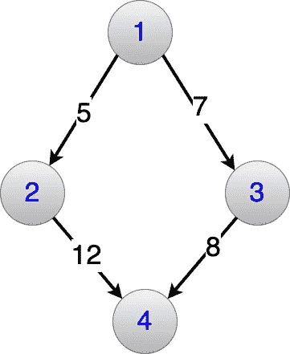
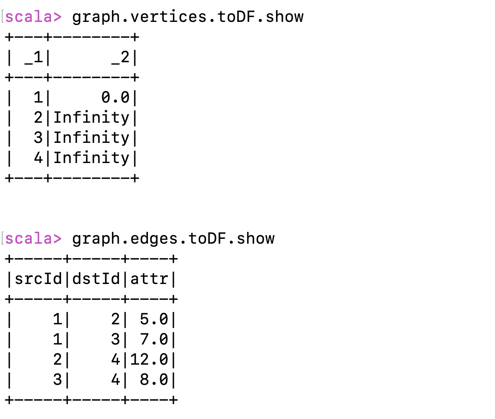
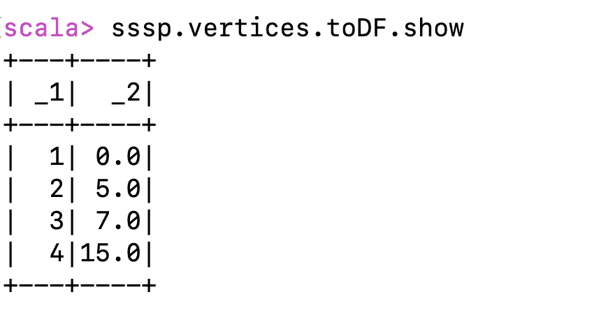
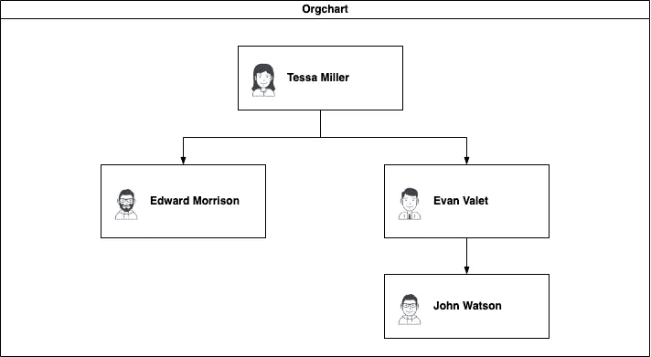
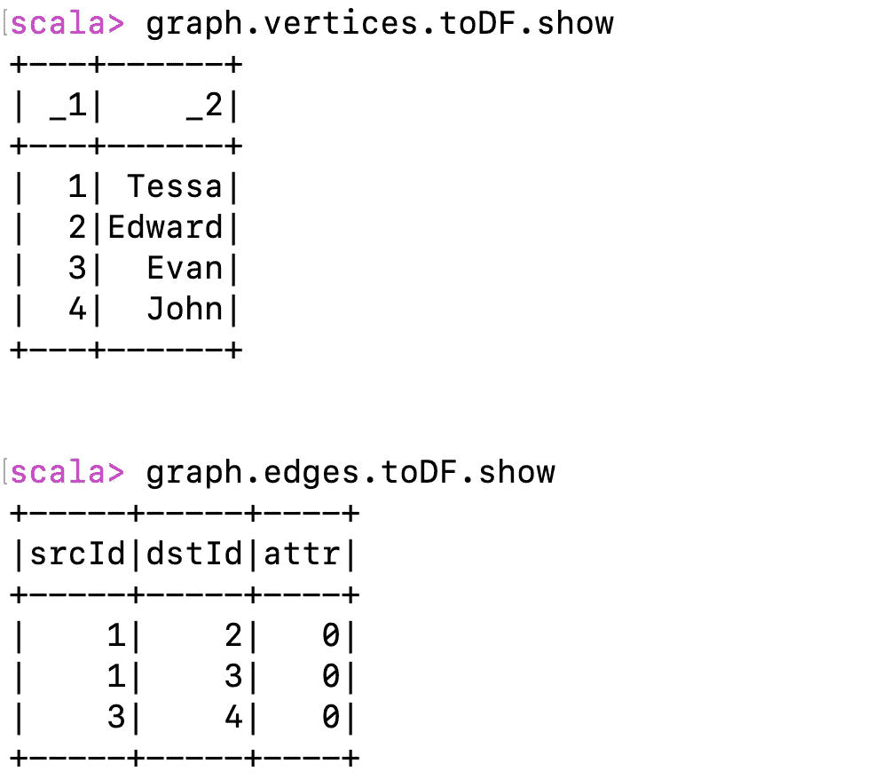
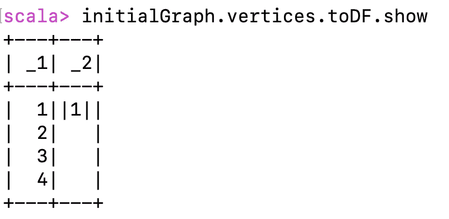
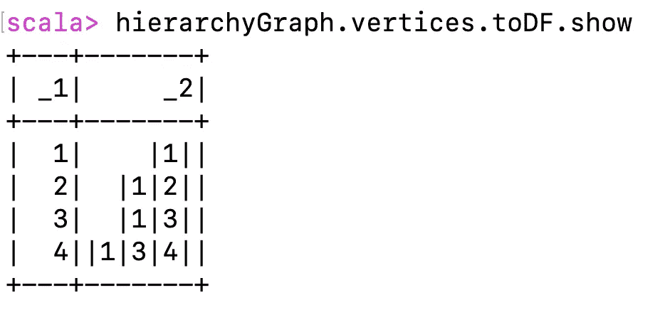
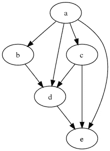
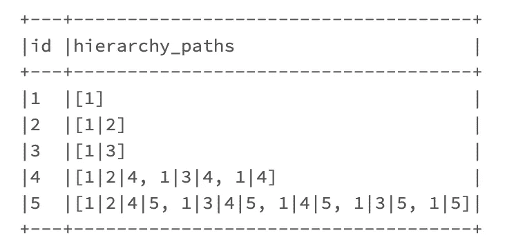

# Spark Graphx Pregel API:它没有听起来那么复杂

> 原文：<https://towardsdatascience.com/spark-graphx-pregel-its-not-so-complex-as-it-sounds-d196da246c73>

# Spark Graphx Pregel API:它没有听起来那么复杂

## 了解 Pregel 的基础知识，以及它如何解决现实世界中的问题，即使这些问题与图形没有严格的关系。


[https://www . pexels . com/photo/person-weaking-米色-毛衣-手持-地图-车内-1252500/](https://www.pexels.com/photo/person-wearing-beige-sweater-holding-map-inside-vehicle-1252500/)

# 普雷格尔什么？

Spark 附带了一个图形处理库，其中有几个有用的 API，用户可以开箱即用，例如查找连接的组件、计算三角形和排列图形中的节点。这些 API 只是将用户从重新发明轮子中解放出来。这不仅是关于图的问题或算法，也是关于可伸缩性的问题，这样问题就可以在大量数据的情况下得到解决。

我以前有机会使用这些 API，但是有一个 API 看起来有点复杂。它实际上是一个框架，需要开发人员插入一些逻辑来解决定制问题。该 API 被称为“ **Pregel** ”。

来自[斯坦福的课堂素材](https://stanford.edu/~rezab/classes/cme323/S15/notes/lec8.pdf):

> pregel(Parallel、Graph 和 Google 三个词的组合)是一个数据流范式和系统，用于 Google 创建的大规模图形处理，以解决仅使用 MapReduce 框架难以解决或成本高昂的问题。虽然该系统仍然是 Google 的专利，但计算范式已被许多图形处理系统采用，许多流行的图形算法已被转换为 Pregel 框架。Pregel 本质上是一个限制在图的边上的消息传递接口。

当图很大时，像 Dijkstra 的最短路径这样的算法可能不是很有效。这并不是因为算法本身就很糟糕，而是因为图像无法容纳在一台机器的内存中。

Spark 对 Pregel 的实现是在[的原始论文](https://15799.courses.cs.cmu.edu/fall2013/static/papers/p135-malewicz.pdf)中提出的一个轻微的变体，以允许某些内部优化。为了继续这篇文章的其余部分，建议对 Spark Graphx 有一些基本的了解。

# 简而言之 Pregel API

Pregel 作为一个 API 有以下冗长的签名，长时间的 currying 和高阶函数。

```
**def** pregel[A]
      (initialMsg**:** A,
       maxIter**:** Int = Int.MaxValue,
       activeDir**:** EdgeDirection = EdgeDirection.Out)
      (vprog**:** (VertexId, VD, A) **=>** **VD**,
       sendMsg**:** EdgeTriplet[VD, ED] **=>** **Iterator**[(VertexId, A)],
       mergeMsg**:** (A, A) **=>** A)
    **:** Graph[VD, ED]
```

从上到下:

1.  该函数在类型 A 上是通用的，类型 A 是从一个节点发送到另一个节点的消息的类型。Pregel 基本上是一个消息发送和聚合算法。该类型是从下一个参数中推断出来的。
2.  **initialMsg** 参数保存调用 API 时发送给图中所有节点的消息。
3.  **maxIter** 是一个数字，用于设定运行迭代次数的上限，默认为 Int 类型的最大值。
4.  **activeDirection** 控制消息是通过边缘的出站方向还是入站方向发送，默认为出站。这里讨论的所有例子都假定默认值为出站方向。
5.  **vprog** 是一个函数，它获取顶点 Id、顶点数据和发送的消息，并基于某种逻辑更新顶点数据。这个函数通常被称为顶点程序。
6.  **sendMsg** 是另一个函数，它接受边三元组并返回由顶点 Id 和消息组成的元组数组。这是用于生成消息的函数，这些消息将在迭代的下一步中使用。
7.  **mergeMsg** 是从发送到同一节点(顶点)的一组消息中挑选出一条消息的功能。
8.  调用这个 Pregel API 的返回类型是另一个具有相同类型的顶点和边数据的图形，但是它的顶点数据可能是输入图形的变异版本。

在接下来的几节中，上述内容的含义和用法将会更加清楚。

让我们使用 Spark 文档单源最短路径示例来实现和解释 Pregel，然后我将跳转到一个可以使用 Pregel 解决的实际业务问题。

# 你好 Pregel

要解决的问题是单源最短路径；简称 SSSP。如果你使用谷歌地图或苹果地图，它们解决了几乎相同的问题，只是有些不同，但概念仍然是一样的。Graphx 的 Spark 文档提供了一个片段来解决这个问题，但是是针对随机生成的图形。

让我们从头开始，从下图开始。节点 1 是起始节点，我们希望找到图中起始节点 1 到其他节点的最短距离。目测问题，节点 2 和 3 的距离很明显，分别为 5 和 7。节点 4 到 1 的最短距离应该是(5+12)和(7+8)的最小值，即 15。



作者图片

## 在 Spark 中创建图形

Spark Graphx 中的图必须有一个顶点 RDD 和一个边 RDD。顶点 RDD 是一个元组数组，其中第一个元素是必须很长的节点 Id(这就是为什么我没有将节点命名为 A、B、C、D)。元组的第二部分是顶点数据，在这种情况下，它被初始化为距节点 1 的最短距离。节点 1 的值为 0，每隔一个节点的距离为无穷大，这将在该过程完成后改变。

> 附言:顶点 RDD 是这样创建的，以便于直接运行 Pregel。在这篇文章的第二部分，我们将看到一种不同的初始化技术，以防初始化图形所需的逻辑有点复杂。

边缘 RDD 是一个容易的；它有源节点 Id、目标节点 Id 和边数据，在我们的例子中是两个节点之间的距离。

为了验证图形是否构建成功，可以将顶点和边部分打印为数据框。



作者图片

## 运行预凝胶

现在是时候使用 Pregel 获得最短路径了。

函数签名在前面已经总结过了，所以现在是时候看看实际的实现了:

1.  第 1 行上的正无穷大比特是要发送给所有节点的初始消息。
2.  第 2 行具有顶点程序，该程序简单地检查接收的消息(newDist)是否小于当前分配的最短距离(Dist)。如果计算结果为真，则用消息值更新顶点数据。请记住，除了节点 1 之外的所有节点都以+Inf 的顶点数据开始。
3.  第 3 行到第 9 行具有沿边缘发送消息的逻辑。该算法在一个循环中迭代，其中每次迭代被称为超级步骤。在每个超级步骤中，生成一组消息并发送给一些节点。节点处理消息以改变顶点数据，并且循环继续。当由于所有节点都暂停而没有生成新消息时，循环结束。所有节点都以主动方式启动算法，因为所有节点都接收到了初始消息。**如果生成的消息中没有一条边接触到一个节点，则该节点可以被暂停。**这并不意味着节点将永远停止，因为如果有消息触及它的一条边，它可以在后面的步骤中被重新激活。在我们的例子中，消息发送函数只是检查当前节点距离(triplet.srcAttr)和边距离(triplet.attr)之和是否小于目标节点上设置的距离(triplet.dstAtrr)。如果评估为真，则在边缘上生成新消息。该消息是要向其发送消息的目标节点的元组加上新的距离值，该新的距离值应该小于目标节点上的当前距离。这个新的距离可以作为顶点程序的节点数据。如果条件评估为 false，则不会从当前节点生成新消息。
4.  第 10 行只是控制一个节点在收到多个消息时处理哪个消息。在我们的例子中，如果一个节点有多条输入边，它将从这些边上发送的消息中选择最短的距离。无论节点收到一条还是多条消息，都将只选取一条消息，其值将用于变异目标节点顶点数据。

请参见 Spark Docs 上的[伪代码](https://spark.apache.org/docs/latest/graphx-programming-guide.html#pregel-api)来形象化上述描述。第二次调用`mapReduceTriplets`有一个最终参数(称为`activeSetOpt`)来控制哪些节点将生成消息。

上面可能看起来过于复杂或不可读(也许这是我的写作风格)，但一旦我们描述了手头问题的迭代，这可能会改变。我将把它推迟几秒钟，现在显示输出。该算法的结果是几乎相同的图，其中每个顶点数据被更新以反映从节点 1 的最短路径距离。这是因为我们将图初始化为节点 1 的值为零，所有其他节点的值为正无穷大**。**



作者图片

如您所见，距离计算正确，节点 4 在从节点 1 到节点 3 再到节点 4 的最短路径上有一个距离。

## 可视化超级步骤行为

如果算法的文本描述很复杂，那么展示某种基于调试的运行会使画面更清晰。这是再次作为复习的图表。


作者图片

**超 0 步**

该算法从所有活动节点开始，并且所有节点都接收到+Inf 的初始消息。

每个节点运行顶点程序，该程序不会对任何节点的顶点数据造成任何改变，因为+Inf 的初始消息不小于任何节点的顶点数据。

下一个 **sendMsg** 功能在所有(**活动**)节点的所有出站边缘被触发，这意味着:

*   节点 1 向节点 2 和 3 发送两个消息，每个消息的值分别为零加上 1 & 2 和 1 & 3 之间的边距离，因为该值(5 或 7)小于目标节点上的顶点数据值。
*   节点 2 和 3 不向节点 4 生成任何消息，因为它们的顶点数据仍然是+Inf。刷新一下你的记忆，是 **Iterator.empty** 行。
*   节点 4 也不生成任何消息，因为它没有出站边。

**超级第一步**

顶点程序根据上一步的消息运行。

*   节点 2 从节点 1 接收值为 5 的消息。节点 2 的顶点数据被更新为 5，因为它小于+Inf 的当前值。
*   节点 3 从节点 1 接收值为 7 的消息。节点 3 的顶点数据被更新为 7，因为它小于+Inf 的当前值。

在节点 1、2 & 3 的出站边缘上调用 **sendMsg** (因为它们是仅有的具有当前消息边缘的节点),这产生了以下结果:

*   节点 1 不向节点 2 和 3 发送任何消息，因为上面代码片段中第 4 行的条件不满足。
*   节点 2 向节点 4 发送值为 17 的消息，因为 5+ 12 小于+Inf。5 是节点 2 上的值，12 是从节点 2 到节点 4 的边距离。
*   节点 3 向节点 4 发送值为 15 的消息，因为 7+ 8 小于+Inf。7 是节点 3 上的值，8 是从节点 3 到节点 4 的边距离。

**超级第二步**

顶点程序根据上一步的消息运行。

*   因为节点 4 接收到不止一条消息，所以调用函数 **mergeMsg** 从 17 和 15 中挑选出一条消息。根据 **mergeMsg** 功能的逻辑选取值为 15 的消息。
*   在节点 4 上调用顶点程序，节点 4 将其顶点数据从+Inf 更改为 15。

**在节点 2、3、4 的出站边缘上调用 sendMsg** (因为它们是仅有的具有带有当前消息的边缘的节点),这产生了以下结果:

*   节点 2 和 3 不发送任何新消息，因为上面代码片段中第 4 行的条件不满足。
*   节点 4 没有出站边缘，因此它不产生任何消息。

当没有新的消息生成时，算法结束，并返回最终的图，其中每个顶点与节点 1 具有正确的最短距离。

[https://tenor . com/view/movies-Matilda-piece-cake-piece-gif-16988524](https://tenor.com/view/movies-matilda-piece-of-cake-cake-piece-gif-16988524)

希望这解释了 Spark Pregel API 是如何工作的，以及它如何用于解决大型图形上的几种类型的问题。

等等！这里不是包装。再来讨论一下我最近遇到的另一个实际用例。

# 有待解决的新的重大问题

你可能会想到使用一些社交媒体或维基百科或引用数据集的复杂大数据规模问题。这实际上是一个经典问题，可以使用递归公共表表达式来解决(Spark OOTB 目前不支持这一功能)。数据大小可大可小，但这并不十分相关，因为 Pregel 旨在处理大数据。

假设有一个传统的雇员表，包含 Id、经理 Id 和所有其他常见属性，如姓名、部门、加入日期等。要求是检查这个 employee 表，找出层次结构中向某个雇员报告的所有雇员(直接/间接)。



作者图片

这可以用于应用一些安全措施，使得一个雇员可以查看她自己以及直接或间接向她报告的任何其他雇员所拥有的数据或人工制品。这听起来像动作/间谍电影中的*通关等级*概念。

如果我们可以将每个雇员的层次结构路径编码为雇员记录的一部分，那么就可以应用一个简单的表过滤器来查找一个雇员记录以及向他报告的所有雇员。

例如，上面屏幕截图中的雇员层次结构路径可以如下保存:

*   苔莎
*   苔莎|爱德华|
*   苔莎|埃文|
*   |泰莎|埃文|约翰|

为了获得 Evan 的根层次结构，我们可以过滤表中任何路径包含 **|evan|的人。**

***附注:路径将由员工的唯一 ID 组成，这些 id 可能看起来像 GUID 之类的，并且 id 中不允许使用分隔符。***

但是为什么要把 Pregel 牵扯进来呢？这可以在 SQL Server 或 Oracle 上使用递归 cte 来实现。使用 Pregel 预计算层次路径可能有两个原因:

1.  员工数据是作为 ETL 管道的一部分准备的，并存储在一些可能不支持递归 cte 的数据存储中。管道使用 Spark 来准备接收和转换数据。Spark 还没有递归 cte，所以 Pregel 恰好是一个很好的选择。
2.  预先计算路径有利于提高性能，这样消费者就不必总是运行这个逻辑(即使他们支持针对该数据存储的递归 cte)。许多 APIs 中间件系统都有积极的性能 SLA，让这样的数据提前持久化是一个明显的优势。

## 在 Graphx 中准备人力资源图表

我就不再赘述了，因为现在事情应该相当简单了，下面是上一节中显示的 HR 图如何在 Graphx 中表示。

因为边属性值在我们的例子中是不相关的，所以它被设置为默认值 0L。



作者图片

**为预凝胶计算准备图形**

在 SSSP 的例子中，已经创建了图，使得开始节点的值为零，并且每个其他节点的值为+Inf。这足以让我们使用 Pregel 开始计算。在其他情况下，可能有必要根据问题类型，用一些初始状态来改变输入图形数据。

在我们的 HR 案例中，如果节点有父节点，我们可以将每个节点数据更改为空字符串，否则节点的数据将由两个|字符组成的节点 Id 包装。

稍后您将看到如何将所有这些图连接在一起，以得到一个包含 Id、雇员姓名和路径的图或表。



作者图片

该图具有相同的节点和边结构，但是每个节点值都从雇员姓名更改为一些不同的初始值。但是只要原始的数字 id 还在，就不会丢失任何东西。顺便说一下，这里一个明显的假设是，除了高层员工，每个员工都有一个经理。这也意味着每个节点只能接收一条或零条消息。

## 编码层次路径的预凝胶逻辑

以上真的很简单:

*   初始消息被设置为空字符串，表示没有路径信息。
*   如果发送的消息具有非空路径，顶点程序改变当前节点上的路径。
*   Send message 函数检查源节点是否有路径，而目标节点是否有，如果有，则向目标节点发送一条消息，连接源节点路径和目标节点 Id。
*   甚至不需要合并消息函数，因为它永远不会被调用，所以任何虚拟逻辑都足够了。

这是预期的输出。



作者图片

要重复查找 Evan(节点 3)层次的逻辑，应该是这样的:

```
SELECT * FROM EMPLOYEE WHERE PATH LIKE '%|3|%'
```

## 连接输出图和输入图

最后一个逻辑是将上面的图与原始图连接起来，这样我们就可以得到一个包含层次结构路径的雇员数据的单一视图。


作者图片

## 2022 年 5 月更新—多母公司人力资源层次结构

Hareesh Alamala 留下了一条[评论](https://gist.github.com/ylashin/6e3b0beca02847fad2e4ee84d0ba1424#gistcomment-4129830),询问如果一个节点有多个父节点，如何调整算法。让我们在 DAG 上尝试相同的 HR 层次路径，其中一些节点有多个父节点。预期的结果将是相似的，除了每个节点有一个路径数组而不是一个路径，因为在这种情况下可能有许多父节点。



[https://upload . wikimedia . org/Wikipedia/commons/thumb/f/Fe/Tred-g . SVG/1920 px-Tred-g . SVG . png](https://upload.wikimedia.org/wikipedia/commons/thumb/f/fe/Tred-G.svg/1920px-Tred-G.svg.png)

上面的输出显示了一些节点(1，2，3)有一条路径，其余的有多条路径。



作者图片

*我还更新了算法解释，以反映节点暂停的原因，不是因为它们没有生成/接收消息，而是因为没有消息的边接触到这些节点。文件通过下面的评论清楚地解释了这一点。*

> 发送新消息，跳过两边都没有收到消息的边。

# 包裹

这需要一点努力，但希望你理解 Pregel 是如何工作的，以及如何用它来解决现实世界的问题，即使它们看起来不像典型的图形问题。

代码是用 Scala 编写的，只需稍加修改就可以移植到 PySpark。

这篇文章中使用的图表的性质也有一些隐含的假设。如果图中有负值的圈或边(在 SSSP 的情况下)，这可能会导致无限循环。所以先试着理解你的图，验证你的 Pregel 逻辑会收敛到比 Int.MaxValue 少的步数。😂