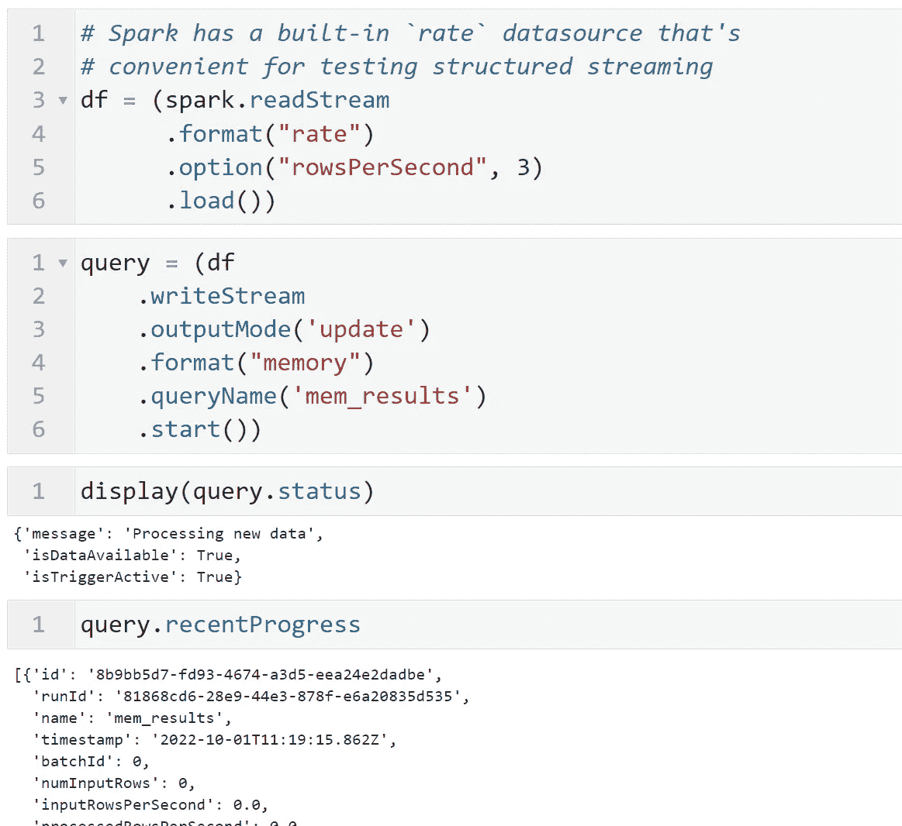
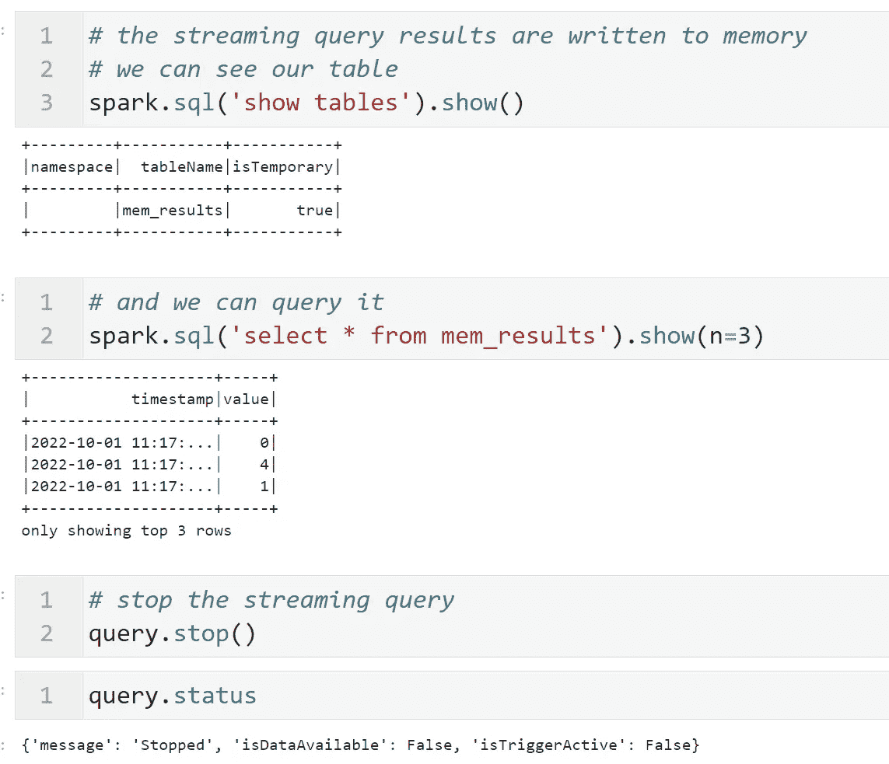
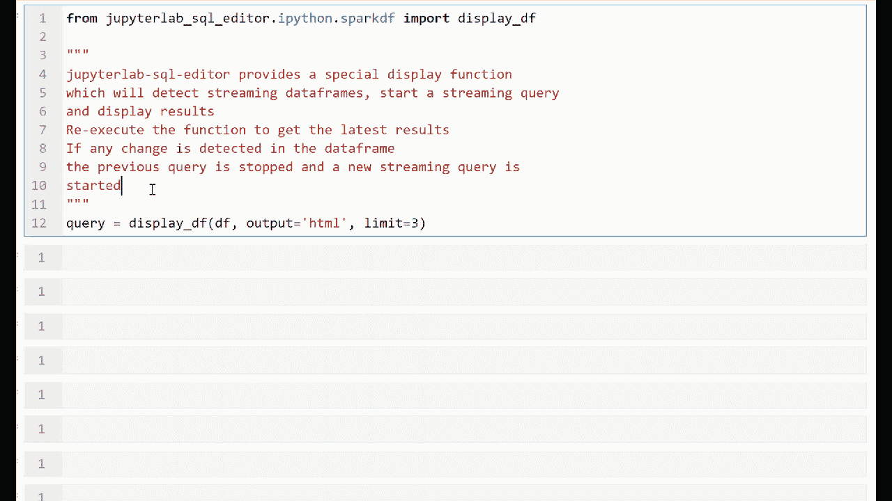
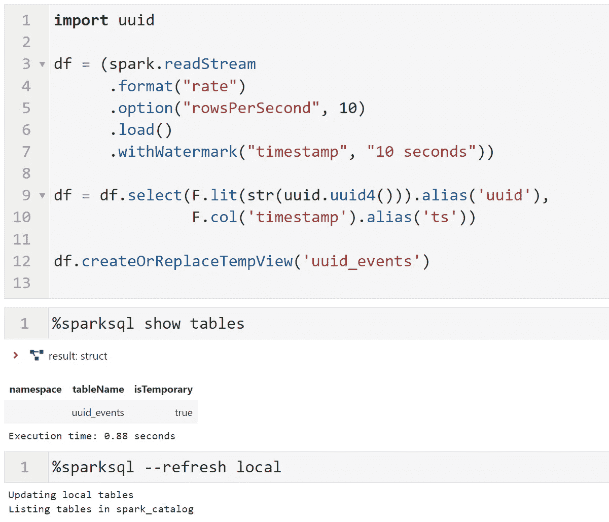
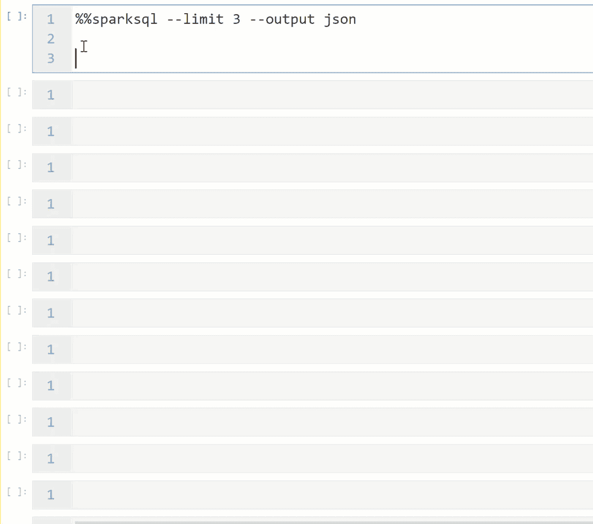
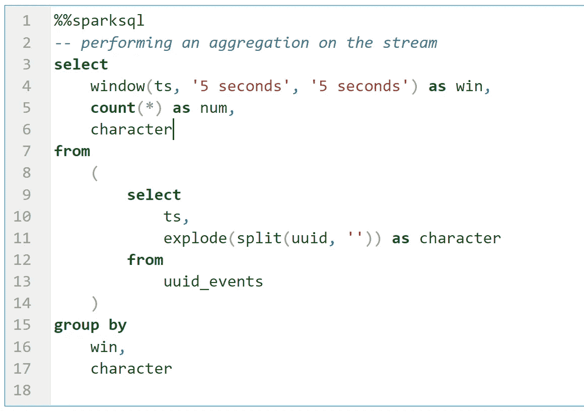
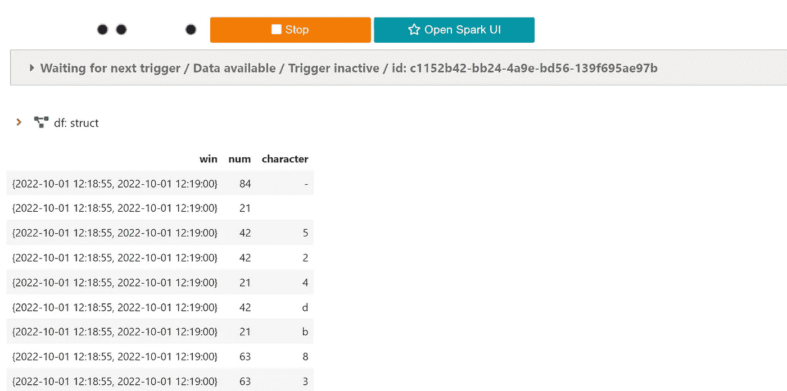

# 借助 JupyterLab SQL Magic 简化 Spark 流

> 原文：<https://towardsdatascience.com/spark-streaming-made-easy-with-jupyterlab-sql-magic-53febf21d9fa>

## jupyterlab-sql-editor 是一个 jupyterlab 扩展，它使执行、显示和管理 Spark 流查询变得轻而易举

法迪拉·努尔哈基姆在 Unsplash 上拍摄的照片

加拿大网络安全中心(CCCS)的角色之一是计算机应急小组。在这个角色中，CCCS 检测异常并尽快发布缓解措施。

在响应时间至关重要的环境中，CCCS 利用 [Spark 结构化流](https://spark.apache.org/docs/latest/structured-streaming-programming-guide.html)和 [Kafka](https://kafka.apache.org/) 事件流平台。

在本文中，我们将演示我们对 JupyterLab 扩展的最新添加，[*JupyterLab-SQL-editor*](https://github.com/CybercentreCanada/jupyterlab-sql-editor)，对 Spark 流的支持。参见我们之前的文章， [*在 JupyterLab*](https://medium.com/towards-data-science/jupyterlab-sql-cell-editor-e6ac865b42df) 中编写可组合的 Spark SQL analytics，获得完整的特性列表以及如何安装 *jupyterlab-sql-editor。*

# 典型火花流 API 用法

这里有一个在笔记本中使用 Spark 流 API 的典型例子。注意`.format(“memory”)`的用法。`console` 水槽在笔记本环境中不工作，因此我们使用`memory` 水槽，这是笔记本中一个众所周知的替代品。

为了显示流式查询的结果，我们从流式查询创建的`mem_results` 表中检索数据。

# 包装样板代码

*jupyterlab-sql-editor* 的`display_df` 函数现在能够检测到所提供的数据帧是一个流数据帧。在这种情况下，它将执行上面的所有锅炉板代码，并显示`mem_results` 表的当前结果。

你所要做的就是创建一个流数据帧，并将其传递给`display_df`。`display_df` 可以以多种格式显示结果，并显示结果的模式(形状)。

除了这些特性之外，`display_df` 函数现在显示了一个与流查询相关的 UI。它显示流式查询、指标和停止按钮的状态。

# 使用 SQL

流式数据帧可以作为临时视图。在本例中，我们创建了一个流数据帧，然后将它命名为视图`uuid_events`。

使用`show tables`我们可以看到这个视图的存在，这意味着我们可以使用`%%sparksql`魔法来查询它。事实上，我们还可以调用`%%sparksql --refresh local`让`%%sparksql`将这个视图信息存储到它的自动完成缓存中。

注册了这个视图并缓存到`%%sparksql`中，我们现在可以利用`%%sparksql`对常规表的所有支持。这些特性包括输出模式、jinja 模板、截断、限制、自动完成、格式化和语法高亮。

记住，我们实际上是在编写一个流 SQL 查询。因此，任何聚合都需要绑定到一个时间窗口。有关更多详细信息，请参见 [Spark 结构化流](https://spark.apache.org/docs/latest/structured-streaming-programming-guide.html)指南。下面是一个流查询的例子，它计算每个字符在 5 秒钟的窗口中出现的次数。

以下是现场结果。注意`character` 和`count` 与时间窗口`win`相关联。

# 结论

在本文中，我们展示了如何利用`**%%sparksql**`在 Spark SQL 中轻松构建流分析原型。魔术照顾了许多锅炉板代码，让您专注于您的流分析的阐述。您还可以使用由`%%sparksql` magic 支持的许多输出(文本、网格、html、json)来验证您的结果。欢迎新的功能想法和贡献！这是我们的 git repo[cyber centre Canada/jupyterlab-SQL-editor](https://github.com/CybercentreCanada/jupyterlab-sql-editor)。