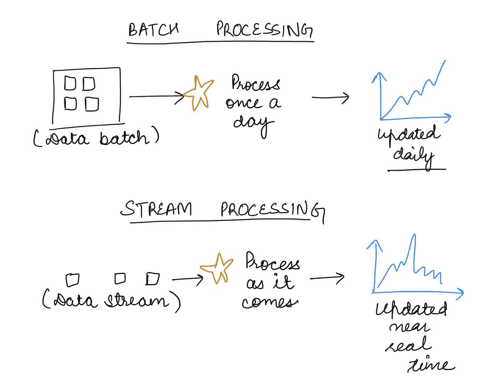
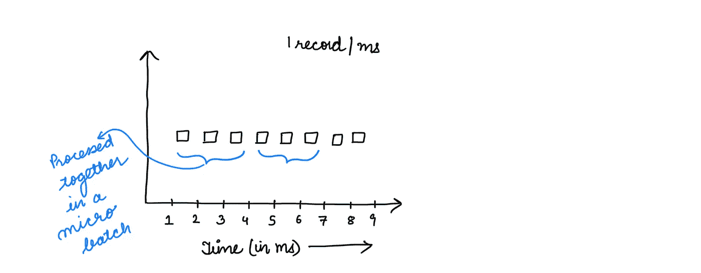
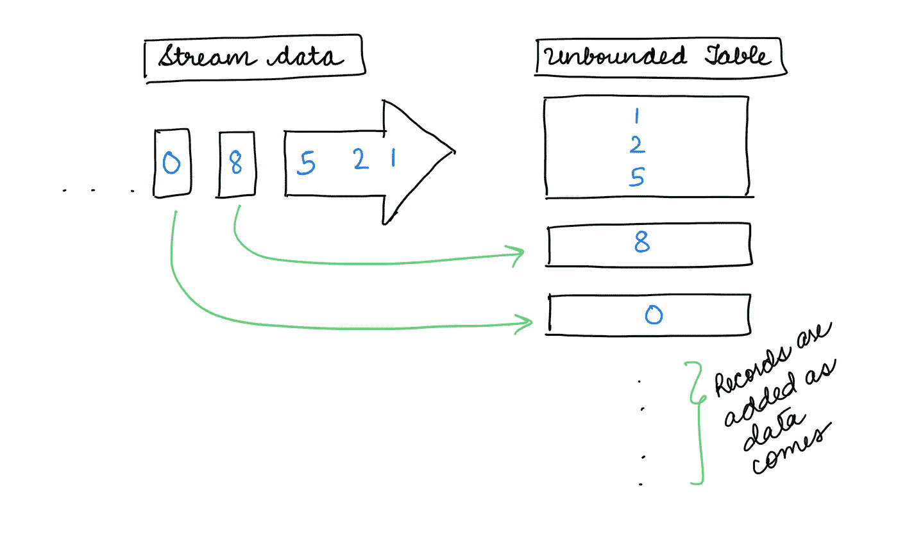
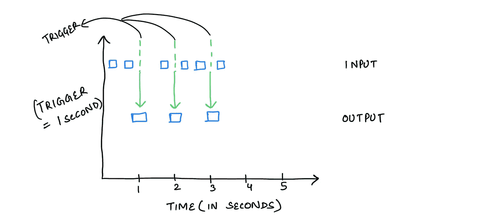
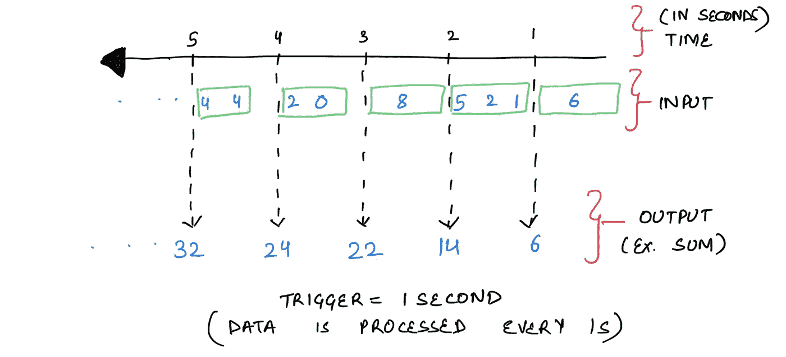

# 简化的 Spark 结构化流

> 原文：<https://towardsdatascience.com/spark-structured-streaming-simplified-9455947674b9>

## 用 Spark 处理流数据的简单概述

卢克·切瑟在 [Unsplash](https://unsplash.com/s/photos/stream-data?utm_source=unsplash&utm_medium=referral&utm_content=creditCopyText) 上的照片

嘿伙计们！

如果您是使用 spark 进行流处理的初学者，或者即使您已经多次使用过它，但是想要更好地理解 Spark 结构化流，那么本文就是为您准备的！

在讨论在 Spark 中处理流数据之前，我们先来了解一下什么是流数据处理，它与批量数据处理有何不同？如果您已经熟悉了这些概念，请直接跳过。

# 流数据处理

> 在做出接近实时的决策时处理数据。

例如，当欺诈发生时的欺诈检测、通过分析错误率来检测错误的服务器等。

## 流处理和批处理有什么不同？

> 批量数据处理是对一段时间内积累的数据的处理。

这些是您每天、每周或每天两次运行的正常流程/作业。无论数据何时到来，它总是以固定的定义间隔被处理。

我想在这里强调的另一个区别是，就可靠性而言，批处理总是比通过流处理生成的聚合更可靠，尤其是在流处理没有正确配置的情况下，但是与批处理相比，流处理允许更快地解释数据。

另一个普遍的区别是，与批处理相比，流处理通常占用更少的内存，因为每次处理的数据更少。

批处理与流中的数据处理(图片由作者提供)

定义了流数据处理之后，让我们深入了解如何使用 Spark(即 Spark 结构化流)来做同样的事情。

# 火花结构化流

> Spark 结构化流允许通过 Spark SQL 引擎对流数据进行近实时计算，以根据定义的逻辑生成集合或输出。

这种流数据可以从文件、套接字或 Kafka 之类的源中读取。

最酷的是，处理实现的核心逻辑与如何以批处理方式处理数据密切相关。基本上，您可以定义数据框，并像编写批处理作业时一样使用它们，但是数据的*处理有所不同。*

这里需要注意的一点是，结构化流不是实时处理数据，而是近乎实时处理。事实上，你很少会找到一个管道或系统，可以“真正”实时地处理数据而没有任何延迟，但这是一个单独的讨论。

## 微量配料

结构化流有一个微批处理的概念来处理数据，这意味着不是每条记录都被处理。相反，它们是以小批量的方式累积的，并且这些微小的(微小的批量)被一起处理，即接近实时。您可以配置您的微批处理，并且可以低至几毫秒，例如:

微量批次(图片由作者提供)

## 无界表

如上所述，您在结构化流作业中处理数据帧，就像批处理作业一样。但是如果你认为在这里？如何在流数据上创建数据帧？我的意思是，如果有 100 条记录，这对于批量数据来说是非常简单的，这是一个包含 100 条记录的数据帧，但是对于连续不断的流数据来说呢？在这里花点时间思考一下。

这里出现了无界表的概念:随着数据的到来，在处理微批处理时，行被追加到表中。当新数据到来时，计算在应用于表时完成，直到在数据帧上定义了逻辑。所以基本上，数据帧是在这个无界的表上创建的。

这里要注意的一点是，这个无界表更多的是一个“概念性的东西”。Spark 不会将整个无界表保存在内存中，但是它会继续写入结果，并且只在内存中维护一个最小的必需中间状态，

无界表的概念(图片由作者提供)

## 扳机

现在，Spark 如何知道何时生成这些微批处理并将它们追加到无界表中呢？

这种机制被称为触发。如前所述，并不是每条记录都在某个时间间隔(称为“触发”时间间隔)被处理，一个小批量的行被追加到表中并被处理。这个时间间隔是可配置的，并有不同的模式，默认模式是开始下一个过程作为前一个完成。

触发的概念(作者图片)

触发示例(图片由作者提供)

## 输出模式

现在我们知道，在触发时间间隔，数据处理开始，输出按照定义的逻辑生成。假设您希望在触发时间间隔内处理成功、失败或未决事务的总数，这样就会生成这个结果。

对于写入此结果或“输出”，有不同的模式可以完成:

*   Complete:整个结果作为输出存储或写入
*   Append:只有结果中的新记录作为输出写入
*   Update:只有结果中更新的记录才作为输出写入

这种输出模式是可配置的，可以根据使用情况进行设置。为了产生这些结果，

## 容错

现在，在一个完美的世界中，一旦您开始流处理，一切都运行顺畅，流永远不会关闭或抛出任何错误(*听起来像一场梦，不是吗？*)。

但可悲的是，在现实世界中，管道确实会失败，或者不得不关闭，甚至重新启动，以应用逻辑中的新变化。在这种情况下,“流”数据处理会发生什么？

结构化流通过[检查点和预写日志](https://www.waitingforcode.com/apache-spark-streaming/spark-streaming-checkpointing-and-write-ahead-logs/read)来处理这个问题。简而言之，在 HDFS(或 S3，无论底层存储层是什么)的某个位置记住并存储数据，直到数据被处理，从而确保容错。以便数据只被处理一次，并确保幂等性。

这基本上就是结构化流的全部总结。我就讲到这里，让你吸收这些信息。

流处理还有很多有趣的东西，特别是这里的结构化流，如流流连接、小文件问题、后期数据处理、基于窗口的处理。但不是要在这里压倒你，我会做一些后续文章。

在那之前，如果你有任何问题或反馈，请留下评论或在 [LinkedIn](https://www.linkedin.com/in/jyotidhiman/) 上与我联系，说声“嗨”！

快乐编码，
JD