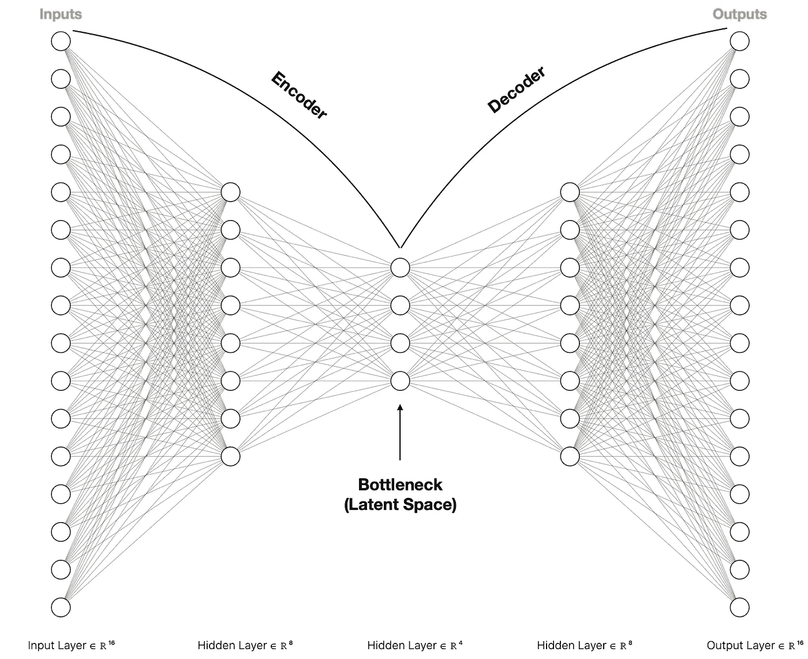
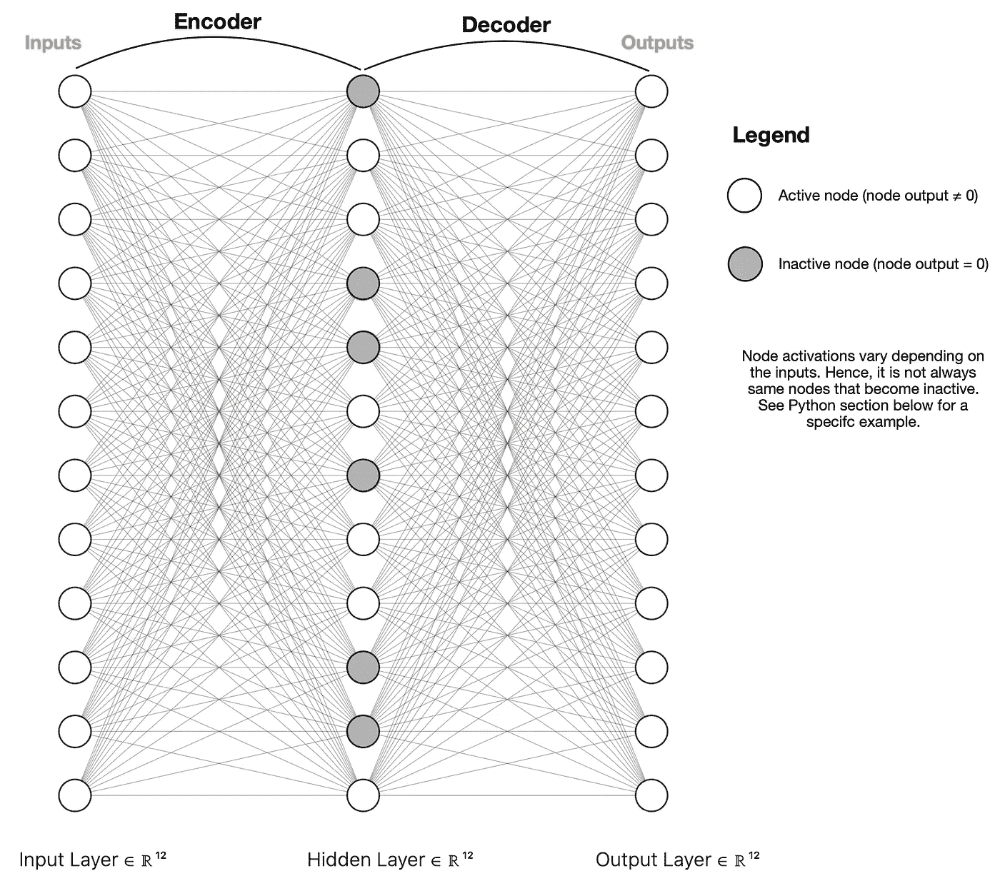
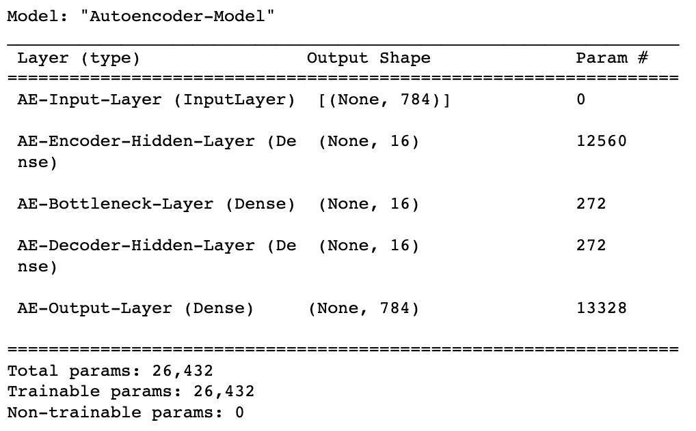
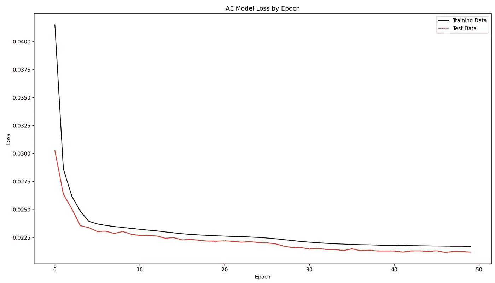
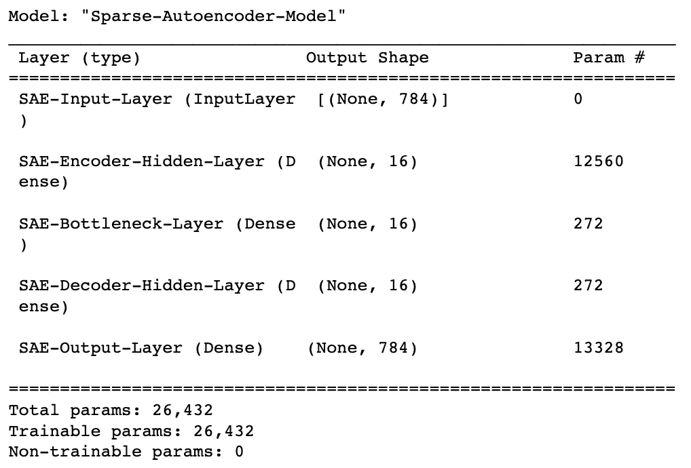
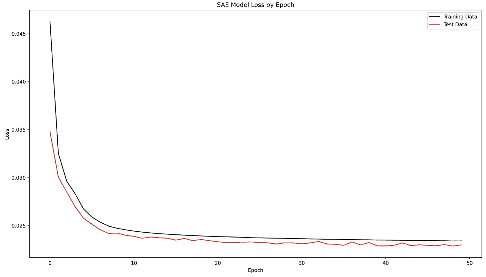
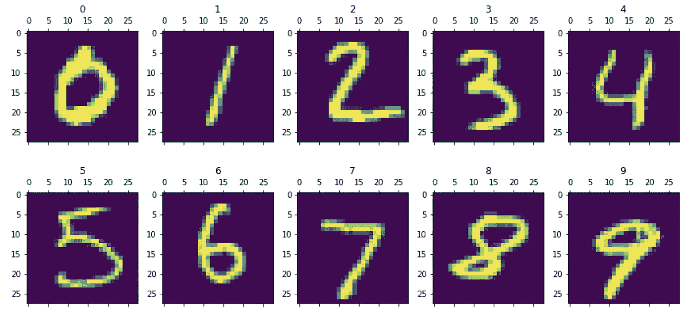
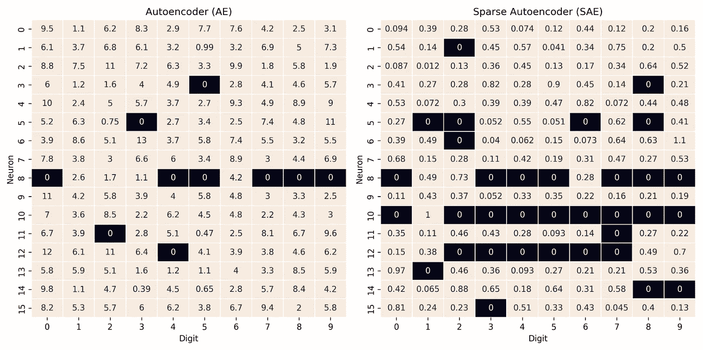

# 稀疏自动编码器神经网络——如何利用稀疏性进行鲁棒信息编码

> 原文：<https://towardsdatascience.com/sparse-autoencoder-neural-networks-how-to-utilise-sparsity-for-robust-information-encoding-6aa9ff542bc9>

## 神经网络

## 用一个详细的 Python 例子比较欠完整和稀疏 AE


由[作者](https://solclover.com/)创建的稀疏自动编码器(SAE)特色图像。

# 介绍

自动编码器使我们能够利用由**编码器**和**解码器**组成的神经网络架构来提取信息。自动编码器有多种类型，根据它们的结构或它们要解决的问题而有所不同。四个最常见的是:

*   [**欠完整自动编码器(AE)**](/autoencoders-ae-a-smart-way-to-process-your-data-using-unsupervised-neural-networks-9661f93a8509) —最基本、最广泛使用的类型，通常被称为自动编码器
*   **稀疏自动编码器(SAE)** —使用稀疏性来创建信息瓶颈
*   [**去噪自动编码器(DAE)**](/denoising-autoencoders-dae-how-to-use-neural-networks-to-clean-up-your-data-cd9c19bc6915) —用于去除数据或图像中的噪声
*   [**变分自动编码器(VAE)**](/vae-variational-autoencoders-how-to-employ-neural-networks-to-generate-new-images-bdeb216ed2c0) —将信息编码到分布中，使我们能够使用它来生成新数据

本文将关注**稀疏自动编码器(SAE)** ，并将它们与欠完整自动编码器(AE)进行比较。

# 内容

*   机器学习算法领域中的 SAE
*   SAE 的结构以及它与不完整 AE 的不同之处
*   如何使用 Keras/Tensorflow 在 Python 中构建 SAE

# 机器学习算法领域中的稀疏自动编码器(SAE)

我试图对最常见的机器学习算法进行分类，如下所示。

虽然我们经常以**监督**的方式使用带有标签的训练数据的神经网络，但我们也可以以**非监督或自我监督的方式**使用它们，例如通过使用**自动编码器**。因此，我觉得神经网络的普遍性和它们对机器学习的独特方法值得一个单独的类别。

点击下面**互动图**中的不同类别，找到 SAE 和其他类型的自动编码器👇。

机器学习算法分类。由[作者](https://solclover.com/)创建的互动图表。

***如果你喜欢数据科学和机器学习*** *，请* [*订阅*](https://bit.ly/3sItbfx) *获取我的新文章的邮件。如果你不是中等会员，可以在这里* *加入* [*。*](https://bit.ly/36Mozgu)

# SAE 的结构以及它与不完整 AE 的不同之处

自动编码器的目的是有效地编码重要的信息。实现这一点的一个常见方法是创建一个瓶颈，迫使模型保留必要的东西，丢弃不重要的部分。

**Autoencoder 可以通过同时训练编码器和解码器**来区分什么是重要的，解码器的目标是从编码表示中重建原始数据。

下图提供了一个瓶颈位于中间的欠完整自动编码器神经网络的示例。



欠完整自动编码器架构。图片由[作者、](https://solclover.com/)使用 [AlexNail 的 NN-SVG 工具](http://alexlenail.me/NN-SVG/index.html)创建。

同时，SAE 的目标与不完全 AE 的目标相同，但是它实现的方式不同。代替(或除此之外)依赖更少的神经元，SAE 使用正则化来加强稀疏性。

所谓稀疏，我们的意思是同时激活的神经元更少，产生了类似于不完全 AE 的信息瓶颈。请参见下图。



稀疏自动编码器(SAE)架构。图片由[作者、](https://solclover.com/)使用 [AlexNail 的 NN-SVG 工具](http://alexlenail.me/NN-SVG/index.html)创建。

请注意，上图仅代表许多潜在设置中的一种。例如，可以有多个隐藏层，或者限制中间(瓶颈)层的神经元数量。

严重不良事件和不良事件之间的主要区别是规范化。在接下来的 Python 小节中，我们将看到它在实践中是如何工作的。

[](https://solclover.com/membership)[](https://www.linkedin.com/in/saulius-dobilas/)

# **如何使用 Keras / Tensorflow 在 Python 中构建稀疏 AE**

## 设置

我们需要以下数据和库:

*   [MNIST 手写数字数据](https://www.tensorflow.org/api_docs/python/tf/keras/datasets/mnist/load_data)(版权由 Yann LeCun 和 Corinna Cortes 根据[知识共享署名-分享 3.0 许可证持有](https://creativecommons.org/licenses/by-sa/3.0/)；数据来源:[MNIST 数据库](http://yann.lecun.com/exdb/mnist/)
*   [Numpy](https://numpy.org/) 用于数据操作
*   用于可视化的 [Matplotlib](https://matplotlib.org/stable/api/index.html) 和 [Seaborn](https://seaborn.pydata.org/)
*   [神经网络的 Tensorflow/Keras](https://www.tensorflow.org/api_docs/python/tf)

让我们导入所有的库:

上面的代码打印了本例中使用的包版本:

```
Tensorflow/Keras: 2.7.0
numpy: 1.21.4
matplotlib: 3.5.1
seaborn: 0.11.2
```

接下来，我们加载 MNIST 手写数字数据并显示前十位数字。我们将在可视化**中使用数字标签(y_train，y_test ),但不用于模型训练**。


MNIST 数据集的前十位数字。图片由[作者](https://solclover.com/)提供。

如您所见，我们在训练集中有 60，000 张图像，在测试集中有 10，000 张图像。请注意，它们的尺寸是 28 x 28 像素。为了使这个例子简单，我们将不使用卷积层，而是将图像展平，这样我们就可以通过密集的全连接层。

```
New shape of X_train:  (60000, 784)
New shape of X_test:  (10000, 784)
```

## **构建自动编码器模型**

我们将建立两个自动编码器模型，以便更容易地看到欠完整 AE 和稀疏 AE 中神经元激活之间的差异。

我们从不完全 AE 开始。以下是需要注意的关键事项:

*   该模型由 5 层组成:一个输入层、三个隐层和一个输出层。
*   输入和输出层各包含 784 个神经元(我们数据的形状)，隐藏层的大小减少到 16 个神经元。
*   我们将在 50 个时期内训练模型，并绘制损失图(见下文)。
*   我们将分离模型的编码器部分，并将其保存到我们的项目目录中。请注意，如果您不打算在以后重用同一个模型，您不需要保留它的副本。

在组装模型之后，上面的代码输出模型摘要，然后是损失图表。



不完全 AE 模型总结。图片来自[作者](https://solclover.com/)。



不完全 AE 模型损失图。图片由[作者](https://solclover.com/)提供。

现在让我们建立一个稀疏的自动编码器模型。为了便于两个模型之间的比较，我们保持参数不变。**唯一的区别是瓶颈层**增加了 L1 规则。

另外，请注意，我们对**神经元激活(activity _ regulator)**应用正则化，而不是权重(kernel _ regularizer)。

以下是我们 SAE 模型的总结和模型损失图表:



稀疏 AE 模型总结。图片由[作者](https://solclover.com/)提供。



稀疏声发射模型损失图。图片由[作者](https://solclover.com/)提供。

最后，是时候对比这两款车型了！

*旁注，如果你想看看模型如何再现原始图像，你可以参考我的 GitHub 上的完整 Jupyter 笔记本代码(文章末尾的链接)。*

回想一下之前的内容，不同的输入会导致不同神经元的激活。因此，让我们从 MNIST 测试集中选择一个数字来代表大范围的输入。请注意，我们需要将数组从 784 重新调整为(28 x 28)以显示图像。



所选的十位数用于模型比较。图片由[作者](https://solclover.com/)提供。

现在让我们使用每个型号(AE 和 SAE)的编码器部分对上述图像进行编码。

编码后，我们绘制一个热图，显示瓶颈中的哪些神经元被激活(≠ 0)。行是神经元，而列是数字(0-9)。



两种声发射模型中的神经元激活。图片由[作者](https://solclover.com/)提供。

我们可以从上面的图表中看到，我们的 SAE 模型更加稀疏，不活跃神经元的数量是不完全 AE 的三倍。

# **结束语**

我希望我的文章为您提供了 SAE 和 AE 之间的有益比较。但是，当然，最好的学习方法是通过实践，所以请随意参考我的 Python 代码，可以在我的 [GitHub 库](https://github.com/SolClover/Art050_NN_SAE)上找到。

**如果你想在我发表新文章时得到通知**，你可以[订阅接收电子邮件](https://bit.ly/3sItbfx)或在 [LinkedIn](https://www.linkedin.com/in/saulius-dobilas/) 上与我联系。

**如果你不是中级会员**并且想继续阅读成千上万伟大作家的文章，你可以使用我下面的个性化链接加入:

[](https://bit.ly/3J6StZI) [## 通过我的推荐链接加入 Medium 索尔·多比拉斯

### 作为一个媒体会员，你的会员费的一部分会给你阅读的作家，你可以完全接触到每一个故事…

solclover.com/membership](https://bit.ly/3J6StZI) 

如果您有任何问题或建议，请随时联系我们！

干杯！🤓
**索尔·多比拉斯**