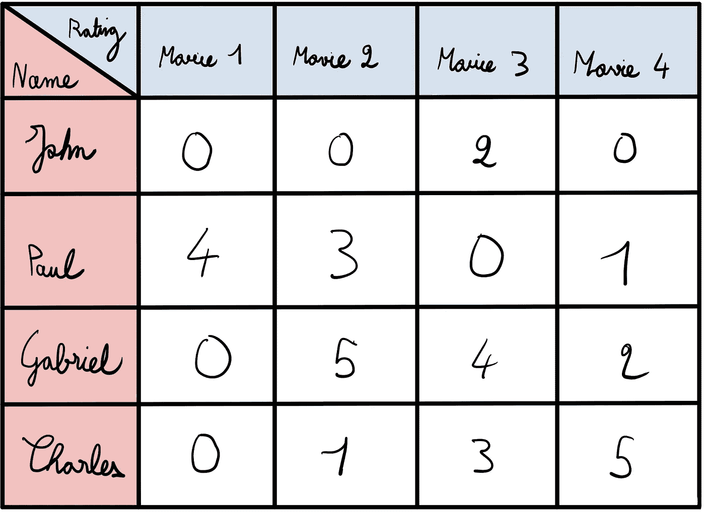
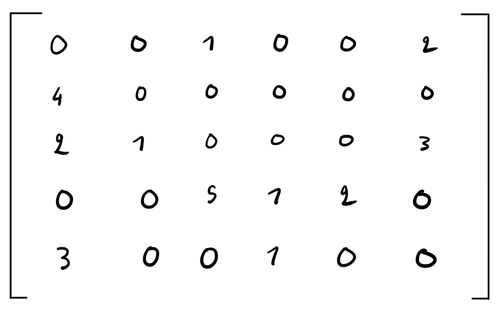
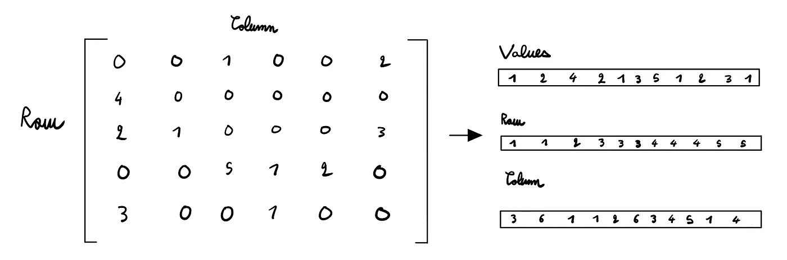
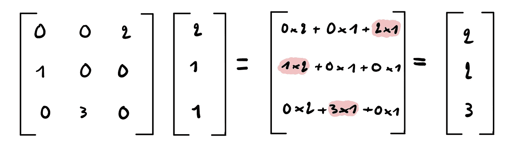
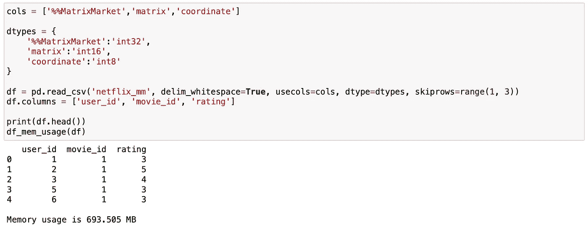
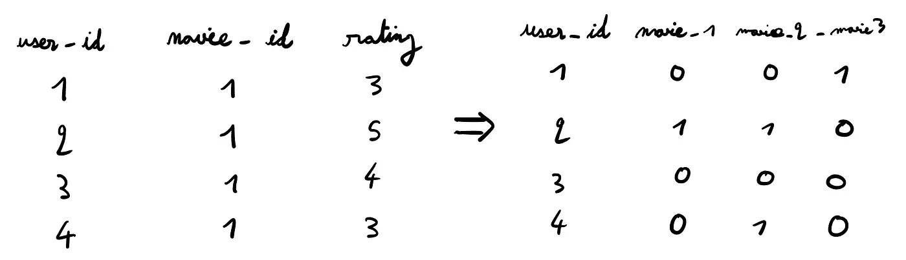
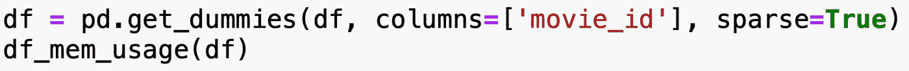
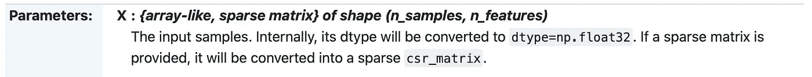

# 稀疏矩阵:为什么它们对机器学习和数据科学很重要

> 原文：<https://towardsdatascience.com/sparse-matrices-why-they-matter-for-machine-learning-and-data-science-55d704d936b2>

## 以及为什么你应该关心

来源: [Unsplash](https://unsplash.com/photos/UxDU0Gg5pqQ)

# 介绍

## 什么是稀疏数据？

当使用矩阵表示数据时，我们可以量化它包含的空值的数量。这被称为稀疏性。主要包含零的矩阵(或数据集)称为稀疏矩阵。

## 简单的例子

假设你让你的 4 个朋友给你 4 部不同的电影打分，从 1 分到 5 分(如果他们没看过，给 0 分)。现在，假设你得到了以下评价:

矩阵示例(图片由作者提供)

这意味着约翰没有看过电影 1、2 和 4，但给了第三部电影 2 的评级。

这个矩阵的稀疏度很低——准确地说是 38 %( 16 个值中的 6 个零= 3/8 稀疏度),我们实际上称它为“密集”矩阵。现在，想象你有更多的电影。假设你有 15000 部电影(相当于网飞目录的大小)。

你可以猜到，大多数人并没有看过网飞的全部 15，000 部电影。因此，假设每部未看过的电影的评分为零，你可以想象这个矩阵会有多稀疏:它大部分由零组成。

# 我为什么要在乎？

两个原因:计算复杂度和存储。

## 稀疏矩阵的存储

理想情况下，我们希望只存储非零值，而不是整个数据集——为什么要存储大量总是具有相同值的元素呢？相反，我们只能存储非零元素的值。在下面的例子中，我们将只存储[1，2，4，2，1，5，1，2，3，1]的值以及它们在矩阵中各自的位置。然后，我们知道矩阵中的所有其他值都是零，我们不需要存储它们。

稀疏矩阵的示例(图片由作者提供)

但是我们在实践中如何做到这一点呢？

## 首席运营官格式

简单:存储 3 个数组，一个存储值，一个存储每个值的行位置，一个存储每个值的列位置。这被称为坐标列表(首席运营官)格式。这是前一个示例中 3 个阵列的样子:

之前的首席运营官格式矩阵(图片由作者提供)

等等，但是要知道，我们存储的是 3 个 11 个值的数组，总共 33 个，而矩阵包含 30 个值。那有什么意义呢？

假设您的数组包含 50 列和 10，000 行，因此有 500，000 个值。此外，它只包含 10，000 个非零值(即 98%稀疏)。您是愿意存储 3 个包含 10，000 个值的数组，从而存储 30，000 个值还是 500，000 个值？

这几乎减少了 20 倍的存储量。

因此，在处理具有高度稀疏性的大型数据集时，使用稀疏矩阵是很有趣的。

## 计算的复杂性

稀疏矩阵的第二点是在执行计算时。让我们以一个向量乘以一个矩阵为例:

带有稀疏矩阵的矩阵向量乘积(图片由作者提供)

在这里，您可以看到，对最终结果有影响的唯一操作是将两个非零值相乘。然而，我们仍然在执行 9 个浮点运算，而只有 3 个是重要的。

理想情况下，我们希望跳过有零的计算，得到一个矩阵向量乘积，其计算复杂度只取决于矩阵非零元素的数量，而不取决于值的总数。这在实践中会有更好的伸缩性。幸运的是，大多数 ML 库都有稀疏矩阵的实现。

# 网飞奖

现在让我们看一个例子，看看稀疏矩阵在实践中是如何有用的。

从 2006 年到 2009 年，网飞赞助了一个竞赛来改进它的电影推荐系统。他们提供了一个 100，480，507 个评级的训练数据集，480，189 个用户给了 17，770 部电影。

对于每一行，您都有一个用户 id、他们看过的电影以及他们对该电影的评价。我们的目标是预测用户对某部电影的评价(使用 1-5 星系统)。

在这个例子中，我运行了下面的代码。它指定了我感兴趣加载的列及其数据类型，以便以最有效的方式存储它们。

然后，它加载数据集，重命名它的列，并打印出前 5 行以及内存使用情况。

加载 Netflix 奖品数据集(图片由作者提供)

这里的问题是我们想知道用户看过什么电影来预测他们是否会喜欢一部电影。下面是我们希望如何格式化我们的数据(类似于我们看到的第一个例子):

一键编码我们的数据矩阵(图片由作者提供)

这样，我们将能够知道用户看过的所有电影，并使用它来预测他们将给予他们没有看过的新电影什么评级。

然而，正如本文开头所讨论的，你可以想象大多数人并没有看完网飞的全部 17，770 部电影。假设人们在网飞上平均观看了 150 部电影(网飞用户平均每周观看 3.4 部电影)，在一次热编码后，数据集将稀疏约 99%。

参考前面的示例，想象一下，您向数据集添加了大约 17，000 列，乘以大约 100 万行就可以得到您添加的值的总数。你真的想存储所有这些值，而知道它们 99%都是零吗？

相反，当调用独热编码函数(这里是 pd.get_dummies)时，我们为参数 sparse 传递一个 true 值。这告诉 pandas 将我们的新数据存储为稀疏数组。

熊猫代码一键编码你的数据矩阵(图片由作者提供)

现在的内存使用量约为 990MB，而在一次性编码之前为 700MB。考虑到我们添加到数据集中的值的数量，这是相对较小的。

作为参考，我用 *sparse=False* 运行了同一行代码，然后……我的电脑崩溃了。

## 用稀疏数据改进 scikit-learn 代码

正如我之前提到的，在执行计算时，稀疏矩阵对于降低计算复杂度也很有用。Sklearn 的大多数算法都有稀疏实现。以下是随机森林分类器文档中的一个示例:

随机森林分类器的 Sklearn 文档([https://sci kit-learn . org/stable/modules/generated/sk learn . ensemble . randomforestclassifier . html](https://scikit-learn.org/stable/modules/generated/sklearn.ensemble.RandomForestClassifier.html))

这里使用的 [CSR 格式](https://en.wikipedia.org/wiki/Sparse_matrix)是实践中最常用的，接近首席运营官格式。我解释了首席运营官的，因为它对初学者更友好。

确保在运行机器学习模型时使用稀疏矩阵可以大大加快运行时间。事实证明，这在运行网格或随机搜索时更加有用，因为这可能非常昂贵。

# 结论

在本教程中，我们看到了为什么稀疏矩阵与机器学习相关，以及它们如何帮助减少数据集的存储以及运行 ML 算法的计算成本。我们还研究了这如何应用于网飞奖数据集。

*我希望你喜欢这个教程！让我知道你对它的看法。*

*随时连接上*[*LinkedIn*](https://www.linkedin.com/in/thomas-le-menestrel/)*和*[*GitHub*](https://github.com/tlemenestrel)*多聊聊数据科学和机器学习！*