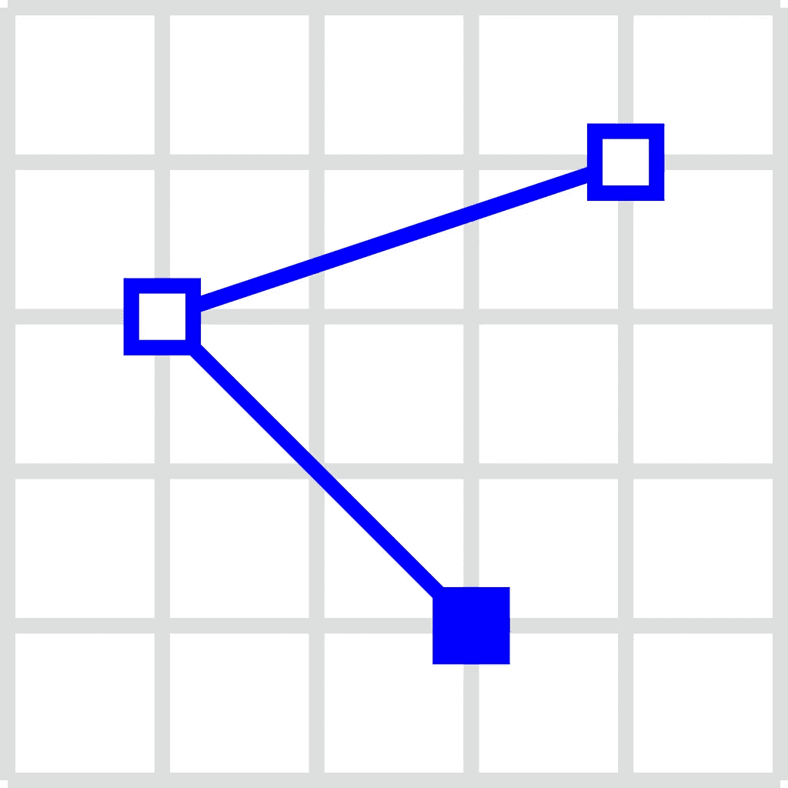
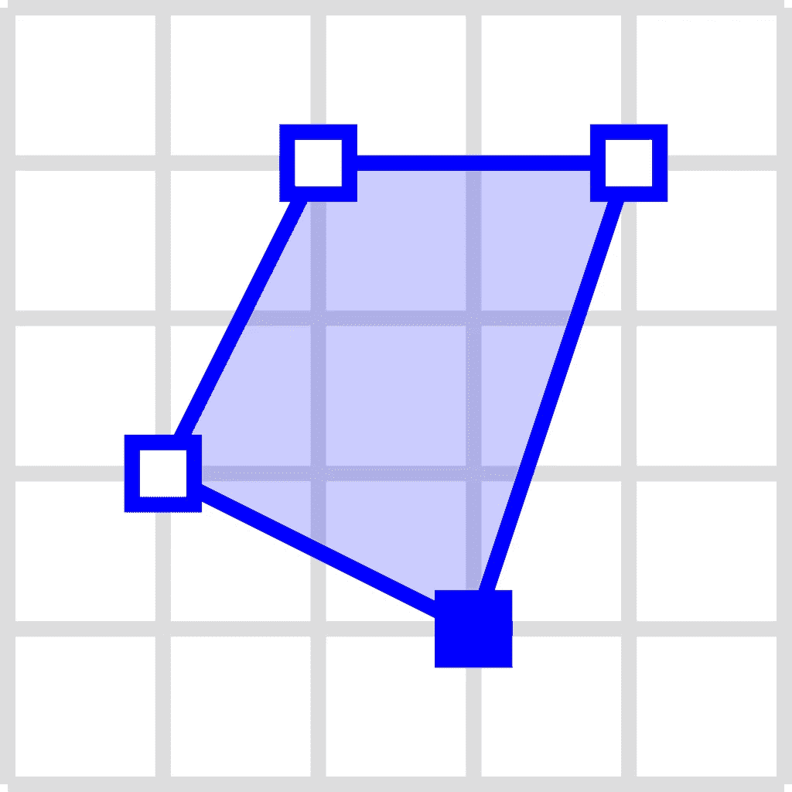
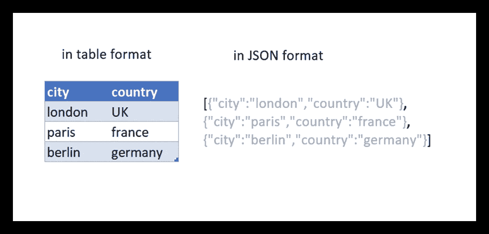
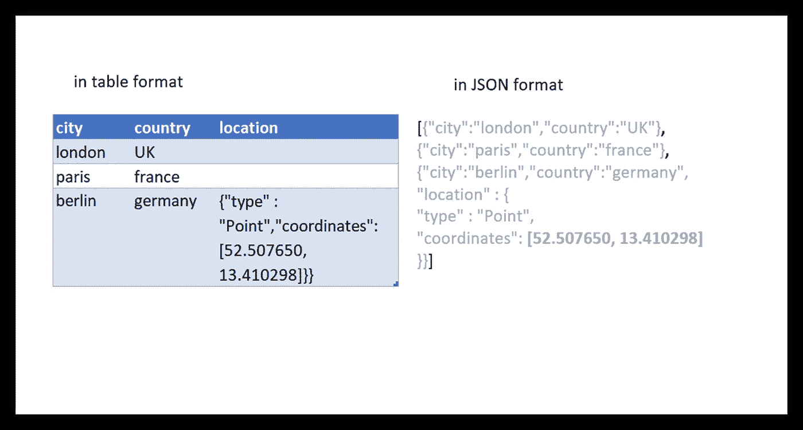
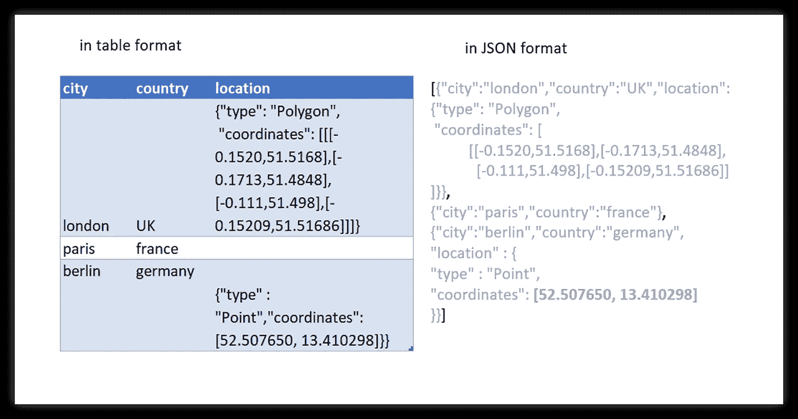
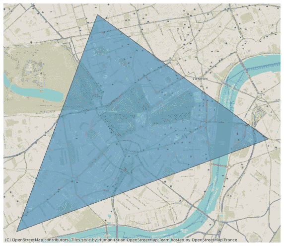
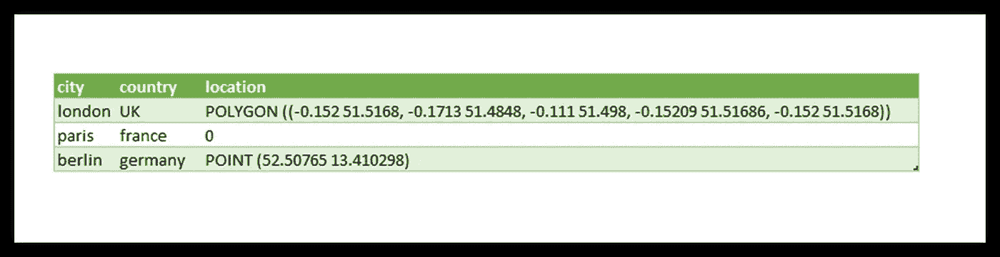

# 空间数据科学:数据结构

> 原文：<https://towardsdatascience.com/spatial-data-science-data-structures-a00c484b8a00>


里尼和作者(2022)

## 表达空间数据的指南

# 介绍

我们如何定义空间数据？一个正式的标准遵循 OGC 标准的简单功能与众所周知的文本(WKT)。很有可能，这也是大多数人所需要的。我认为这并不新奇，但是下面的官方文件乍一看可能很吓人。

<https://www.ogc.org/standards/sfa>  

欣赏文档让我们有了在数据库中存储空间数据的想法。本文简要介绍了如何通过理解空间数据结构来存储空间数据。

在本文中，我将解释我们如何用 WKT 格式定义空间数据，以及如何用 JSON (Javascript 对象表示法)构造空间数据。为什么是 JSON？所以我可以在 Ms Excel 中把它可视化，让每个人都能理解。这不是我们在数据库服务器中存储数据的方式，但它给出了数据的结构。

# 著名的文本

众所周知的文字(WKT)是定义几何学的标准。我认为维基百科的文章很好地解释了它是如何工作的。

<https://en.wikipedia.org/wiki/Well-known_text_representation_of_geometry>  

空间数据(在这种情况下，让我们坚持简单的矢量要素)由坐标和类型组成。有 3 种基本类型:点、线串和多边形。

*   **点**最简单。它是一个点；我认为这是不言自明的。它由 1 个坐标组成。


By Mwtoews —自己的作品，CC BY-SA 3.0，【https://commons.wikimedia.org/w/index.php?curid=14591527 

*   **LineString** (线)，是一条线。一串**点**组成一条线。你至少需要两个点来组成一条线。



由 Mwtoews —自己的作品，CC BY-SA 3.0，[https://commons.wikimedia.org/w/index.php?curid=14594518](https://commons.wikimedia.org/w/index.php?curid=14594518)

*   **多边形**，是封闭的线串。任何线都可以转换成多边形，它是一个面。



由 Mwtoews —自己的作品，CC BY-SA 3.0，[https://commons.wikimedia.org/w/index.php?curid=14592092](https://commons.wikimedia.org/w/index.php?curid=14592092)

在 WKT 格式中，我们首先定义类型，然后是组成空间数据的坐标；举个例子，

```
"POLYON (0 0, 1 0, 1 1, 0 1)"
```

这张基本上是 1x1 的正方形。请注意，我将 WKT 写成了文本文件，因此我们可以在 Ms Word 中清晰地表达空间数据！

# 杰奥森

还有另一种格式，一种更加通用的格式，那就是 JSON 格式。GeoJSON 是 JSON 格式的扩展，但它是 JSON。JSON 格式是什么？JSON 是一种定义在花括号内的键值对格式。例如，定义伦敦城，

```
{"city": "london", "country": "UK"}
```

或者巴黎，

```
{"city": "paris", "country": "france"}
```

我们可以把任意的属性放在这个括号里，

```
{"city": "berlin", "country": "germany", 
**"**coordinates**": [52.507650, 13.410298]**}
```

稍等一下；我只是把位置数据放在这里！我们知道它是一个点坐标。但是，我们需要在 JSON 数据中指定它。因此，结论是，

```
{"city": "berlin", "country": "germany",
"location" : {
    "type" : "**Point**",
    "coordinates": [**52.507650, 13.410298**]
}}
```

# 在 Excel 中可视化空间数据结构

在我的另一篇文章中，我解释了我们如何将花括号看作表格行。我们将使用 JSON 格式在 excel 中可视化数据结构。

<https://perkotaan.medium.com/nested-table-in-excel-9977637a74aa>  

我们之前的 JSON 城市表如下图所示。



来源:作者(2022)

这是在没有空间数据的情况下，现在空间数据(一堆坐标和类型的定义)作为 JSON 存储在单元中。



在 excel 中存储数据结构，来源:作者(2022)

或者，我们可以为伦敦添加另一个多边形数据示例



来源:作者(2022)

当我们可视化伦敦多边形的坐标时，它看起来像下面的图像:



来源:作者(2022)

或者我们也可以用 WKT 格式来声明它，这对于这个上下文来说更简单。



来源:作者(2022)

它们都转化为相同的数据:城市。然而，我们可以用各种格式存储空间数据，它们都仍然有效。

# 结论

空间数据是一串具有定义类型的坐标(点？多边形？线？)如果我们能以某种方式:

*   定义类型和
*   定义坐标组成、

然后我们有了空间数据。这就是 WKT 和乔森的用武之地。首先，我们定义几何图形的类型，然后我们定义组成几何图形的坐标。使用其中一种格式，我们可以声明我们拥有的每个特征/数据行的空间属性。它们是可以用电脑分析的，所以我们可以用电脑软件来分析它们！