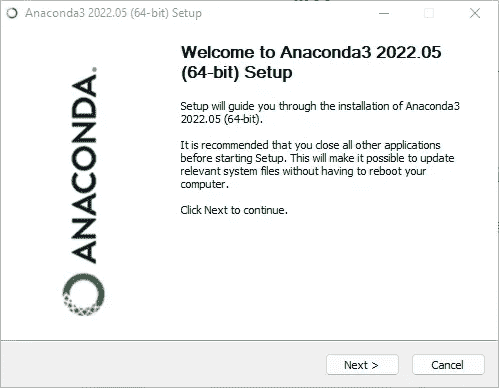
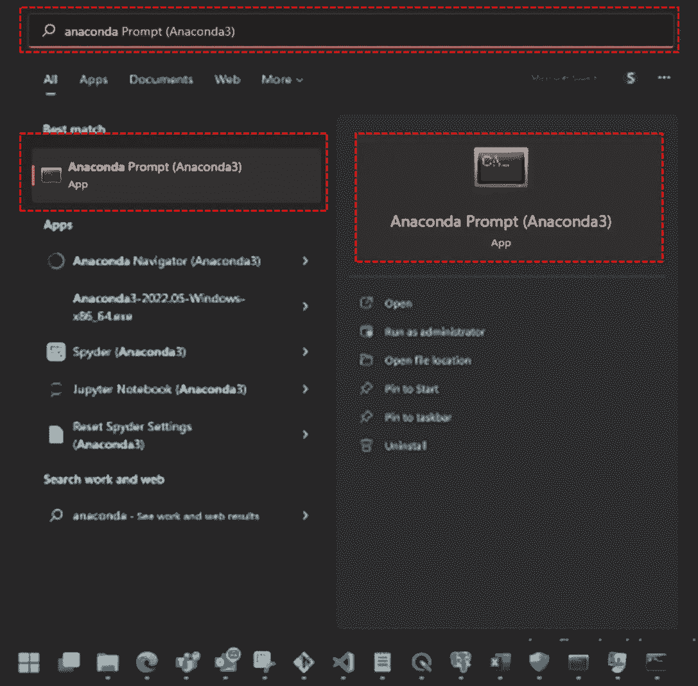
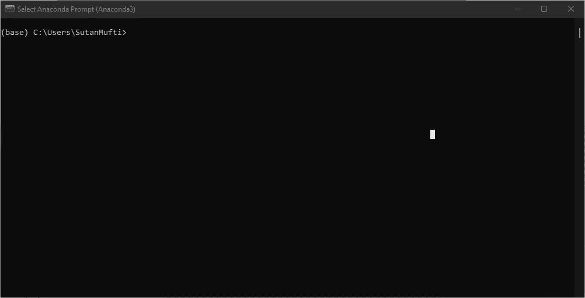
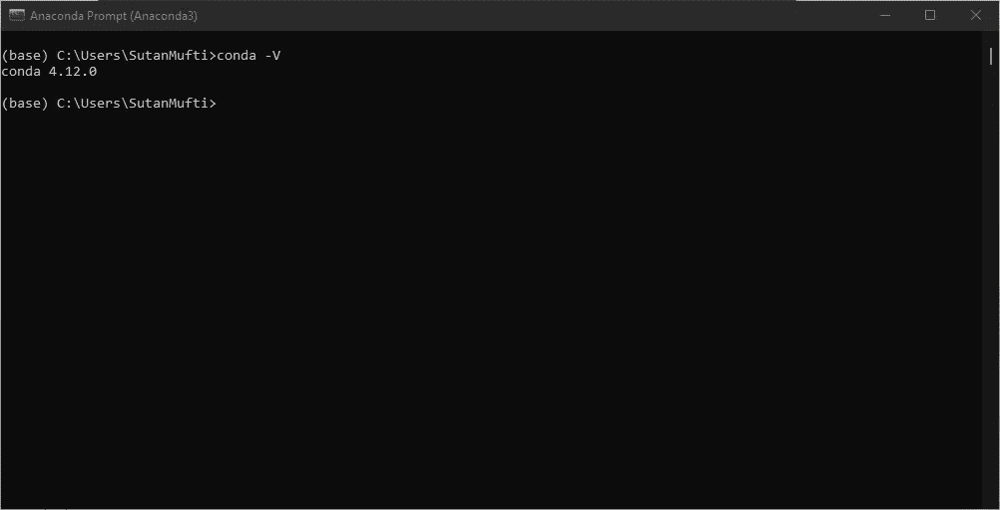
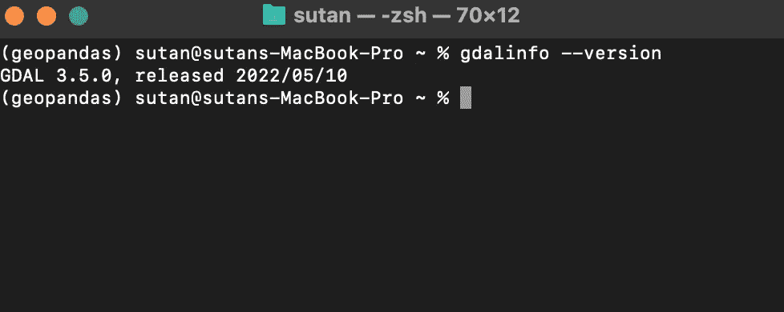
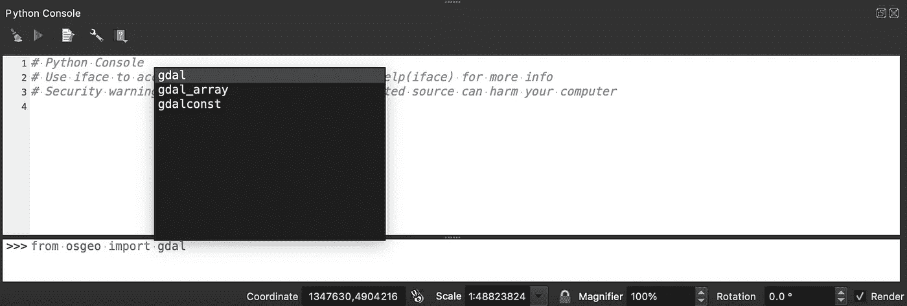

# 空间数据科学:在 Windows 和 MacOS 上安装 GDAL

> 原文：<https://towardsdatascience.com/spatial-data-science-installing-gdal-on-windows-and-macos-6fb5c958dc26>


作者和里尼(2022)

## GDAL 是空间数据科学的基础。在 windows 和 MacOS 上安装比较棘手。这是实用指南。

# 介绍

在 MacOS 或 Windows 上调用`$ pip install fiona`,你将很难找出哪里出错了。您很可能会遇到以下错误:

```
c:/> pip install fiona
Collecting fiona                                                                                                          Downloading Fiona-1.8.21.tar.gz (1.0 MB)                                                                                   ---------------------------------------- 1.0/1.0 MB 8.2 MB/s eta 0:00:00                                             Preparing metadata (setup.py) ... error                                                                                 error: subprocess-exited-with-error...**A GDAL API version must be specified. Provide a path to gdal-config using a GDAL_CONFIG environment variable or use a GDAL_VERSION environment variable.**
```

`fiona`是 GDAL 的 python 链接；它是允许 python 开发者读写空间数据的模块。它有一个基本的依赖:`GDAL`是空间数据输入输出背后的主要软件。另一个是`GEOS`，它是`GDAL`和处理背后的几何引擎，但在本文中它不是一个非常突出的问题。突出的问题是`GDAL`在 windows 和 macos 上的安装很棘手。

在这篇文章中，我将提供一个实用的指南，在你的 windows 和 MacOS 机器上安装`GDAL`。注意是实用的；这很可能与你有关，但你的实际需求取决于你要做的事情的背景。

本文回答的一些问题:

*   如何在 windows 上安装 gdal？
*   如何在 macos 上安装 gdal？
*   如何使用 GDAL_CONFIG 环境变量或在 windows 或 mac 上使用 GDAL_VERSION 环境变量提供到 gdal-config 的路径

总之，这是需要做的事情:

*   安装 anaconda
*   使用 Anaconda 提示符，而不是通常的命令提示符(cmd.exe)。在 Mac 中，这相当于在环境变量中设置 anaconda 提示符。对于 mac 用户，请遵循

  

*   熟悉管理 python 包和环境的`conda`命令行工具

替代安装；如果我们不想使用蟒蛇

*   安装 QGIS
*   从 OSGeo4W shell 或从 QGIS 控制台调用 GDAL。

让我们开始吧。

# 选择 1:蟒蛇

第一步是不要在 python.org 的官方 python 网站上使用 python。如果你已经从官方的 python 网站安装了 python，那就没什么好担心的，也不需要卸载。我们只需要安装来自另一个发行商的另一个 python:Anaconda。

Anaconda 是一个 python 发行商，但是它附带了`conda`。我们可以把`conda`看作是`pip`和`venv`的替代品，虽然不是真的。`conda`是一个在`anaconda`环境中管理 python 库和环境的工具。如果您不理解这一点，特别是关于环境的部分，请不要担心，但是我们可以从安装 anaconda 开始:

<https://www.anaconda.com/>  

安装向导(来源:作者(2022))

从开始按钮调用 anaconda 提示符:



来源:作者(2022)

然后我们看到 anaconda 提示:



蟒蛇提示(来源:作者(2022))

我们可以把这看作另一个命令提示符；但是这个环境比较特殊，因为它是一个 anaconda 环境。我们可以使用`conda`来做事情。尝试调用`conda -V`查看`conda`版本。



来源:作者(2022)

## 忘记皮普，与康达和解

我们仍然可以使用`pip`来安装包。但是对于 gdal，让我们忘记`pip install gdal`或者`pip install fiona`，转而使用`conda.`

现在我们可以通过键入`conda install gdal`在 python 中安装 gdal。准确的说，`conda install **-c conda-forge** gdal`。我们加上`-c`表示我们正在使用一个通道，那个通道就是`conda-forge`。Conda 是 python 的包管理器；它像 pip 一样工作，但是在 anaconda 环境中。我们可以看到康达像皮普，但它可以做得更多。让我们在其他时间探索 conda 可以做什么，但现在让我们专注于安装 Gdal。

安装 gdal 后，应该可以通过 **anaconda 提示符**使用 GDAL。在你的开始菜单中搜索 **Anaconda 提示**，并点击它。它将打开一个命令提示符窗口，但与 anaconda 环境。将其视为普通的命令提示符。尝试调用`gdalinfo --version`。如果它打印出类似下图的内容，那么您已经成功安装了 GDAL！



来源:作者(2022)

## 是的，你已经安装了 GDAL！

现在，要使用 gdal，只需打开 anaconda 提示符，像普通的终端/命令提示符一样使用它，然后就可以开始了！

一种更简单的安装方法是使用 OSGEO Shell。

## 总结和安装菲奥娜

Fiona 是空间数据 IO 的 python 接口。它使用 GDAL，在空间数据科学中至关重要。下面是 Anaconda 提示符下安装 Fiona 和 GDAL 的命令行:

```
C:\> conda install -c conda-forge gdal
...
C:\> conda install -c conda-forge fiona
...
C:\> echo gdal and fiona are installed. let's check it. we can use python and import osgeo module to import gdal, or just straight type gdalinfo --version
C:\> python -c "import fiona; print(fiona.__version__)"
C:\> python -c "from osgeo import gdal; print(gdal.__version__)"
C:\> gdalinfo --version
```

# 备选方案#2: Osgeo4W shell，或来自 QGIS

这就简单多了。装 QGIS 就行了。QGIS 是地理信息系统软件；这是 GIS 首先要学的第一件事。它是免费的，开源的，面向所有人。

您可以从终端内部的 python shell 或从 QGIS Python 控制台访问 GDAL。如果您正在使用 python 控制台，那么我希望您对简单的 Python 语法有基本的了解。我不认为学习 python 需要那么长时间，这很简单。话又说回来，反正你用的是 GDAL，Python 应该不难；很难想象使用 GDAL 的人能不学习 Python(仅是我的看法)。



从 QGIS python 控制台使用 python 导入 gdal。(来源:作者(2022))

## 顶生花柱

如果您想将它用作普通的终端风格 CLI，那么搜索`osgeo4w shell`并执行它。它将打开一个命令提示符/终端，并设置 GDAL 环境。再次调用`gdalinfo --version`来验证它是否已经安装。

# 结论

耶！我们已经用 conda 或 QGIS 安装了 GDAL。最简单的也许就是安装 QGIS，没有比点击安装并按照向导操作更简单的方法了。长期措施是安装 anaconda 并学习基本的 conda 语法。我建议将它安装在 anaconda 中，因为它可以比 QGIS 控制台更好地预测未来的需求。