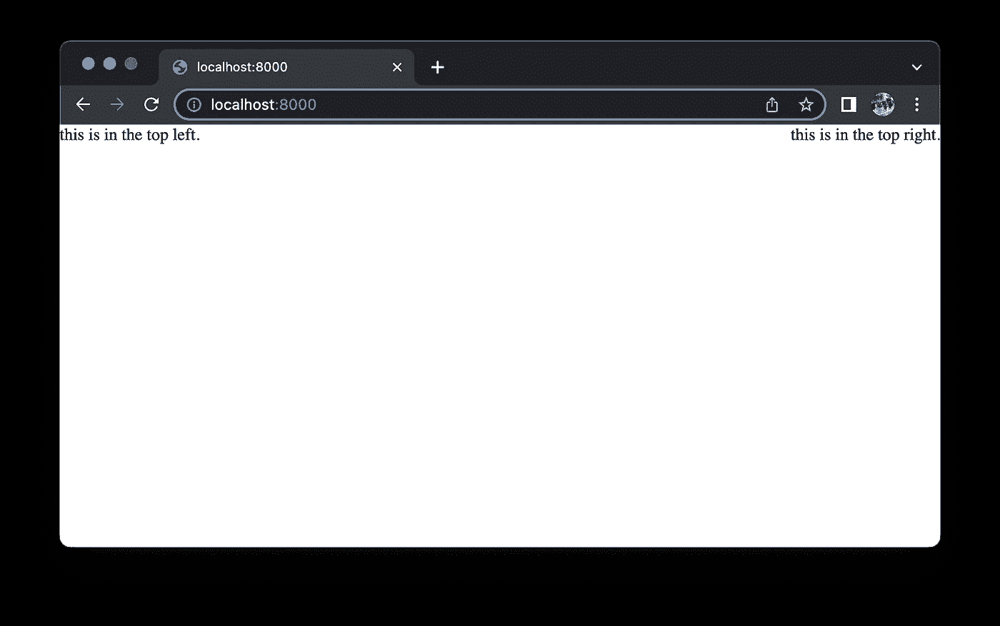
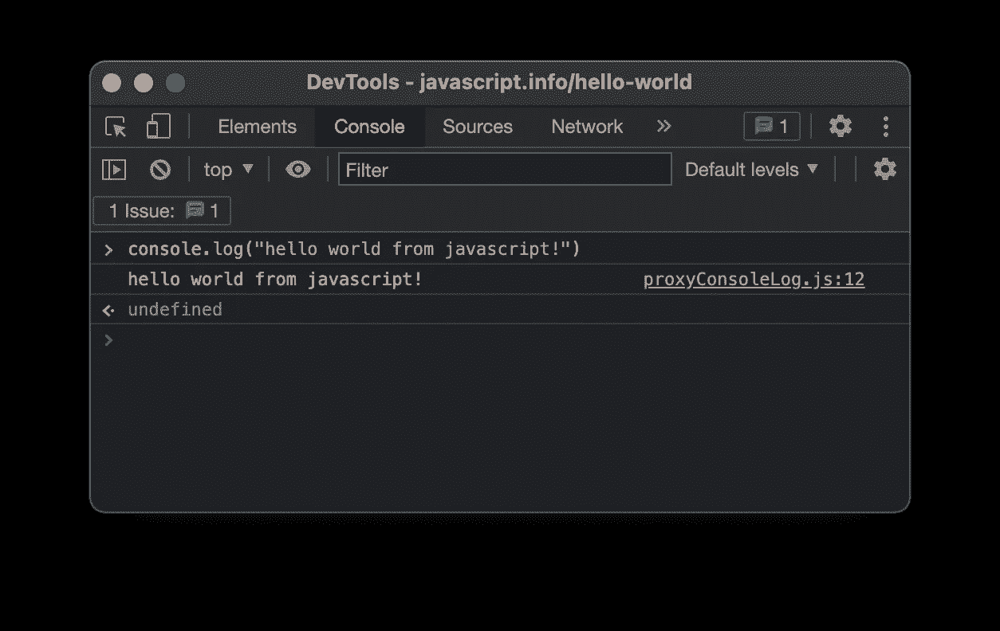

# 空间数据科学:Javascript 和 Python

> 原文：<https://towardsdatascience.com/spatial-data-science-javascript-python-60464cbe908d>


作者和里尼(2022)

## 从数据工程到全栈应用，你需要的语言。入门和精选学习资源！

# 介绍

进入高级 GIS 意味着做编程工作。这是必然的。当你知道如何编写一些代码时，事情就简单多了！例如，为您的 QGIS 创建自定义插件，或修改现有插件，在 ArcGIS Pro 中创建功能区工具等等。通常新程序员会问自己:“我应该使用哪种编程语言？”答案是，这取决于你想建立什么。在 GIS 的例子中，我可以说每个人最可能使用的流行工具是 Javascript 和 Python。

Python 已经是我多年来最好的朋友了。它加速了我作为交通/城市规划顾问的职业生涯，并为主要的交通基础设施发展项目做出了贡献。事实上，它的免费是非常令人印象深刻的。在这篇文章中，我将分享为什么它是我最好的朋友。

另一种语言是 Javascript。由于语法的原因，Javascript 很容易被嘲笑，这是 r/programminghumors 中的一个笑话。玩笑归玩笑，这是一种让我们的浏览器与我们互动的神奇语言。语法方面，我认为这很奇怪；尽管如此，它是如此强大。在本文中，让我们探讨 Javascript 如何在空间数据科学实践中增加价值。

最后，尽管标题中没有提到，HTML 在将事物联系在一起时起着至关重要的作用。你需要展示东西，这就是你展示的方式。它是你网络浏览器中的文件；这是你现在正在看的网页。

在开始之前，请注意，本文是空间数据科学系列的一部分。更多类似的文章，请访问下面的元文章

<https://medium.com/rekayasa-data-spasial/spatial-data-science-the-series-81344a3ead29>  

让我们探索每一点，好吗？

## 解释器和编译器简介

在我们学习语言之前，我认为了解语言的类型是很重要的。我们将编程语言分为两类:编译语言和解释语言。这个帖子值得一看。

<https://stackoverflow.com/questions/3265357/compiled-vs-interpreted-languages>  

简而言之:

*   编译语言:一种由软件将代码(我们在代码编辑器中输入的文本)转换成可执行文件(通常以。windows 中的 exe)。这就是我们所说的通过**编译我们的代码。**我们不能使用代码本身，我们使用的是可执行文件。
*   解释语言:一种由另一个可执行文件逐行执行代码的语言。这个可执行文件被称为解释器。 **Python 和 Javascript 就是这一类**。

所以，请记住 **Python 和 Javascript 都是解释语言**。如果我们想两者都利用，在我们编码之前，**我们需要安装解释器；**哪个是用于 Javascript 的 Python 和 NodeJS(或者您用来阅读本文的浏览器)。

代码只是一堆文本文件，我们可以用 ms. word 编码，不用担心。重要的是它能够被解释者解释。

# 计算机编程语言

Python 是一种通用编程语言，可以做任何事情。它经常被拿来和 R 比较，但是，我认为如果你打算研究空间数据科学，我推荐使用 Python。这是因为它的性质；它可以连接到 Python 模块，为您提供可能需要的灵活性。另一方面，我认为 R 在学术环境和统计目的中更为优化。但是嘿，如果你正在制作一个 ArcGIS/QGIS 插件，我不认为你会用 r 来写。

Python 的主要优势是:

*   对于任何目的来说都很棒，尽管速度很慢，但是对于你可能会发现的许多情况来说已经足够快了
*   连接任何计算机科学任务
*   容易学习，语法哲学表达了它必须尽可能的易读

## 空间数据分析和建模

虽然 Python 有很多用途，但在我们的例子中，Python 用于数据分析和空间数据建模。这是因为朱庇特的笔记本；包含单元格的文本文件。每个单元格包含一个我们可以执行并直接看到输出的代码。这是数据科学 101；学习如何用 Python 使用 Jupyter 笔记本。我认为科里·斯查费的这个视频很好地介绍了 python 在数据科学方面的应用。

(注意:科里·斯查费的视频假设你有一个基本的 python 基础。我把视频放在这里是为了演示 Jupyter Notebook 和 Python 中的数据分析是什么)

当涉及到空间数据建模和分析时，我们将使用 pandas 和 geo pandas(R 等价于模块 sf)。在 Jupyter 笔记本中使用这两个模块要方便得多；并将结果导出为 pdf 或任何空间数据格式，如 shapefiles 或 geojson。

## 数据工程

当数据存在时，分析数据是容易的，然而，通常情况下，数据分散在整个星系和服务器中。数据工程将这些分散的数据变成可供数据分析师使用的数据。最基本的角色是执行 ETL(提取、转换、加载)。medium 里面有很多关于 ETL 的文章；例如，使用 Apache Airflow，或者通常使用请求模块；但是大部分都在用 Python 或者要求 Python 是主要语言。

<https://airflow.apache.org/>  

## 全栈应用

最受欢迎的学习库是 Django 和 Flask。两者都有能力生产全栈应用程序或只是一个 web 框架。我个人使用 Django，因为我对它更熟悉，但如果你需要构建一个快速简单的 API，我认为 Flask 更合适。我认为它在 Flask 中非常简单，但在 Django 中要灵活得多。

## Python 空间数据科学入门

不要从官方 Python 网站(python.org)安装。而是安装 anaconda！Anaconda 是一个 python 发行商，它将 conda 作为包管理器。Anaconda 在空间数据科学中是非常必要的，尤其是对于新手来说，因为我们将使用 GDAL(地理空间抽象库)。如果能在 Windows 中安装 GDAL，基本上就是安装 Python 了。请看我关于如何入门 Anaconda 和 GDAL 的文章。

这个建议是基于多年的实践。我的判断是，这可能是人们所需要的。

</spatial-data-science-installing-gdal-on-windows-and-macos-6fb5c958dc26>  

## 学习资源

这里是一些用来学习和强化 python 基础的精选资源。一些建议:

*   首先，学习如何使用终端。了解如何调用 Python 控制台。了解如何浏览文件夹。
*   学习基本语法，如 if 语句、for 循环等。
*   学习数据结构，如数组和字典
*   你会发现很多教程会建议你使用 Pycharm。如果这是你第一次编程，我建议不要使用 Pycharm。这是因为你需要了解如何使用终端；Pycharm 实现了自动化。不是怀疑 Pycharm，可能你会发现在那里更容易，我只是认为新的程序员应该使用 Pycharm，如果他们有使用终端的基础。

我认为科里斯查费的提供了一个伟大的视频。

我个人从查克博士的 Python 为大家学习。除了 Python 之外，他还做了一个关于计算机科学基础的简短演讲。

# 超文本标记语言

超文本标记语言(HTML)不是一种编程语言。这是一种指示哪个部分去哪里的语言。它是一种用于在浏览器中进行布局的语言。

Python 数据分析的结果可以以 HTML 格式呈现。例如，Python 中的 Folium 模块将地理空间信息转换成 html 地图，使我们的地图具有交互性。它利用了 Javascript 传单库，我们稍后将讨论这一点。

<https://python-visualization.github.io/folium/>  

## 入门指南

HTML 和网络互联网一样古老。创建一个文本文件，并以。名称中的 html。在这个文本文件中，输入`<html> hello world, this is an html file</html>`，把它拖到你的浏览器中，从技术上来说，你就有了一个网络文档！

现在，在 html 文件中，尝试插入这段文本。它将根据我们的指示放置文本。

```
Inside your html file, insert shis (between the 3 back ticks):
```<html><div style="position:absolute;top:0;right:0;">
**this is in the top right.** </div><div style="position:absolute;top:0;left:0;">
**this is in the top left.** </div></html>```
You should have the text in the top right and left corner of the browsers.
```

`div`是容器，我们将对这些容器进行布局。最终结果看起来像下图。



布局结果(来源:作者，2022)

在空间数据科学方面，这是我们如何布局交互式地图。

## 学习资源

w3school 是一个非常好的资源。他们提供简单的指导。

<https://www.w3schools.com/html/>  

# java 描述语言

Javascript 是让我们的浏览器具有交互性的语言。HTML 是静态的，只提供图片和文本文件。但是，按下按钮呢？在页面加载时制造纺车？换位还是爆位？收到通知时自动更新？所有这些都由 javascript 代码来完成和指示。

Javascript 已经发展成为一种前端工程语言；它可以使你的浏览器具有交互性。然后，NodeJS 被开发出来(Ryan Dahl)允许 Javascript 在机器环境中运行，而不是在浏览器环境中运行。这意味着我们可以像编写 python 程序一样编写 javascript 程序。这对于服务器端编程处理来自前端的请求非常有用。这也被称为后端工程。

所以在 Javascript 中你有两个选择:后端工程和前端工程。在我们这里，把它作为前端工程语言使用是最直接的。Javascript 是我们设计网络地图的方式；与用户互动的地图。受欢迎的图书馆包括:

*   传单. js
*   开放层

他们遵循 OGC 标准，因此可以轻松连接到任何地理空间服务器！

## 入门指南

你现在正在使用 javascript。打开浏览器，然后打开“开发工具”或“检查元素”。有一个控制台选项卡。试着输入类似`console.log("hello world")`的东西。



Javascript 控制台(来源:作者，2022)

恭喜你，你刚刚做了 javascript。下一步是在你的`.js`文件中写一串可以被这个浏览器解释的行。就像 Python 一样，但是在浏览器中。

## 学习资源

我建议学习 **NodeJs** 。这就给了学习 Javascript 就像学习 Python 一样的体验。感觉就像使用 Python，但是使用了 Javascript 语法。NodeJS 给你做后端工程师或者前端的灵活性。

普通的 javascript(唯一的 Javascript，比如，基础的)也可以从 w3schools 学到。

<https://www.w3schools.com/js/default.asp>  

如果你只关心简单的 web，那么香草 javascript 是你需要的。学会操作 DOM(文档对象模型)和显示数据。

一个伟大的介绍都是由火船简介

# 一个把所有东西放在一起的普通例子

我们知道如何进行空间数据分析，也就是使用 Python。创建一些为你做分析的脚本；指示做什么，替代鼠标和点击按钮的工作流程。我们将把原始数据转换成有用的见解，这些见解只需要被可视化，以便每个人都能理解。

可视化可以使用 Javascript 库来完成。地图是使用像 OpenLayers 或传单 JS 这样的库制作的。如果您在 Esri 环境中工作，ArcGIS online 也是另一个选择。现在你已经有了地图，我们只需要布局这个交互式地图。

这就是 HTML 的用武之地。使用 CSS(层叠样式表)来指定使用什么字体，或者东西应该如何着色，让它看起来更好。HTML 是我们制作的地图的包装，让每个人看起来都很好。

最后，把所有东西都部署到服务器上，或者只是静态压缩，然后用电子邮件发给每个人！

# 结论

Python 被用作分析和建模工具，Javascript 被用于使事物交互并呈现地图，HTML 被用于布局一切，将一切打包。两种语言(Javascript 和 Python)都可以用来开发全栈应用程序或任何与您喜欢的映射相关的东西！

## 一些笔记

本文提供了空间数据科学领域中事物如何工作的高级概念。技术细节是最重要的，因为一点点的错误都会导致整个项目的失败。例如，部署东西需要了解服务器如何工作，或者什么是 TCP/IP；用 Javascript/Python 创建模块；了解日志记录以减少错误；用 git 进行版本控制；更多！每个编码教程都有长达 17 小时的内容，这是有原因的，而且这只是代码。一切都需要工作，有些事情需要先工作；而本文所讨论的正是它后面的事情。

希望这篇文章足以作为那些想要追求空间数据科学路线的人的起点。

最好的是直接跳到一个项目，了解项目需要的背景；然而，一般的想法总是相同的。Python 用于分析，Javascript 用于呈现和交互，HTML 用于布局一切。