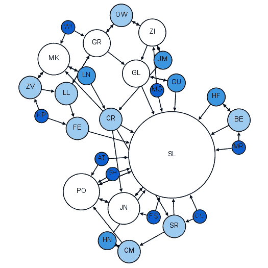
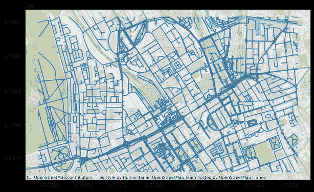
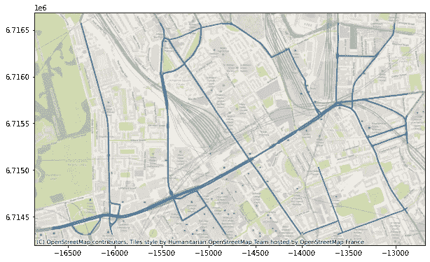
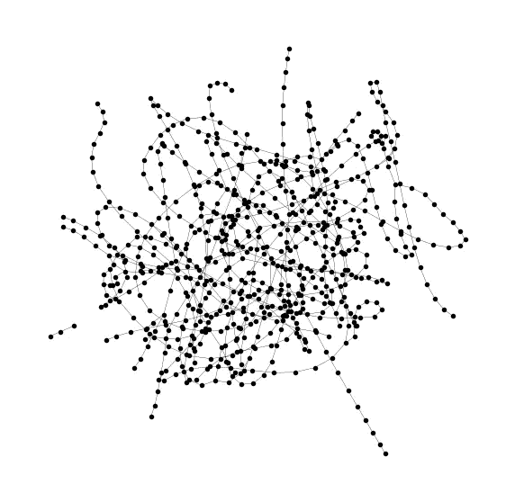
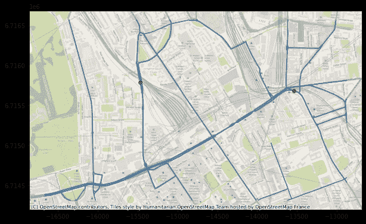
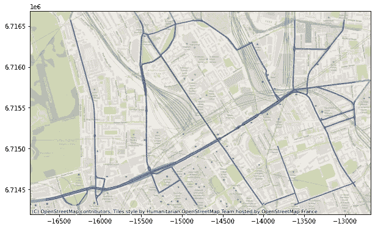
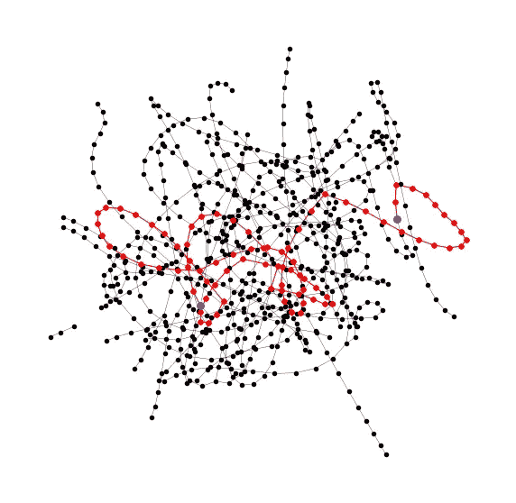
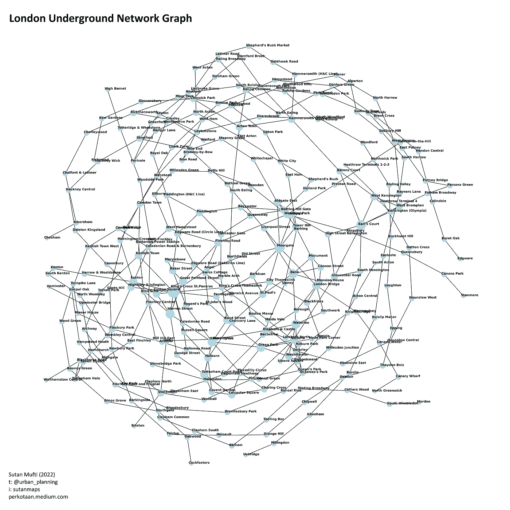

# 空间数据科学:交通规划的网络分析

> 原文：<https://towardsdatascience.com/spatial-data-science-network-analysis-for-transportation-planning-7be048b8f37>


来源:原创内容来自作者和里尼 A. (2022)

## 面向交通规划者的高级图论工具介绍(使用 Python)

# 介绍

交通/城市规划者进行交通分析。我想讨论这个分析，特别是在城市范围内。这条路线可行吗？最有效的公共交通路线是什么？这个地区交通便利吗？路线重叠吗？这类问题属于网络分析的范畴；在图论下。虽然图论本身对任何现实世界的现象都是不可知的，但我们可以用它来建模所有与网络相关的事物，包括城市交通分析。



社会学中的图论，马丁·格兰让—自己的作品，CC BY-SA 4.0，[https://commons.wikimedia.org/w/index.php?curid=39967994](https://commons.wikimedia.org/w/index.php?curid=39967994)

我从 2018 年(到现在 4 年)开始和网络分析打交道，用过一些工具。在本文中，我想与大家分享一下交通规划者如何开始使用 Python 工具进行网络分析。我希望读者都知道基本的图论知识，比如什么是节点和边，什么是图。

> **注意:**这篇文章是苏坦穆夫提的空间数据科学系列的一部分，请查看[这篇元文章](https://perkotaan.medium.com/spatial-data-science-the-series-81344a3ead29)以获得更多类似的文章！

## 计算机编程语言

对于像我这样没有编程背景的人来说，对于不需要非常低级编程技术的作品来说，Python 是一种非常棒的高级编程语言。在这种情况下，交通分析是我发现可以通过利用 Python 的功能进行优化的领域之一。这种优化需要工作流程的自动化，并使文件更符合字面意思；因此确保了再现性。它的语法哲学是人类友好和可读的；我们来对比一些语法。

在 Java 中，初学者的 hello world 程序如下:

```
public class Main {
  public static void main(String[] args) {
    System.out.println("Hello World");
  }
}
```

而在 Python 中，它如下

```
print('hello world')
```

对于像我这样不热衷于编程的人来说，Python 已经足够了。尽管计算机科学社区认为它很慢，但对于像我这样的交通/城市规划者来说，我觉得速度引发问题的可能性很低。

# **网络 x**


[网络 x](https://networkx.org/documentation/stable/)

我不能强调这个软件包有多棒。这是一个用于图形/网络分析和构建的轻量级 python 包。它是用 C++编写的算法的接口，以其性能速度而闻名。再加上 Python 的人语法，我感觉在网络分析方面，Networkx 在语法和性能之间，两全其美。

我们直接一头扎进去吧！

> (注:**本文中我没有使用 **QGIS** 和 **ArcGIS** 等**图形用户界面 GIS 软件！让我们用 Python 来实现自动化，显式地，&缩放目的)

# 示范

一个用例:我下载了一个 [OSM 网络数据](https://export.hotosm.org/en/v3/)并运行了一个`geopandas`绘图脚本。

```
import matplotlib.pyplot as plt;
import contextily as cx;
import geopandas as gpd;network_gdf = gpd.read_file('osm_network.shp');fig, ax = plt.subplots(figsize=(10,10));network_gdf.to_crs('epsg:3857').plot(ax=ax);
cx.add_basemap(ax,
               source=cx.providers.OpenStreetMap.HOT
              );
```

代码将导出如下所示的地图。



来源:作者(2022)

嗯，这个案子很复杂。让我们把它简化为主次干道。



来源:作者(2022)

完美！我们下一步应该做的只是清理工作，我认为这对于本文来说是微不足道的；我用草'`v.clean`搭配`pyqgis`。[检查该螺纹](https://gis.stackexchange.com/questions/279902/unable-to-run-v-clean-in-qgis-3-0-1-in-python-console)。这是一种质量控制措施，可确保网络拓扑结构的稳定性。

我们现在有了道路形状文件。

# 图形模型

我们现在有的只是一个普通的“shapefile”。为了对连通性和运输进行建模，需要将这些数据转换成图形模型。这就是`networkx`进入游戏的地方。

## 识别边缘

首先，确定每条道路的端点，并创建由这些端点组成的数据框。我使用`pandas`来管理表格数据框。下表是数据框片段。每一行反映了 shapefile 中的一条道路。使用来自`id`列的简单 SQL 连接，我可以识别 shapefile 中的几何图形。

```
+----+----------------------+----------------------+
| id |        start         |         stop         |
+----+----------------------+----------------------+
|  0 | (-0.13492, 51.5246)  | (-0.13499, 51.52457) |
|  1 | (-0.11953, 51.52866) | (-0.11956, 51.52871) |
|  2 | (-0.14517, 51.52391) | (-0.14513, 51.52375) |
|  3 | (-0.14423, 51.52399) | (-0.14473, 51.52398) |
|  4 | (-0.14398, 51.52287) | (-0.14415, 51.52325) |
+----+----------------------+----------------------+
note: the decimal place is reduced for presentation purposes
```

构建边的方法是我们以数据帧的形式拥有的 2 个节点。每一排都是一条边！使用简单的 Python 构建了一个`networkx`图形对象。生成的图形如下图所示。



道路网络的图形模型来源:作者(2022)

这是反映道路连通性的图形模型。我们可以对它进行各种图形分析算法，并获得关于我们的道路网络的见解。让我们通过执行两点之间的最短路径分析来演示它；

# 运输分析

本节演示了`networkx`在运输建模中的应用。

好吧，让我们做些有趣的事情！(:

## 最短路径

让我们试着找出最短的路径。假设我想确定(-0.13894，51.53115)和(-0.12162，51.53054)之间的路线，如下图所示。



来源:作者(2022)

然后，使用 Dijkstra 的算法，最短路径路线将如下图所示。



来源:作者(2022)

那么，它在图形模型中看起来如何？拓扑如下图所示。



图模型中的最短路径来源:作者(2022)

## 按比例放大

现在假设有 1，000，000 条记录或源和目标文件，给定一个网络数据集，如 OpenStreetMap 的。我们可以在算法中加入 for 循环，并遍历记录来确定最短路径。如果重量是一个变量，那么我们可以将其设置为算法中的成本变量。这都是因为 Python 才有的能力。

## 其他应用—等时线

我的一个个人应用是分析公共交通可达性。例如，从一个点出发，仅用 30 分钟步行+使用公共交通工具，你能到达多远的城市？我们可以从一个点创建一个等时线。幸运的是，有一个 networkx [算法](https://networkx.org/documentation/stable/reference/algorithms/generated/networkx.algorithms.shortest_paths.unweighted.single_source_shortest_path_length.html#networkx.algorithms.shortest_paths.unweighted.single_source_shortest_path_length)可以解决这个问题！

## **公共交通**

这对于评估公共交通网络和创建模拟非常有用。例如，下图显示了伦敦地铁网络。**我们可以插入一个额外的网络来模拟它将如何影响整个网络！**



伦敦地铁网络图来源:作者(2022)

# 结论

图论是城市交通分析的基础理论。Networkx 是一个利用 Python 编程执行图形分析的工具。它是一个用于扩展交通/网络分析的快速 API 一个让非硬核程序员(我认为对于城市/交通规划者来说刚好够用)执行交通分析的 shell。我个人认为这是进行运输分析的最佳和最容易使用的工具。你所需要的就是学习 Python 语法，理解 GIS，学习图论。这需要时间，但我觉得很有收获！

## 个人笔记

在空间和网络数据分析中，我经常尝试不使用 QGIS 或 ArcGIS，而是使用 Python 脚本将工作转移到`pyqgis`和`arcpy`。这是为了扩大规模，并使项目可追踪。有了 Python 脚本，我总能明确地说出我做了什么。正如本文所展示的，我认为我已经非常清楚地表达了我的想法；本文所做的所有工作都是使用 Ms Visual Studio 代码和 Jupyter 扩展开发的！当然，探索数据的工具是 QGIS 和 ArcGIS，但是对于分析过程，我发现 Visual Studio 代码是完美的工具。

目前…(: